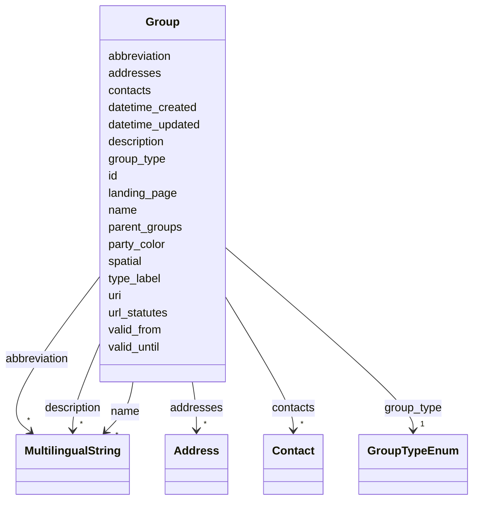

# Class: Group 


_[en] A political group, organization, or body (e.g., party, committee, parliament, department)._

_[de] Eine politische Gruppe, Organisation oder Körperschaft (z.B. Partei, Kommission, Parlament, Departement)._

__


URI: [act:Group](https://ch.paf.link/schema/actors/Group)





<!-- no inheritance hierarchy -->


## Slots

| Name | Cardinality and Range | Description | Inheritance |
| ---  | --- | --- | --- |
| [id](id.md) | 1 <br/> [String](String.md) | [en] Unique identifier (preferably Wikidata-ID or URI) | direct |
| [uri](uri.md) | 0..1 <br/> [Uriorcurie](Uriorcurie.md) | [en] Globally valid identifier (e | direct |
| [group_type](group_type.md) | 1 <br/> [GroupTypeEnum](GroupTypeEnum.md) | [en] Type of group (e | direct |
| [type_label](type_label.md) | 0..1 <br/> [String](String.md) | [en] Custom type label when standard type values don't apply | direct |
| [valid_from](valid_from.md) | 0..1 <br/> [Date](Date.md) | [en] Start date of validity period | direct |
| [valid_until](valid_until.md) | 0..1 <br/> [Date](Date.md) | [en] End date of validity period | direct |
| [name](name.md) | * <br/> [MultilingualString](MultilingualString.md) | [en] Name (can be multilingual) | direct |
| [abbreviation](abbreviation.md) | * <br/> [MultilingualString](MultilingualString.md) | [en] Abbreviation (can be multilingual) | direct |
| [description](description.md) | * <br/> [MultilingualString](MultilingualString.md) | [en] Description of the entity | direct |
| [landing_page](landing_page.md) | 0..1 <br/> [String](String.md) | [en] URL providing further information | direct |
| [parent_groups](parent_groups.md) | * <br/> [String](String.md) | [en] Parent group IDs (to model party hierarchy or bind parties to parliament... | direct |
| [spatial](spatial.md) | 0..1 <br/> [String](String.md) | [en] Spatial reference (municipality number, canton number, e | direct |
| [contacts](contacts.md) | * <br/> [Contact](Contact.md) | [en] Contact information (email, website, social media) | direct |
| [addresses](addresses.md) | * <br/> [Address](Address.md) | [en] Addresses (private, business, local) | direct |
| [url_statutes](url_statutes.md) | 0..1 <br/> [String](String.md) | [en] URL to party statutes (optional for parties) | direct |
| [party_color](party_color.md) | 0..1 <br/> [String](String.md) | [en] Party color (optional for parties) | direct |
| [datetime_updated](datetime_updated.md) | 0..1 <br/> [Datetime](Datetime.md) | [en] The last time this record was updated | direct |
| [datetime_created](datetime_created.md) | 0..1 <br/> [Datetime](Datetime.md) | [en] The time this record was created | direct |


## Usages

| used by | used in | type | used |
| ---  | --- | --- | --- |
| [Container](Container.md) | [groups](groups.md) | range | [Group](Group.md) |


## Identifier and Mapping Information


### Schema Source


* from schema: https://ch.paf.link/schema/actors


## Mappings

| Mapping Type | Mapped Value |
| ---  | ---  |
| self | act:Group |
| native | act:Group |


## LinkML Source

<!-- TODO: investigate https://stackoverflow.com/questions/37606292/how-to-create-tabbed-code-blocks-in-mkdocs-or-sphinx -->

### Direct

<details>
```yaml
name: Group
description: '[en] A political group, organization, or body (e.g., party, committee,
  parliament, department).

  [de] Eine politische Gruppe, Organisation oder Körperschaft (z.B. Partei, Kommission,
  Parlament, Departement).

  '
from_schema: https://ch.paf.link/schema/actors
slots:
- id
- uri
- group_type
- type_label
- valid_from
- valid_until
- name
- abbreviation
- description
- landing_page
- parent_groups
- spatial
- contacts
- addresses
- url_statutes
- party_color
- datetime_updated
- datetime_created

```
</details>

### Induced

<details>
```yaml
name: Group
description: '[en] A political group, organization, or body (e.g., party, committee,
  parliament, department).

  [de] Eine politische Gruppe, Organisation oder Körperschaft (z.B. Partei, Kommission,
  Parlament, Departement).

  '
from_schema: https://ch.paf.link/schema/actors
attributes:
  id:
    name: id
    description: '[en] Unique identifier (preferably Wikidata-ID or URI).

      [de] Eindeutiger Identifikator (vorzugsweise Wikidata-ID oder URI).

      '
    from_schema: https://ch.paf.link/schema/actors
    rank: 1000
    slot_uri: dcterm:identifier
    identifier: true
    alias: id
    owner: Group
    domain_of:
    - Container
    - Person
    - Group
    - Membership
    - InterestLink
    - PersonReference
    - GroupReference
    range: string
    required: true
  uri:
    name: uri
    description: '[en] Globally valid identifier (e.g., politics.ld.admin.ch/party/1).

      [de] Global gültiger Identifikator (z.B. politics.ld.admin.ch/party/1).

      '
    from_schema: https://ch.paf.link/schema/actors
    rank: 1000
    alias: uri
    owner: Group
    domain_of:
    - Group
    - PersonReference
    - GroupReference
    range: uriorcurie
  group_type:
    name: group_type
    description: '[en] Type of group (e.g., party, committee, parliament, department).

      [de] Art der Gruppe (z.B. Partei, Kommission, Parlament, Departement).

      '
    from_schema: https://ch.paf.link/schema/actors
    rank: 1000
    slot_uri: act:groupType
    alias: group_type
    owner: Group
    domain_of:
    - Group
    range: GroupTypeEnum
    required: true
  type_label:
    name: type_label
    description: '[en] Custom type label when standard type values don''t apply.

      [de] Benutzerdefinierte Typbezeichnung, wenn Standardtypwerte nicht zutreffen.

      '
    from_schema: https://ch.paf.link/schema/actors
    rank: 1000
    alias: type_label
    owner: Group
    domain_of:
    - Group
    range: string
  valid_from:
    name: valid_from
    description: '[en] Start date of validity period.

      [de] Startdatum der Gültigkeitsperiode.

      '
    from_schema: https://ch.paf.link/schema/actors
    rank: 1000
    slot_uri: act:validFrom
    alias: valid_from
    owner: Group
    domain_of:
    - Group
    - Membership
    - InterestLink
    - Name
    - Validity
    - ElectoralDistrict
    range: date
  valid_until:
    name: valid_until
    description: '[en] End date of validity period.

      [de] Enddatum der Gültigkeitsperiode.

      '
    from_schema: https://ch.paf.link/schema/actors
    rank: 1000
    slot_uri: act:validUntil
    alias: valid_until
    owner: Group
    domain_of:
    - Group
    - Membership
    - InterestLink
    - Name
    - Validity
    - ElectoralDistrict
    range: date
  name:
    name: name
    description: '[en] Name (can be multilingual).

      [de] Name (kann mehrsprachig sein).

      '
    from_schema: https://ch.paf.link/schema/actors
    rank: 1000
    alias: name
    owner: Group
    domain_of:
    - Group
    - PersonReference
    - GroupReference
    range: MultilingualString
    multivalued: true
    inlined: true
    inlined_as_list: true
  abbreviation:
    name: abbreviation
    description: '[en] Abbreviation (can be multilingual).

      [de] Abkürzung (kann mehrsprachig sein).

      '
    from_schema: https://ch.paf.link/schema/actors
    rank: 1000
    slot_uri: act:abbreviation
    alias: abbreviation
    owner: Group
    domain_of:
    - Group
    range: MultilingualString
    multivalued: true
    inlined: true
    inlined_as_list: true
  description:
    name: description
    description: '[en] Description of the entity.

      [de] Beschreibung der Entität.

      '
    from_schema: https://ch.paf.link/schema/actors
    rank: 1000
    alias: description
    owner: Group
    domain_of:
    - Group
    range: MultilingualString
    multivalued: true
    inlined: true
    inlined_as_list: true
  landing_page:
    name: landing_page
    description: '[en] URL providing further information.

      [de] URL mit weiteren Informationen.

      '
    from_schema: https://ch.paf.link/schema/actors
    rank: 1000
    slot_uri: act:landingPage
    alias: landing_page
    owner: Group
    domain_of:
    - Group
    range: string
  parent_groups:
    name: parent_groups
    description: '[en] Parent group IDs (to model party hierarchy or bind parties
      to parliaments).

      [de] Übergeordnete Gruppen-IDs (um Parteihierarchie oder Bindung an Parlamente
      abzubilden).

      '
    from_schema: https://ch.paf.link/schema/actors
    rank: 1000
    slot_uri: act:parentGroup
    alias: parent_groups
    owner: Group
    domain_of:
    - Group
    range: string
    multivalued: true
    inlined: true
    inlined_as_list: true
  spatial:
    name: spatial
    description: '[en] Spatial reference (municipality number, canton number, e.g.,
      ld.admin.ch/municipality/234).

      [de] Räumliche Referenz (Gemeindenummer, Kantonsnummer, z.B. ld.admin.ch/municipality/234).

      '
    from_schema: https://ch.paf.link/schema/actors
    rank: 1000
    alias: spatial
    owner: Group
    domain_of:
    - Group
    range: string
  contacts:
    name: contacts
    description: '[en] Contact information (email, website, social media).

      [de] Kontaktinformationen (E-Mail, Website, Social Media).

      '
    from_schema: https://ch.paf.link/schema/actors
    rank: 1000
    slot_uri: act:contact
    alias: contacts
    owner: Group
    domain_of:
    - Person
    - Group
    range: Contact
    multivalued: true
    inlined: true
    inlined_as_list: true
  addresses:
    name: addresses
    description: '[en] Addresses (private, business, local).

      [de] Adressen (privat, geschäftlich, lokal).

      '
    from_schema: https://ch.paf.link/schema/actors
    rank: 1000
    slot_uri: act:address
    alias: addresses
    owner: Group
    domain_of:
    - Person
    - Group
    range: Address
    multivalued: true
    inlined: true
    inlined_as_list: true
  url_statutes:
    name: url_statutes
    description: '[en] URL to party statutes (optional for parties).

      [de] URL zu Parteistatuten (optional für Parteien).

      '
    from_schema: https://ch.paf.link/schema/actors
    rank: 1000
    slot_uri: act:urlStatutes
    alias: url_statutes
    owner: Group
    domain_of:
    - Group
    range: string
  party_color:
    name: party_color
    description: '[en] Party color (optional for parties).

      [de] Parteifarbe (optional für Parteien).

      '
    from_schema: https://ch.paf.link/schema/actors
    rank: 1000
    slot_uri: act:partyColor
    alias: party_color
    owner: Group
    domain_of:
    - Group
    range: string
  datetime_updated:
    name: datetime_updated
    description: '[en] The last time this record was updated.

      [de] Der Zeitpunkt, zu dem dieser Datensatz zuletzt aktualisiert wurde.

      '
    from_schema: https://ch.paf.link/schema/actors
    rank: 1000
    alias: datetime_updated
    owner: Group
    domain_of:
    - Person
    - Group
    - Membership
    - InterestLink
    range: datetime
  datetime_created:
    name: datetime_created
    description: '[en] The time this record was created.

      [de] Der Zeitpunkt, zu dem dieser Datensatz erstellt wurde.

      '
    from_schema: https://ch.paf.link/schema/actors
    rank: 1000
    alias: datetime_created
    owner: Group
    domain_of:
    - Person
    - Group
    - Membership
    - InterestLink
    range: datetime

```
</details>