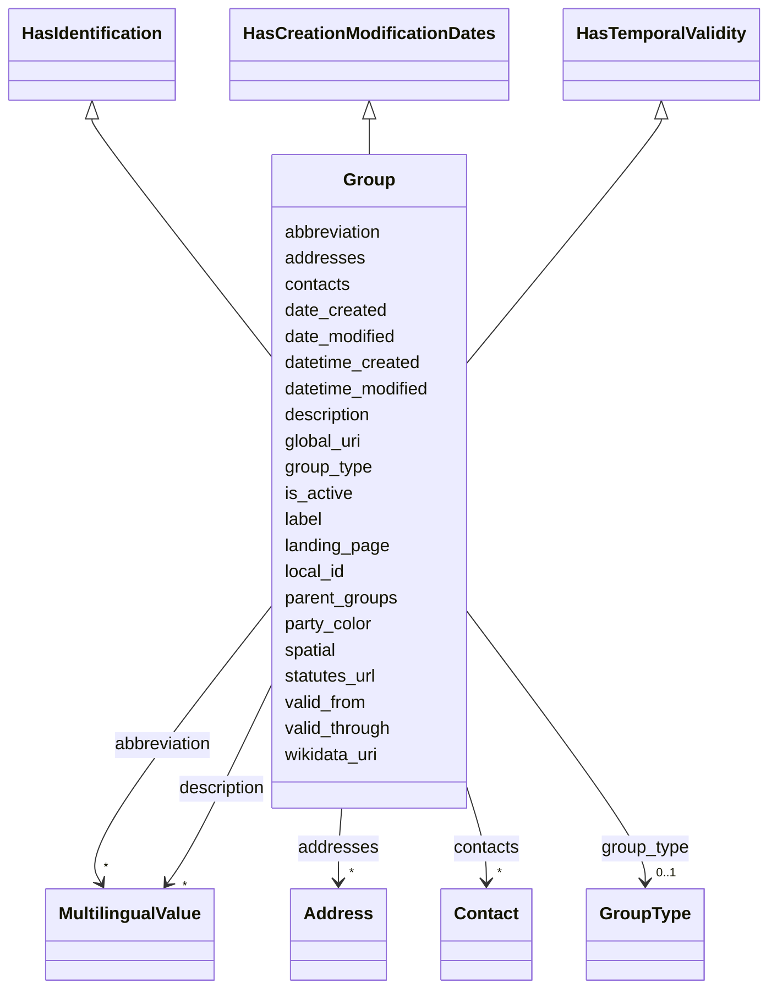

# Class: Group 


_[de] Eine politische Gruppe, Organisation oder Körperschaft (z.B. Partei, Kommission, Parlament, Departement)._

_[en] A political group, organization, or body (e.g., party, committee, parliament, department)._

__


URI: [act:Group](https://ld.ech.ch/schema/0294/actors/Group)



```mermaid
 classDiagram
    class Group
    click Group href "../Group/"
      HasIdentification <|-- Group
        click HasIdentification href "../HasIdentification/"
      HasCreationModificationDates <|-- Group
        click HasCreationModificationDates href "../HasCreationModificationDates/"
      HasTemporalValidity <|-- Group
        click HasTemporalValidity href "../HasTemporalValidity/"
      
      Group : abbreviation
        
          
    
        
        
        Group --> "*" MultilingualValue : abbreviation
        click MultilingualValue href "../MultilingualValue/"
    

        
      Group : addresses
        
          
    
        
        
        Group --> "*" Address : addresses
        click Address href "../Address/"
    

        
      Group : contacts
        
          
    
        
        
        Group --> "*" Contact : contacts
        click Contact href "../Contact/"
    

        
      Group : date_created
        
      Group : date_modified
        
      Group : datetime_created
        
      Group : datetime_modified
        
      Group : description
        
          
    
        
        
        Group --> "*" MultilingualValue : description
        click MultilingualValue href "../MultilingualValue/"
    

        
      Group : global_uri
        
      Group : group_type
        
          
    
        
        
        Group --> "0..1" GroupType : group_type
        click GroupType href "../GroupType/"
    

        
      Group : is_active
        
      Group : label
        
      Group : landing_page
        
      Group : local_id
        
      Group : parent_groups
        
      Group : party_color
        
      Group : spatial
        
      Group : statutes_url
        
      Group : valid_from
        
      Group : valid_through
        
      Group : wikidata_uri
        
      
```


## Inheritance
* **Group** [ [HasIdentification](HasIdentification.md) [HasCreationModificationDates](HasCreationModificationDates.md) [HasTemporalValidity](HasTemporalValidity.md)]


## Slots

| Name | Cardinality and Range | Description | Inheritance |
| ---  | --- | --- | --- |
| [group_type](group_type.md) | 0..1 <br/> [GroupType](GroupType.md) | [de] Link zum Gruppentyp | direct |
| [label](label.md) | 0..1 <br/> [String](String.md) | [de] Möglichkeit bei einer strukturierten Information, ein Label zu vergeben ... | direct |
| [abbreviation](abbreviation.md) | * <br/> [MultilingualValue](MultilingualValue.md) | [de] Abkürzung (kann mehrsprachig sein) | direct |
| [description](description.md) | * <br/> [MultilingualValue](MultilingualValue.md) | [de] Beschreibung der Entität | direct |
| [landing_page](landing_page.md) | 0..1 <br/> [String](String.md) | [de] URL mit weiteren Informationen | direct |
| [parent_groups](parent_groups.md) | * <br/> [Uriorcurie](Uriorcurie.md) | [de] Link zu übergeordneten Gruppen | direct |
| [spatial](spatial.md) | 0..1 <br/> [String](String.md) | [de] Räumliche Referenz (Gemeindenummer, Kantonsnummer, z | direct |
| [contacts](contacts.md) | * <br/> [Contact](Contact.md) | [en] Contact information (email, website, social media) | direct |
| [addresses](addresses.md) | * <br/> [Address](Address.md) | [de] Adressen mit Typ (privat, geschäftlich, lokal) | direct |
| [statutes_url](statutes_url.md) | 0..1 <br/> [String](String.md) | [de] URL zu Parteistatuten (optional für Parteien) | direct |
| [party_color](party_color.md) | 0..1 <br/> [String](String.md) | [de] Parteifarbe (optional für Parteien) | direct |
| [local_id](local_id.md) | 0..1 <br/> [String](String.md) | [de] Lokaler Identifikator | [HasIdentification](HasIdentification.md) |
| [global_uri](global_uri.md) | 1 <br/> [Uriorcurie](Uriorcurie.md) | [de] Eine eindeutige, global gültige URI für die Entität | [HasIdentification](HasIdentification.md) |
| [wikidata_uri](wikidata_uri.md) | 0..1 <br/> [Uriorcurie](Uriorcurie.md) | [de] Eine URI, die auf eine Wikidata-Entität verweist, z | [HasIdentification](HasIdentification.md) |
| [date_created](date_created.md) | 0..1 <br/> [Date](Date.md) | [de] Das Datum, an dem eine Entität erstellt wurde | [HasCreationModificationDates](HasCreationModificationDates.md) |
| [datetime_created](datetime_created.md) | 0..1 <br/> [Datetime](Datetime.md) | [de] Das Datum und die Uhrzeit, an dem eine Entität erstellt wurde | [HasCreationModificationDates](HasCreationModificationDates.md) |
| [date_modified](date_modified.md) | 0..1 <br/> [Date](Date.md) | [de] Das Datum, an dem eine Entität zuletzt geändert wurde | [HasCreationModificationDates](HasCreationModificationDates.md) |
| [datetime_modified](datetime_modified.md) | 0..1 <br/> [Datetime](Datetime.md) | [de] Das Datum und die Uhrzeit, an dem eine Entität zuletzt geändert wurde | [HasCreationModificationDates](HasCreationModificationDates.md) |
| [valid_from](valid_from.md) | 0..1 <br/> [Date](Date.md) | [de] Das Datum, ab dem die Information gültig ist | [HasTemporalValidity](HasTemporalValidity.md) |
| [valid_through](valid_through.md) | 0..1 <br/> [Date](Date.md) | [de] Das Datum, bis und mit dem die Information gültig ist | [HasTemporalValidity](HasTemporalValidity.md) |
| [is_active](is_active.md) | 0..1 <br/> [Boolean](Boolean.md) | [de] Gibt an, ob die Information aktuell gültig ist | [HasTemporalValidity](HasTemporalValidity.md) |


## Usages

| used by | used in | type | used |
| ---  | --- | --- | --- |
| [Container](Container.md) | [groups](groups.md) | range | [Group](Group.md) |
| [Membership](Membership.md) | [concerned_group](concerned_group.md) | range | [Group](Group.md) |


## Identifier and Mapping Information


### Schema Source


* from schema: https://ld.ech.ch/schema/0294/actors


## Mappings

| Mapping Type | Mapped Value |
| ---  | ---  |
| self | act:Group |
| native | act:Group |


## LinkML Source

<!-- TODO: investigate https://stackoverflow.com/questions/37606292/how-to-create-tabbed-code-blocks-in-mkdocs-or-sphinx -->

### Direct

<details>
```yaml
name: Group
description: '[de] Eine politische Gruppe, Organisation oder Körperschaft (z.B. Partei,
  Kommission, Parlament, Departement).

  [en] A political group, organization, or body (e.g., party, committee, parliament,
  department).

  '
from_schema: https://ld.ech.ch/schema/0294/actors
mixins:
- HasIdentification
- HasCreationModificationDates
- HasTemporalValidity
slots:
- group_type
- label
- abbreviation
- description
- landing_page
- parent_groups
- spatial
- contacts
- addresses
- statutes_url
- party_color

```
</details>

### Induced

<details>
```yaml
name: Group
description: '[de] Eine politische Gruppe, Organisation oder Körperschaft (z.B. Partei,
  Kommission, Parlament, Departement).

  [en] A political group, organization, or body (e.g., party, committee, parliament,
  department).

  '
from_schema: https://ld.ech.ch/schema/0294/actors
mixins:
- HasIdentification
- HasCreationModificationDates
- HasTemporalValidity
attributes:
  group_type:
    name: group_type
    description: '[de] Link zum Gruppentyp.

      [en] Link to the group type.

      '
    from_schema: https://ld.ech.ch/schema/0294/actors
    rank: 1000
    slot_uri: act:groupType
    alias: group_type
    owner: Group
    domain_of:
    - Group
    range: GroupType
  label:
    name: label
    description: '[de] Möglichkeit bei einer strukturierten Information, ein Label
      zu vergeben (bspw. Anzeigename, Anstellung, etc.).

      [en] Option to assign a label to a structured piece of information (e.g., display
      name, position, etc.).

      '
    from_schema: https://ld.ech.ch/schema/0294/actors
    rank: 1000
    slot_uri: mcm:label
    alias: label
    owner: Group
    domain_of:
    - Person
    - Group
    - Occupation
    - GroupType
    - RoleType
    range: string
  abbreviation:
    name: abbreviation
    description: '[de] Abkürzung (kann mehrsprachig sein).

      [en] Abbreviation (can be multilingual).

      '
    from_schema: https://ld.ech.ch/schema/0294/actors
    rank: 1000
    alias: abbreviation
    owner: Group
    domain_of:
    - Group
    range: MultilingualValue
    multivalued: true
    inlined: true
    inlined_as_list: true
  description:
    name: description
    description: '[de] Beschreibung der Entität.

      [en] Description of the entity.

      '
    from_schema: https://ld.ech.ch/schema/0294/actors
    rank: 1000
    alias: description
    owner: Group
    domain_of:
    - Group
    range: MultilingualValue
    multivalued: true
    inlined: true
    inlined_as_list: true
  landing_page:
    name: landing_page
    description: '[de] URL mit weiteren Informationen.

      [en] URL providing further information.

      '
    from_schema: https://ld.ech.ch/schema/0294/actors
    rank: 1000
    slot_uri: act:landingPage
    alias: landing_page
    owner: Group
    domain_of:
    - Group
    range: string
  parent_groups:
    name: parent_groups
    description: '[de] Link zu übergeordneten Gruppen.

      [en] Link to parent groups.

      '
    from_schema: https://ld.ech.ch/schema/0294/actors
    rank: 1000
    slot_uri: act:parentGroup
    alias: parent_groups
    owner: Group
    domain_of:
    - Group
    range: uriorcurie
    multivalued: true
    inlined: true
    inlined_as_list: true
  spatial:
    name: spatial
    description: '[de] Räumliche Referenz (Gemeindenummer, Kantonsnummer, z.B. ld.admin.ch/municipality/234).

      [en] Spatial reference (municipality number, canton number, e.g., ld.admin.ch/municipality/234).

      '
    from_schema: https://ld.ech.ch/schema/0294/actors
    rank: 1000
    alias: spatial
    owner: Group
    domain_of:
    - Group
    range: string
  contacts:
    name: contacts
    description: '[en] Contact information (email, website, social media).

      [de] Kontaktinformationen (E-Mail, Website, Social Media).

      '
    from_schema: https://ld.ech.ch/schema/0294/actors
    rank: 1000
    slot_uri: act:contact
    alias: contacts
    owner: Group
    domain_of:
    - Person
    - Group
    range: Contact
    multivalued: true
    inlined: true
    inlined_as_list: true
  addresses:
    name: addresses
    description: '[de] Adressen mit Typ (privat, geschäftlich, lokal).

      [en] Addresses with type (private, business, local).

      '
    from_schema: https://ld.ech.ch/schema/0294/actors
    rank: 1000
    slot_uri: act:address
    alias: addresses
    owner: Group
    domain_of:
    - Person
    - Group
    range: Address
    multivalued: true
    inlined: true
    inlined_as_list: true
  statutes_url:
    name: statutes_url
    description: '[de] URL zu Parteistatuten (optional für Parteien).

      [en] URL to party statutes (optional for parties).

      '
    from_schema: https://ld.ech.ch/schema/0294/actors
    rank: 1000
    slot_uri: act:statutesURL
    alias: statutes_url
    owner: Group
    domain_of:
    - Group
    range: string
  party_color:
    name: party_color
    description: '[de] Parteifarbe (optional für Parteien).

      [en] Party color (optional for parties).

      '
    from_schema: https://ld.ech.ch/schema/0294/actors
    rank: 1000
    slot_uri: act:partyColor
    alias: party_color
    owner: Group
    domain_of:
    - Group
    range: string
  local_id:
    name: local_id
    description: '[de] Lokaler Identifikator. Bspw. eine UUID aus dem Ratsinformationssystem.

      [en] Local identifier. For example, a UUID from the council information system.

      '
    from_schema: https://ld.ech.ch/schema/0294/actors
    rank: 1000
    slot_uri: mcm:localId
    alias: local_id
    owner: Group
    domain_of:
    - HasIdentification
    range: string
  global_uri:
    name: global_uri
    description: '[de] Eine eindeutige, global gültige URI für die Entität.

      [en] A unique, globally valid URI for the entity.

      '
    from_schema: https://ld.ech.ch/schema/0294/actors
    rank: 1000
    slot_uri: mcm:globalURI
    identifier: true
    alias: global_uri
    owner: Group
    domain_of:
    - HasIdentification
    range: uriorcurie
    required: true
  wikidata_uri:
    name: wikidata_uri
    description: '[de] Eine URI, die auf eine Wikidata-Entität verweist, z.B. https://www.wikidata.org/wiki/Q39
      für die Schweiz.

      [en] A URI that refers to a Wikidata entity, e.g. https://www.wikidata.org/wiki/Q39
      for Switzerland.

      '
    from_schema: https://ld.ech.ch/schema/0294/actors
    rank: 1000
    slot_uri: mcm:wikidataUri
    alias: wikidata_uri
    owner: Group
    domain_of:
    - HasIdentification
    range: uriorcurie
  date_created:
    name: date_created
    description: '[de] Das Datum, an dem eine Entität erstellt wurde.

      [en] The date when an entity was created.

      '
    from_schema: https://ld.ech.ch/schema/0294/actors
    rank: 1000
    slot_uri: mcm:dateCreated
    alias: date_created
    owner: Group
    domain_of:
    - HasCreationModificationDates
    range: date
  datetime_created:
    name: datetime_created
    description: '[de] Das Datum und die Uhrzeit, an dem eine Entität erstellt wurde.

      [en] The date and time when an entity was created.

      '
    from_schema: https://ld.ech.ch/schema/0294/actors
    rank: 1000
    slot_uri: mcm:datetimeCreated
    alias: datetime_created
    owner: Group
    domain_of:
    - HasCreationModificationDates
    range: datetime
  date_modified:
    name: date_modified
    description: '[de] Das Datum, an dem eine Entität zuletzt geändert wurde.

      [en] The date when an entity was last modified.

      '
    from_schema: https://ld.ech.ch/schema/0294/actors
    rank: 1000
    slot_uri: mcm:dateModified
    alias: date_modified
    owner: Group
    domain_of:
    - HasCreationModificationDates
    range: date
  datetime_modified:
    name: datetime_modified
    description: '[de] Das Datum und die Uhrzeit, an dem eine Entität zuletzt geändert
      wurde.

      [en] The date and time when an entity was last modified.

      '
    from_schema: https://ld.ech.ch/schema/0294/actors
    rank: 1000
    slot_uri: mcm:datetimeModified
    alias: datetime_modified
    owner: Group
    domain_of:
    - HasCreationModificationDates
    range: datetime
  valid_from:
    name: valid_from
    description: '[de] Das Datum, ab dem die Information gültig ist.

      [en] The date from which the information is valid.

      '
    from_schema: https://ld.ech.ch/schema/0294/actors
    rank: 1000
    slot_uri: schema:validFrom
    alias: valid_from
    owner: Group
    domain_of:
    - HasTemporalValidity
    range: date
  valid_through:
    name: valid_through
    description: '[de] Das Datum, bis und mit dem die Information gültig ist.

      [en] The date until which the information is valid, inclusive.

      '
    from_schema: https://ld.ech.ch/schema/0294/actors
    rank: 1000
    slot_uri: schema:validThrough
    alias: valid_through
    owner: Group
    domain_of:
    - HasTemporalValidity
    range: date
  is_active:
    name: is_active
    description: '[de] Gibt an, ob die Information aktuell gültig ist. Kann nützlich
      sein, wenn diese Information explizit vorhanden ist.

      [en] Indicates whether the information is currently valid. Can be useful when
      this information is explicitly available.

      '
    from_schema: https://ld.ech.ch/schema/0294/actors
    rank: 1000
    slot_uri: mcm:isCurrent
    alias: is_active
    owner: Group
    domain_of:
    - HasTemporalValidity
    range: boolean

```
</details>