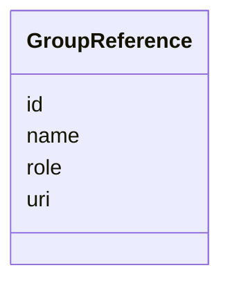

# Class: GroupReference 


_Reference to a group acting in a specific role_


URI: [act:GroupReference](https://ch.paf.link/schema/actors/GroupReference)





<!-- no inheritance hierarchy -->


## Slots

| Name | Cardinality and Range | Description | Inheritance |
| ---  | --- | --- | --- |
| [id](id.md) | 1 <br/> [String](String.md) | Internal system identifier | direct |
| [uri](uri.md) | 0..1 <br/> [String](String.md) | Globally valid identifier (eCH-0285 compatible) | direct |
| [name](name.md) | 1 <br/> [String](String.md) | Group name (can be multilingual) | direct |
| [role](role.md) | 1 <br/> [String](String.md) | Role of the group (e | direct |


## Identifier and Mapping Information


### Schema Source


* from schema: https://ch.paf.link/schema/actors


## Mappings

| Mapping Type | Mapped Value |
| ---  | ---  |
| self | act:GroupReference |
| native | act:GroupReference |


## LinkML Source

<!-- TODO: investigate https://stackoverflow.com/questions/37606292/how-to-create-tabbed-code-blocks-in-mkdocs-or-sphinx -->

### Direct

<details>
```yaml
name: GroupReference
description: Reference to a group acting in a specific role
from_schema: https://ch.paf.link/schema/actors
attributes:
  id:
    name: id
    description: Internal system identifier
    from_schema: https://ch.paf.link/schema/actors
    identifier: true
    domain_of:
    - Person
    - PersonReference
    - GroupReference
    required: true
  uri:
    name: uri
    description: Globally valid identifier (eCH-0285 compatible)
    from_schema: https://ch.paf.link/schema/actors
    domain_of:
    - PersonReference
    - GroupReference
  name:
    name: name
    description: Group name (can be multilingual)
    from_schema: https://ch.paf.link/schema/actors
    domain_of:
    - PersonReference
    - GroupReference
    required: true
  role:
    name: role
    description: Role of the group (e.g. speaker, author, holder, leading)
    from_schema: https://ch.paf.link/schema/actors
    domain_of:
    - PersonReference
    - GroupReference
    required: true

```
</details>

### Induced

<details>
```yaml
name: GroupReference
description: Reference to a group acting in a specific role
from_schema: https://ch.paf.link/schema/actors
attributes:
  id:
    name: id
    description: Internal system identifier
    from_schema: https://ch.paf.link/schema/actors
    identifier: true
    alias: id
    owner: GroupReference
    domain_of:
    - Person
    - PersonReference
    - GroupReference
    range: string
    required: true
  uri:
    name: uri
    description: Globally valid identifier (eCH-0285 compatible)
    from_schema: https://ch.paf.link/schema/actors
    alias: uri
    owner: GroupReference
    domain_of:
    - PersonReference
    - GroupReference
    range: string
  name:
    name: name
    description: Group name (can be multilingual)
    from_schema: https://ch.paf.link/schema/actors
    alias: name
    owner: GroupReference
    domain_of:
    - PersonReference
    - GroupReference
    range: string
    required: true
  role:
    name: role
    description: Role of the group (e.g. speaker, author, holder, leading)
    from_schema: https://ch.paf.link/schema/actors
    alias: role
    owner: GroupReference
    domain_of:
    - PersonReference
    - GroupReference
    range: string
    required: true

```
</details>