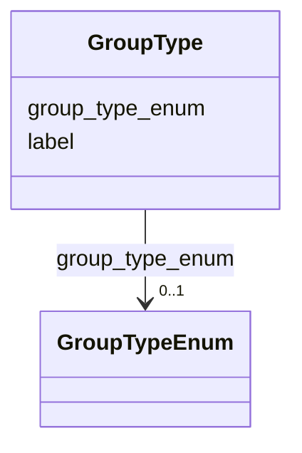

# Class: GroupType 


_[de] Art der Gruppe (z.B. Partei, Kommission, Parlament, Departement)._

_[en] Type of group (e.g., party, committee, parliament, department)._

__


URI: [act:GroupType](https://ld.ech.ch/schema/0294/actors/GroupType)





<!-- no inheritance hierarchy -->

## Slots

| Name | Cardinality and Range | Description | Inheritance |
| ---  | --- | --- | --- |
| [group_type_enum](group_type_enum.md) | 0..1 <br/> [GroupTypeEnum](GroupTypeEnum.md) | [de] Link zum kontrollierten Vokabular für Gruppentypen | direct |
| [label](label.md) | 0..1 <br/> [String](String.md) | [de] Möglichkeit bei einer strukturierten Information, ein Label zu vergeben ... | direct |


## Usages

| used by | used in | type | used |
| ---  | --- | --- | --- |
| [Group](Group.md) | [group_type](group_type.md) | range | [GroupType](GroupType.md) |


## Identifier and Mapping Information


### Schema Source


* from schema: https://ld.ech.ch/schema/0294/actors


## Mappings

| Mapping Type | Mapped Value |
| ---  | ---  |
| self | act:GroupType |
| native | act:GroupType |


## LinkML Source

<!-- TODO: investigate https://stackoverflow.com/questions/37606292/how-to-create-tabbed-code-blocks-in-mkdocs-or-sphinx -->

### Direct

<details>
```yaml
name: GroupType
description: '[de] Art der Gruppe (z.B. Partei, Kommission, Parlament, Departement).

  [en] Type of group (e.g., party, committee, parliament, department).

  '
from_schema: https://ld.ech.ch/schema/0294/actors
slots:
- group_type_enum
- label

```
</details>

### Induced

<details>
```yaml
name: GroupType
description: '[de] Art der Gruppe (z.B. Partei, Kommission, Parlament, Departement).

  [en] Type of group (e.g., party, committee, parliament, department).

  '
from_schema: https://ld.ech.ch/schema/0294/actors
attributes:
  group_type_enum:
    name: group_type_enum
    description: '[de] Link zum kontrollierten Vokabular für Gruppentypen.

      [en] Link to the controlled vocabulary for group types.

      '
    from_schema: https://ld.ech.ch/schema/0294/actors
    rank: 1000
    slot_uri: act:groupTypeEnum
    alias: group_type_enum
    owner: GroupType
    domain_of:
    - GroupType
    range: GroupTypeEnum
  label:
    name: label
    description: '[de] Möglichkeit bei einer strukturierten Information, ein Label
      zu vergeben (bspw. Anzeigename, Anstellung, etc.).

      [en] Option to assign a label to a structured piece of information (e.g., display
      name, position, etc.).

      '
    from_schema: https://ld.ech.ch/schema/0294/actors
    rank: 1000
    slot_uri: mcm:label
    alias: label
    owner: GroupType
    domain_of:
    - Person
    - Group
    - Occupation
    - Training
    - GroupType
    - RoleType
    range: string

```
</details>