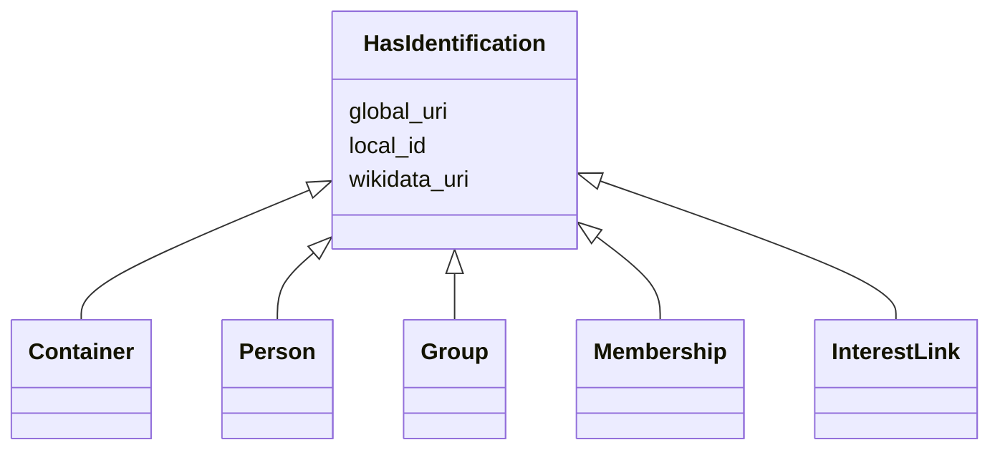

# Class: HasIdentification 


_[de] Eine Mixin-Klasse, die Slots für die Identifikation einer Entität zur Verfügung stellt._

_[en] A mixin class that provides slots for the identification of an entity._

__


URI: [act:HasIdentification](https://ld.ech.ch/schema/0294/actors/HasIdentification)





<!-- no inheritance hierarchy -->

## Class Properties

| Property | Value |
| --- | --- |
| Mixin | Yes |


## Slots

| Name | Cardinality and Range | Description | Inheritance |
| ---  | --- | --- | --- |
| [local_id](local_id.md) | 0..1 <br/> [String](String.md) | [de] Lokaler Identifikator | direct |
| [global_uri](global_uri.md) | 1 <br/> [Uriorcurie](Uriorcurie.md) | [de] Eine eindeutige, global gültige URI für die Entität | direct |
| [wikidata_uri](wikidata_uri.md) | 0..1 <br/> [Uriorcurie](Uriorcurie.md) | [de] Eine URI, die auf eine Wikidata-Entität verweist, z | direct |


## Mixin Usage

| mixed into | description |
| --- | --- |
| [Container](Container.md) | [de] Container für politische Akteure, Gruppen und Beziehungen |
| [Person](Person.md) | [de] Eine Person mit Identifikatoren, Namen, Adressen, Staatsbürgerschaften u... |
| [Group](Group.md) | [de] Eine politische Gruppe, Organisation oder Körperschaft (z |
| [Membership](Membership.md) | [de] Eine Mitgliedschaftsbeziehung zwischen einer Person und einer Gruppe |
| [InterestLink](InterestLink.md) | [de] Eine Interessenbindung (Interessenkonflikt, Politikfinanzierung) einer P... |


## Identifier and Mapping Information


### Schema Source


* from schema: https://ld.ech.ch/schema/0294/actors


## Mappings

| Mapping Type | Mapped Value |
| ---  | ---  |
| self | act:HasIdentification |
| native | act:HasIdentification |


## LinkML Source

<!-- TODO: investigate https://stackoverflow.com/questions/37606292/how-to-create-tabbed-code-blocks-in-mkdocs-or-sphinx -->

### Direct

<details>
```yaml
name: HasIdentification
description: '[de] Eine Mixin-Klasse, die Slots für die Identifikation einer Entität
  zur Verfügung stellt.

  [en] A mixin class that provides slots for the identification of an entity.

  '
from_schema: https://ld.ech.ch/schema/0294/actors
mixin: true
slots:
- local_id
- global_uri
- wikidata_uri

```
</details>

### Induced

<details>
```yaml
name: HasIdentification
description: '[de] Eine Mixin-Klasse, die Slots für die Identifikation einer Entität
  zur Verfügung stellt.

  [en] A mixin class that provides slots for the identification of an entity.

  '
from_schema: https://ld.ech.ch/schema/0294/actors
mixin: true
attributes:
  local_id:
    name: local_id
    description: '[de] Lokaler Identifikator. Bspw. eine UUID aus dem Ratsinformationssystem.

      [en] Local identifier. For example, a UUID from the council information system.

      '
    from_schema: https://ld.ech.ch/schema/0294/actors
    rank: 1000
    slot_uri: mcm:localId
    alias: local_id
    owner: HasIdentification
    domain_of:
    - HasIdentification
    range: string
  global_uri:
    name: global_uri
    description: '[de] Eine eindeutige, global gültige URI für die Entität.

      [en] A unique, globally valid URI for the entity.

      '
    from_schema: https://ld.ech.ch/schema/0294/actors
    rank: 1000
    slot_uri: mcm:globalURI
    identifier: true
    alias: global_uri
    owner: HasIdentification
    domain_of:
    - HasIdentification
    range: uriorcurie
    required: true
  wikidata_uri:
    name: wikidata_uri
    description: '[de] Eine URI, die auf eine Wikidata-Entität verweist, z.B. https://www.wikidata.org/wiki/Q39
      für die Schweiz.

      [en] A URI that refers to a Wikidata entity, e.g. https://www.wikidata.org/wiki/Q39
      for Switzerland.

      '
    from_schema: https://ld.ech.ch/schema/0294/actors
    rank: 1000
    slot_uri: mcm:wikidataUri
    alias: wikidata_uri
    owner: HasIdentification
    domain_of:
    - HasIdentification
    range: uriorcurie

```
</details>