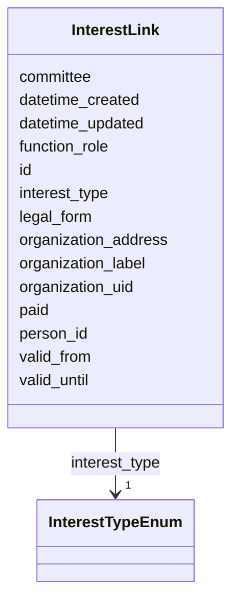

# Class: InterestLink 


_[en] An interest link (conflict of interest, political financing) of a person to an organization._

_[de] Eine Interessenbindung (Interessenkonflikt, Politikfinanzierung) einer Person zu einer Organisation._

__


URI: [act:InterestLink](https://ch.paf.link/schema/actors/InterestLink)





<!-- no inheritance hierarchy -->


## Slots

| Name | Cardinality and Range | Description | Inheritance |
| ---  | --- | --- | --- |
| [id](id.md) | 1 <br/> [String](String.md) | [en] Unique identifier (preferably Wikidata-ID or URI) | direct |
| [person_id](person_id.md) | 0..1 <br/> [String](String.md) | [en] Reference to a person ID | direct |
| [interest_type](interest_type.md) | 1 <br/> [InterestTypeEnum](InterestTypeEnum.md) | [en] Type of interest link (professional activity, political office, associat... | direct |
| [organization_label](organization_label.md) | 0..1 <br/> [String](String.md) | [en] Label of the organization | direct |
| [organization_uid](organization_uid.md) | 0..1 <br/> [String](String.md) | [en] UID of the organization (for analysis with NOGA codes, etc | direct |
| [organization_address](organization_address.md) | 0..1 <br/> [String](String.md) | [en] Address of the organization | direct |
| [legal_form](legal_form.md) | 0..1 <br/> [String](String.md) | [en] Legal form of the organization | direct |
| [valid_from](valid_from.md) | 0..1 <br/> [Date](Date.md) | [en] Start date of validity period | direct |
| [valid_until](valid_until.md) | 0..1 <br/> [Date](Date.md) | [en] End date of validity period | direct |
| [paid](paid.md) | 0..1 <br/> [Boolean](Boolean.md) | [en] Indicates if the position is paid | direct |
| [committee](committee.md) | 0..1 <br/> [String](String.md) | [en] Committee or board (e | direct |
| [function_role](function_role.md) | 0..1 <br/> [String](String.md) | [en] Function or role in the organization | direct |
| [datetime_updated](datetime_updated.md) | 0..1 <br/> [Datetime](Datetime.md) | [en] The last time this record was updated | direct |
| [datetime_created](datetime_created.md) | 0..1 <br/> [Datetime](Datetime.md) | [en] The time this record was created | direct |


## Usages

| used by | used in | type | used |
| ---  | --- | --- | --- |
| [Container](Container.md) | [interest_links](interest_links.md) | range | [InterestLink](InterestLink.md) |
| [Person](Person.md) | [interest_links_person](interest_links_person.md) | range | [InterestLink](InterestLink.md) |


## Identifier and Mapping Information


### Schema Source


* from schema: https://ch.paf.link/schema/actors


## Mappings

| Mapping Type | Mapped Value |
| ---  | ---  |
| self | act:InterestLink |
| native | act:InterestLink |


## LinkML Source

<!-- TODO: investigate https://stackoverflow.com/questions/37606292/how-to-create-tabbed-code-blocks-in-mkdocs-or-sphinx -->

### Direct

<details>
```yaml
name: InterestLink
description: '[en] An interest link (conflict of interest, political financing) of
  a person to an organization.

  [de] Eine Interessenbindung (Interessenkonflikt, Politikfinanzierung) einer Person
  zu einer Organisation.

  '
from_schema: https://ch.paf.link/schema/actors
slots:
- id
- person_id
- interest_type
- organization_label
- organization_uid
- organization_address
- legal_form
- valid_from
- valid_until
- paid
- committee
- function_role
- datetime_updated
- datetime_created

```
</details>

### Induced

<details>
```yaml
name: InterestLink
description: '[en] An interest link (conflict of interest, political financing) of
  a person to an organization.

  [de] Eine Interessenbindung (Interessenkonflikt, Politikfinanzierung) einer Person
  zu einer Organisation.

  '
from_schema: https://ch.paf.link/schema/actors
attributes:
  id:
    name: id
    description: '[en] Unique identifier (preferably Wikidata-ID or URI).

      [de] Eindeutiger Identifikator (vorzugsweise Wikidata-ID oder URI).

      '
    from_schema: https://ch.paf.link/schema/actors
    rank: 1000
    slot_uri: dcterm:identifier
    identifier: true
    alias: id
    owner: InterestLink
    domain_of:
    - Container
    - Person
    - Group
    - Membership
    - InterestLink
    - PersonReference
    - GroupReference
    range: string
    required: true
  person_id:
    name: person_id
    description: '[en] Reference to a person ID.

      [de] Referenz zu einer Personen-ID.

      '
    from_schema: https://ch.paf.link/schema/actors
    rank: 1000
    alias: person_id
    owner: InterestLink
    domain_of:
    - Membership
    - InterestLink
    range: string
  interest_type:
    name: interest_type
    description: '[en] Type of interest link (professional activity, political office,
      association).

      [de] Art der Interessenbindung (Berufliche Tätigkeit, Politische Ämter, Verein).

      '
    from_schema: https://ch.paf.link/schema/actors
    rank: 1000
    slot_uri: act:interestType
    alias: interest_type
    owner: InterestLink
    domain_of:
    - InterestLink
    range: InterestTypeEnum
    required: true
  organization_label:
    name: organization_label
    description: '[en] Label of the organization.

      [de] Bezeichnung der Organisation.

      '
    from_schema: https://ch.paf.link/schema/actors
    rank: 1000
    slot_uri: act:organizationLabel
    alias: organization_label
    owner: InterestLink
    domain_of:
    - InterestLink
    range: string
  organization_uid:
    name: organization_uid
    description: '[en] UID of the organization (for analysis with NOGA codes, etc.).

      [de] UID der Organisation (für Auswertungen mit NOGA-Codes, etc.).

      '
    from_schema: https://ch.paf.link/schema/actors
    rank: 1000
    slot_uri: act:organizationUid
    alias: organization_uid
    owner: InterestLink
    domain_of:
    - InterestLink
    range: string
  organization_address:
    name: organization_address
    description: '[en] Address of the organization.

      [de] Adresse der Organisation.

      '
    from_schema: https://ch.paf.link/schema/actors
    rank: 1000
    slot_uri: act:organizationAddress
    alias: organization_address
    owner: InterestLink
    domain_of:
    - InterestLink
    range: string
  legal_form:
    name: legal_form
    description: '[en] Legal form of the organization.

      [de] Rechtsform der Organisation.

      '
    from_schema: https://ch.paf.link/schema/actors
    rank: 1000
    slot_uri: act:legalForm
    alias: legal_form
    owner: InterestLink
    domain_of:
    - InterestLink
    range: string
  valid_from:
    name: valid_from
    description: '[en] Start date of validity period.

      [de] Startdatum der Gültigkeitsperiode.

      '
    from_schema: https://ch.paf.link/schema/actors
    rank: 1000
    slot_uri: act:validFrom
    alias: valid_from
    owner: InterestLink
    domain_of:
    - Group
    - Membership
    - InterestLink
    - Name
    - Validity
    - ElectoralDistrict
    range: date
  valid_until:
    name: valid_until
    description: '[en] End date of validity period.

      [de] Enddatum der Gültigkeitsperiode.

      '
    from_schema: https://ch.paf.link/schema/actors
    rank: 1000
    slot_uri: act:validUntil
    alias: valid_until
    owner: InterestLink
    domain_of:
    - Group
    - Membership
    - InterestLink
    - Name
    range: date
  paid:
    name: paid
    description: '[en] Indicates if the position is paid.

      [de] Gibt an, ob die Position bezahlt ist.

      '
    from_schema: https://ch.paf.link/schema/actors
    rank: 1000
    alias: paid
    owner: InterestLink
    domain_of:
    - InterestLink
    - Occupation
    range: boolean
  committee:
    name: committee
    description: '[en] Committee or board (e.g., foundation board, board of directors).

      [de] Gremium (z.B. Stiftungsrat, Verwaltungsrat).

      '
    from_schema: https://ch.paf.link/schema/actors
    rank: 1000
    slot_uri: act:committee
    alias: committee
    owner: InterestLink
    domain_of:
    - InterestLink
    range: string
  function_role:
    name: function_role
    description: '[en] Function or role in the organization.

      [de] Funktion oder Rolle in der Organisation.

      '
    from_schema: https://ch.paf.link/schema/actors
    rank: 1000
    slot_uri: act:functionRole
    alias: function_role
    owner: InterestLink
    domain_of:
    - InterestLink
    range: string
  datetime_updated:
    name: datetime_updated
    description: '[en] The last time this record was updated.

      [de] Der Zeitpunkt, zu dem dieser Datensatz zuletzt aktualisiert wurde.

      '
    from_schema: https://ch.paf.link/schema/actors
    rank: 1000
    alias: datetime_updated
    owner: InterestLink
    domain_of:
    - Person
    - Group
    - Membership
    - InterestLink
    range: datetime
  datetime_created:
    name: datetime_created
    description: '[en] The time this record was created.

      [de] Der Zeitpunkt, zu dem dieser Datensatz erstellt wurde.

      '
    from_schema: https://ch.paf.link/schema/actors
    rank: 1000
    alias: datetime_created
    owner: InterestLink
    domain_of:
    - Person
    - Group
    - Membership
    - InterestLink
    range: datetime

```
</details>