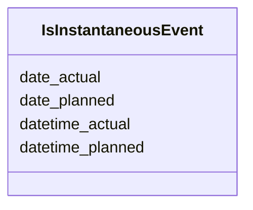

# Class: IsInstantaneousEvent 


_[de] Eine Mixin-Klasse, die Slots für die Modellierung von instantanen Ereignissen oder Vorkommnissen (ohne Zeitdauer) zur Verfügung stellt._

_[en] A mixin class that provides slots for modeling instantaneous events or occurrences (without time duration)._

__


URI: [act:IsInstantaneousEvent](https://ld.ech.ch/schema/0294/actors/IsInstantaneousEvent)





<!-- no inheritance hierarchy -->

## Class Properties

| Property | Value |
| --- | --- |
| Mixin | Yes |


## Slots

| Name | Cardinality and Range | Description | Inheritance |
| ---  | --- | --- | --- |
| [date_actual](date_actual.md) | 0..1 <br/> [Date](Date.md) | [de] Das tatsächliche Datum eines instantanen Ereignisses oder Vorkommens (oh... | direct |
| [datetime_actual](datetime_actual.md) | 0..1 <br/> [Datetime](Datetime.md) | [de] Das tatsächliche Datum und die Uhrzeit eines instantanen Ereignisses ode... | direct |
| [date_planned](date_planned.md) | 0..1 <br/> [Date](Date.md) | [de] Das geplante Datum eines instantanen Ereignisses oder Vorkommens (ohne Z... | direct |
| [datetime_planned](datetime_planned.md) | 0..1 <br/> [Datetime](Datetime.md) | [de] Das geplante Datum und die Uhrzeit eines instantanen Ereignisses oder Vo... | direct |


## Mixin Usage

| mixed into | description |
| --- | --- |


## Identifier and Mapping Information


### Schema Source


* from schema: https://ld.ech.ch/schema/0294/actors


## Mappings

| Mapping Type | Mapped Value |
| ---  | ---  |
| self | act:IsInstantaneousEvent |
| native | act:IsInstantaneousEvent |


## LinkML Source

<!-- TODO: investigate https://stackoverflow.com/questions/37606292/how-to-create-tabbed-code-blocks-in-mkdocs-or-sphinx -->

### Direct

<details>
```yaml
name: IsInstantaneousEvent
description: '[de] Eine Mixin-Klasse, die Slots für die Modellierung von instantanen
  Ereignissen oder Vorkommnissen (ohne Zeitdauer) zur Verfügung stellt.

  [en] A mixin class that provides slots for modeling instantaneous events or occurrences
  (without time duration).

  '
from_schema: https://ld.ech.ch/schema/0294/actors
mixin: true
slots:
- date_actual
- datetime_actual
- date_planned
- datetime_planned

```
</details>

### Induced

<details>
```yaml
name: IsInstantaneousEvent
description: '[de] Eine Mixin-Klasse, die Slots für die Modellierung von instantanen
  Ereignissen oder Vorkommnissen (ohne Zeitdauer) zur Verfügung stellt.

  [en] A mixin class that provides slots for modeling instantaneous events or occurrences
  (without time duration).

  '
from_schema: https://ld.ech.ch/schema/0294/actors
mixin: true
attributes:
  date_actual:
    name: date_actual
    description: '[de] Das tatsächliche Datum eines instantanen Ereignisses oder Vorkommens
      (ohne Zeitdauer).

      [en] The actual date of an instantaneous event or occurrence (without time duration).

      '
    from_schema: https://ld.ech.ch/schema/0294/actors
    rank: 1000
    slot_uri: mcm:dateActual
    alias: date_actual
    owner: IsInstantaneousEvent
    domain_of:
    - IsInstantaneousEvent
    range: date
  datetime_actual:
    name: datetime_actual
    description: '[de] Das tatsächliche Datum und die Uhrzeit eines instantanen Ereignisses
      oder Vorkommens (ohne Zeitdauer).

      [en] The actual date and time of an instantaneous event or occurrence (without
      time duration).

      '
    from_schema: https://ld.ech.ch/schema/0294/actors
    rank: 1000
    slot_uri: mcm:datetimeActual
    alias: datetime_actual
    owner: IsInstantaneousEvent
    domain_of:
    - IsInstantaneousEvent
    range: datetime
  date_planned:
    name: date_planned
    description: '[de] Das geplante Datum eines instantanen Ereignisses oder Vorkommens
      (ohne Zeitdauer).

      [en] The planned date of an instantaneous event or occurrence (without time
      duration).

      '
    from_schema: https://ld.ech.ch/schema/0294/actors
    rank: 1000
    slot_uri: mcm:datePlanned
    alias: date_planned
    owner: IsInstantaneousEvent
    domain_of:
    - IsInstantaneousEvent
    range: date
  datetime_planned:
    name: datetime_planned
    description: '[de] Das geplante Datum und die Uhrzeit eines instantanen Ereignisses
      oder Vorkommens (ohne Zeitdauer).

      [en] The planned date and time of an instantaneous event or occurrence (without
      time duration).

      '
    from_schema: https://ld.ech.ch/schema/0294/actors
    rank: 1000
    slot_uri: mcm:datetimePlanned
    alias: datetime_planned
    owner: IsInstantaneousEvent
    domain_of:
    - IsInstantaneousEvent
    range: datetime

```
</details>