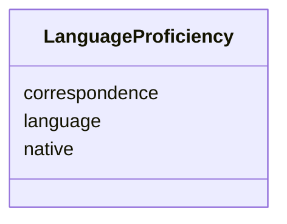

# Class: LanguageProficiency 


URI: [act:LanguageProficiency](https://ch.paf.link/schema/actors/LanguageProficiency)





<!-- no inheritance hierarchy -->


## Slots

| Name | Cardinality and Range | Description | Inheritance |
| ---  | --- | --- | --- |
| [language](language.md) | 1 <br/> [String](String.md) | ISO language code | direct |
| [correspondence](correspondence.md) | 0..1 <br/> [Boolean](Boolean.md) | preferred language | direct |
| [native](native.md) | 0..1 <br/> [Boolean](Boolean.md) | proficient language | direct |


## Usages

| used by | used in | type | used |
| ---  | --- | --- | --- |
| [Person](Person.md) | [languages](languages.md) | range | [LanguageProficiency](LanguageProficiency.md) |


## Identifier and Mapping Information


### Schema Source


* from schema: https://ch.paf.link/schema/actors


## Mappings

| Mapping Type | Mapped Value |
| ---  | ---  |
| self | act:LanguageProficiency |
| native | act:LanguageProficiency |


## LinkML Source

<!-- TODO: investigate https://stackoverflow.com/questions/37606292/how-to-create-tabbed-code-blocks-in-mkdocs-or-sphinx -->

### Direct

<details>
```yaml
name: LanguageProficiency
from_schema: https://ch.paf.link/schema/actors
attributes:
  language:
    name: language
    description: ISO language code
    from_schema: https://ch.paf.link/schema/actors
    domain_of:
    - LanguageProficiency
    - MultilingualString
    required: true
  correspondence:
    name: correspondence
    description: preferred language
    from_schema: https://ch.paf.link/schema/actors
    rank: 1000
    domain_of:
    - LanguageProficiency
    range: boolean
  native:
    name: native
    description: proficient language
    from_schema: https://ch.paf.link/schema/actors
    rank: 1000
    domain_of:
    - LanguageProficiency
    range: boolean

```
</details>

### Induced

<details>
```yaml
name: LanguageProficiency
from_schema: https://ch.paf.link/schema/actors
attributes:
  language:
    name: language
    description: ISO language code
    from_schema: https://ch.paf.link/schema/actors
    alias: language
    owner: LanguageProficiency
    domain_of:
    - LanguageProficiency
    - MultilingualString
    range: string
    required: true
  correspondence:
    name: correspondence
    description: preferred language
    from_schema: https://ch.paf.link/schema/actors
    rank: 1000
    alias: correspondence
    owner: LanguageProficiency
    domain_of:
    - LanguageProficiency
    range: boolean
  native:
    name: native
    description: proficient language
    from_schema: https://ch.paf.link/schema/actors
    rank: 1000
    alias: native
    owner: LanguageProficiency
    domain_of:
    - LanguageProficiency
    range: boolean

```
</details>