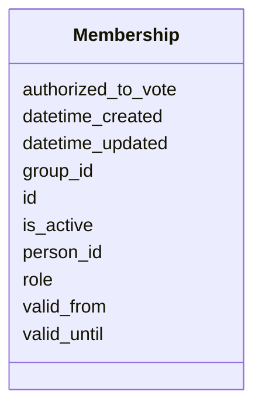

# Class: Membership 


_[en] A membership relationship between a person and a group._

_[de] Eine Mitgliedschaftsbeziehung zwischen einer Person und einer Gruppe._

__


URI: [act:Membership](https://ch.paf.link/schema/actors/Membership)





<!-- no inheritance hierarchy -->


## Slots

| Name | Cardinality and Range | Description | Inheritance |
| ---  | --- | --- | --- |
| [id](id.md) | 1 <br/> [String](String.md) | [en] Unique identifier (preferably Wikidata-ID or URI) | direct |
| [person_id](person_id.md) | 0..1 <br/> [String](String.md) | [en] Reference to a person ID | direct |
| [group_id](group_id.md) | 0..1 <br/> [String](String.md) | [en] Reference to a group ID | direct |
| [role](role.md) | 0..1 <br/> [String](String.md) | [en] Role of the person in the membership or function | direct |
| [valid_from](valid_from.md) | 0..1 <br/> [Date](Date.md) | [en] Start date of validity period | direct |
| [valid_until](valid_until.md) | 0..1 <br/> [Date](Date.md) | [en] End date of validity period | direct |
| [is_active](is_active.md) | 0..1 <br/> [Boolean](Boolean.md) | [en] Indicates if the membership is currently active | direct |
| [authorized_to_vote](authorized_to_vote.md) | 0..1 <br/> [Boolean](Boolean.md) | [en] Indicates if the person is authorized to vote | direct |
| [datetime_updated](datetime_updated.md) | 0..1 <br/> [Datetime](Datetime.md) | [en] The last time this record was updated | direct |
| [datetime_created](datetime_created.md) | 0..1 <br/> [Datetime](Datetime.md) | [en] The time this record was created | direct |


## Usages

| used by | used in | type | used |
| ---  | --- | --- | --- |
| [Container](Container.md) | [memberships](memberships.md) | range | [Membership](Membership.md) |


## Identifier and Mapping Information


### Schema Source


* from schema: https://ch.paf.link/schema/actors


## Mappings

| Mapping Type | Mapped Value |
| ---  | ---  |
| self | act:Membership |
| native | act:Membership |


## LinkML Source

<!-- TODO: investigate https://stackoverflow.com/questions/37606292/how-to-create-tabbed-code-blocks-in-mkdocs-or-sphinx -->

### Direct

<details>
```yaml
name: Membership
description: '[en] A membership relationship between a person and a group.

  [de] Eine Mitgliedschaftsbeziehung zwischen einer Person und einer Gruppe.

  '
from_schema: https://ch.paf.link/schema/actors
slots:
- id
- person_id
- group_id
- role
- valid_from
- valid_until
- is_active
- authorized_to_vote
- datetime_updated
- datetime_created

```
</details>

### Induced

<details>
```yaml
name: Membership
description: '[en] A membership relationship between a person and a group.

  [de] Eine Mitgliedschaftsbeziehung zwischen einer Person und einer Gruppe.

  '
from_schema: https://ch.paf.link/schema/actors
attributes:
  id:
    name: id
    description: '[en] Unique identifier (preferably Wikidata-ID or URI).

      [de] Eindeutiger Identifikator (vorzugsweise Wikidata-ID oder URI).

      '
    from_schema: https://ch.paf.link/schema/actors
    rank: 1000
    slot_uri: dcterm:identifier
    identifier: true
    alias: id
    owner: Membership
    domain_of:
    - Container
    - Person
    - Group
    - Membership
    - InterestLink
    - PersonReference
    - GroupReference
    range: string
    required: true
  person_id:
    name: person_id
    description: '[en] Reference to a person ID.

      [de] Referenz zu einer Personen-ID.

      '
    from_schema: https://ch.paf.link/schema/actors
    rank: 1000
    alias: person_id
    owner: Membership
    domain_of:
    - Membership
    - InterestLink
    range: string
  group_id:
    name: group_id
    description: '[en] Reference to a group ID.

      [de] Referenz zu einer Gruppen-ID.

      '
    from_schema: https://ch.paf.link/schema/actors
    rank: 1000
    alias: group_id
    owner: Membership
    domain_of:
    - Membership
    range: string
  role:
    name: role
    description: '[en] Role of the person in the membership or function.

      [de] Rolle der Person in der Mitgliedschaft oder Funktion.

      '
    from_schema: https://ch.paf.link/schema/actors
    rank: 1000
    alias: role
    owner: Membership
    domain_of:
    - Membership
    - PersonReference
    - GroupReference
    range: string
  valid_from:
    name: valid_from
    description: '[en] Start date of validity period.

      [de] Startdatum der Gültigkeitsperiode.

      '
    from_schema: https://ch.paf.link/schema/actors
    rank: 1000
    slot_uri: act:validFrom
    alias: valid_from
    owner: Membership
    domain_of:
    - Group
    - Membership
    - InterestLink
    - Name
    - Validity
    - ElectoralDistrict
    range: date
  valid_until:
    name: valid_until
    description: '[en] End date of validity period.

      [de] Enddatum der Gültigkeitsperiode.

      '
    from_schema: https://ch.paf.link/schema/actors
    rank: 1000
    slot_uri: act:validUntil
    alias: valid_until
    owner: Membership
    domain_of:
    - Group
    - Membership
    - InterestLink
    - Name
    - Validity
    - ElectoralDistrict
    range: date
  is_active:
    name: is_active
    description: '[en] Indicates if the membership is currently active.

      [de] Gibt an, ob die Mitgliedschaft derzeit aktiv ist.

      '
    from_schema: https://ch.paf.link/schema/actors
    rank: 1000
    slot_uri: act:isActive
    alias: is_active
    owner: Membership
    domain_of:
    - Membership
    range: boolean
  authorized_to_vote:
    name: authorized_to_vote
    description: '[en] Indicates if the person is authorized to vote.

      [de] Gibt an, ob die Person stimmberechtigt ist.

      '
    from_schema: https://ch.paf.link/schema/actors
    rank: 1000
    slot_uri: act:authorizedToVote
    alias: authorized_to_vote
    owner: Membership
    domain_of:
    - Membership
    range: boolean
  datetime_updated:
    name: datetime_updated
    description: '[en] The last time this record was updated.

      [de] Der Zeitpunkt, zu dem dieser Datensatz zuletzt aktualisiert wurde.

      '
    from_schema: https://ch.paf.link/schema/actors
    rank: 1000
    alias: datetime_updated
    owner: Membership
    domain_of:
    - Person
    - Group
    - Membership
    - InterestLink
    range: datetime
  datetime_created:
    name: datetime_created
    description: '[en] The time this record was created.

      [de] Der Zeitpunkt, zu dem dieser Datensatz erstellt wurde.

      '
    from_schema: https://ch.paf.link/schema/actors
    rank: 1000
    alias: datetime_created
    owner: Membership
    domain_of:
    - Person
    - Group
    - Membership
    - InterestLink
    range: datetime

```
</details>