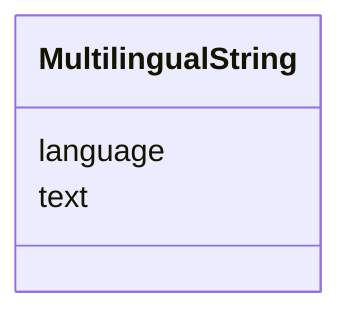

# Class: MultilingualString 


URI: [act:MultilingualString](https://ch.paf.link/schema/actors/MultilingualString)





<!-- no inheritance hierarchy -->


## Slots

| Name | Cardinality and Range | Description | Inheritance |
| ---  | --- | --- | --- |
| [text](text.md) | 1 <br/> [String](String.md) |  | direct |
| [language](language.md) | 1 <br/> [String](String.md) | Language code in ISO 639-1 format | direct |


## Identifier and Mapping Information


### Schema Source


* from schema: https://ch.paf.link/schema/actors


## Mappings

| Mapping Type | Mapped Value |
| ---  | ---  |
| self | act:MultilingualString |
| native | act:MultilingualString |


## LinkML Source

<!-- TODO: investigate https://stackoverflow.com/questions/37606292/how-to-create-tabbed-code-blocks-in-mkdocs-or-sphinx -->

### Direct

<details>
```yaml
name: MultilingualString
from_schema: https://ch.paf.link/schema/actors
slots:
- text
- language

```
</details>

### Induced

<details>
```yaml
name: MultilingualString
from_schema: https://ch.paf.link/schema/actors
attributes:
  text:
    name: text
    from_schema: https://ch.paf.link/schema/actors
    rank: 1000
    alias: text
    owner: MultilingualString
    domain_of:
    - MultilingualString
    range: string
    required: true
  language:
    name: language
    description: Language code in ISO 639-1 format
    from_schema: https://ch.paf.link/schema/actors
    rank: 1000
    alias: language
    owner: MultilingualString
    domain_of:
    - MultilingualString
    range: string
    required: true
    pattern: ^[a-z]{2}$

```
</details>