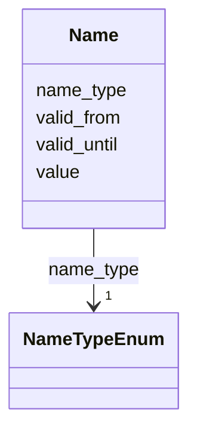

# Class: Name 


URI: [act:Name](https://ch.paf.link/schema/actors/Name)





<!-- no inheritance hierarchy -->


## Slots

| Name | Cardinality and Range | Description | Inheritance |
| ---  | --- | --- | --- |
| [name_type](name_type.md) | 1 <br/> [NameTypeEnum](NameTypeEnum.md) | categories of name types | direct |
| [value](value.md) | 1 <br/> [String](String.md) |  | direct |
| [valid_from](valid_from.md) | 0..1 <br/> [Date](Date.md) |  | direct |
| [valid_until](valid_until.md) | 0..1 <br/> [Date](Date.md) |  | direct |


## Usages

| used by | used in | type | used |
| ---  | --- | --- | --- |
| [Person](Person.md) | [names](names.md) | range | [Name](Name.md) |


## Identifier and Mapping Information


### Schema Source


* from schema: https://ch.paf.link/schema/actors


## Mappings

| Mapping Type | Mapped Value |
| ---  | ---  |
| self | act:Name |
| native | act:Name |


## LinkML Source

<!-- TODO: investigate https://stackoverflow.com/questions/37606292/how-to-create-tabbed-code-blocks-in-mkdocs-or-sphinx -->

### Direct

<details>
```yaml
name: Name
from_schema: https://ch.paf.link/schema/actors
attributes:
  name_type:
    name: name_type
    description: categories of name types
    from_schema: https://ch.paf.link/schema/actors
    rank: 1000
    slot_uri: act:nameType
    domain_of:
    - Name
    range: NameTypeEnum
    required: true
  value:
    name: value
    from_schema: https://ch.paf.link/schema/actors
    rank: 1000
    domain_of:
    - Name
    - Gender
    - Occupation
    - Training
    - Contact
    required: true
  valid_from:
    name: valid_from
    from_schema: https://ch.paf.link/schema/actors
    slot_uri: act:validFrom
    domain_of:
    - Group
    - Membership
    - InterestLink
    - Name
    - Validity
    - ElectoralDistrict
    range: date
  valid_until:
    name: valid_until
    from_schema: https://ch.paf.link/schema/actors
    slot_uri: act:validUntil
    domain_of:
    - Group
    - Membership
    - InterestLink
    - Name
    - Validity
    - ElectoralDistrict
    range: date

```
</details>

### Induced

<details>
```yaml
name: Name
from_schema: https://ch.paf.link/schema/actors
attributes:
  name_type:
    name: name_type
    description: categories of name types
    from_schema: https://ch.paf.link/schema/actors
    rank: 1000
    slot_uri: act:nameType
    alias: name_type
    owner: Name
    domain_of:
    - Name
    range: NameTypeEnum
    required: true
  value:
    name: value
    from_schema: https://ch.paf.link/schema/actors
    rank: 1000
    alias: value
    owner: Name
    domain_of:
    - Name
    - Gender
    - Occupation
    - Training
    - Contact
    range: string
    required: true
  valid_from:
    name: valid_from
    from_schema: https://ch.paf.link/schema/actors
    slot_uri: act:validFrom
    alias: valid_from
    owner: Name
    domain_of:
    - Group
    - Membership
    - InterestLink
    - Name
    - Validity
    - ElectoralDistrict
    range: date
  valid_until:
    name: valid_until
    from_schema: https://ch.paf.link/schema/actors
    slot_uri: act:validUntil
    alias: valid_until
    owner: Name
    domain_of:
    - Group
    - Membership
    - InterestLink
    - Name
    - Validity
    - ElectoralDistrict
    range: date

```
</details>