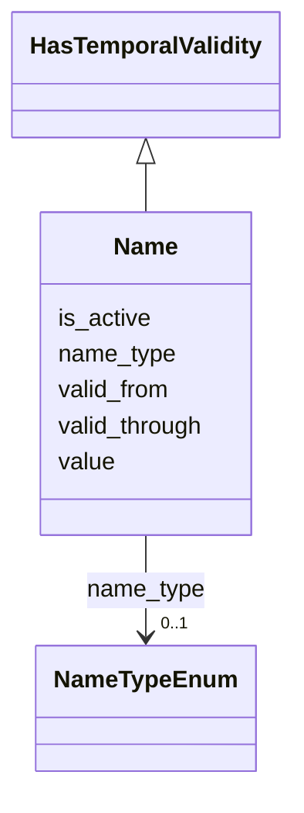

# Class: Name 


_[de] Ein Name mit einem Typ (z.B. Rufname, amtlicher Name) und einem Wert und einer zeitlichen Gültigkeit._

_[en] A name with a type (e.g., call name, official name) and a value._

__


URI: [act:Name](https://ld.ech.ch/schema/0294/actors/Name)



```mermaid
 classDiagram
    class Name
    click Name href "../Name/"
      HasTemporalValidity <|-- Name
        click HasTemporalValidity href "../HasTemporalValidity/"
      
      Name : is_active
        
      Name : name_type
        
          
    
        
        
        Name --> "0..1" NameTypeEnum : name_type
        click NameTypeEnum href "../NameTypeEnum/"
    

        
      Name : valid_from
        
      Name : valid_through
        
      Name : value
        
      
```


## Inheritance
* **Name** [ [HasTemporalValidity](HasTemporalValidity.md)]


## Slots

| Name | Cardinality and Range | Description | Inheritance |
| ---  | --- | --- | --- |
| [name_type](name_type.md) | 0..1 <br/> [NameTypeEnum](NameTypeEnum.md) | [de] Typ des Namens | direct |
| [value](value.md) | 0..1 <br/> [String](String.md) | [de] Der eigentliche Wert einer Information neben weiteren attributen wie Typ... | direct |
| [valid_from](valid_from.md) | 0..1 <br/> [Date](Date.md) | [de] Das Datum, ab dem die Information gültig ist | [HasTemporalValidity](HasTemporalValidity.md) |
| [valid_through](valid_through.md) | 0..1 <br/> [Date](Date.md) | [de] Das Datum, bis und mit dem die Information gültig ist | [HasTemporalValidity](HasTemporalValidity.md) |
| [is_active](is_active.md) | 0..1 <br/> [Boolean](Boolean.md) | [de] Gibt an, ob die Information aktuell gültig ist | [HasTemporalValidity](HasTemporalValidity.md) |


## Usages

| used by | used in | type | used |
| ---  | --- | --- | --- |
| [Person](Person.md) | [names](names.md) | range | [Name](Name.md) |


## Identifier and Mapping Information


### Schema Source


* from schema: https://ld.ech.ch/schema/0294/actors


## Mappings

| Mapping Type | Mapped Value |
| ---  | ---  |
| self | act:Name |
| native | act:Name |


## LinkML Source

<!-- TODO: investigate https://stackoverflow.com/questions/37606292/how-to-create-tabbed-code-blocks-in-mkdocs-or-sphinx -->

### Direct

<details>
```yaml
name: Name
description: '[de] Ein Name mit einem Typ (z.B. Rufname, amtlicher Name) und einem
  Wert und einer zeitlichen Gültigkeit.

  [en] A name with a type (e.g., call name, official name) and a value.

  '
from_schema: https://ld.ech.ch/schema/0294/actors
mixins:
- HasTemporalValidity
slots:
- name_type
- value

```
</details>

### Induced

<details>
```yaml
name: Name
description: '[de] Ein Name mit einem Typ (z.B. Rufname, amtlicher Name) und einem
  Wert und einer zeitlichen Gültigkeit.

  [en] A name with a type (e.g., call name, official name) and a value.

  '
from_schema: https://ld.ech.ch/schema/0294/actors
mixins:
- HasTemporalValidity
attributes:
  name_type:
    name: name_type
    description: '[de] Typ des Namens.

      [en] Type of name.

      '
    from_schema: https://ld.ech.ch/schema/0294/actors
    rank: 1000
    slot_uri: act:nameType
    alias: name_type
    owner: Name
    domain_of:
    - Name
    range: NameTypeEnum
  value:
    name: value
    description: '[de] Der eigentliche Wert einer Information neben weiteren attributen
      wie Typ, Sprache, etc.

      [en] The value of an information besides other attributes such as type, language,
      etc.

      '
    from_schema: https://ld.ech.ch/schema/0294/actors
    rank: 1000
    slot_uri: mcm:value
    alias: value
    owner: Name
    domain_of:
    - Name
    - Training
    - Contact
    - MultilingualValue
    range: string
  valid_from:
    name: valid_from
    description: '[de] Das Datum, ab dem die Information gültig ist.

      [en] The date from which the information is valid.

      '
    from_schema: https://ld.ech.ch/schema/0294/actors
    rank: 1000
    slot_uri: schema:validFrom
    alias: valid_from
    owner: Name
    domain_of:
    - HasTemporalValidity
    range: date
  valid_through:
    name: valid_through
    description: '[de] Das Datum, bis und mit dem die Information gültig ist.

      [en] The date until which the information is valid, inclusive.

      '
    from_schema: https://ld.ech.ch/schema/0294/actors
    rank: 1000
    slot_uri: schema:validThrough
    alias: valid_through
    owner: Name
    domain_of:
    - HasTemporalValidity
    range: date
  is_active:
    name: is_active
    description: '[de] Gibt an, ob die Information aktuell gültig ist. Kann nützlich
      sein, wenn diese Information explizit vorhanden ist.

      [en] Indicates whether the information is currently valid. Can be useful when
      this information is explicitly available.

      '
    from_schema: https://ld.ech.ch/schema/0294/actors
    rank: 1000
    slot_uri: mcm:isCurrent
    alias: is_active
    owner: Name
    domain_of:
    - HasTemporalValidity
    range: boolean

```
</details>