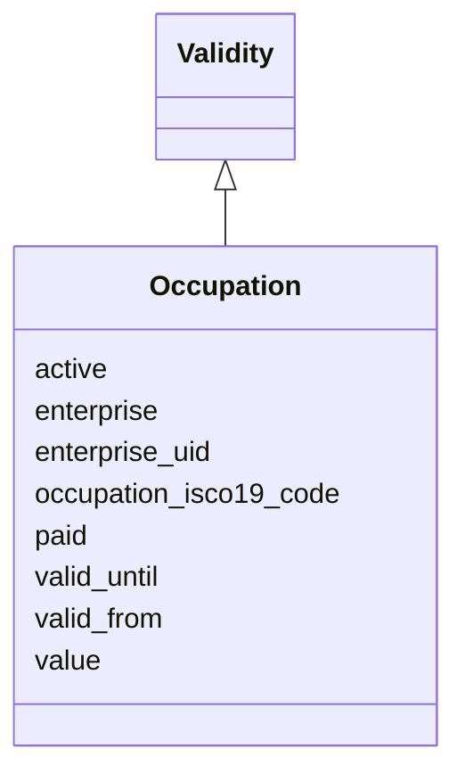

# Class: Occupation 


URI: [act:Occupation](https://ch.paf.link/schema/actors/Occupation)





## Inheritance
* [Validity](Validity.md)
    * **Occupation**


## Slots

| Name | Cardinality and Range | Description | Inheritance |
| ---  | --- | --- | --- |
| [active](active.md) | 0..1 <br/> [Boolean](Boolean.md) |  | direct |
| [paid](paid.md) | 0..1 <br/> [Boolean](Boolean.md) |  | direct |
| [occupation_isco19_code](occupation_isco19_code.md) | 0..1 <br/> [String](String.md) |  | direct |
| [value](value.md) | 0..1 <br/> [String](String.md) |  | direct |
| [enterprise_uid](enterprise_uid.md) | 0..1 <br/> [String](String.md) |  | direct |
| [enterprise](enterprise.md) | 0..1 <br/> [String](String.md) |  | direct |
| [valid_from](valid_from.md) | 0..1 <br/> [Date](Date.md) |  | [Validity](Validity.md) |
| [valid_until](valid_until.md) | 0..1 <br/> [Date](Date.md) |  | [Validity](Validity.md) |


## Usages

| used by | used in | type | used |
| ---  | --- | --- | --- |
| [Person](Person.md) | [occupations](occupations.md) | range | [Occupation](Occupation.md) |


## Identifier and Mapping Information


### Schema Source


* from schema: https://ch.paf.link/schema/actors


## Mappings

| Mapping Type | Mapped Value |
| ---  | ---  |
| self | act:Occupation |
| native | act:Occupation |


## LinkML Source

<!-- TODO: investigate https://stackoverflow.com/questions/37606292/how-to-create-tabbed-code-blocks-in-mkdocs-or-sphinx -->

### Direct

<details>
```yaml
name: Occupation
from_schema: https://ch.paf.link/schema/actors
is_a: Validity
attributes:
  active:
    name: active
    from_schema: https://ch.paf.link/schema/actors
    rank: 1000
    domain_of:
    - Occupation
    range: boolean
  paid:
    name: paid
    from_schema: https://ch.paf.link/schema/actors
    domain_of:
    - InterestLink
    - Occupation
    range: boolean
  occupation_isco19_code:
    name: occupation_isco19_code
    from_schema: https://ch.paf.link/schema/actors
    rank: 1000
    slot_uri: act:occupationIsco19Code
    domain_of:
    - Occupation
  value:
    name: value
    from_schema: https://ch.paf.link/schema/actors
    domain_of:
    - Name
    - Gender
    - Occupation
    - Training
    - Contact
  enterprise_uid:
    name: enterprise_uid
    from_schema: https://ch.paf.link/schema/actors
    rank: 1000
    slot_uri: act:enterpriseUid
    domain_of:
    - Occupation
  enterprise:
    name: enterprise
    from_schema: https://ch.paf.link/schema/actors
    rank: 1000
    domain_of:
    - Occupation

```
</details>

### Induced

<details>
```yaml
name: Occupation
from_schema: https://ch.paf.link/schema/actors
is_a: Validity
attributes:
  active:
    name: active
    from_schema: https://ch.paf.link/schema/actors
    rank: 1000
    alias: active
    owner: Occupation
    domain_of:
    - Occupation
    range: boolean
  paid:
    name: paid
    from_schema: https://ch.paf.link/schema/actors
    alias: paid
    owner: Occupation
    domain_of:
    - InterestLink
    - Occupation
    range: boolean
  occupation_isco19_code:
    name: occupation_isco19_code
    from_schema: https://ch.paf.link/schema/actors
    rank: 1000
    slot_uri: act:occupationIsco19Code
    alias: occupation_isco19_code
    owner: Occupation
    domain_of:
    - Occupation
    range: string
  value:
    name: value
    from_schema: https://ch.paf.link/schema/actors
    alias: value
    owner: Occupation
    domain_of:
    - Name
    - Gender
    - Occupation
    - Training
    - Contact
    range: string
  enterprise_uid:
    name: enterprise_uid
    from_schema: https://ch.paf.link/schema/actors
    rank: 1000
    slot_uri: act:enterpriseUid
    alias: enterprise_uid
    owner: Occupation
    domain_of:
    - Occupation
    range: string
  enterprise:
    name: enterprise
    from_schema: https://ch.paf.link/schema/actors
    rank: 1000
    alias: enterprise
    owner: Occupation
    domain_of:
    - Occupation
    range: string
  valid_from:
    name: valid_from
    from_schema: https://ch.paf.link/schema/actors
    slot_uri: act:validFrom
    alias: valid_from
    owner: Occupation
    domain_of:
    - Group
    - Membership
    - InterestLink
    - Name
    - Validity
    - ElectoralDistrict
    range: date
  valid-until:
    name: valid-until
    from_schema: https://ch.paf.link/schema/actors
    rank: 1000
    slot_uri: act:validUntil
    alias: valid_until
    owner: Occupation
    domain_of:
    - Validity
    - ElectoralDistrict
    range: date

```
</details>