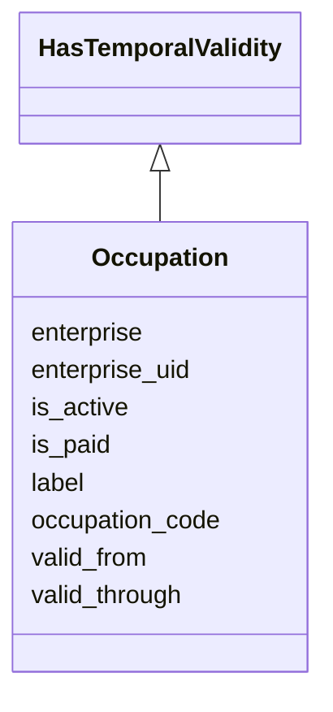

# Class: Occupation 


_[de] Beruf oder Tätigkeit einer Person mit Angabe eines Labels, eines ISCO-19 Codes, ob die Position bezahlt ist, und der zeitlichen Gültigkeit._

_[en] Occupation or profession of a person indicating a label, an ISCO-19 code, whether the position is paid, and temporal validity._

__


URI: [act:Occupation](https://ld.ech.ch/schema/0294/actors/Occupation)



```mermaid
 classDiagram
    class Occupation
    click Occupation href "../Occupation/"
      HasTemporalValidity <|-- Occupation
        click HasTemporalValidity href "../HasTemporalValidity/"
      
      Occupation : enterprise
        
      Occupation : enterprise_uid
        
      Occupation : is_active
        
      Occupation : is_paid
        
      Occupation : label
        
      Occupation : occupation_code
        
      Occupation : valid_from
        
      Occupation : valid_through
        
      
```


## Inheritance
* **Occupation** [ [HasTemporalValidity](HasTemporalValidity.md)]


## Slots

| Name | Cardinality and Range | Description | Inheritance |
| ---  | --- | --- | --- |
| [is_paid](is_paid.md) | 0..1 <br/> [Boolean](Boolean.md) | [de] Gibt an, ob die Position bezahlt ist | direct |
| [occupation_code](occupation_code.md) | 0..1 <br/> [String](String.md) | [de] ISCO-19 Code der Tätigkeit | direct |
| [label](label.md) | 0..1 <br/> [String](String.md) | [de] Möglichkeit bei einer strukturierten Information, ein Label zu vergeben ... | direct |
| [enterprise_uid](enterprise_uid.md) | 0..1 <br/> [String](String.md) | [de] UID des Unternehmens | direct |
| [enterprise](enterprise.md) | 0..1 <br/> [String](String.md) | [de] Name des Unternehmens | direct |
| [valid_from](valid_from.md) | 0..1 <br/> [Date](Date.md) | [de] Das Datum, ab dem die Information gültig ist | [HasTemporalValidity](HasTemporalValidity.md) |
| [valid_through](valid_through.md) | 0..1 <br/> [Date](Date.md) | [de] Das Datum, bis und mit dem die Information gültig ist | [HasTemporalValidity](HasTemporalValidity.md) |
| [is_active](is_active.md) | 0..1 <br/> [Boolean](Boolean.md) | [de] Gibt an, ob die Information aktuell gültig ist | [HasTemporalValidity](HasTemporalValidity.md) |


## Usages

| used by | used in | type | used |
| ---  | --- | --- | --- |
| [Person](Person.md) | [occupations](occupations.md) | range | [Occupation](Occupation.md) |


## Identifier and Mapping Information


### Schema Source


* from schema: https://ld.ech.ch/schema/0294/actors


## Mappings

| Mapping Type | Mapped Value |
| ---  | ---  |
| self | act:Occupation |
| native | act:Occupation |


## LinkML Source

<!-- TODO: investigate https://stackoverflow.com/questions/37606292/how-to-create-tabbed-code-blocks-in-mkdocs-or-sphinx -->

### Direct

<details>
```yaml
name: Occupation
description: '[de] Beruf oder Tätigkeit einer Person mit Angabe eines Labels, eines
  ISCO-19 Codes, ob die Position bezahlt ist, und der zeitlichen Gültigkeit.

  [en] Occupation or profession of a person indicating a label, an ISCO-19 code, whether
  the position is paid, and temporal validity.

  '
from_schema: https://ld.ech.ch/schema/0294/actors
mixins:
- HasTemporalValidity
slots:
- is_paid
- occupation_code
- label
- enterprise_uid
- enterprise

```
</details>

### Induced

<details>
```yaml
name: Occupation
description: '[de] Beruf oder Tätigkeit einer Person mit Angabe eines Labels, eines
  ISCO-19 Codes, ob die Position bezahlt ist, und der zeitlichen Gültigkeit.

  [en] Occupation or profession of a person indicating a label, an ISCO-19 code, whether
  the position is paid, and temporal validity.

  '
from_schema: https://ld.ech.ch/schema/0294/actors
mixins:
- HasTemporalValidity
attributes:
  is_paid:
    name: is_paid
    description: '[de] Gibt an, ob die Position bezahlt ist.

      [en] Indicates if the position is paid.

      '
    from_schema: https://ld.ech.ch/schema/0294/actors
    rank: 1000
    slot_uri: act:isPaid
    alias: is_paid
    owner: Occupation
    domain_of:
    - InterestLink
    - Occupation
    range: boolean
  occupation_code:
    name: occupation_code
    description: '[de] ISCO-19 Code der Tätigkeit.

      [en] ISCO-19 code of the occupation.

      '
    from_schema: https://ld.ech.ch/schema/0294/actors
    rank: 1000
    slot_uri: act:occupationCode
    alias: occupation_code
    owner: Occupation
    domain_of:
    - Occupation
    range: string
  label:
    name: label
    description: '[de] Möglichkeit bei einer strukturierten Information, ein Label
      zu vergeben (bspw. Anzeigename, Anstellung, etc.).

      [en] Option to assign a label to a structured piece of information (e.g., display
      name, position, etc.).

      '
    from_schema: https://ld.ech.ch/schema/0294/actors
    rank: 1000
    slot_uri: mcm:label
    alias: label
    owner: Occupation
    domain_of:
    - Person
    - Group
    - Occupation
    - Training
    - GroupType
    - RoleType
    range: string
  enterprise_uid:
    name: enterprise_uid
    description: '[de] UID des Unternehmens.

      [en] UID of the enterprise.

      '
    from_schema: https://ld.ech.ch/schema/0294/actors
    rank: 1000
    slot_uri: act:enterpriseUid
    alias: enterprise_uid
    owner: Occupation
    domain_of:
    - Occupation
    range: string
  enterprise:
    name: enterprise
    description: '[de] Name des Unternehmens.

      [en] Name of the enterprise.

      '
    from_schema: https://ld.ech.ch/schema/0294/actors
    rank: 1000
    slot_uri: act:enterprise
    alias: enterprise
    owner: Occupation
    domain_of:
    - Occupation
    range: string
  valid_from:
    name: valid_from
    description: '[de] Das Datum, ab dem die Information gültig ist.

      [en] The date from which the information is valid.

      '
    from_schema: https://ld.ech.ch/schema/0294/actors
    rank: 1000
    slot_uri: schema:validFrom
    alias: valid_from
    owner: Occupation
    domain_of:
    - HasTemporalValidity
    range: date
  valid_through:
    name: valid_through
    description: '[de] Das Datum, bis und mit dem die Information gültig ist.

      [en] The date until which the information is valid, inclusive.

      '
    from_schema: https://ld.ech.ch/schema/0294/actors
    rank: 1000
    slot_uri: schema:validThrough
    alias: valid_through
    owner: Occupation
    domain_of:
    - HasTemporalValidity
    range: date
  is_active:
    name: is_active
    description: '[de] Gibt an, ob die Information aktuell gültig ist. Kann nützlich
      sein, wenn diese Information explizit vorhanden ist.

      [en] Indicates whether the information is currently valid. Can be useful when
      this information is explicitly available.

      '
    from_schema: https://ld.ech.ch/schema/0294/actors
    rank: 1000
    slot_uri: mcm:isCurrent
    alias: is_active
    owner: Occupation
    domain_of:
    - HasTemporalValidity
    range: boolean

```
</details>