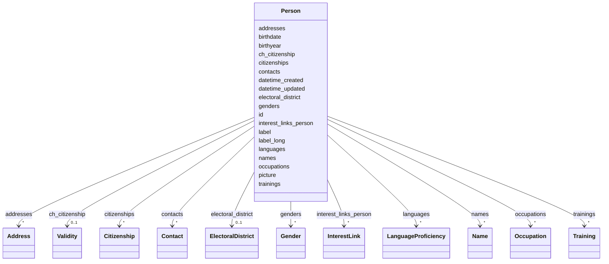

# Class: Person 


_[en] A person with identifiers, names, addresses, citizenships, and occupations._

_[de] Eine Person mit Identifikatoren, Namen, Adressen, Staatsbürgerschaften und Berufen._

__


URI: [act:Person](https://ch.paf.link/schema/actors/Person)





<!-- no inheritance hierarchy -->


## Slots

| Name | Cardinality and Range | Description | Inheritance |
| ---  | --- | --- | --- |
| [id](id.md) | 1 <br/> [String](String.md) | [en] Unique identifier (preferably Wikidata-ID or URI) | direct |
| [label](label.md) | 1 <br/> [String](String.md) | [en] Display name of the person | direct |
| [label_long](label_long.md) | 0..1 <br/> [String](String.md) | [en] Extended display name (with title, etc | direct |
| [birthyear](birthyear.md) | 0..1 <br/> [Integer](Integer.md) | [en] Year of birth | direct |
| [birthdate](birthdate.md) | 0..1 <br/> [Date](Date.md) | [en] Exact date of birth | direct |
| [picture](picture.md) | 0..1 <br/> [String](String.md) | [en] Link to an image (preferred: PNG, then JPG, then GIF) | direct |
| [names](names.md) | * <br/> [Name](Name.md) |  | direct |
| [addresses](addresses.md) | * <br/> [Address](Address.md) | [en] Addresses (private, business, local) | direct |
| [languages](languages.md) | * <br/> [LanguageProficiency](LanguageProficiency.md) |  | direct |
| [ch_citizenship](ch_citizenship.md) | 0..1 <br/> [Validity](Validity.md) |  | direct |
| [citizenships](citizenships.md) | * <br/> [Citizenship](Citizenship.md) |  | direct |
| [genders](genders.md) | * <br/> [Gender](Gender.md) |  | direct |
| [occupations](occupations.md) | * <br/> [Occupation](Occupation.md) |  | direct |
| [trainings](trainings.md) | * <br/> [Training](Training.md) |  | direct |
| [contacts](contacts.md) | * <br/> [Contact](Contact.md) | [en] Contact information (email, website, social media) | direct |
| [electoral_district](electoral_district.md) | 0..1 <br/> [ElectoralDistrict](ElectoralDistrict.md) |  | direct |
| [interest_links_person](interest_links_person.md) | * <br/> [InterestLink](InterestLink.md) | [en] Interest links of the person | direct |
| [datetime_updated](datetime_updated.md) | 0..1 <br/> [Datetime](Datetime.md) | [en] The last time this record was updated | direct |
| [datetime_created](datetime_created.md) | 0..1 <br/> [Datetime](Datetime.md) | [en] The time this record was created | direct |


## Usages

| used by | used in | type | used |
| ---  | --- | --- | --- |
| [Container](Container.md) | [persons](persons.md) | range | [Person](Person.md) |


## Identifier and Mapping Information


### Schema Source


* from schema: https://ch.paf.link/schema/actors


## Mappings

| Mapping Type | Mapped Value |
| ---  | ---  |
| self | act:Person |
| native | act:Person |


## LinkML Source

<!-- TODO: investigate https://stackoverflow.com/questions/37606292/how-to-create-tabbed-code-blocks-in-mkdocs-or-sphinx -->

### Direct

<details>
```yaml
name: Person
description: '[en] A person with identifiers, names, addresses, citizenships, and
  occupations.

  [de] Eine Person mit Identifikatoren, Namen, Adressen, Staatsbürgerschaften und
  Berufen.

  '
from_schema: https://ch.paf.link/schema/actors
slots:
- id
- label
- label_long
- birthyear
- birthdate
- picture
- names
- addresses
- languages
- ch_citizenship
- citizenships
- genders
- occupations
- trainings
- contacts
- electoral_district
- interest_links_person
- datetime_updated
- datetime_created

```
</details>

### Induced

<details>
```yaml
name: Person
description: '[en] A person with identifiers, names, addresses, citizenships, and
  occupations.

  [de] Eine Person mit Identifikatoren, Namen, Adressen, Staatsbürgerschaften und
  Berufen.

  '
from_schema: https://ch.paf.link/schema/actors
attributes:
  id:
    name: id
    description: '[en] Unique identifier (preferably Wikidata-ID or URI).

      [de] Eindeutiger Identifikator (vorzugsweise Wikidata-ID oder URI).

      '
    from_schema: https://ch.paf.link/schema/actors
    rank: 1000
    slot_uri: dcterm:identifier
    identifier: true
    alias: id
    owner: Person
    domain_of:
    - Container
    - Person
    - Group
    - Membership
    - InterestLink
    - PersonReference
    - GroupReference
    range: string
    required: true
  label:
    name: label
    description: '[en] Display name of the person.

      [de] Anzeigename der Person.

      '
    from_schema: https://ch.paf.link/schema/actors
    rank: 1000
    alias: label
    owner: Person
    domain_of:
    - Person
    range: string
    required: true
  label_long:
    name: label_long
    description: '[en] Extended display name (with title, etc.).

      [de] Erweiterter Anzeigename (mit Titel, etc.).

      '
    from_schema: https://ch.paf.link/schema/actors
    rank: 1000
    alias: label_long
    owner: Person
    domain_of:
    - Person
    range: string
  birthyear:
    name: birthyear
    description: '[en] Year of birth.

      [de] Geburtsjahr.

      '
    from_schema: https://ch.paf.link/schema/actors
    rank: 1000
    alias: birthyear
    owner: Person
    domain_of:
    - Person
    range: integer
  birthdate:
    name: birthdate
    description: '[en] Exact date of birth.

      [de] Genaues Geburtsdatum.

      '
    from_schema: https://ch.paf.link/schema/actors
    rank: 1000
    alias: birthdate
    owner: Person
    domain_of:
    - Person
    range: date
  picture:
    name: picture
    description: '[en] Link to an image (preferred: PNG, then JPG, then GIF).

      [de] Link zu einem Bild (bevorzugt: PNG, dann JPG, dann GIF).

      '
    from_schema: https://ch.paf.link/schema/actors
    rank: 1000
    alias: picture
    owner: Person
    domain_of:
    - Person
    range: string
  names:
    name: names
    from_schema: https://ch.paf.link/schema/actors
    rank: 1000
    slot_uri: act:name
    alias: names
    owner: Person
    domain_of:
    - Person
    range: Name
    multivalued: true
    inlined: true
    inlined_as_list: true
  addresses:
    name: addresses
    description: '[en] Addresses (private, business, local).

      [de] Adressen (privat, geschäftlich, lokal).

      '
    from_schema: https://ch.paf.link/schema/actors
    rank: 1000
    slot_uri: act:address
    alias: addresses
    owner: Person
    domain_of:
    - Person
    - Group
    range: Address
    multivalued: true
    inlined: true
    inlined_as_list: true
  languages:
    name: languages
    from_schema: https://ch.paf.link/schema/actors
    rank: 1000
    slot_uri: act:language
    alias: languages
    owner: Person
    domain_of:
    - Person
    range: LanguageProficiency
    multivalued: true
    inlined: true
    inlined_as_list: true
  ch_citizenship:
    name: ch_citizenship
    from_schema: https://ch.paf.link/schema/actors
    rank: 1000
    slot_uri: act:chCitizenship
    alias: ch_citizenship
    owner: Person
    domain_of:
    - Person
    range: Validity
  citizenships:
    name: citizenships
    from_schema: https://ch.paf.link/schema/actors
    rank: 1000
    slot_uri: act:citizenship
    alias: citizenships
    owner: Person
    domain_of:
    - Person
    range: Citizenship
    multivalued: true
    inlined: true
    inlined_as_list: true
  genders:
    name: genders
    from_schema: https://ch.paf.link/schema/actors
    rank: 1000
    slot_uri: act:gender
    alias: genders
    owner: Person
    domain_of:
    - Person
    range: Gender
    multivalued: true
    inlined: true
    inlined_as_list: true
  occupations:
    name: occupations
    from_schema: https://ch.paf.link/schema/actors
    rank: 1000
    slot_uri: act:occupation
    alias: occupations
    owner: Person
    domain_of:
    - Person
    range: Occupation
    multivalued: true
    inlined: true
    inlined_as_list: true
  trainings:
    name: trainings
    from_schema: https://ch.paf.link/schema/actors
    rank: 1000
    slot_uri: act:training
    alias: trainings
    owner: Person
    domain_of:
    - Person
    range: Training
    multivalued: true
    inlined: true
    inlined_as_list: true
  contacts:
    name: contacts
    description: '[en] Contact information (email, website, social media).

      [de] Kontaktinformationen (E-Mail, Website, Social Media).

      '
    from_schema: https://ch.paf.link/schema/actors
    rank: 1000
    slot_uri: act:contact
    alias: contacts
    owner: Person
    domain_of:
    - Person
    - Group
    range: Contact
    multivalued: true
    inlined: true
    inlined_as_list: true
  electoral_district:
    name: electoral_district
    from_schema: https://ch.paf.link/schema/actors
    rank: 1000
    slot_uri: act:electoralDistrict
    alias: electoral_district
    owner: Person
    domain_of:
    - Person
    range: ElectoralDistrict
  interest_links_person:
    name: interest_links_person
    description: '[en] Interest links of the person.

      [de] Interessenbindungen der Person.

      '
    from_schema: https://ch.paf.link/schema/actors
    rank: 1000
    slot_uri: act:interestLink
    alias: interest_links_person
    owner: Person
    domain_of:
    - Person
    range: InterestLink
    multivalued: true
    inlined: true
    inlined_as_list: true
  datetime_updated:
    name: datetime_updated
    description: '[en] The last time this record was updated.

      [de] Der Zeitpunkt, zu dem dieser Datensatz zuletzt aktualisiert wurde.

      '
    from_schema: https://ch.paf.link/schema/actors
    rank: 1000
    alias: datetime_updated
    owner: Person
    domain_of:
    - Person
    - Group
    - Membership
    - InterestLink
    range: datetime
  datetime_created:
    name: datetime_created
    description: '[en] The time this record was created.

      [de] Der Zeitpunkt, zu dem dieser Datensatz erstellt wurde.

      '
    from_schema: https://ch.paf.link/schema/actors
    rank: 1000
    alias: datetime_created
    owner: Person
    domain_of:
    - Person
    - Group
    - Membership
    - InterestLink
    range: datetime

```
</details>