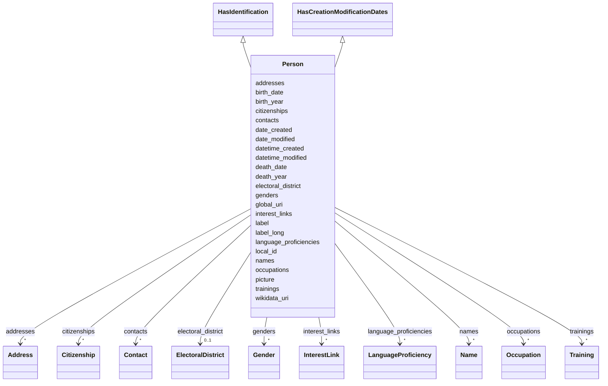

# Class: Person 


_[de] Eine Person mit Identifikatoren, Namen, Adressen, Staatsbürgerschaften und Berufen._

_[en] A person with identifiers, names, addresses, citizenships, and occupations._

__


URI: [act:Person](https://ld.ech.ch/schema/0294/actors/Person)



```mermaid
 classDiagram
    class Person
    click Person href "../Person/"
      HasIdentification <|-- Person
        click HasIdentification href "../HasIdentification/"
      HasCreationModificationDates <|-- Person
        click HasCreationModificationDates href "../HasCreationModificationDates/"
      
      Person : addresses
        
          
    
        
        
        Person --> "*" Address : addresses
        click Address href "../Address/"
    

        
      Person : birth_date
        
      Person : birth_year
        
      Person : citizenships
        
          
    
        
        
        Person --> "*" Citizenship : citizenships
        click Citizenship href "../Citizenship/"
    

        
      Person : contacts
        
          
    
        
        
        Person --> "*" Contact : contacts
        click Contact href "../Contact/"
    

        
      Person : date_created
        
      Person : date_modified
        
      Person : datetime_created
        
      Person : datetime_modified
        
      Person : death_date
        
      Person : death_year
        
      Person : electoral_district
        
          
    
        
        
        Person --> "0..1" ElectoralDistrict : electoral_district
        click ElectoralDistrict href "../ElectoralDistrict/"
    

        
      Person : genders
        
          
    
        
        
        Person --> "*" Gender : genders
        click Gender href "../Gender/"
    

        
      Person : global_uri
        
      Person : interest_links
        
          
    
        
        
        Person --> "*" InterestLink : interest_links
        click InterestLink href "../InterestLink/"
    

        
      Person : label
        
      Person : label_long
        
      Person : language_proficiencies
        
          
    
        
        
        Person --> "*" LanguageProficiency : language_proficiencies
        click LanguageProficiency href "../LanguageProficiency/"
    

        
      Person : local_id
        
      Person : names
        
          
    
        
        
        Person --> "*" Name : names
        click Name href "../Name/"
    

        
      Person : occupations
        
          
    
        
        
        Person --> "*" Occupation : occupations
        click Occupation href "../Occupation/"
    

        
      Person : picture
        
      Person : trainings
        
          
    
        
        
        Person --> "*" Training : trainings
        click Training href "../Training/"
    

        
      Person : wikidata_uri
        
      
```


## Inheritance
* **Person** [ [HasIdentification](HasIdentification.md) [HasCreationModificationDates](HasCreationModificationDates.md)]


## Slots

| Name | Cardinality and Range | Description | Inheritance |
| ---  | --- | --- | --- |
| [label](label.md) | 0..1 <br/> [String](String.md) | [de] Möglichkeit bei einer strukturierten Information, ein Label zu vergeben ... | direct |
| [label_long](label_long.md) | 0..1 <br/> [String](String.md) | [de] Möglichkeit bei einer strukturierten Information, ein erweitertesLabel z... | direct |
| [birth_year](birth_year.md) | 0..1 <br/> [Integer](Integer.md) | [de] Geburtsjahr | direct |
| [birth_date](birth_date.md) | 0..1 <br/> [Date](Date.md) | [de] Genaues Geburtsdatum | direct |
| [death_year](death_year.md) | 0..1 <br/> [Integer](Integer.md) | [de] Todesjahr | direct |
| [death_date](death_date.md) | 0..1 <br/> [Date](Date.md) | [de] Genaues Todesdatum | direct |
| [picture](picture.md) | 0..1 <br/> [String](String.md) | [de] Link zu einem Bild (bevorzugt: PNG, dann JPG, dann GIF) | direct |
| [names](names.md) | * <br/> [Name](Name.md) | [en] Names of the person with type and value | direct |
| [addresses](addresses.md) | * <br/> [Address](Address.md) | [de] Adressen mit Typ (privat, geschäftlich, lokal) | direct |
| [language_proficiencies](language_proficiencies.md) | * <br/> [LanguageProficiency](LanguageProficiency.md) | [de] Sprachkompetenzen der Person | direct |
| [citizenships](citizenships.md) | * <br/> [Citizenship](Citizenship.md) | [de] Staatsbürgerschaften der Person | direct |
| [genders](genders.md) | * <br/> [Gender](Gender.md) | [de] Geschlecht der Person | direct |
| [occupations](occupations.md) | * <br/> [Occupation](Occupation.md) | [de] Berufe oder Tätigkeiten der Person | direct |
| [trainings](trainings.md) | * <br/> [Training](Training.md) | [de] Ausbildungen oder Bildungen der Person | direct |
| [contacts](contacts.md) | * <br/> [Contact](Contact.md) | [en] Contact information (email, website, social media) | direct |
| [electoral_district](electoral_district.md) | 0..1 <br/> [ElectoralDistrict](ElectoralDistrict.md) | [de] Link zum Wahlbezirk | direct |
| [interest_links](interest_links.md) | * <br/> [InterestLink](InterestLink.md) | [de] Sammlung von Interessenbindungen | direct |
| [local_id](local_id.md) | 0..1 <br/> [String](String.md) | [de] Lokaler Identifikator | [HasIdentification](HasIdentification.md) |
| [global_uri](global_uri.md) | 1 <br/> [Uriorcurie](Uriorcurie.md) | [de] Eine eindeutige, global gültige URI für die Entität | [HasIdentification](HasIdentification.md) |
| [wikidata_uri](wikidata_uri.md) | 0..1 <br/> [Uriorcurie](Uriorcurie.md) | [de] Eine URI, die auf eine Wikidata-Entität verweist, z | [HasIdentification](HasIdentification.md) |
| [date_created](date_created.md) | 0..1 <br/> [Date](Date.md) | [de] Das Datum, an dem eine Entität erstellt wurde | [HasCreationModificationDates](HasCreationModificationDates.md) |
| [datetime_created](datetime_created.md) | 0..1 <br/> [Datetime](Datetime.md) | [de] Das Datum und die Uhrzeit, an dem eine Entität erstellt wurde | [HasCreationModificationDates](HasCreationModificationDates.md) |
| [date_modified](date_modified.md) | 0..1 <br/> [Date](Date.md) | [de] Das Datum, an dem eine Entität zuletzt geändert wurde | [HasCreationModificationDates](HasCreationModificationDates.md) |
| [datetime_modified](datetime_modified.md) | 0..1 <br/> [Datetime](Datetime.md) | [de] Das Datum und die Uhrzeit, an dem eine Entität zuletzt geändert wurde | [HasCreationModificationDates](HasCreationModificationDates.md) |


## Usages

| used by | used in | type | used |
| ---  | --- | --- | --- |
| [Container](Container.md) | [persons](persons.md) | range | [Person](Person.md) |
| [Membership](Membership.md) | [concerned_person](concerned_person.md) | range | [Person](Person.md) |
| [InterestLink](InterestLink.md) | [concerned_person](concerned_person.md) | range | [Person](Person.md) |


## Identifier and Mapping Information


### Schema Source


* from schema: https://ld.ech.ch/schema/0294/actors


## Mappings

| Mapping Type | Mapped Value |
| ---  | ---  |
| self | act:Person |
| native | act:Person |


## LinkML Source

<!-- TODO: investigate https://stackoverflow.com/questions/37606292/how-to-create-tabbed-code-blocks-in-mkdocs-or-sphinx -->

### Direct

<details>
```yaml
name: Person
description: '[de] Eine Person mit Identifikatoren, Namen, Adressen, Staatsbürgerschaften
  und Berufen.

  [en] A person with identifiers, names, addresses, citizenships, and occupations.

  '
from_schema: https://ld.ech.ch/schema/0294/actors
mixins:
- HasIdentification
- HasCreationModificationDates
slots:
- label
- label_long
- birth_year
- birth_date
- death_year
- death_date
- picture
- names
- addresses
- language_proficiencies
- citizenships
- genders
- occupations
- trainings
- contacts
- electoral_district
- interest_links

```
</details>

### Induced

<details>
```yaml
name: Person
description: '[de] Eine Person mit Identifikatoren, Namen, Adressen, Staatsbürgerschaften
  und Berufen.

  [en] A person with identifiers, names, addresses, citizenships, and occupations.

  '
from_schema: https://ld.ech.ch/schema/0294/actors
mixins:
- HasIdentification
- HasCreationModificationDates
attributes:
  label:
    name: label
    description: '[de] Möglichkeit bei einer strukturierten Information, ein Label
      zu vergeben (bspw. Anzeigename, Anstellung, etc.).

      [en] Option to assign a label to a structured piece of information (e.g., display
      name, position, etc.).

      '
    from_schema: https://ld.ech.ch/schema/0294/actors
    rank: 1000
    slot_uri: mcm:label
    alias: label
    owner: Person
    domain_of:
    - Person
    - Group
    - Occupation
    - Training
    - GroupType
    - RoleType
    range: string
  label_long:
    name: label_long
    description: '[de] Möglichkeit bei einer strukturierten Information, ein erweitertesLabel
      zu vergeben (bspw. Anzeigename mit Titel, Anstellung, etc.).

      [en] Option to assign an extended label to a structured piece of information
      (e.g., display name with title, position, etc.).

      '
    from_schema: https://ld.ech.ch/schema/0294/actors
    rank: 1000
    slot_uri: mcm:labelLong
    alias: label_long
    owner: Person
    domain_of:
    - Person
    range: string
  birth_year:
    name: birth_year
    description: '[de] Geburtsjahr.

      [en] Year of birth.

      '
    from_schema: https://ld.ech.ch/schema/0294/actors
    rank: 1000
    slot_uri: act:birthYear
    alias: birth_year
    owner: Person
    domain_of:
    - Person
    range: integer
  birth_date:
    name: birth_date
    description: '[de] Genaues Geburtsdatum.

      [en] Exact date of birth.

      '
    from_schema: https://ld.ech.ch/schema/0294/actors
    rank: 1000
    slot_uri: schema:birthDate
    alias: birth_date
    owner: Person
    domain_of:
    - Person
    range: date
  death_year:
    name: death_year
    description: '[de] Todesjahr.

      [en] Year of death.

      '
    from_schema: https://ld.ech.ch/schema/0294/actors
    rank: 1000
    slot_uri: act:deathYear
    alias: death_year
    owner: Person
    domain_of:
    - Person
    range: integer
  death_date:
    name: death_date
    description: '[de] Genaues Todesdatum.

      [en] Exact date of death.

      '
    from_schema: https://ld.ech.ch/schema/0294/actors
    rank: 1000
    slot_uri: schema:deathDate
    alias: death_date
    owner: Person
    domain_of:
    - Person
    range: date
  picture:
    name: picture
    description: '[de] Link zu einem Bild (bevorzugt: PNG, dann JPG, dann GIF).

      [en] Link to an image (preferred: PNG, then JPG, then GIF).

      '
    from_schema: https://ld.ech.ch/schema/0294/actors
    rank: 1000
    alias: picture
    owner: Person
    domain_of:
    - Person
    range: string
  names:
    name: names
    description: '[en] Names of the person with type and value.

      [de] Namen der Person mit Typ und Wert.

      '
    from_schema: https://ld.ech.ch/schema/0294/actors
    rank: 1000
    slot_uri: act:name
    alias: names
    owner: Person
    domain_of:
    - Person
    range: Name
    multivalued: true
    inlined: true
    inlined_as_list: true
  addresses:
    name: addresses
    description: '[de] Adressen mit Typ (privat, geschäftlich, lokal).

      [en] Addresses with type (private, business, local).

      '
    from_schema: https://ld.ech.ch/schema/0294/actors
    rank: 1000
    slot_uri: act:address
    alias: addresses
    owner: Person
    domain_of:
    - Person
    - Group
    range: Address
    multivalued: true
    inlined: true
    inlined_as_list: true
  language_proficiencies:
    name: language_proficiencies
    description: '[de] Sprachkompetenzen der Person.

      [en] Language proficiencies of the person.

      '
    from_schema: https://ld.ech.ch/schema/0294/actors
    rank: 1000
    slot_uri: act:languageProficiency
    alias: language_proficiencies
    owner: Person
    domain_of:
    - Person
    range: LanguageProficiency
    multivalued: true
    inlined: true
    inlined_as_list: true
  citizenships:
    name: citizenships
    description: '[de] Staatsbürgerschaften der Person.

      [en] Citizenships of the person.

      '
    from_schema: https://ld.ech.ch/schema/0294/actors
    rank: 1000
    slot_uri: act:citizenship
    alias: citizenships
    owner: Person
    domain_of:
    - Person
    range: Citizenship
    multivalued: true
    inlined: true
    inlined_as_list: true
  genders:
    name: genders
    description: '[de] Geschlecht der Person.

      [en] Gender of the person.

      '
    from_schema: https://ld.ech.ch/schema/0294/actors
    rank: 1000
    slot_uri: act:gender
    alias: genders
    owner: Person
    domain_of:
    - Person
    range: Gender
    multivalued: true
    inlined: true
    inlined_as_list: true
  occupations:
    name: occupations
    description: '[de] Berufe oder Tätigkeiten der Person.

      [en] Occupations or professions of the person.

      '
    from_schema: https://ld.ech.ch/schema/0294/actors
    rank: 1000
    slot_uri: act:occupation
    alias: occupations
    owner: Person
    domain_of:
    - Person
    range: Occupation
    multivalued: true
    inlined: true
    inlined_as_list: true
  trainings:
    name: trainings
    description: '[de] Ausbildungen oder Bildungen der Person.

      [en] Trainings or educations of the person.

      '
    from_schema: https://ld.ech.ch/schema/0294/actors
    rank: 1000
    slot_uri: act:training
    alias: trainings
    owner: Person
    domain_of:
    - Person
    range: Training
    multivalued: true
    inlined: true
    inlined_as_list: true
  contacts:
    name: contacts
    description: '[en] Contact information (email, website, social media).

      [de] Kontaktinformationen (E-Mail, Website, Social Media).

      '
    from_schema: https://ld.ech.ch/schema/0294/actors
    rank: 1000
    slot_uri: act:contact
    alias: contacts
    owner: Person
    domain_of:
    - Person
    - Group
    range: Contact
    multivalued: true
    inlined: true
    inlined_as_list: true
  electoral_district:
    name: electoral_district
    description: '[de] Link zum Wahlbezirk.

      [en] Link to the electoral district.

      '
    from_schema: https://ld.ech.ch/schema/0294/actors
    rank: 1000
    slot_uri: act:electoralDistrict
    alias: electoral_district
    owner: Person
    domain_of:
    - Person
    range: ElectoralDistrict
  interest_links:
    name: interest_links
    description: '[de] Sammlung von Interessenbindungen.

      [en] Collection of interest links.range: InterestLink

      '
    from_schema: https://ld.ech.ch/schema/0294/actors
    rank: 1000
    slot_uri: act:interestLink
    alias: interest_links
    owner: Person
    domain_of:
    - Container
    - Person
    range: InterestLink
    multivalued: true
    inlined: true
    inlined_as_list: true
  local_id:
    name: local_id
    description: '[de] Lokaler Identifikator. Bspw. eine UUID aus dem Ratsinformationssystem.

      [en] Local identifier. For example, a UUID from the council information system.

      '
    from_schema: https://ld.ech.ch/schema/0294/actors
    rank: 1000
    slot_uri: mcm:localId
    alias: local_id
    owner: Person
    domain_of:
    - HasIdentification
    range: string
  global_uri:
    name: global_uri
    description: '[de] Eine eindeutige, global gültige URI für die Entität.

      [en] A unique, globally valid URI for the entity.

      '
    from_schema: https://ld.ech.ch/schema/0294/actors
    rank: 1000
    slot_uri: mcm:globalURI
    identifier: true
    alias: global_uri
    owner: Person
    domain_of:
    - HasIdentification
    range: uriorcurie
    required: true
  wikidata_uri:
    name: wikidata_uri
    description: '[de] Eine URI, die auf eine Wikidata-Entität verweist, z.B. https://www.wikidata.org/wiki/Q39
      für die Schweiz.

      [en] A URI that refers to a Wikidata entity, e.g. https://www.wikidata.org/wiki/Q39
      for Switzerland.

      '
    from_schema: https://ld.ech.ch/schema/0294/actors
    rank: 1000
    slot_uri: mcm:wikidataUri
    alias: wikidata_uri
    owner: Person
    domain_of:
    - HasIdentification
    range: uriorcurie
  date_created:
    name: date_created
    description: '[de] Das Datum, an dem eine Entität erstellt wurde.

      [en] The date when an entity was created.

      '
    from_schema: https://ld.ech.ch/schema/0294/actors
    rank: 1000
    slot_uri: mcm:dateCreated
    alias: date_created
    owner: Person
    domain_of:
    - HasCreationModificationDates
    range: date
  datetime_created:
    name: datetime_created
    description: '[de] Das Datum und die Uhrzeit, an dem eine Entität erstellt wurde.

      [en] The date and time when an entity was created.

      '
    from_schema: https://ld.ech.ch/schema/0294/actors
    rank: 1000
    slot_uri: mcm:datetimeCreated
    alias: datetime_created
    owner: Person
    domain_of:
    - HasCreationModificationDates
    range: datetime
  date_modified:
    name: date_modified
    description: '[de] Das Datum, an dem eine Entität zuletzt geändert wurde.

      [en] The date when an entity was last modified.

      '
    from_schema: https://ld.ech.ch/schema/0294/actors
    rank: 1000
    slot_uri: mcm:dateModified
    alias: date_modified
    owner: Person
    domain_of:
    - HasCreationModificationDates
    range: date
  datetime_modified:
    name: datetime_modified
    description: '[de] Das Datum und die Uhrzeit, an dem eine Entität zuletzt geändert
      wurde.

      [en] The date and time when an entity was last modified.

      '
    from_schema: https://ld.ech.ch/schema/0294/actors
    rank: 1000
    slot_uri: mcm:datetimeModified
    alias: datetime_modified
    owner: Person
    domain_of:
    - HasCreationModificationDates
    range: datetime

```
</details>