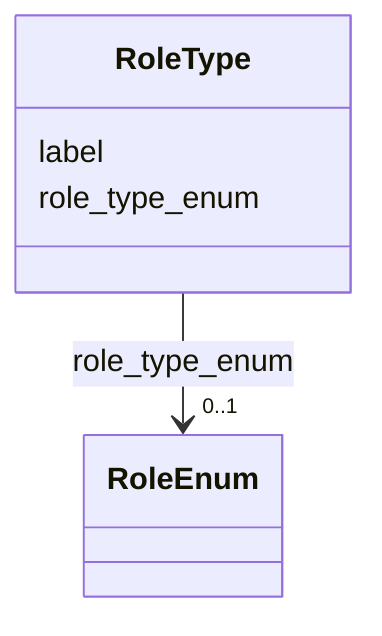

# Class: RoleType 


_[de] Rolle einer Person in einer Mitgliedschaft oder Funktion (z.B. Mitglied, Präsident, Stellvertreter)._

_[en] Role of a person in a membership or function (e.g., member, president, deputy)._

__


URI: [act:RoleType](https://ld.ech.ch/schema/0294/actors/RoleType)





<!-- no inheritance hierarchy -->

## Slots

| Name | Cardinality and Range | Description | Inheritance |
| ---  | --- | --- | --- |
| [role_type_enum](role_type_enum.md) | 0..1 <br/> [RoleEnum](RoleEnum.md) | [en] Role of the person in the membership or function | direct |
| [label](label.md) | 0..1 <br/> [String](String.md) | [de] Möglichkeit bei einer strukturierten Information, ein Label zu vergeben ... | direct |


## Usages

| used by | used in | type | used |
| ---  | --- | --- | --- |
| [Membership](Membership.md) | [role_type](role_type.md) | range | [RoleType](RoleType.md) |


## Identifier and Mapping Information


### Schema Source


* from schema: https://ld.ech.ch/schema/0294/actors


## Mappings

| Mapping Type | Mapped Value |
| ---  | ---  |
| self | act:RoleType |
| native | act:RoleType |


## LinkML Source

<!-- TODO: investigate https://stackoverflow.com/questions/37606292/how-to-create-tabbed-code-blocks-in-mkdocs-or-sphinx -->

### Direct

<details>
```yaml
name: RoleType
description: '[de] Rolle einer Person in einer Mitgliedschaft oder Funktion (z.B.
  Mitglied, Präsident, Stellvertreter).

  [en] Role of a person in a membership or function (e.g., member, president, deputy).

  '
from_schema: https://ld.ech.ch/schema/0294/actors
slots:
- role_type_enum
- label

```
</details>

### Induced

<details>
```yaml
name: RoleType
description: '[de] Rolle einer Person in einer Mitgliedschaft oder Funktion (z.B.
  Mitglied, Präsident, Stellvertreter).

  [en] Role of a person in a membership or function (e.g., member, president, deputy).

  '
from_schema: https://ld.ech.ch/schema/0294/actors
attributes:
  role_type_enum:
    name: role_type_enum
    description: '[en] Role of the person in the membership or function.

      [de] Rolle der Person in der Mitgliedschaft oder Funktion.

      '
    from_schema: https://ld.ech.ch/schema/0294/actors
    rank: 1000
    slot_uri: act:roleTypeEnum
    alias: role_type_enum
    owner: RoleType
    domain_of:
    - RoleType
    range: RoleEnum
  label:
    name: label
    description: '[de] Möglichkeit bei einer strukturierten Information, ein Label
      zu vergeben (bspw. Anzeigename, Anstellung, etc.).

      [en] Option to assign a label to a structured piece of information (e.g., display
      name, position, etc.).

      '
    from_schema: https://ld.ech.ch/schema/0294/actors
    rank: 1000
    slot_uri: mcm:label
    alias: label
    owner: RoleType
    domain_of:
    - Person
    - Group
    - Occupation
    - Training
    - GroupType
    - RoleType
    range: string

```
</details>