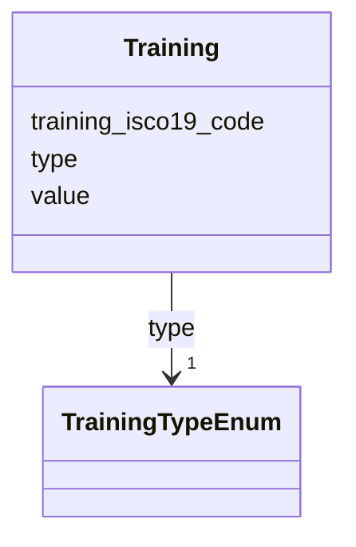

# Class: Training 


URI: [act:Training](https://ch.paf.link/schema/actors/Training)





<!-- no inheritance hierarchy -->


## Slots

| Name | Cardinality and Range | Description | Inheritance |
| ---  | --- | --- | --- |
| [type](type.md) | 1 <br/> [TrainingTypeEnum](TrainingTypeEnum.md) |  | direct |
| [training_isco19_code](training_isco19_code.md) | 0..1 <br/> [String](String.md) |  | direct |
| [value](value.md) | 0..1 <br/> [String](String.md) |  | direct |


## Usages

| used by | used in | type | used |
| ---  | --- | --- | --- |
| [Person](Person.md) | [trainings](trainings.md) | range | [Training](Training.md) |


## Identifier and Mapping Information


### Schema Source


* from schema: https://ch.paf.link/schema/actors


## Mappings

| Mapping Type | Mapped Value |
| ---  | ---  |
| self | act:Training |
| native | act:Training |


## LinkML Source

<!-- TODO: investigate https://stackoverflow.com/questions/37606292/how-to-create-tabbed-code-blocks-in-mkdocs-or-sphinx -->

### Direct

<details>
```yaml
name: Training
from_schema: https://ch.paf.link/schema/actors
attributes:
  type:
    name: type
    from_schema: https://ch.paf.link/schema/actors
    rank: 1000
    domain_of:
    - Training
    - Contact
    range: TrainingTypeEnum
    required: true
  training_isco19_code:
    name: training_isco19_code
    from_schema: https://ch.paf.link/schema/actors
    rank: 1000
    slot_uri: act:trainingIsco19Code
    domain_of:
    - Training
  value:
    name: value
    from_schema: https://ch.paf.link/schema/actors
    domain_of:
    - Name
    - Gender
    - Occupation
    - Training
    - Contact

```
</details>

### Induced

<details>
```yaml
name: Training
from_schema: https://ch.paf.link/schema/actors
attributes:
  type:
    name: type
    from_schema: https://ch.paf.link/schema/actors
    rank: 1000
    alias: type
    owner: Training
    domain_of:
    - Training
    - Contact
    range: TrainingTypeEnum
    required: true
  training_isco19_code:
    name: training_isco19_code
    from_schema: https://ch.paf.link/schema/actors
    rank: 1000
    slot_uri: act:trainingIsco19Code
    alias: training_isco19_code
    owner: Training
    domain_of:
    - Training
    range: string
  value:
    name: value
    from_schema: https://ch.paf.link/schema/actors
    alias: value
    owner: Training
    domain_of:
    - Name
    - Gender
    - Occupation
    - Training
    - Contact
    range: string

```
</details>