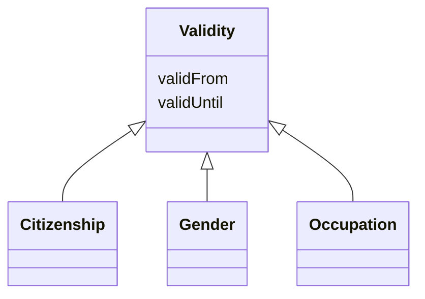

# Class: Validity 


URI: [act:Validity](https://ch.paf.link/schema/actors/Validity)





## Inheritance
* **Validity**
    * [Citizenship](Citizenship.md)
    * [Gender](Gender.md)
    * [Occupation](Occupation.md)


## Slots

| Name | Cardinality and Range | Description | Inheritance |
| ---  | --- | --- | --- |
| [validFrom](validFrom.md) | 0..1 <br/> [Date](Date.md) |  | direct |
| [validUntil](validUntil.md) | 0..1 <br/> [Date](Date.md) |  | direct |


## Usages

| used by | used in | type | used |
| ---  | --- | --- | --- |
| [Person](Person.md) | [ch_citizenship](ch_citizenship.md) | range | [Validity](Validity.md) |


## Identifier and Mapping Information


### Schema Source


* from schema: https://ch.paf.link/schema/actors


## Mappings

| Mapping Type | Mapped Value |
| ---  | ---  |
| self | act:Validity |
| native | act:Validity |


## LinkML Source

<!-- TODO: investigate https://stackoverflow.com/questions/37606292/how-to-create-tabbed-code-blocks-in-mkdocs-or-sphinx -->

### Direct

<details>
```yaml
name: Validity
from_schema: https://ch.paf.link/schema/actors
attributes:
  validFrom:
    name: validFrom
    from_schema: https://ch.paf.link/schema/actors
    domain_of:
    - Name
    - Validity
    - ElectoralDistrict
    range: date
  validUntil:
    name: validUntil
    from_schema: https://ch.paf.link/schema/actors
    domain_of:
    - Name
    - Validity
    - ElectoralDistrict
    range: date

```
</details>

### Induced

<details>
```yaml
name: Validity
from_schema: https://ch.paf.link/schema/actors
attributes:
  validFrom:
    name: validFrom
    from_schema: https://ch.paf.link/schema/actors
    alias: validFrom
    owner: Validity
    domain_of:
    - Name
    - Validity
    - ElectoralDistrict
    range: date
  validUntil:
    name: validUntil
    from_schema: https://ch.paf.link/schema/actors
    alias: validUntil
    owner: Validity
    domain_of:
    - Name
    - Validity
    - ElectoralDistrict
    range: date

```
</details>