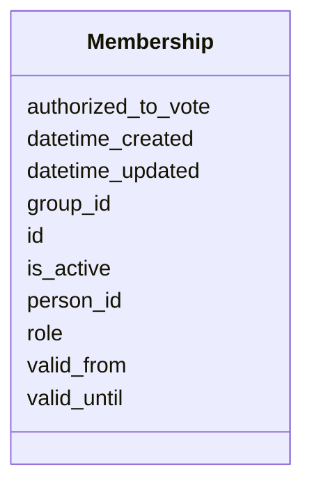

| **Name**              | **Politische Akteure: Personen, Gruppen und Organe**                                                                                               |
|-----------------------|----------------------------------------------------------------------------------------------------------------------------|
| **eCH-Nummer**        | eCH-0294                                                                                                                   |
| **Kategorie**         | Entwurf                                                                                                                    |
| **Reifegrad**         |                                                                                                                            |
| **Version**           | 0.1                                                                                                                        |
| **Status**            |                                                                                                                            |
| **Beschluss am**      |                                                                                                                            |
| **Ausgabedatum**      |                                                                                                                            |
| **Ersetzt Version**   | 0.0                                                                                                                        |
| **Voraussetzungen**   | ?                                                                                                                          |
| **Beilagen**          | -                                                                                                                          |
| **Sprachen**          | English (Original)                                                                                                         |
| **Autoren**           | Fachgruppe politische Geschäfte: Julie Silberstein, Laurence Brandenberger, Daniela Koller, Thomas Roth, Stefan Oderbolz, Fabian Davolio, Orhan Saeedi   |
| **Herausgeber / Vertrieb** | Verein eCH, Räffelstr. 20, 8045                                                                                       |

# Summary

Management summary of the document.

# Table of Contents

< manually insert TOC here >


# Introduction

## Scope of this Document

## Identified Gaps on Political Actors

## Goals of this Document


## Work Plan as of November 2025
Currently we are working in the following order on the different topics regarding political actors (agents):
1) Personen: Ratsmitglieder, Verwaltungsmitglieder
2) Gruppen / Organe / Interessengruppe: Parteien, Fraktionen, Gremien, Kommissionen, Verbände
3) Interessenbindungen / Konflikte (Politikfinanzierungen)
4) Verknüpfungen gleicher Personen übergreifend CH / Kanton


# Person

## Einführung und Zielsetzung

Das Person-Schema beschreibt natürliche Personen im politischen Kontext mit dem Ziel, eine präzise und gleichzeitig flexible Datenstruktur bereitzustellen. Der Standard ermöglicht es, sowohl hochgradig strukturierte als auch offene Informationen zu erfassen, um unterschiedliche Datenqualitäten und Verfügbarkeiten abzubilden.

**Kernziele:**
- **Präzision**: Unterstützung von zeitlich gültigen Attributen (z.B. Namen, Adressen, Geschlecht)
- **Flexibilität**: Optionale Felder erlauben schrittweise Datenanreicherung
- **Interoperabilität**: Verwendung von Wikidata-IDs und URIs als globale Identifikatoren
- **Mehrsprachigkeit**: Unterstützung mehrsprachiger Inhalte gemäß Schweizer Anforderungen

## Technische Struktur

### Identifikatoren

Das Person-Schema verwendet eine hierarchische Identifikationsstrategie:

1. **Primärer Identifikator (`id`)**:
   - **Präferenz**: Wikidata-ID (z.B. `https://www.wikidata.org/wiki/Q813067`)
   - **Alternative**: Lokaler URI (z.B. `act:person_12345`)
   - **Anforderung**: Eindeutig, persistent, global auflösbar (wenn möglich)

2. **Anzeigenamen**:
   - `label`: Kurzer Anzeigename (z.B. "Beat Jans")
   - `label_long`: Erweiterter Anzeigename mit Titeln (z.B. "Prof. Dr. iur. Andrea Caroni, MPA (Harvard)")

### Temporale Validität

Viele Attribute unterstützen zeitliche Gültigkeit durch `valid_from` und `valid_until`:

- **Name**: Namen können sich ändern (Heirat, Geschlechtsanpassung)
- **Adresse**: Wohn- und Geschäftsadressen ändern sich
- **Geschlecht**: Geschlechtsidentität kann sich entwickeln
- **Staatsbürgerschaft**: Mehrfache Staatsbürgerschaften mit unterschiedlichen Gültigkeitsperioden
- **Beruf**: Berufliche Tätigkeiten mit Start- und Enddatum
- **Wahlkreis**: Wahlkreis kann sich bei Neuwahlen ändern

**Beispiel:**
```yaml
names:
  - name_type: officialLastName
    value: Müller
    valid_from: 1980-01-01
    valid_until: 2010-06-15
  - name_type: officialLastName
    value: Meier-Müller
    valid_from: 2010-06-15
```

### Datentypen und Validierung

| Attribut | Datentyp | Pflicht | Beschreibung |
|----------|----------|---------|--------------|
| `id` | URI | Ja | Eindeutiger Identifikator |
| `label` | string | Ja | Anzeigename |
| `birthyear` | integer | Nein | Geburtsjahr (4-stellig) |
| `birthdate` | date | Nein | Exaktes Geburtsdatum (ISO 8601) |
| `picture` | URI | Nein | Link zu Profilbild (bevorzugt PNG) |
| `names` | Name[] | Nein | Liste strukturierter Namen |
| `addresses` | Address[] | Nein | Wohn- und Geschäftsadressen |
| `languages` | LanguageProficiency[] | Nein | Sprachkenntnisse |
| `ch_citizenship` | Validity | Nein | Schweizer Bürgerrecht (zeitlich) |
| `citizenships` | Citizenship[] | Nein | Weitere Staatsbürgerschaften |
| `genders` | Gender[] | Nein | Geschlechtsidentität(en) |
| `occupations` | Occupation[] | Nein | Berufliche Tätigkeiten |
| `trainings` | Training[] | Nein | Ausbildungen |
| `contacts` | Contact[] | Nein | Kontaktinformationen |
| `electoral_district` | ElectoralDistrict | Nein | Wahlkreis |
| `interest_links_person` | InterestLink[] | Nein | Interessenbindungen |

## Strukturierte Unterklassen

### Name

Namen werden nach eCH-0044 strukturiert erfasst:

```yaml
names:
  - name_type: officialGivenName
    value: Andrea
  - name_type: officialLastName
    value: Caroni
    valid_from: 1980-04-19
  - name_type: callName
    value: Andi
```

**Namenstypen** (`NameTypeEnum`):
- `officialGivenName`: Offizieller Vorname
- `officialLastName`: Offizieller Nachname
- `officialMiddleName`: Offizieller Mittelname
- `callName`: Rufname
- `familyNameOnForeignPassport`: Familienname auf ausländischem Pass

### Adresse

Adressen folgen eCH-0010 Standard:

```yaml
addresses:
  - address_type: businessAddress
    address_URI: https://ld.admin.ch/address/12345
    street_address: Bundesplatz 3
    postal_code: "3003"
    postal_locality: Bern
  - address_type: privateAddress
    postal_locality: Zürich
```

**Adresstypen** (`AddressTypeEnum`):
- `privateAddress`: Privatadresse
- `businessAddress`: Geschäftsadresse
- `localAddress`: Lokale Adresse (z.B. Parlamentsadresse)

### Sprachkenntnisse

```yaml
languages:
  - language: de
    correspondence: true
    native: true
  - language: fr
    correspondence: false
    native: false
```

- `language`: ISO 639-1 Sprachcode (de, fr, it, rm, en)
- `correspondence`: Bevorzugte Korrespondenzsprache
- `native`: Muttersprache

### Geschlecht

```yaml
genders:
  - value: female
    valid_from: 1978-05-23
    pronouns:
      - sie
      - ihr
```

- `value`: Geschlechtscode (male, female, diverse, etc.)
- `pronouns`: Bevorzugte Pronomen (mehrsprachig möglich)
- Unterstützt zeitliche Änderungen

### Staatsbürgerschaft

```yaml
ch_citizenship:
  valid_from: 1980-04-19

citizenships:
  - country: IT
    valid_from: 1980-04-19
  - country: DE
    valid_from: 2005-01-15
    valid_until: 2020-12-31
```

- `ch_citizenship`: Schweizer Bürgerrecht (Validity-Objekt)
- `citizenships`: Weitere Staatsbürgerschaften mit ISO 3166 Ländercodes

### Beruf und Ausbildung

```yaml
occupations:
  - value: Honorarprofessor
    occupation_isco19_code: "2421"
    valid_from: 2010-01-01
    active: true
    paid: true
    enterprise_uid: CHE-123.456.789
    enterprise: Universität St. Gallen

trainings:
  - type: uni
    value: Prof. Dr. iur.
    training_isco19_code: "0421"
  - type: uni
    value: MPA (Harvard)
```

- `occupation_isco19_code`: ISCO-19 Berufsklassifikation
- `enterprise_uid`: UID-Nummer des Unternehmens (eCH-0097)
- `active`: Aktuelle Tätigkeit
- `paid`: Bezahlte Position

**Ausbildungstypen** (`TrainingTypeEnum`):
- `schulabschluss`: Schulabschluss
- `efz`: Eidgenössisches Fähigkeitszeugnis
- `uni`: Universitätsabschluss
- `armee`: Militärdienst
- `zivi`: Zivildienst
- `zischutz`: Zivilschutz

### Kontaktinformationen

```yaml
contacts:
  - type: email
    value: andrea.caroni@parl.ch
  - type: contact_website
    value: http://www.andrea-caroni.ch
  - type: linked-in
    value: https://linkedin.com/in/andrea-caroni
  - type: twitter
    value: https://twitter.com/acaroni
```

**Kontakttypen** (`ContactTypeEnum`):
- `email`: E-Mail-Adresse
- `contact_website`: Persönliche Website
- `linked-in`: LinkedIn-Profil
- `twitter`: Twitter/X-Profil

### Wahlkreis

```yaml
electoral_district:
  district: Appenzell Ausserrhoden
  valid_from: 2015-01-01
  valid_until: 2023-11-30
```

## Interoperabilität

### Globale Identifikatoren

- **Wikidata**: Primäre Quelle für Personen-IDs
- **eCH-0285**: Kompatibilität mit eCH-Standard für semantische Identifikatoren
- **Linked Open Data**: URIs erlauben Verlinkung mit anderen Datenquellen

### Referenzierung in anderen Schemas

Personen werden in anderen eCH-Standards referenziert:
- **eCH-0293** (Operations): `actor_id` verweist auf Person
- **eCH-0294** (Actors): `person_id` in Memberships und InterestLinks
- **eCH-0295** (Affairs): Autoren, Einreicher, Mitunterzeichner

## Anwendungsbeispiele

### Beispiel 1: Nationalrat mit vollständigen Angaben

```yaml
id: https://www.wikidata.org/wiki/Q493598
label: Andrea Caroni
label_long: Prof. Dr. iur. Andrea Caroni, MPA (Harvard)
birthyear: 1980
birthdate: 1980-04-19
picture: https://www.parlament.ch/[...]
names:
  - name_type: officialGivenName
    value: Andrea
  - name_type: officialLastName
    value: Caroni
    valid_from: 1980-04-19
addresses:
  - address_type: businessAddress
    street_address: Poststrasse 1
    postal_code: "9100"
    postal_locality: Herisau
languages:
  - language: de
    correspondence: true
    native: true
ch_citizenship:
  valid_from: 1980-04-19
genders:
  - value: male
    valid_from: 1980-04-19
    pronouns:
      - er
      - ihm
occupations:
  - value: Honorarprofessor
    valid_from: 2010-01-01
    active: true
    paid: true
trainings:
  - type: uni
    value: Prof. Dr. iur.
  - type: uni
    value: MPA (Harvard)
contacts:
  - type: email
    value: andrea.caroni@parl.ch
  - type: contact_website
    value: http://www.andrea-caroni.ch
electoral_district:
  district: Appenzell Ausserrhoden
  valid_from: 2015-01-01
```

### Beispiel 2: Minimale Angaben

```yaml
id: act:person_local_123
label: Max Muster
names:
  - name_type: officialGivenName
    value: Max
  - name_type: officialLastName
    value: Muster
languages:
  - language: de
    native: true
ch_citizenship:
  valid_from: 1970-01-01
```

### Beispiel 3: Person mit Namensänderung

```yaml
id: https://www.wikidata.org/wiki/Q123456
label: Petra Meier-Schmidt
names:
  - name_type: officialGivenName
    value: Petra
  - name_type: officialLastName
    value: Schmidt
    valid_from: 1975-03-15
    valid_until: 2005-06-20
  - name_type: officialLastName
    value: Meier-Schmidt
    valid_from: 2005-06-20
```

## Referenzen

Siehe vollständige LinkML-Schema-Dokumentation:


# Class: Person 


_[en] A person with identifiers, names, addresses, citizenships, and occupations._

_[de] Eine Person mit Identifikatoren, Namen, Adressen, Staatsbürgerschaften und Berufen._

__


URI: [act:Person](https://ch.paf.link/schema/actors/Person)


<!-- no inheritance hierarchy -->


## Slots

| Name | Cardinality and Range | Description | Inheritance |
| ---  | --- | --- | --- |
| [id](#id) | 1 <br/> [String](#String) | [en] Unique identifier (preferably Wikidata-ID or URI) | direct |
| [label](#label) | 1 <br/> [String](#String) | [en] Display name of the person | direct |
| [label_long](#label_long) | 0..1 <br/> [String](#String) | [en] Extended display name (with title, etc | direct |
| [birthyear](#birthyear) | 0..1 <br/> [Integer](#Integer) | [en] Year of birth | direct |
| [birthdate](#birthdate) | 0..1 <br/> [Date](#Date) | [en] Exact date of birth | direct |
| [picture](#picture) | 0..1 <br/> [String](#String) | [en] Link to an image (preferred: PNG, then JPG, then GIF) | direct |
| [names](#names) | * <br/> [Name](#Name) |  | direct |
| [addresses](#addresses) | * <br/> [Address](#Address) | [en] Addresses (private, business, local) | direct |
| [languages](#languages) | * <br/> [LanguageProficiency](#LanguageProficiency) |  | direct |
| [ch_citizenship](#ch_citizenship) | 0..1 <br/> [Validity](#Validity) |  | direct |
| [citizenships](#citizenships) | * <br/> [Citizenship](#Citizenship) |  | direct |
| [genders](#genders) | * <br/> [Gender](#Gender) |  | direct |
| [occupations](#occupations) | * <br/> [Occupation](#Occupation) |  | direct |
| [trainings](#trainings) | * <br/> [Training](#Training) |  | direct |
| [contacts](#contacts) | * <br/> [Contact](#Contact) | [en] Contact information (email, website, social media) | direct |
| [electoral_district](#electoral_district) | 0..1 <br/> [ElectoralDistrict](#ElectoralDistrict) |  | direct |
| [interest_links_person](#interest_links_person) | * <br/> [InterestLink](#InterestLink) | [en] Interest links of the person | direct |
| [datetime_updated](#datetime_updated) | 0..1 <br/> [Datetime](#Datetime) | [en] The last time this record was updated | direct |
| [datetime_created](#datetime_created) | 0..1 <br/> [Datetime](#Datetime) | [en] The time this record was created | direct |


## Usages

| used by | used in | type | used |
| ---  | --- | --- | --- |
| [Container](#Container) | [persons](#persons) | range | [Person](#Person) |


## Identifier and Mapping Information


### Schema Source


* from schema: https://ch.paf.link/schema/actors


## Mappings

| Mapping Type | Mapped Value |
| ---  | ---  |
| self | act:Person |
| native | act:Person |


## LinkML Source

<!-- TODO: investigate https://stackoverflow.com/questions/37606292/how-to-create-tabbed-code-blocks-in-mkdocs-or-sphinx -->

### Direct

<details>
```yaml
name: Person
description: '[en] A person with identifiers, names, addresses, citizenships, and
  occupations.

  [de] Eine Person mit Identifikatoren, Namen, Adressen, Staatsbürgerschaften und
  Berufen.

  '
from_schema: https://ch.paf.link/schema/actors
slots:
- id
- label
- label_long
- birthyear
- birthdate
- picture
- names
- addresses
- languages
- ch_citizenship
- citizenships
- genders
- occupations
- trainings
- contacts
- electoral_district
- interest_links_person
- datetime_updated
- datetime_created

```
</details>

### Induced

<details>
```yaml
name: Person
description: '[en] A person with identifiers, names, addresses, citizenships, and
  occupations.

  [de] Eine Person mit Identifikatoren, Namen, Adressen, Staatsbürgerschaften und
  Berufen.

  '
from_schema: https://ch.paf.link/schema/actors
attributes:
  id:
    name: id
    description: '[en] Unique identifier (preferably Wikidata-ID or URI).

      [de] Eindeutiger Identifikator (vorzugsweise Wikidata-ID oder URI).

      '
    from_schema: https://ch.paf.link/schema/actors
    rank: 1000
    slot_uri: dcterm:identifier
    identifier: true
    alias: id
    owner: Person
    domain_of:
    - Container
    - Person
    - Group
    - Membership
    - InterestLink
    - PersonReference
    - GroupReference
    range: string
    required: true
  label:
    name: label
    description: '[en] Display name of the person.

      [de] Anzeigename der Person.

      '
    from_schema: https://ch.paf.link/schema/actors
    rank: 1000
    alias: label
    owner: Person
    domain_of:
    - Person
    range: string
    required: true
  label_long:
    name: label_long
    description: '[en] Extended display name (with title, etc.).

      [de] Erweiterter Anzeigename (mit Titel, etc.).

      '
    from_schema: https://ch.paf.link/schema/actors
    rank: 1000
    alias: label_long
    owner: Person
    domain_of:
    - Person
    range: string
  birthyear:
    name: birthyear
    description: '[en] Year of birth.

      [de] Geburtsjahr.

      '
    from_schema: https://ch.paf.link/schema/actors
    rank: 1000
    alias: birthyear
    owner: Person
    domain_of:
    - Person
    range: integer
  birthdate:
    name: birthdate
    description: '[en] Exact date of birth.

      [de] Genaues Geburtsdatum.

      '
    from_schema: https://ch.paf.link/schema/actors
    rank: 1000
    alias: birthdate
    owner: Person
    domain_of:
    - Person
    range: date
  picture:
    name: picture
    description: '[en] Link to an image (preferred: PNG, then JPG, then GIF).

      [de] Link zu einem Bild (bevorzugt: PNG, dann JPG, dann GIF).

      '
    from_schema: https://ch.paf.link/schema/actors
    rank: 1000
    alias: picture
    owner: Person
    domain_of:
    - Person
    range: string
  names:
    name: names
    from_schema: https://ch.paf.link/schema/actors
    rank: 1000
    slot_uri: act:name
    alias: names
    owner: Person
    domain_of:
    - Person
    range: Name
    multivalued: true
    inlined: true
    inlined_as_list: true
  addresses:
    name: addresses
    description: '[en] Addresses (private, business, local).

      [de] Adressen (privat, geschäftlich, lokal).

      '
    from_schema: https://ch.paf.link/schema/actors
    rank: 1000
    slot_uri: act:address
    alias: addresses
    owner: Person
    domain_of:
    - Person
    - Group
    range: Address
    multivalued: true
    inlined: true
    inlined_as_list: true
  languages:
    name: languages
    from_schema: https://ch.paf.link/schema/actors
    rank: 1000
    slot_uri: act:language
    alias: languages
    owner: Person
    domain_of:
    - Person
    range: LanguageProficiency
    multivalued: true
    inlined: true
    inlined_as_list: true
  ch_citizenship:
    name: ch_citizenship
    from_schema: https://ch.paf.link/schema/actors
    rank: 1000
    slot_uri: act:chCitizenship
    alias: ch_citizenship
    owner: Person
    domain_of:
    - Person
    range: Validity
  citizenships:
    name: citizenships
    from_schema: https://ch.paf.link/schema/actors
    rank: 1000
    slot_uri: act:citizenship
    alias: citizenships
    owner: Person
    domain_of:
    - Person
    range: Citizenship
    multivalued: true
    inlined: true
    inlined_as_list: true
  genders:
    name: genders
    from_schema: https://ch.paf.link/schema/actors
    rank: 1000
    slot_uri: act:gender
    alias: genders
    owner: Person
    domain_of:
    - Person
    range: Gender
    multivalued: true
    inlined: true
    inlined_as_list: true
  occupations:
    name: occupations
    from_schema: https://ch.paf.link/schema/actors
    rank: 1000
    slot_uri: act:occupation
    alias: occupations
    owner: Person
    domain_of:
    - Person
    range: Occupation
    multivalued: true
    inlined: true
    inlined_as_list: true
  trainings:
    name: trainings
    from_schema: https://ch.paf.link/schema/actors
    rank: 1000
    slot_uri: act:training
    alias: trainings
    owner: Person
    domain_of:
    - Person
    range: Training
    multivalued: true
    inlined: true
    inlined_as_list: true
  contacts:
    name: contacts
    description: '[en] Contact information (email, website, social media).

      [de] Kontaktinformationen (E-Mail, Website, Social Media).

      '
    from_schema: https://ch.paf.link/schema/actors
    rank: 1000
    slot_uri: act:contact
    alias: contacts
    owner: Person
    domain_of:
    - Person
    - Group
    range: Contact
    multivalued: true
    inlined: true
    inlined_as_list: true
  electoral_district:
    name: electoral_district
    from_schema: https://ch.paf.link/schema/actors
    rank: 1000
    slot_uri: act:electoralDistrict
    alias: electoral_district
    owner: Person
    domain_of:
    - Person
    range: ElectoralDistrict
  interest_links_person:
    name: interest_links_person
    description: '[en] Interest links of the person.

      [de] Interessenbindungen der Person.

      '
    from_schema: https://ch.paf.link/schema/actors
    rank: 1000
    slot_uri: act:interestLink
    alias: interest_links_person
    owner: Person
    domain_of:
    - Person
    range: InterestLink
    multivalued: true
    inlined: true
    inlined_as_list: true
  datetime_updated:
    name: datetime_updated
    description: '[en] The last time this record was updated.

      [de] Der Zeitpunkt, zu dem dieser Datensatz zuletzt aktualisiert wurde.

      '
    from_schema: https://ch.paf.link/schema/actors
    rank: 1000
    alias: datetime_updated
    owner: Person
    domain_of:
    - Person
    - Group
    - Membership
    - InterestLink
    range: datetime
  datetime_created:
    name: datetime_created
    description: '[en] The time this record was created.

      [de] Der Zeitpunkt, zu dem dieser Datensatz erstellt wurde.

      '
    from_schema: https://ch.paf.link/schema/actors
    rank: 1000
    alias: datetime_created
    owner: Person
    domain_of:
    - Person
    - Group
    - Membership
    - InterestLink
    range: datetime

```
</details> 


# Mitgliedschaften (Memberships)

## Einführung und Zielsetzung

Das Membership-Schema bildet die Beziehung zwischen Personen und Gruppen ab. Es ist das zentrale Bindeglied im Actor-Schema und ermöglicht die Zuordnung von Personen zu Parteien, Fraktionen, Kommissionen, Parlamenten und anderen politischen Organen.

**Kernziele:**
- **Verknüpfung**: Strukturierte Verbindung zwischen Person und Group
- **Rollen**: Erfassung der Funktion innerhalb der Gruppe
- **Zeitliche Dimension**: Dokumentation von Beginn und Ende der Mitgliedschaft
- **Status**: Unterscheidung zwischen aktiven und inaktiven Mitgliedschaften
- **Stimmberechtigung**: Erfassung der Stimmberechtigung (relevant für Parlamente)

## Anwendungsszenarien

Memberships werden für verschiedene Zuordnungen verwendet:

1. **Parteimitgliedschaften**: Zugehörigkeit zu politischen Parteien
2. **Fraktionsmitgliedschaften**: Zuordnung zu parlamentarischen Fraktionen
3. **Kommissionsmitgliedschaften**: Mitarbeit in parlamentarischen Kommissionen
4. **Parlamentsmitgliedschaften**: Mandate in Parlamenten (Bund, Kantone, Gemeinden)
5. **Regierungsmitgliedschaften**: Mitgliedschaft in Exekutivorganen
6. **Delegationen**: Teilnahme an Delegationen
7. **Gremien**: Mitwirkung in Gremien und Arbeitsgruppen

## Technische Struktur

### Identifikatoren und Referenzen

Eine Membership verknüpft zwei Entitäten:

| Attribut | Typ | Pflicht | Beschreibung |
|----------|-----|---------|--------------|
| `id` | URI | Ja | Eindeutiger Identifikator der Mitgliedschaft |
| `person_id` | string | Ja | Referenz zur Person |
| `group_id` | string | Ja | Referenz zur Gruppe |

**Beispiel:**
```yaml
id: act:membership_jans_sp
person_id: https://www.wikidata.org/wiki/Q813067
group_id: act:sp_basel_stadt
```

## Datenstruktur

### Pflichtfelder

| Attribut | Datentyp | Beschreibung |
|----------|----------|--------------|
| `id` | URI | Eindeutiger Identifikator der Mitgliedschaft |
| `person_id` | string | Referenz zur Person (Wikidata-ID oder lokale ID) |
| `group_id` | string | Referenz zur Gruppe (lokale ID) |

### Optionale Felder

| Attribut | Datentyp | Beschreibung |
|----------|----------|--------------|
| `role` | string | Rolle/Funktion innerhalb der Gruppe |
| `valid_from` | date | Beginn der Mitgliedschaft |
| `valid_until` | date | Ende der Mitgliedschaft |
| `is_active` | boolean | Gibt an, ob die Mitgliedschaft derzeit aktiv ist |
| `authorized_to_vote` | boolean | Stimmberechtigung (relevant für Parlamente) |
| `datetime_updated` | datetime | Letzte Aktualisierung des Datensatzes |
| `datetime_created` | datetime | Erstellung des Datensatzes |

## Rollen (role)

Das Attribut `role` beschreibt die Funktion der Person in der Gruppe.

### Typische Rollen in Parlamenten

- **Mitglied**: Reguläres Parlamentsmitglied
- **Präsident/Präsidentin**: Parlamentspräsident/in
- **Vizepräsident/Vizepräsidentin**: Stellvertretung
- **Ersatzmitglied**: Stellvertretende Person
- **Beobachter/Beobachterin**: Beobachterstatus ohne Stimmrecht

### Typische Rollen in Kommissionen

- **Mitglied**: Reguläres Kommissionsmitglied
- **Präsident/Präsidentin**: Kommissionspräsident/in
- **Vizepräsident/Vizepräsidentin**: Stellvertretung
- **Ersatzmitglied**: Stellvertretende Person
- **Sekretär/Sekretärin**: Kommissionssekretär/in (oft nicht stimmberechtigtes Mitglied)

### Typische Rollen in Parteien

- **Mitglied**: Parteimitglied
- **Präsident/Präsidentin**: Parteipräsident/in
- **Vorstandsmitglied**: Mitglied des Parteivorstands
- **Geschäftsführer/Geschäftsführerin**: Geschäftsführung
- **Ehrenmitglied**: Ehrenmitgliedschaft

### Typische Rollen in Regierungen

- **Regierungsrat/Regierungsrätin**: Mitglied der Kantonsregierung
- **Bundesrat/Bundesrätin**: Mitglied des Bundesrats
- **Bundespräsident/Bundespräsidentin**: Rotierendes Amt
- **Vizepräsident/Vizepräsidentin**: Stellvertretung

## Zeitliche Validität

### valid_from und valid_until

Mitgliedschaften haben einen klar definierten Beginn und oft auch ein Ende:

```yaml
# Parlamentsmandat mit fester Amtszeit
id: act:membership_caroni_sr
person_id: https://www.wikidata.org/wiki/Q493598
group_id: act:staenderat
role: Mitglied
valid_from: 2015-12-07  # Amtsantritt nach Wahl
valid_until: 2023-11-30  # Ende der Amtsperiode
authorized_to_vote: true
```

```yaml
# Parteimitgliedschaft ohne Enddatum
id: act:membership_riniker_fdp
person_id: https://www.wikidata.org/wiki/Q77074968
group_id: act:fdp_aargau
role: Mitglied
valid_from: 2000-01-01
# valid_until nicht gesetzt = noch aktiv
is_active: true
```

### is_active

Alternative oder Ergänzung zu `valid_from`/`valid_until`:

- `true`: Mitgliedschaft ist derzeit aktiv
- `false`: Mitgliedschaft ist inaktiv/beendet
- Nicht gesetzt: Aktivität wird aus `valid_from`/`valid_until` abgeleitet

**Verwendung:**
```yaml
# Explizite Markierung als aktiv
is_active: true
valid_from: 2019-01-01

# Explizite Markierung als beendet
is_active: false
valid_from: 2015-01-01
valid_until: 2019-12-31
```

## Stimmberechtigung (authorized_to_vote)

Das Attribut `authorized_to_vote` gibt an, ob die Person in der Gruppe stimmberechtigt ist.

**Relevant für:**
- Parlamentsmitgliedschaften
- Kommissionsmitgliedschaften
- Gremien mit Beschlussfassungen

**Nicht stimmberechtigt können sein:**
- Ersatzmitglieder (wenn nicht im Einsatz)
- Beobachter/Beobachterinnen
- Sekretärinnen/Sekretäre
- Gäste

**Beispiele:**
```yaml
# Stimmberechtigtes Mitglied
role: Mitglied
authorized_to_vote: true

# Nicht stimmberechtigtes Ersatzmitglied
role: Ersatzmitglied
authorized_to_vote: false

# Kommissionssekretär ohne Stimmrecht
role: Sekretär
authorized_to_vote: false
```

## Mehrfachmitgliedschaften

Eine Person kann gleichzeitig mehrere Mitgliedschaften haben:

```yaml
# Container-Struktur
persons:
  - id: https://www.wikidata.org/wiki/Q493598
    label: Andrea Caroni

memberships:
  # Parteimitgliedschaft
  - id: act:membership_caroni_fdp
    person_id: https://www.wikidata.org/wiki/Q493598
    group_id: act:fdp_appenzell
    role: Mitglied
    valid_from: 1998-01-01
    is_active: true

  # Parlamentsmandat
  - id: act:membership_caroni_sr
    person_id: https://www.wikidata.org/wiki/Q493598
    group_id: act:staenderat
    role: Mitglied
    valid_from: 2015-12-07
    authorized_to_vote: true
    is_active: true

  # Fraktionsmitgliedschaft
  - id: act:membership_caroni_fdp_fraktion
    person_id: https://www.wikidata.org/wiki/Q493598
    group_id: act:fdp_fraktion_sr
    role: Mitglied
    valid_from: 2015-12-07
    is_active: true

  # Kommissionsmitgliedschaft
  - id: act:membership_caroni_rk_sr
    person_id: https://www.wikidata.org/wiki/Q493598
    group_id: act:rechtskommission_sr
    role: Mitglied
    valid_from: 2016-01-01
    valid_until: 2019-12-31
    authorized_to_vote: true
    is_active: false
```

## Hierarchische Darstellung

Memberships können auch hierarchisch organisiert werden:

### Partei → Fraktion
```yaml
# Person ist Mitglied einer Partei
- id: act:membership_jans_sp
  person_id: https://www.wikidata.org/wiki/Q813067
  group_id: act:sp_schweiz
  role: Mitglied
  valid_from: 1980-01-01

# Person ist Mitglied der SP-Fraktion im Nationalrat
- id: act:membership_jans_sp_fraktion
  person_id: https://www.wikidata.org/wiki/Q813067
  group_id: act:sp_fraktion_nr
  role: Mitglied
  valid_from: 2010-12-06
```

Die Fraktion selbst hat eine `parent_groups`-Beziehung zur Partei (siehe Group-Schema).

## Wechsel und Nachfolge

### Parteiwechsel

```yaml
# SP-Mitgliedschaft (beendet)
- id: act:membership_mueller_sp
  person_id: act:person_mueller
  group_id: act:sp_zuerich
  role: Mitglied
  valid_from: 2010-01-01
  valid_until: 2018-06-30
  is_active: false

# Grüne-Mitgliedschaft (neu)
- id: act:membership_mueller_gruene
  person_id: act:person_mueller
  group_id: act:gruene_zuerich
  role: Mitglied
  valid_from: 2018-07-01
  is_active: true
```

### Rollenwechsel innerhalb einer Gruppe

```yaml
# Reguläres Mitglied
- id: act:membership_schmidt_kommission_1
  person_id: act:person_schmidt
  group_id: act:sik_nr
  role: Mitglied
  valid_from: 2016-01-01
  valid_until: 2019-12-31

# Präsidentin (Nachfolge-Membership)
- id: act:membership_schmidt_kommission_2
  person_id: act:person_schmidt
  group_id: act:sik_nr
  role: Präsidentin
  valid_from: 2020-01-01
  is_active: true
```

## Interoperabilität

### Verknüpfung im Container

```yaml
id: act:political_actors_dataset
persons:
  - id: https://www.wikidata.org/wiki/Q813067
    label: Beat Jans
    # ... weitere Person-Attribute

groups:
  - id: act:sp_basel_stadt
    group_type: party
    name: [{text: "SP Basel-Stadt", language: de}]
    # ... weitere Group-Attribute

memberships:
  - id: act:membership_jans_sp
    person_id: https://www.wikidata.org/wiki/Q813067
    group_id: act:sp_basel_stadt
    role: Mitglied
    valid_from: 1990-01-01
    is_active: true
```

### Auswertungen

**Nach Gruppe:**
```sparql
# Alle Mitglieder der SP Basel-Stadt
SELECT ?person ?role WHERE {
  ?membership a act:Membership ;
    act:group_id act:sp_basel_stadt ;
    act:person_id ?person ;
    act:role ?role ;
    act:isActive true .
}
```

**Nach Person:**
```sparql
# Alle Gruppen von Beat Jans
SELECT ?group ?role WHERE {
  ?membership a act:Membership ;
    act:person_id <https://www.wikidata.org/wiki/Q813067> ;
    act:group_id ?group ;
    act:role ?role ;
    act:isActive true .
}
```

## Anwendungsbeispiele

### Beispiel 1: Nationalratsmandat

```yaml
id: act:membership_riniker_nr
person_id: https://www.wikidata.org/wiki/Q77074968
group_id: act:nationalrat
role: Mitglied
valid_from: 2019-12-02  # Amtsantritt nach Wahl 2019
valid_until: 2023-11-30  # Ende der Legislaturperiode
authorized_to_vote: true
is_active: false  # Legislatur ist beendet
datetime_created: 2019-12-02T00:00:00Z
datetime_updated: 2023-11-30T00:00:00Z
```

### Beispiel 2: Kommissionsmitgliedschaft mit Präsidium

```yaml
# Reguläres Mitglied
id: act:membership_caroni_rk_1
person_id: https://www.wikidata.org/wiki/Q493598
group_id: act:rechtskommission_sr
role: Mitglied
valid_from: 2016-01-01
valid_until: 2019-12-31
authorized_to_vote: true
is_active: false

# Präsident
id: act:membership_caroni_rk_2
person_id: https://www.wikidata.org/wiki/Q493598
group_id: act:rechtskommission_sr
role: Präsident
valid_from: 2020-01-01
valid_until: 2023-12-31
authorized_to_vote: true
is_active: false
```

### Beispiel 3: Parteimitgliedschaft über alle Ebenen

```yaml
# Bundesebene
- id: act:membership_jans_sp_ch
  person_id: https://www.wikidata.org/wiki/Q813067
  group_id: act:sp_schweiz
  role: Mitglied
  valid_from: 1980-01-01
  is_active: true

# Kantonsebene
- id: act:membership_jans_sp_bs
  person_id: https://www.wikidata.org/wiki/Q813067
  group_id: act:sp_basel_stadt
  role: Mitglied
  valid_from: 1980-01-01
  is_active: true

# Gemeinde (optional)
- id: act:membership_jans_sp_basel
  person_id: https://www.wikidata.org/wiki/Q813067
  group_id: act:sp_stadt_basel
  role: Vorstandsmitglied
  valid_from: 2000-01-01
  valid_until: 2010-12-31
  is_active: false
```

### Beispiel 4: Bundesrat

```yaml
id: act:membership_luisier_vd_regierung
person_id: https://www.wikidata.org/wiki/Q24699807
group_id: act:regierungsrat_vaud
role: Conseillère d'État
valid_from: 2022-07-01
is_active: true
authorized_to_vote: true
datetime_created: 2022-07-01T00:00:00Z
```

### Beispiel 5: Fraktionsmitgliedschaft

```yaml
id: act:membership_riniker_fdp_fraktion
person_id: https://www.wikidata.org/wiki/Q77074968
group_id: act:fdp_fraktion_nr
role: Mitglied
valid_from: 2019-12-02
valid_until: 2023-11-30
is_active: false
datetime_created: 2019-12-02T00:00:00Z
```

### Beispiel 6: Ersatzmitglied

```yaml
id: act:membership_mueller_gpk_ersatz
person_id: act:person_mueller
group_id: act:gpk_nr
role: Ersatzmitglied
valid_from: 2020-01-01
valid_until: 2023-12-31
authorized_to_vote: false  # Ersatzmitglieder sind normalerweise nicht stimmberechtigt
is_active: false
```

### Beispiel 7: Delegation

```yaml
id: act:membership_caroni_delegation
person_id: https://www.wikidata.org/wiki/Q493598
group_id: act:delegation_europarat
role: Delegierter
valid_from: 2016-01-01
is_active: true
authorized_to_vote: true
```

## Auswertungsmöglichkeiten

### Aktive Mitgliedschaften

Filtern nach `is_active: true` oder `valid_until` nicht gesetzt:
```yaml
SELECT * FROM memberships
WHERE is_active = true
OR (valid_from <= CURRENT_DATE AND (valid_until IS NULL OR valid_until >= CURRENT_DATE))
```

### Historische Analysen

- Parteiwechsel über Zeit
- Durchschnittliche Dauer von Mandaten
- Fluktuation in Kommissionen
- Karrierewege (Gemeinde → Kanton → Bund)

### Netzwerkanalysen

- Welche Personen sind in denselben Gruppen?
- Ko-Mitgliedschaften in Kommissionen
- Parteizugehörigkeit vs. Fraktionszugehörigkeit

### Stimmberechtigungen

- Anzahl stimmberechtigter Mitglieder pro Gruppe
- Anteil von Ersatzmitgliedern
- Quorum-Berechnungen

## Unterschied zu InterestLink

**Membership** vs. **InterestLink**:

| Aspekt | Membership | InterestLink |
|--------|-----------|--------------|
| **Zweck** | Formale Zugehörigkeit zu politischen Gruppen | Interessenbindungen und Konflikte |
| **Zielgruppe** | Gruppen im Actor-Schema | Externe Organisationen |
| **Beispiele** | Parteimitglied, Kommissionsmitglied | Verwaltungsratsmandat, Vereinsvorstand |
| **Transparenzpflicht** | Standard-Zuordnung | Offenlegungspflicht wegen Interessenkonflikten |
| **Stimmberechtigung** | Ja (authorized_to_vote) | Nein |

**Überschneidung:**
Eine Person kann sowohl Membership (z.B. Nationalrat) als auch InterestLink (z.B. Verwaltungsrat bei Swisscom) haben.

## Referenzen

Siehe vollständige LinkML-Schema-Dokumentation:


# Class: Membership 


_[en] A membership relationship between a person and a group._

_[de] Eine Mitgliedschaftsbeziehung zwischen einer Person und einer Gruppe._

__


URI: [act:Membership](https://ch.paf.link/schema/actors/Membership)





<!-- no inheritance hierarchy -->


## Slots

| Name | Cardinality and Range | Description | Inheritance |
| ---  | --- | --- | --- |
| [id](#id) | 1 <br/> [String](#String) | [en] Unique identifier (preferably Wikidata-ID or URI) | direct |
| [person_id](#person_id) | 0..1 <br/> [String](#String) | [en] Reference to a person ID | direct |
| [group_id](#group_id) | 0..1 <br/> [String](#String) | [en] Reference to a group ID | direct |
| [role](#role) | 0..1 <br/> [String](#String) | [en] Role of the person in the membership or function | direct |
| [valid_from](#valid_from) | 0..1 <br/> [Date](#Date) | [en] Start date of validity period | direct |
| [valid_until](#valid_until) | 0..1 <br/> [Date](#Date) | [en] End date of validity period | direct |
| [is_active](#is_active) | 0..1 <br/> [Boolean](#Boolean) | [en] Indicates if the membership is currently active | direct |
| [authorized_to_vote](#authorized_to_vote) | 0..1 <br/> [Boolean](#Boolean) | [en] Indicates if the person is authorized to vote | direct |
| [datetime_updated](#datetime_updated) | 0..1 <br/> [Datetime](#Datetime) | [en] The last time this record was updated | direct |
| [datetime_created](#datetime_created) | 0..1 <br/> [Datetime](#Datetime) | [en] The time this record was created | direct |


## Usages

| used by | used in | type | used |
| ---  | --- | --- | --- |
| [Container](#Container) | [memberships](#memberships) | range | [Membership](#Membership) |


## Identifier and Mapping Information


### Schema Source


* from schema: https://ch.paf.link/schema/actors


## Mappings

| Mapping Type | Mapped Value |
| ---  | ---  |
| self | act:Membership |
| native | act:Membership |


## LinkML Source

<!-- TODO: investigate https://stackoverflow.com/questions/37606292/how-to-create-tabbed-code-blocks-in-mkdocs-or-sphinx -->

### Direct

<details>
```yaml
name: Membership
description: '[en] A membership relationship between a person and a group.

  [de] Eine Mitgliedschaftsbeziehung zwischen einer Person und einer Gruppe.

  '
from_schema: https://ch.paf.link/schema/actors
slots:
- id
- person_id
- group_id
- role
- valid_from
- valid_until
- is_active
- authorized_to_vote
- datetime_updated
- datetime_created

```
</details>

### Induced

<details>
```yaml
name: Membership
description: '[en] A membership relationship between a person and a group.

  [de] Eine Mitgliedschaftsbeziehung zwischen einer Person und einer Gruppe.

  '
from_schema: https://ch.paf.link/schema/actors
attributes:
  id:
    name: id
    description: '[en] Unique identifier (preferably Wikidata-ID or URI).

      [de] Eindeutiger Identifikator (vorzugsweise Wikidata-ID oder URI).

      '
    from_schema: https://ch.paf.link/schema/actors
    rank: 1000
    slot_uri: dcterm:identifier
    identifier: true
    alias: id
    owner: Membership
    domain_of:
    - Container
    - Person
    - Group
    - Membership
    - InterestLink
    - PersonReference
    - GroupReference
    range: string
    required: true
  person_id:
    name: person_id
    description: '[en] Reference to a person ID.

      [de] Referenz zu einer Personen-ID.

      '
    from_schema: https://ch.paf.link/schema/actors
    rank: 1000
    alias: person_id
    owner: Membership
    domain_of:
    - Membership
    - InterestLink
    range: string
  group_id:
    name: group_id
    description: '[en] Reference to a group ID.

      [de] Referenz zu einer Gruppen-ID.

      '
    from_schema: https://ch.paf.link/schema/actors
    rank: 1000
    alias: group_id
    owner: Membership
    domain_of:
    - Membership
    range: string
  role:
    name: role
    description: '[en] Role of the person in the membership or function.

      [de] Rolle der Person in der Mitgliedschaft oder Funktion.

      '
    from_schema: https://ch.paf.link/schema/actors
    rank: 1000
    alias: role
    owner: Membership
    domain_of:
    - Membership
    - PersonReference
    - GroupReference
    range: string
  valid_from:
    name: valid_from
    description: '[en] Start date of validity period.

      [de] Startdatum der Gültigkeitsperiode.

      '
    from_schema: https://ch.paf.link/schema/actors
    rank: 1000
    slot_uri: act:validFrom
    alias: valid_from
    owner: Membership
    domain_of:
    - Group
    - Membership
    - InterestLink
    - Name
    - Validity
    - ElectoralDistrict
    range: date
  valid_until:
    name: valid_until
    description: '[en] End date of validity period.

      [de] Enddatum der Gültigkeitsperiode.

      '
    from_schema: https://ch.paf.link/schema/actors
    rank: 1000
    slot_uri: act:validUntil
    alias: valid_until
    owner: Membership
    domain_of:
    - Group
    - Membership
    - InterestLink
    - Name
    range: date
  is_active:
    name: is_active
    description: '[en] Indicates if the membership is currently active.

      [de] Gibt an, ob die Mitgliedschaft derzeit aktiv ist.

      '
    from_schema: https://ch.paf.link/schema/actors
    rank: 1000
    slot_uri: act:isActive
    alias: is_active
    owner: Membership
    domain_of:
    - Membership
    range: boolean
  authorized_to_vote:
    name: authorized_to_vote
    description: '[en] Indicates if the person is authorized to vote.

      [de] Gibt an, ob die Person stimmberechtigt ist.

      '
    from_schema: https://ch.paf.link/schema/actors
    rank: 1000
    slot_uri: act:authorizedToVote
    alias: authorized_to_vote
    owner: Membership
    domain_of:
    - Membership
    range: boolean
  datetime_updated:
    name: datetime_updated
    description: '[en] The last time this record was updated.

      [de] Der Zeitpunkt, zu dem dieser Datensatz zuletzt aktualisiert wurde.

      '
    from_schema: https://ch.paf.link/schema/actors
    rank: 1000
    alias: datetime_updated
    owner: Membership
    domain_of:
    - Person
    - Group
    - Membership
    - InterestLink
    range: datetime
  datetime_created:
    name: datetime_created
    description: '[en] The time this record was created.

      [de] Der Zeitpunkt, zu dem dieser Datensatz erstellt wurde.

      '
    from_schema: https://ch.paf.link/schema/actors
    rank: 1000
    alias: datetime_created
    owner: Membership
    domain_of:
    - Person
    - Group
    - Membership
    - InterestLink
    range: datetime

```
</details> 

* Überlegungen zu Datenschutz / Öffentlichkeitsrecht  (Christian schaut sich das an).
  * ein Kapitel mit Analyse des IST Zustands / Rechtsgrundlage oder Toolkit ?
  * Abklärung was ist rechtlich erlaubt.
  * Was wäre ethisch verantwortbar.
  * Personen des öffentlichen Interesses.
  
  * [Ersetzung der privaten Wohnadresse als Identifikator der Urheber von Volksinitiativen](https://www.parlament.ch/de/ratsbetrieb/suche-curia-vista/geschaeft?AffairId=20243425)
  * [Verhinderung der Pflicht zur Veröffentlichung der Wohnadressen von Parlamentsmitgliedern](https://www.parlament.ch/de/ratsbetrieb/suche-curia-vista/geschaeft?AffairId=20233913)

