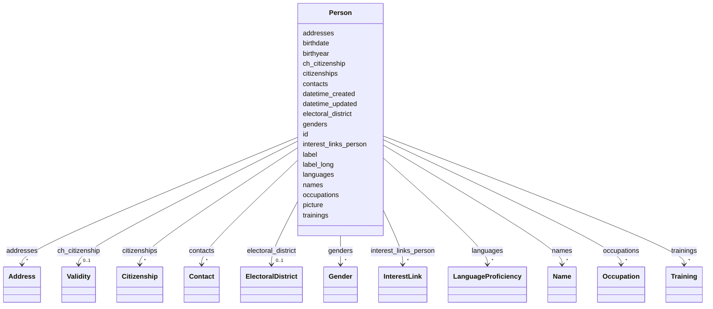

| **Name**              | **Politische Akteure: Personen, Gruppen und Organe**                                                                                               |
|-----------------------|----------------------------------------------------------------------------------------------------------------------------|
| **eCH-Nummer**        | eCH-0294                                                                                                                   |
| **Kategorie**         | Entwurf                                                                                                                    |
| **Reifegrad**         |                                                                                                                            |
| **Version**           | 0.1                                                                                                                        |
| **Status**            |                                                                                                                            |
| **Beschluss am**      |                                                                                                                            |
| **Ausgabedatum**      |                                                                                                                            |
| **Ersetzt Version**   | 0.0                                                                                                                        |
| **Voraussetzungen**   | ?                                                                                                                          |
| **Beilagen**          | -                                                                                                                          |
| **Sprachen**          | English (Original)                                                                                                         |
| **Autoren**           | Fachgruppe politische Geschäfte: Julie Silberstein, Laurence Brandenberger, Daniela Koller, Thomas Roth, Stefan Oderbolz, Fabian Davolio, Orhan Saeedi   |
| **Herausgeber / Vertrieb** | Verein eCH, Räffelstr. 20, 8045                                                                                       |

# Summary

Management summary of the document.

# Table of Contents

< manually insert TOC here >


# Introduction

## Scope of this Document

## Identified Gaps on Political Actors

## Goals of this Document


## Work Plan as of November 2025
Currently we are working in the following order on the different topics regarding political actors (agents):
1) Personen: Ratsmitglieder, Verwaltungsmitglieder
2) Gruppen / Organe / Interessengruppe: Parteien, Fraktionen, Gremien, Kommissionen, Verbände
3) Interessenbindungen / Konflikte (Politikfinanzierungen)
4) Verknüpfungen gleicher Personen übergreifend CH / Kanton


# Person

## Einführung und Zielsetzung

Das Person-Schema beschreibt natürliche Personen im politischen Kontext mit dem Ziel, eine präzise und gleichzeitig flexible Datenstruktur bereitzustellen. Der Standard ermöglicht es, sowohl hochgradig strukturierte als auch offene Informationen zu erfassen, um unterschiedliche Datenqualitäten und Verfügbarkeiten abzubilden.

**Kernziele:**
- **Präzision**: Unterstützung von zeitlich gültigen Attributen (z.B. Namen, Adressen, Geschlecht)
- **Flexibilität**: Optionale Felder erlauben schrittweise Datenanreicherung
- **Interoperabilität**: Verwendung von Wikidata-IDs und URIs als globale Identifikatoren
- **Mehrsprachigkeit**: Unterstützung mehrsprachiger Inhalte gemäß Schweizer Anforderungen

## Technische Struktur

### Identifikatoren

Das Person-Schema verwendet eine hierarchische Identifikationsstrategie:

1. **Primärer Identifikator (`id`)**:
   - **Präferenz**: Wikidata-ID (z.B. `https://www.wikidata.org/wiki/Q813067`)
   - **Alternative**: Lokaler URI (z.B. `act:person_12345`)
   - **Anforderung**: Eindeutig, persistent, global auflösbar (wenn möglich)

2. **Anzeigenamen**:
   - `label`: Kurzer Anzeigename (z.B. "Beat Jans")
   - `label_long`: Erweiterter Anzeigename mit Titeln (z.B. "Prof. Dr. iur. Andrea Caroni, MPA (Harvard)")

### Temporale Validität

Viele Attribute unterstützen zeitliche Gültigkeit durch `valid_from` und `valid_until`:

- **Name**: Namen können sich ändern (Heirat, Geschlechtsanpassung)
- **Adresse**: Wohn- und Geschäftsadressen ändern sich
- **Geschlecht**: Geschlechtsidentität kann sich entwickeln
- **Staatsbürgerschaft**: Mehrfache Staatsbürgerschaften mit unterschiedlichen Gültigkeitsperioden
- **Beruf**: Berufliche Tätigkeiten mit Start- und Enddatum
- **Wahlkreis**: Wahlkreis kann sich bei Neuwahlen ändern

**Beispiel:**
```yaml
names:
  - name_type: officialLastName
    value: Müller
    valid_from: 1980-01-01
    valid_until: 2010-06-15
  - name_type: officialLastName
    value: Meier-Müller
    valid_from: 2010-06-15
```

### Datentypen und Validierung

| Attribut | Datentyp | Pflicht | Beschreibung |
|----------|----------|---------|--------------|
| `id` | URI | Ja | Eindeutiger Identifikator |
| `label` | string | Ja | Anzeigename |
| `birthyear` | integer | Nein | Geburtsjahr (4-stellig) |
| `birthdate` | date | Nein | Exaktes Geburtsdatum (ISO 8601) |
| `picture` | URI | Nein | Link zu Profilbild (bevorzugt PNG) |
| `names` | Name[] | Nein | Liste strukturierter Namen |
| `addresses` | Address[] | Nein | Wohn- und Geschäftsadressen |
| `languages` | LanguageProficiency[] | Nein | Sprachkenntnisse |
| `ch_citizenship` | Validity | Nein | Schweizer Bürgerrecht (zeitlich) |
| `citizenships` | Citizenship[] | Nein | Weitere Staatsbürgerschaften |
| `genders` | Gender[] | Nein | Geschlechtsidentität(en) |
| `occupations` | Occupation[] | Nein | Berufliche Tätigkeiten |
| `trainings` | Training[] | Nein | Ausbildungen |
| `contacts` | Contact[] | Nein | Kontaktinformationen |
| `electoral_district` | ElectoralDistrict | Nein | Wahlkreis |
| `interest_links_person` | InterestLink[] | Nein | Interessenbindungen |

## Strukturierte Unterklassen

### Name

Namen werden nach eCH-0044 strukturiert erfasst:

```yaml
names:
  - name_type: officialGivenName
    value: Andrea
  - name_type: officialLastName
    value: Caroni
    valid_from: 1980-04-19
  - name_type: callName
    value: Andi
```

**Namenstypen** (`NameTypeEnum`):
- `officialGivenName`: Offizieller Vorname
- `officialLastName`: Offizieller Nachname
- `officialMiddleName`: Offizieller Mittelname
- `callName`: Rufname
- `familyNameOnForeignPassport`: Familienname auf ausländischem Pass

### Adresse

Adressen folgen eCH-0010 Standard:

```yaml
addresses:
  - address_type: businessAddress
    address_URI: https://ld.admin.ch/address/12345
    street_address: Bundesplatz 3
    postal_code: "3003"
    postal_locality: Bern
  - address_type: privateAddress
    postal_locality: Zürich
```

**Adresstypen** (`AddressTypeEnum`):
- `privateAddress`: Privatadresse
- `businessAddress`: Geschäftsadresse
- `localAddress`: Lokale Adresse (z.B. Parlamentsadresse)

### Sprachkenntnisse

```yaml
languages:
  - language: de
    correspondence: true
    native: true
  - language: fr
    correspondence: false
    native: false
```

- `language`: ISO 639-1 Sprachcode (de, fr, it, rm, en)
- `correspondence`: Bevorzugte Korrespondenzsprache
- `native`: Muttersprache

### Geschlecht

```yaml
genders:
  - value: female
    valid_from: 1978-05-23
    pronouns:
      - sie
      - ihr
```

- `value`: Geschlechtscode (male, female, diverse, etc.)
- `pronouns`: Bevorzugte Pronomen (mehrsprachig möglich)
- Unterstützt zeitliche Änderungen

### Staatsbürgerschaft

```yaml
ch_citizenship:
  valid_from: 1980-04-19

citizenships:
  - country: IT
    valid_from: 1980-04-19
  - country: DE
    valid_from: 2005-01-15
    valid_until: 2020-12-31
```

- `ch_citizenship`: Schweizer Bürgerrecht (Validity-Objekt)
- `citizenships`: Weitere Staatsbürgerschaften mit ISO 3166 Ländercodes

### Beruf und Ausbildung

```yaml
occupations:
  - value: Honorarprofessor
    occupation_isco19_code: "2421"
    valid_from: 2010-01-01
    active: true
    paid: true
    enterprise_uid: CHE-123.456.789
    enterprise: Universität St. Gallen

trainings:
  - type: uni
    value: Prof. Dr. iur.
    training_isco19_code: "0421"
  - type: uni
    value: MPA (Harvard)
```

- `occupation_isco19_code`: ISCO-19 Berufsklassifikation
- `enterprise_uid`: UID-Nummer des Unternehmens (eCH-0097)
- `active`: Aktuelle Tätigkeit
- `paid`: Bezahlte Position

**Ausbildungstypen** (`TrainingTypeEnum`):
- `schulabschluss`: Schulabschluss
- `efz`: Eidgenössisches Fähigkeitszeugnis
- `uni`: Universitätsabschluss
- `armee`: Militärdienst
- `zivi`: Zivildienst
- `zischutz`: Zivilschutz

### Kontaktinformationen

```yaml
contacts:
  - type: email
    value: andrea.caroni@parl.ch
  - type: contact_website
    value: http://www.andrea-caroni.ch
  - type: linked-in
    value: https://linkedin.com/in/andrea-caroni
  - type: twitter
    value: https://twitter.com/acaroni
```

**Kontakttypen** (`ContactTypeEnum`):
- `email`: E-Mail-Adresse
- `contact_website`: Persönliche Website
- `linked-in`: LinkedIn-Profil
- `twitter`: Twitter/X-Profil

### Wahlkreis

```yaml
electoral_district:
  district: Appenzell Ausserrhoden
  valid_from: 2015-01-01
  valid_until: 2023-11-30
```

## Interoperabilität

### Globale Identifikatoren

- **Wikidata**: Primäre Quelle für Personen-IDs
- **eCH-0285**: Kompatibilität mit eCH-Standard für semantische Identifikatoren
- **Linked Open Data**: URIs erlauben Verlinkung mit anderen Datenquellen

### Referenzierung in anderen Schemas

Personen werden in anderen eCH-Standards referenziert:
- **eCH-0293** (Operations): `actor_id` verweist auf Person
- **eCH-0294** (Actors): `person_id` in Memberships und InterestLinks
- **eCH-0295** (Affairs): Autoren, Einreicher, Mitunterzeichner

## Anwendungsbeispiele

### Beispiel 1: Nationalrat mit vollständigen Angaben

```yaml
id: https://www.wikidata.org/wiki/Q493598
label: Andrea Caroni
label_long: Prof. Dr. iur. Andrea Caroni, MPA (Harvard)
birthyear: 1980
birthdate: 1980-04-19
picture: https://www.parlament.ch/[...]
names:
  - name_type: officialGivenName
    value: Andrea
  - name_type: officialLastName
    value: Caroni
    valid_from: 1980-04-19
addresses:
  - address_type: businessAddress
    street_address: Poststrasse 1
    postal_code: "9100"
    postal_locality: Herisau
languages:
  - language: de
    correspondence: true
    native: true
ch_citizenship:
  valid_from: 1980-04-19
genders:
  - value: male
    valid_from: 1980-04-19
    pronouns:
      - er
      - ihm
occupations:
  - value: Honorarprofessor
    valid_from: 2010-01-01
    active: true
    paid: true
trainings:
  - type: uni
    value: Prof. Dr. iur.
  - type: uni
    value: MPA (Harvard)
contacts:
  - type: email
    value: andrea.caroni@parl.ch
  - type: contact_website
    value: http://www.andrea-caroni.ch
electoral_district:
  district: Appenzell Ausserrhoden
  valid_from: 2015-01-01
```

### Beispiel 2: Minimale Angaben

```yaml
id: act:person_local_123
label: Max Muster
names:
  - name_type: officialGivenName
    value: Max
  - name_type: officialLastName
    value: Muster
languages:
  - language: de
    native: true
ch_citizenship:
  valid_from: 1970-01-01
```

### Beispiel 3: Person mit Namensänderung

```yaml
id: https://www.wikidata.org/wiki/Q123456
label: Petra Meier-Schmidt
names:
  - name_type: officialGivenName
    value: Petra
  - name_type: officialLastName
    value: Schmidt
    valid_from: 1975-03-15
    valid_until: 2005-06-20
  - name_type: officialLastName
    value: Meier-Schmidt
    valid_from: 2005-06-20
```

## Referenzen

Siehe vollständige LinkML-Schema-Dokumentation:


# Class: Person 


_[en] A person with identifiers, names, addresses, citizenships, and occupations._

_[de] Eine Person mit Identifikatoren, Namen, Adressen, Staatsbürgerschaften und Berufen._

__


URI: [act:Person](https://ch.paf.link/schema/actors/Person)





<!-- no inheritance hierarchy -->


## Slots

| Name | Cardinality and Range | Description | Inheritance |
| ---  | --- | --- | --- |
| [id](#id) | 1 <br/> [String](#String) | [en] Unique identifier (preferably Wikidata-ID or URI) | direct |
| [label](#label) | 1 <br/> [String](#String) | [en] Display name of the person | direct |
| [label_long](#label_long) | 0..1 <br/> [String](#String) | [en] Extended display name (with title, etc | direct |
| [birthyear](#birthyear) | 0..1 <br/> [Integer](#Integer) | [en] Year of birth | direct |
| [birthdate](#birthdate) | 0..1 <br/> [Date](#Date) | [en] Exact date of birth | direct |
| [picture](#picture) | 0..1 <br/> [String](#String) | [en] Link to an image (preferred: PNG, then JPG, then GIF) | direct |
| [names](#names) | * <br/> [Name](#Name) |  | direct |
| [addresses](#addresses) | * <br/> [Address](#Address) | [en] Addresses (private, business, local) | direct |
| [languages](#languages) | * <br/> [LanguageProficiency](#LanguageProficiency) |  | direct |
| [ch_citizenship](#ch_citizenship) | 0..1 <br/> [Validity](#Validity) |  | direct |
| [citizenships](#citizenships) | * <br/> [Citizenship](#Citizenship) |  | direct |
| [genders](#genders) | * <br/> [Gender](#Gender) |  | direct |
| [occupations](#occupations) | * <br/> [Occupation](#Occupation) |  | direct |
| [trainings](#trainings) | * <br/> [Training](#Training) |  | direct |
| [contacts](#contacts) | * <br/> [Contact](#Contact) | [en] Contact information (email, website, social media) | direct |
| [electoral_district](#electoral_district) | 0..1 <br/> [ElectoralDistrict](#ElectoralDistrict) |  | direct |
| [interest_links_person](#interest_links_person) | * <br/> [InterestLink](#InterestLink) | [en] Interest links of the person | direct |
| [datetime_updated](#datetime_updated) | 0..1 <br/> [Datetime](#Datetime) | [en] The last time this record was updated | direct |
| [datetime_created](#datetime_created) | 0..1 <br/> [Datetime](#Datetime) | [en] The time this record was created | direct |


## Usages

| used by | used in | type | used |
| ---  | --- | --- | --- |
| [Container](#Container) | [persons](#persons) | range | [Person](#Person) |


## Identifier and Mapping Information


### Schema Source


* from schema: https://ch.paf.link/schema/actors


## Mappings

| Mapping Type | Mapped Value |
| ---  | ---  |
| self | act:Person |
| native | act:Person |


## LinkML Source

<!-- TODO: investigate https://stackoverflow.com/questions/37606292/how-to-create-tabbed-code-blocks-in-mkdocs-or-sphinx -->

### Direct

<details>
```yaml
name: Person
description: '[en] A person with identifiers, names, addresses, citizenships, and
  occupations.

  [de] Eine Person mit Identifikatoren, Namen, Adressen, Staatsbürgerschaften und
  Berufen.

  '
from_schema: https://ch.paf.link/schema/actors
slots:
- id
- label
- label_long
- birthyear
- birthdate
- picture
- names
- addresses
- languages
- ch_citizenship
- citizenships
- genders
- occupations
- trainings
- contacts
- electoral_district
- interest_links_person
- datetime_updated
- datetime_created

```
</details>

### Induced

<details>
```yaml
name: Person
description: '[en] A person with identifiers, names, addresses, citizenships, and
  occupations.

  [de] Eine Person mit Identifikatoren, Namen, Adressen, Staatsbürgerschaften und
  Berufen.

  '
from_schema: https://ch.paf.link/schema/actors
attributes:
  id:
    name: id
    description: '[en] Unique identifier (preferably Wikidata-ID or URI).

      [de] Eindeutiger Identifikator (vorzugsweise Wikidata-ID oder URI).

      '
    from_schema: https://ch.paf.link/schema/actors
    rank: 1000
    slot_uri: dcterm:identifier
    identifier: true
    alias: id
    owner: Person
    domain_of:
    - Container
    - Person
    - Group
    - Membership
    - InterestLink
    - PersonReference
    - GroupReference
    range: string
    required: true
  label:
    name: label
    description: '[en] Display name of the person.

      [de] Anzeigename der Person.

      '
    from_schema: https://ch.paf.link/schema/actors
    rank: 1000
    alias: label
    owner: Person
    domain_of:
    - Person
    range: string
    required: true
  label_long:
    name: label_long
    description: '[en] Extended display name (with title, etc.).

      [de] Erweiterter Anzeigename (mit Titel, etc.).

      '
    from_schema: https://ch.paf.link/schema/actors
    rank: 1000
    alias: label_long
    owner: Person
    domain_of:
    - Person
    range: string
  birthyear:
    name: birthyear
    description: '[en] Year of birth.

      [de] Geburtsjahr.

      '
    from_schema: https://ch.paf.link/schema/actors
    rank: 1000
    alias: birthyear
    owner: Person
    domain_of:
    - Person
    range: integer
  birthdate:
    name: birthdate
    description: '[en] Exact date of birth.

      [de] Genaues Geburtsdatum.

      '
    from_schema: https://ch.paf.link/schema/actors
    rank: 1000
    alias: birthdate
    owner: Person
    domain_of:
    - Person
    range: date
  picture:
    name: picture
    description: '[en] Link to an image (preferred: PNG, then JPG, then GIF).

      [de] Link zu einem Bild (bevorzugt: PNG, dann JPG, dann GIF).

      '
    from_schema: https://ch.paf.link/schema/actors
    rank: 1000
    alias: picture
    owner: Person
    domain_of:
    - Person
    range: string
  names:
    name: names
    from_schema: https://ch.paf.link/schema/actors
    rank: 1000
    slot_uri: act:name
    alias: names
    owner: Person
    domain_of:
    - Person
    range: Name
    multivalued: true
    inlined: true
    inlined_as_list: true
  addresses:
    name: addresses
    description: '[en] Addresses (private, business, local).

      [de] Adressen (privat, geschäftlich, lokal).

      '
    from_schema: https://ch.paf.link/schema/actors
    rank: 1000
    slot_uri: act:address
    alias: addresses
    owner: Person
    domain_of:
    - Person
    - Group
    range: Address
    multivalued: true
    inlined: true
    inlined_as_list: true
  languages:
    name: languages
    from_schema: https://ch.paf.link/schema/actors
    rank: 1000
    slot_uri: act:language
    alias: languages
    owner: Person
    domain_of:
    - Person
    range: LanguageProficiency
    multivalued: true
    inlined: true
    inlined_as_list: true
  ch_citizenship:
    name: ch_citizenship
    from_schema: https://ch.paf.link/schema/actors
    rank: 1000
    slot_uri: act:chCitizenship
    alias: ch_citizenship
    owner: Person
    domain_of:
    - Person
    range: Validity
  citizenships:
    name: citizenships
    from_schema: https://ch.paf.link/schema/actors
    rank: 1000
    slot_uri: act:citizenship
    alias: citizenships
    owner: Person
    domain_of:
    - Person
    range: Citizenship
    multivalued: true
    inlined: true
    inlined_as_list: true
  genders:
    name: genders
    from_schema: https://ch.paf.link/schema/actors
    rank: 1000
    slot_uri: act:gender
    alias: genders
    owner: Person
    domain_of:
    - Person
    range: Gender
    multivalued: true
    inlined: true
    inlined_as_list: true
  occupations:
    name: occupations
    from_schema: https://ch.paf.link/schema/actors
    rank: 1000
    slot_uri: act:occupation
    alias: occupations
    owner: Person
    domain_of:
    - Person
    range: Occupation
    multivalued: true
    inlined: true
    inlined_as_list: true
  trainings:
    name: trainings
    from_schema: https://ch.paf.link/schema/actors
    rank: 1000
    slot_uri: act:training
    alias: trainings
    owner: Person
    domain_of:
    - Person
    range: Training
    multivalued: true
    inlined: true
    inlined_as_list: true
  contacts:
    name: contacts
    description: '[en] Contact information (email, website, social media).

      [de] Kontaktinformationen (E-Mail, Website, Social Media).

      '
    from_schema: https://ch.paf.link/schema/actors
    rank: 1000
    slot_uri: act:contact
    alias: contacts
    owner: Person
    domain_of:
    - Person
    - Group
    range: Contact
    multivalued: true
    inlined: true
    inlined_as_list: true
  electoral_district:
    name: electoral_district
    from_schema: https://ch.paf.link/schema/actors
    rank: 1000
    slot_uri: act:electoralDistrict
    alias: electoral_district
    owner: Person
    domain_of:
    - Person
    range: ElectoralDistrict
  interest_links_person:
    name: interest_links_person
    description: '[en] Interest links of the person.

      [de] Interessenbindungen der Person.

      '
    from_schema: https://ch.paf.link/schema/actors
    rank: 1000
    slot_uri: act:interestLink
    alias: interest_links_person
    owner: Person
    domain_of:
    - Person
    range: InterestLink
    multivalued: true
    inlined: true
    inlined_as_list: true
  datetime_updated:
    name: datetime_updated
    description: '[en] The last time this record was updated.

      [de] Der Zeitpunkt, zu dem dieser Datensatz zuletzt aktualisiert wurde.

      '
    from_schema: https://ch.paf.link/schema/actors
    rank: 1000
    alias: datetime_updated
    owner: Person
    domain_of:
    - Person
    - Group
    - Membership
    - InterestLink
    range: datetime
  datetime_created:
    name: datetime_created
    description: '[en] The time this record was created.

      [de] Der Zeitpunkt, zu dem dieser Datensatz erstellt wurde.

      '
    from_schema: https://ch.paf.link/schema/actors
    rank: 1000
    alias: datetime_created
    owner: Person
    domain_of:
    - Person
    - Group
    - Membership
    - InterestLink
    range: datetime

```
</details> 


# Organe im Politischen Prozess

Ein Organ in dieser Definition ist einzig eine ansammlung von Personen. (Ohne weitere semantik.) Sie wird typisiert um die Art des Organs zu bestimmen.

## Allgemeinen Felder eines Organes

group
- id (local)
- uri politics.ld.admin.ch/party/1
- type  enum -> Partei, Liste, Arbeitsgruppe 
- type_label: "" (Wenn spezifischer lokaler Namen vorhanden.)
- valid_from:
- valid_to:
- name: (Mehrsprachig)
- abrev: (Mehrsprachig)
- description:
- landing_page:
- parent_group: (0:n)   Um die Parteienhierarchie (CH-Kanton-Gemeinde) abzubilden, aber auch um Parteien an ein Parlament zu binden.
- spatial: gemeindenummer / agvch nummer ld.admin.ch/muncipality/234 ld.admin.ch/canton/2
- contact:
   - type: email, contact_website, linked-in, twitter; # Guideline: E-mail is quasi mandatory and should be always provided.
   - contact: "michael.luggen@...";
- address: 
   - addressType: enum ? -> privateAddress, businessAddress, localAddress,
   - addressURI: , (super präferenziert)
   - streetAddress: ,
   - postalCode: ,
   - postalLocality: , 

## Verschiedene Typen von Organen

* Gruppen, beinhalten Mitglieder ausweisen wollen (Listen)
* Gruppen, Identifizieren (Departemente, Gerichte)

-> Gemeinden, Kantone und Bund
Zu diskutieren mit Hans-Peter

-> Anwendungszweck der Struktur
* Organisation innerhalb eines Parlamentssystems
* Publikation an die öffentichkeit
* Systeme mit Politischen Personen
* Analysen mit Personen welche in Gruppen leben
* Parteiliste global - UNIBE

-> Ausdrücken der Ebene:
* localExtend: Gemeinde Root
* level: canton, municipality (abstract)


Hierarchien innerhalb eines Types: Departement, Amt / Fraktion / Parteien

# Sicht Parlamentsmitglied
* Legislative
  * Parlamente Föderale Ebene
    * Bund (beide Kammern) / Kanton / Gemeinde
  * Delegation
  * Komission
    * Attribute:
       * ständig / (Ad-Hoc) nicht ständige
       * Aufsichtkomissionen / Sachkomissionen
    * Geschäftsprüfungskommission (ständige Aufsichtskommission)
    * PUK (nichständige Aufsichtkommision)
    * Rechnungsprüfungskommission 
  * Fraktion
  * Parlamentsbüro
  * Präsidium des Parlaments
* Exekutive = Regierung / Verwaltung
  * Department
  * Amt
  * Ausserparlementarische Komissionen (z.B. Bankrat)
  * Arbeitsgruppe (Ad-Hoc APK)
* Zivilgesellschaft
   * Partei
   * Liste (kann Teil einer Partei sein, oder nicht) 
   * Interessengruppen
* Andere
  * Kontrollorgane
    * Finanzkontrolle
    * AB-BA
  * Parlamentsdienste
*	(Parteilose und/oder fraktionslose Parlamentsmitglieder)


# Sicht Parlamentsgeschäft
* Legislative
* Exekutive
  * Ausgelagerte Träger öffentlicher Aufgaben
    * Universitäten
* Judikative
  * Gerichte
* Zivilgesellschaft
  * Petitionsträger
  * Verein


## Parteien
Jede Föderaleebene, wird als eigene Gruppierung geführt.
- url_statutes: (optional)
- party_color: (optional)


## Memberships

- ID Person
- Role
- ID Group
- validFrom
- validUntil
- isActive (als Alternateive zu validFrom and validUntil)
- authorized_to_vote

## 

## Interessenbindungen / Konflikte (Politikfinanzierungen)

Siehe:  * https://www.parlament.ch/centers/documents/de/interessen-nr.pdf


* Person:
  * Interessensbindungen
    * Type: Berufliche Tätigkeit, Politische Ämter, Verein
    * Label der Organisation
    * Addresse der Organisation
    * UID Link zu Organisation -> Weil damit dann auch Auswertungen wie z.B. Noga codes vorhanden sind.
    * Rechtsform Organisation
    * from / to
    * Bezahlt
    * Gremium (Stiftungsrat, Verwaltungsrat - übernehmen Liste von Parlament)
    * Funktion/Rolle
    

## Überlegungen am 17.09.2025

* Zutrittsberechtigte in Personen eintragen und dann ein Objekt Zuttritsberechtigte die eine Beziehung zwischen Ratsmitglied und Zuttrittsberechtigter herstellt?
* Wenn Interessensgrupppe ein anderes Parlament, dann ID von wo?

* Überlegungen zu Datenschutz / Öffentlichkeitsrecht  (Christian schaut sich das an).
  * ein Kapitel mit Analyse des IST Zustands / Rechtsgrundlage oder Toolkit ?
  * Abklärung was ist rechtlich erlaubt.
  * Was wäre ethisch verantwortbar.
  * Personen des öffentlichen Interesses.
  
  * [Ersetzung der privaten Wohnadresse als Identifikator der Urheber von Volksinitiativen](https://www.parlament.ch/de/ratsbetrieb/suche-curia-vista/geschaeft?AffairId=20243425)
  * [Verhinderung der Pflicht zur Veröffentlichung der Wohnadressen von Parlamentsmitgliedern](https://www.parlament.ch/de/ratsbetrieb/suche-curia-vista/geschaeft?AffairId=20233913)

