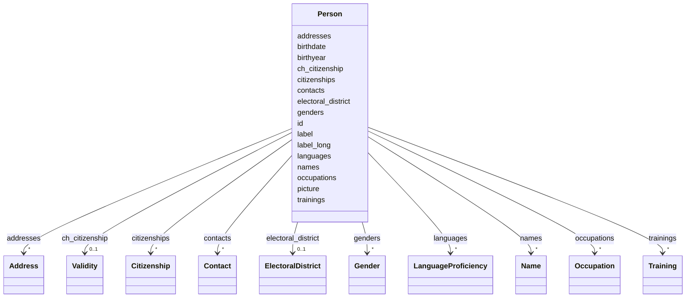

| **Name**              | **Politische Akteure: Personen, Gruppen und Organe**                                                                                               |
|-----------------------|----------------------------------------------------------------------------------------------------------------------------|
| **eCH-Nummer**        | eCH-0294                                                                                                                   |
| **Kategorie**         | Entwurf                                                                                                                    |
| **Reifegrad**         |                                                                                                                            |
| **Version**           | 0.1                                                                                                                        |
| **Status**            |                                                                                                                            |
| **Beschluss am**      |                                                                                                                            |
| **Ausgabedatum**      |                                                                                                                            |
| **Ersetzt Version**   | 0.0                                                                                                                        |
| **Voraussetzungen**   | ?                                                                                                                          |
| **Beilagen**          | -                                                                                                                          |
| **Sprachen**          | English (Original)                                                                                                         |
| **Autoren**           | Fachgruppe politische Geschäfte: Julie Silberstein, Laurence Brandenberger, Daniela Koller, Thomas Roth, Stefan Oderbolz, Fabian Davolio, Orhan Saeedi   |
| **Herausgeber / Vertrieb** | Verein eCH, Räffelstr. 20, 8045                                                                                       |

# Summary

Management summary of the document.

# Table of Contents

< manually insert TOC here >


# Introduction

## Scope of this Document

## Identified Gaps on Political Actors

## Goals of this Document


## Work Plan as of November 2025
Currently we are working in the following order on the different topics regarding political actors (agents):
1) Personen: Ratsmitglieder, Verwaltungsmitglieder
2) Gruppen / Organe / Interessengruppe: Parteien, Fraktionen, Gremien, Kommissionen, Verbände
3) Interessenbindungen / Konflikte (Politikfinanzierungen)
4) Verknüpfungen gleicher Personen übergreifend CH / Kanton


# Person

[todo]: # (Introduction of the "Person in Political Context", goal of the structure, goal of providing the ability to be very correct, but allow open information)


# Class: Person 


_A person with identifiers, names, addresses, citizenships, and occupations._


URI: [act:Person](https://ch.paf.link/schema/actors/Person)





<!-- no inheritance hierarchy -->


## Slots

| Name | Cardinality and Range | Description | Inheritance |
| ---  | --- | --- | --- |
| [id](#id) | 1 <br/> [String](#String) | Wikidata-ID preferred | direct |
| [label](#label) | 1 <br/> [String](#String) | Display name of the person | direct |
| [label_long](#label_long) | 0..1 <br/> [String](#String) | Extended display name (with title, etc | direct |
| [birthyear](#birthyear) | 0..1 <br/> [Integer](#Integer) | Year of birth | direct |
| [birthdate](#birthdate) | 0..1 <br/> [Date](#Date) | Exact date of birth | direct |
| [picture](#picture) | 0..1 <br/> [String](#String) | Link to an image (preferred: PNG, then JPG, then GIF) | direct |
| [names](#names) | * <br/> [Name](#Name) |  | direct |
| [addresses](#addresses) | * <br/> [Address](#Address) | place of residence and work | direct |
| [languages](#languages) | * <br/> [LanguageProficiency](#LanguageProficiency) |  | direct |
| [ch_citizenship](#ch_citizenship) | 0..1 <br/> [Validity](#Validity) |  | direct |
| [citizenships](#citizenships) | * <br/> [Citizenship](#Citizenship) |  | direct |
| [genders](#genders) | * <br/> [Gender](#Gender) |  | direct |
| [occupations](#occupations) | * <br/> [Occupation](#Occupation) |  | direct |
| [trainings](#trainings) | * <br/> [Training](#Training) |  | direct |
| [contacts](#contacts) | * <br/> [Contact](#Contact) |  | direct |
| [electoral_district](#electoral_district) | 0..1 <br/> [ElectoralDistrict](#ElectoralDistrict) |  | direct |


## Identifier and Mapping Information


### Schema Source


* from schema: https://ch.paf.link/schema/actors


## Mappings

| Mapping Type | Mapped Value |
| ---  | ---  |
| self | act:Person |
| native | act:Person |


## LinkML Source

<!-- TODO: investigate https://stackoverflow.com/questions/37606292/how-to-create-tabbed-code-blocks-in-mkdocs-or-sphinx -->

### Direct

<details>
```yaml
name: Person
description: A person with identifiers, names, addresses, citizenships, and occupations.
from_schema: https://ch.paf.link/schema/actors
attributes:
  id:
    name: id
    description: Wikidata-ID preferred
    from_schema: https://ch.paf.link/schema/actors
    rank: 1000
    identifier: true
    domain_of:
    - Person
    required: true
  label:
    name: label
    description: Display name of the person
    from_schema: https://ch.paf.link/schema/actors
    rank: 1000
    domain_of:
    - Person
    required: true
  label_long:
    name: label_long
    description: Extended display name (with title, etc.)
    from_schema: https://ch.paf.link/schema/actors
    rank: 1000
    domain_of:
    - Person
  birthyear:
    name: birthyear
    description: Year of birth
    from_schema: https://ch.paf.link/schema/actors
    rank: 1000
    domain_of:
    - Person
    range: integer
  birthdate:
    name: birthdate
    description: Exact date of birth
    from_schema: https://ch.paf.link/schema/actors
    rank: 1000
    domain_of:
    - Person
    range: date
  picture:
    name: picture
    description: 'Link to an image (preferred: PNG, then JPG, then GIF)'
    from_schema: https://ch.paf.link/schema/actors
    rank: 1000
    domain_of:
    - Person
  names:
    name: names
    from_schema: https://ch.paf.link/schema/actors
    rank: 1000
    slot_uri: act:name
    domain_of:
    - Person
    range: Name
    multivalued: true
    inlined: true
    inlined_as_list: true
  addresses:
    name: addresses
    description: place of residence and work
    from_schema: https://ch.paf.link/schema/actors
    rank: 1000
    slot_uri: act:address
    domain_of:
    - Person
    range: Address
    multivalued: true
    inlined: true
    inlined_as_list: true
  languages:
    name: languages
    from_schema: https://ch.paf.link/schema/actors
    rank: 1000
    slot_uri: act:language
    domain_of:
    - Person
    range: LanguageProficiency
    multivalued: true
    inlined: true
    inlined_as_list: true
  ch_citizenship:
    name: ch_citizenship
    from_schema: https://ch.paf.link/schema/actors
    rank: 1000
    slot_uri: act:chCitizenship
    domain_of:
    - Person
    range: Validity
  citizenships:
    name: citizenships
    from_schema: https://ch.paf.link/schema/actors
    rank: 1000
    slot_uri: act:citizenship
    domain_of:
    - Person
    range: Citizenship
    multivalued: true
    inlined: true
    inlined_as_list: true
  genders:
    name: genders
    from_schema: https://ch.paf.link/schema/actors
    rank: 1000
    slot_uri: act:gender
    domain_of:
    - Person
    range: Gender
    multivalued: true
    inlined: true
    inlined_as_list: true
  occupations:
    name: occupations
    from_schema: https://ch.paf.link/schema/actors
    rank: 1000
    slot_uri: act:occupation
    domain_of:
    - Person
    range: Occupation
    multivalued: true
    inlined: true
    inlined_as_list: true
  trainings:
    name: trainings
    from_schema: https://ch.paf.link/schema/actors
    rank: 1000
    slot_uri: act:training
    domain_of:
    - Person
    range: Training
    multivalued: true
    inlined: true
    inlined_as_list: true
  contacts:
    name: contacts
    from_schema: https://ch.paf.link/schema/actors
    rank: 1000
    slot_uri: act:contact
    domain_of:
    - Person
    range: Contact
    multivalued: true
    inlined: true
    inlined_as_list: true
  electoral_district:
    name: electoral_district
    from_schema: https://ch.paf.link/schema/actors
    rank: 1000
    slot_uri: act:electoralDistrict
    domain_of:
    - Person
    range: ElectoralDistrict
tree_root: true

```
</details>

### Induced

<details>
```yaml
name: Person
description: A person with identifiers, names, addresses, citizenships, and occupations.
from_schema: https://ch.paf.link/schema/actors
attributes:
  id:
    name: id
    description: Wikidata-ID preferred
    from_schema: https://ch.paf.link/schema/actors
    rank: 1000
    identifier: true
    alias: id
    owner: Person
    domain_of:
    - Person
    range: string
    required: true
  label:
    name: label
    description: Display name of the person
    from_schema: https://ch.paf.link/schema/actors
    rank: 1000
    alias: label
    owner: Person
    domain_of:
    - Person
    range: string
    required: true
  label_long:
    name: label_long
    description: Extended display name (with title, etc.)
    from_schema: https://ch.paf.link/schema/actors
    rank: 1000
    alias: label_long
    owner: Person
    domain_of:
    - Person
    range: string
  birthyear:
    name: birthyear
    description: Year of birth
    from_schema: https://ch.paf.link/schema/actors
    rank: 1000
    alias: birthyear
    owner: Person
    domain_of:
    - Person
    range: integer
  birthdate:
    name: birthdate
    description: Exact date of birth
    from_schema: https://ch.paf.link/schema/actors
    rank: 1000
    alias: birthdate
    owner: Person
    domain_of:
    - Person
    range: date
  picture:
    name: picture
    description: 'Link to an image (preferred: PNG, then JPG, then GIF)'
    from_schema: https://ch.paf.link/schema/actors
    rank: 1000
    alias: picture
    owner: Person
    domain_of:
    - Person
    range: string
  names:
    name: names
    from_schema: https://ch.paf.link/schema/actors
    rank: 1000
    slot_uri: act:name
    alias: names
    owner: Person
    domain_of:
    - Person
    range: Name
    multivalued: true
    inlined_as_list: true
  addresses:
    name: addresses
    description: place of residence and work
    from_schema: https://ch.paf.link/schema/actors
    rank: 1000
    slot_uri: act:address
    alias: addresses
    owner: Person
    domain_of:
    - Person
    range: Address
    multivalued: true
    inlined_as_list: true
  languages:
    name: languages
    from_schema: https://ch.paf.link/schema/actors
    rank: 1000
    slot_uri: act:language
    alias: languages
    owner: Person
    domain_of:
    - Person
    range: LanguageProficiency
    multivalued: true
    inlined_as_list: true
  ch_citizenship:
    name: ch_citizenship
    from_schema: https://ch.paf.link/schema/actors
    rank: 1000
    slot_uri: act:chCitizenship
    alias: ch_citizenship
    owner: Person
    domain_of:
    - Person
    range: Validity
  citizenships:
    name: citizenships
    from_schema: https://ch.paf.link/schema/actors
    rank: 1000
    slot_uri: act:citizenship
    alias: citizenships
    owner: Person
    domain_of:
    - Person
    range: Citizenship
    multivalued: true
    inlined_as_list: true
  genders:
    name: genders
    from_schema: https://ch.paf.link/schema/actors
    rank: 1000
    slot_uri: act:gender
    alias: genders
    owner: Person
    domain_of:
    - Person
    range: Gender
    multivalued: true
    inlined_as_list: true
  occupations:
    name: occupations
    from_schema: https://ch.paf.link/schema/actors
    rank: 1000
    slot_uri: act:occupation
    alias: occupations
    owner: Person
    domain_of:
    - Person
    range: Occupation
    multivalued: true
    inlined_as_list: true
  trainings:
    name: trainings
    from_schema: https://ch.paf.link/schema/actors
    rank: 1000
    slot_uri: act:training
    alias: trainings
    owner: Person
    domain_of:
    - Person
    range: Training
    multivalued: true
    inlined_as_list: true
  contacts:
    name: contacts
    from_schema: https://ch.paf.link/schema/actors
    rank: 1000
    slot_uri: act:contact
    alias: contacts
    owner: Person
    domain_of:
    - Person
    range: Contact
    multivalued: true
    inlined_as_list: true
  electoral_district:
    name: electoral_district
    from_schema: https://ch.paf.link/schema/actors
    rank: 1000
    slot_uri: act:electoralDistrict
    alias: electoral_district
    owner: Person
    domain_of:
    - Person
    range: ElectoralDistrict
tree_root: true

```
</details> 


# Organe im Politischen Prozess

Ein Organ in dieser Definition ist einzig eine ansammlung von Personen. (Ohne weitere semantik.) Sie wird typisiert um die Art des Organs zu bestimmen.

## Allgemeinen Felder eines Organes

group
- id (local)
- uri politics.ld.admin.ch/party/1
- type  enum -> Partei, Liste, Arbeitsgruppe 
- type_label: "" (Wenn spezifischer lokaler Namen vorhanden.)
- valid_from:
- valid_to:
- name: (Mehrsprachig)
- abrev: (Mehrsprachig)
- description:
- landing_page:
- parent_group: (0:n)   Um die Parteienhierarchie (CH-Kanton-Gemeinde) abzubilden, aber auch um Parteien an ein Parlament zu binden.
- spatial: gemeindenummer / agvch nummer ld.admin.ch/muncipality/234 ld.admin.ch/canton/2
- contact:
   - type: email, contact_website, linked-in, twitter; # Guideline: E-mail is quasi mandatory and should be always provided.
   - contact: "michael.luggen@...";
- address: 
   - addressType: enum ? -> privateAddress, businessAddress, localAddress,
   - addressURI: , (super präferenziert)
   - streetAddress: ,
   - postalCode: ,
   - postalLocality: , 

## Verschiedene Typen von Organen

* Gruppen, beinhalten Mitglieder ausweisen wollen (Listen)
* Gruppen, Identifizieren (Departemente, Gerichte)

-> Gemeinden, Kantone und Bund
Zu diskutieren mit Hans-Peter

-> Anwendungszweck der Struktur
* Organisation innerhalb eines Parlamentssystems
* Publikation an die öffentichkeit
* Systeme mit Politischen Personen
* Analysen mit Personen welche in Gruppen leben
* Parteiliste global - UNIBE

-> Ausdrücken der Ebene:
* localExtend: Gemeinde Root
* level: canton, municipality (abstract)


Hierarchien innerhalb eines Types: Departement, Amt / Fraktion / Parteien

# Sicht Parlamentsmitglied
* Legislative
  * Parlamente Föderale Ebene
    * Bund (beide Kammern) / Kanton / Gemeinde
  * Delegation
  * Komission
    * Attribute:
       * ständig / (Ad-Hoc) nicht ständige
       * Aufsichtkomissionen / Sachkomissionen
    * Geschäftsprüfungskommission (ständige Aufsichtskommission)
    * PUK (nichständige Aufsichtkommision)
    * Rechnungsprüfungskommission 
  * Fraktion
  * Parlamentsbüro
  * Präsidium des Parlaments
* Exekutive = Regierung / Verwaltung
  * Department
  * Amt
  * Ausserparlementarische Komissionen (z.B. Bankrat)
  * Arbeitsgruppe (Ad-Hoc APK)
* Zivilgesellschaft
   * Partei
   * Liste (kann Teil einer Partei sein, oder nicht) 
   * Interessengruppen
* Andere
  * Kontrollorgane
    * Finanzkontrolle
    * AB-BA
  * Parlamentsdienste
*	(Parteilose und/oder fraktionslose Parlamentsmitglieder)


# Sicht Parlamentsgeschäft
* Legislative
* Exekutive
  * Ausgelagerte Träger öffentlicher Aufgaben
    * Universitäten
* Judikative
  * Gerichte
* Zivilgesellschaft
  * Petitionsträger
  * Verein


## Parteien
Jede Föderaleebene, wird als eigene Gruppierung geführt.
- url_statutes: (optional)
- party_color: (optional)

## Interessenbindungen / Konflikte (Politikfinanzierungen)

Siehe:  * https://www.parlament.ch/centers/documents/de/interessen-nr.pdf


* Person:
  * Interessensbindungen
    * Type: Berufliche Tätigkeit, Politische Ämter, Verein
    * Label der Organisation
    * Addresse der Organisation
    * UID Link zu Organisation -> Weil damit dann auch Auswertungen wie z.B. Noga codes vorhanden sind.
    * Rechtsform Organisation
    * from / to
    * Bezahlt
    * Gremium (Stiftungsrat, Verwaltungsrat - übernehmen Liste von Parlament)
    * Funktion/Rolle
    

## Überlegungen am 17.09.2025

* Zutrittsberechtigte in Personen eintragen und dann ein Objekt Zuttritsberechtigte die eine Beziehung zwischen Ratsmitglied und Zuttrittsberechtigter herstellt?
* Wenn Interessensgrupppe ein anderes Parlament, dann ID von wo?

* Überlegungen zu Datenschutz / Öffentlichkeitsrecht  (Christian schaut sich das an).
  * ein Kapitel mit Analyse des IST Zustands / Rechtsgrundlage oder Toolkit ?
  * Abklärung was ist rechtlich erlaubt.
  * Was wäre ethisch verantwortbar.
  * Personen des öffentlichen Interesses.
  
  * [Ersetzung der privaten Wohnadresse als Identifikator der Urheber von Volksinitiativen](https://www.parlament.ch/de/ratsbetrieb/suche-curia-vista/geschaeft?AffairId=20243425)
  * [Verhinderung der Pflicht zur Veröffentlichung der Wohnadressen von Parlamentsmitgliedern](https://www.parlament.ch/de/ratsbetrieb/suche-curia-vista/geschaeft?AffairId=20233913)

