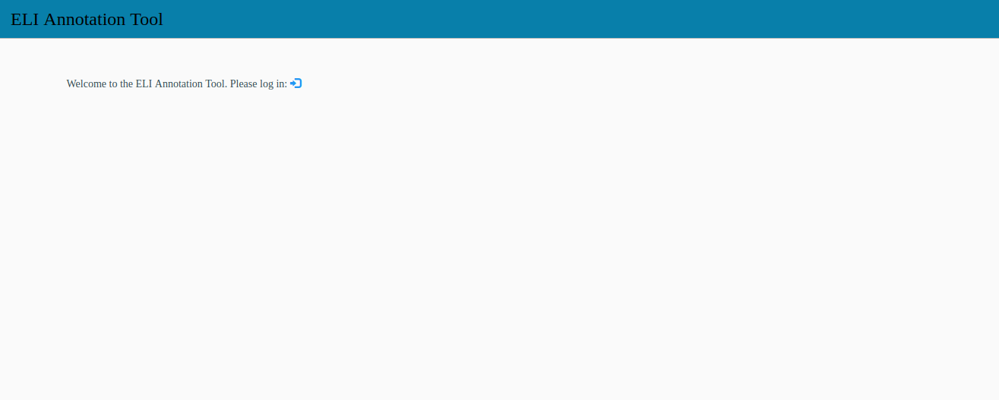
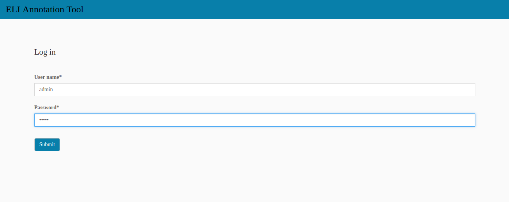
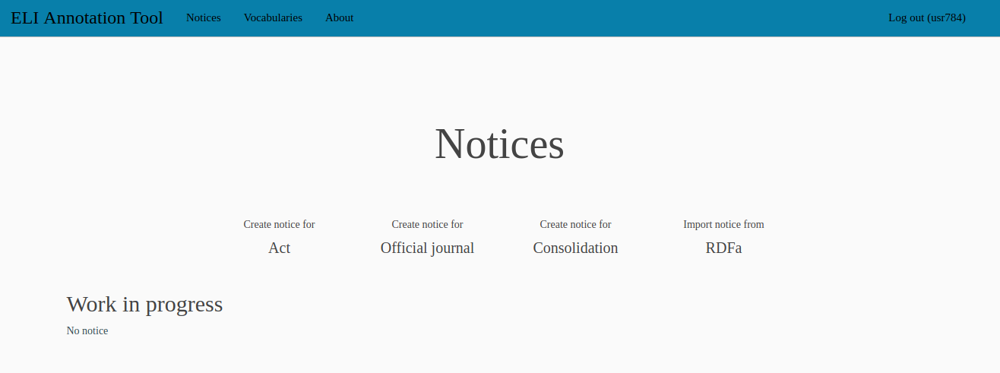
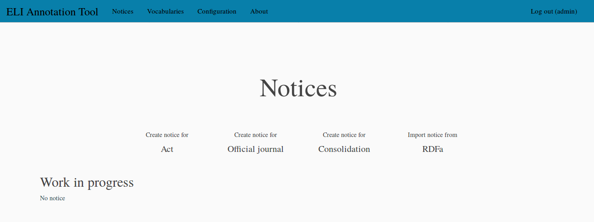

.. -*- coding: utf-8 -*-

Accessing the tool
==================

Once it has been properly installed on a server, the ELI annotation tool can
be accessed with a recent (as of end 2017) Web browser. Simply enter the
Web address given by the system administrator that has installed the tool
and you will see the following page:

Click on the blue icon after the text inviting you to log in. On the
*Log in* page, enter the identifier and password that the system
administrator has given you:

If you have been correctly identified, you should now see the home page of
the ELI annotation tool. If you are a **regular user**, this home page looks
like:

On the top of the page, in the blue header, you have a menu with the various
pages of the tool:

* ``Notices`` to create notices (see :ref:`notices` and :ref:`notices-import`
  section),
* ``Vocabularies`` to display the vocabularies used in the notices properties
  (see :ref:`vocabs` section),
* ``About`` to display the tool version and a few paragraphes about the tool,
* and, on the far right, the button to log out from the tool.

The current page is the notices page. You can see in this example that no
notice is currently worked on.

If you are **a user with administrator rights**, the home page looks like:

On the top of the page, in the blue header, you also have a menu with the
various pages of the tool:

* ``Notices`` to create notices (see :ref:`notices` ans :ref:`notices-import`
  section),
* ``Vocabularies`` to display and edit the vocabularies used in the notices
  properties (see :ref:`vocabs` and :ref:`vocabs-edit` sections),
* ``Configuration`` to configure the forms used to create notices (see
  :ref:`configuration` section),
* ``About`` to display the tool version and a few paragraphes about the tool,
* and, on the far right, the button to log out from the tool.

The current page is the notices page. You can see in this example that no
notice is currently worked on.
