.. -*- coding: utf-8 -*-

.. _configuration:

Configuring forms
=================

Only a user with administrative rights can access the page to
configure the forms for creating the notices. This page contains three
entry points: the configuration of the form for the *acts*, the
configuration of the form for the *official journals*, the
configuration of the form for the *consolidations*.

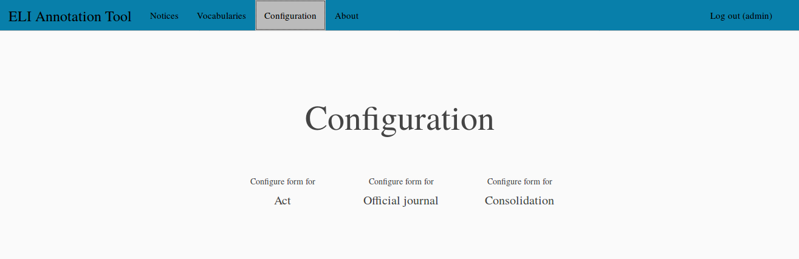

The form configuration contains several parts. Firstly, the definition
of the URIs of the ELI entities that will be created for each notice:

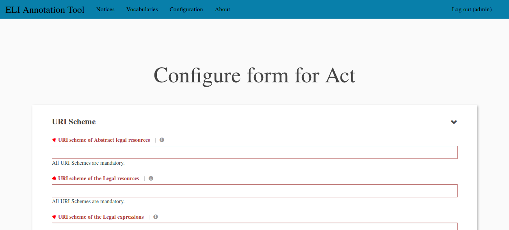

Then, the choice of the languages and formats corresponding to the
*legal expression* and *format* entities that will be created for each
notice (one *legal expression* for each language and then, for each of
these *legal expressions*, one *format* for each format):

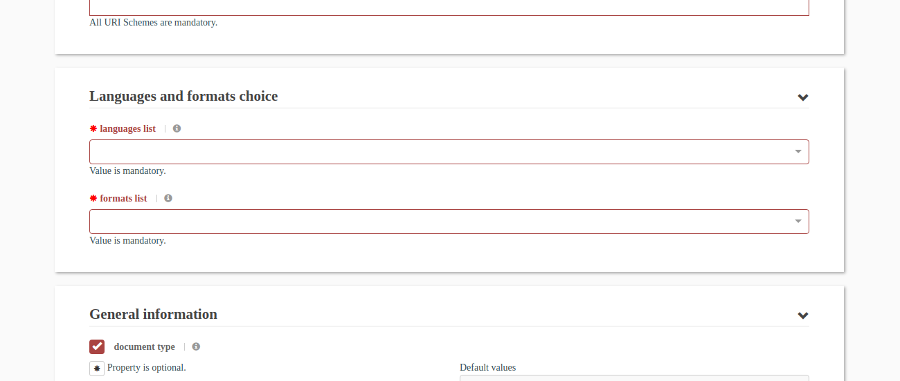

Then, the various ELI properties that can be activated and configured:

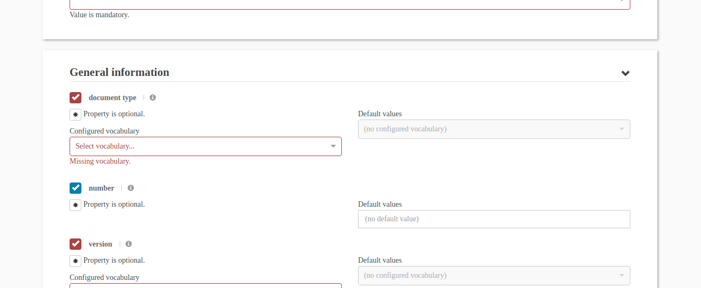

At the bottom of the page, messages explain the various errors in the
form. It is necessary to correct all these errors to save the form.

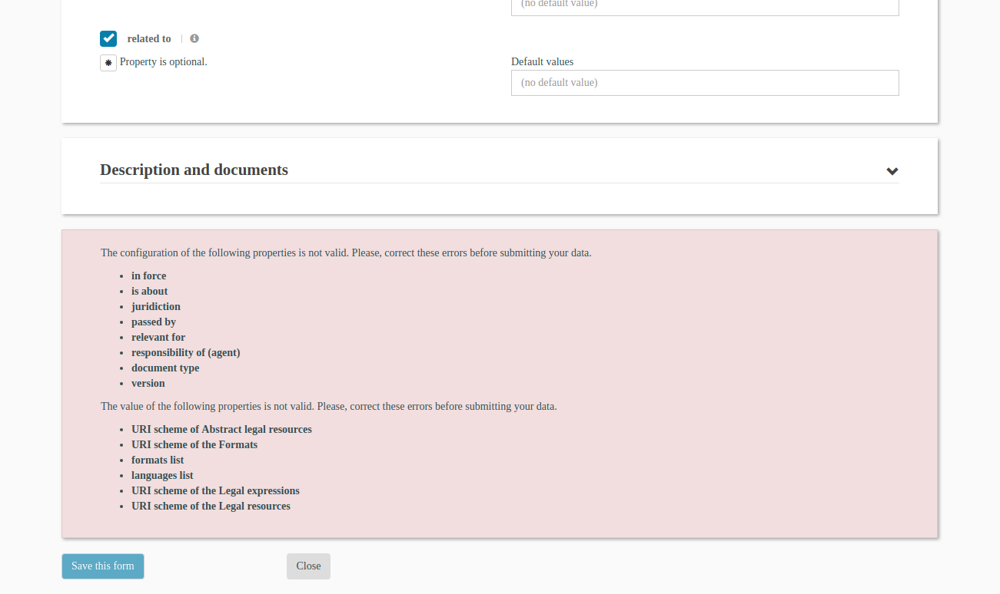

.. _uri-schemes:

Defining the URI schemes
------------------------

When a notice is created, several ELI entities are created: a *legal
resource*, several *legal expressions* (one for each chosen language)
and several *formats* (one for each chosen language and for each
chosen format). These entities all have a URI. The first part of the
configuration form consists in defining how these URI are built.

They are four URI to build:

* one for the *abstract legal resource* (a resource that has the
  actual *legal resource* as one of its member),
* one for the actual *legal resource* described the notice,
* one for the *legal expressions* that realize the actual *legal
  resource*
* one for the *formats* that embody the *legal expressions*.

The beginning of the second URI shall be the first URI and shall add
one or several parts. The beginning of the third URI shall be the
second URI and shall add one or several parts. The beginning of the
fourth URI shall be the third URI and shall add one or several
parts. Most of the time, the part added for the third URI (*legal
resource*) is the language and the part added for the fourth URI
(*format*) is the format. The following screenshot shows a consistent
example of URIs.

The URIs shall be well-formed and can contain the values of one or
several ELI properties (that will be defined in the notices creation
form). The insertion of such a value is done with the following syntax::

  {eli:version}

The name of the ELI field is given between curly brackets. The textual
value of the field will be inserted *as if* and shall thus respect the
rules of well-formedness for the URIs.

If the value is a date, it will be inserted in the format:
``YYYY-MM-DD`` (for example ``2017-11-23``). In such a case, it is
possible to only insert the year or the month or the day by using a
suffix operator::

  {eli:date_publication|year}

* ``|year`` will insert the year (``YYYY`` e.g. ``2017``),
* ``|month`` will insert the month (``MM`` e.g. ``11``),
* ``|day`` will insert the day (``DD`` e.g. ``23``).

If the value is a *concept* URI taken from a controlled vocabulary,
the SKOS *notation* of the *concept* will be inserted. Therefore,
**all the SKOS concepts inside a vocabulary controlling the values of
an ELI property used in the URI schemes must have a SKOS notation**.

The following screenshot shows a consistent definition of the URI
schemes for all the ELI entities:

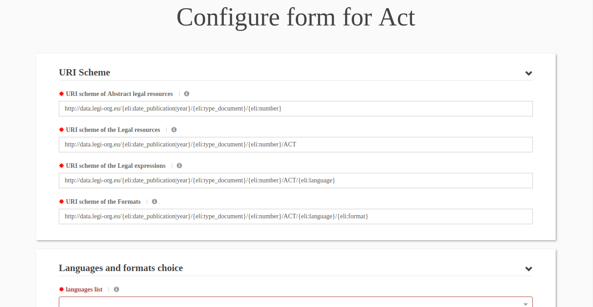

Choosing the languages and formats
----------------------------------

In the ELI standard, a *legal resource* is realized by several *legal
expressions* (one for each language) and each *legal resource* is
embodied by several *formats* (one for each format). It is this
necessary to choose the languages for which the *legal expressions*
will be created and the formats for which the *formats* will be
created. The languages are chosen from the
http://publications.europa.eu/resource/authority/language vocabulary
and the formats from the https://www.iana.org/assignments/media-types
vocabulary, as specified in the ELI standard.

Languages choice
~~~~~~~~~~~~~~~~

When clicking on the *languages list* field, the list of all the
possible values is opened. It is possible to search and click on the
desired language:

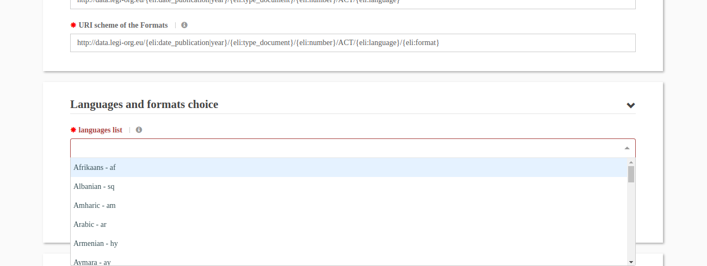

As there are numerous languages, it is also possible to type several
letters of the desired language. The list is now restrained to the
languages that contain the entered text:

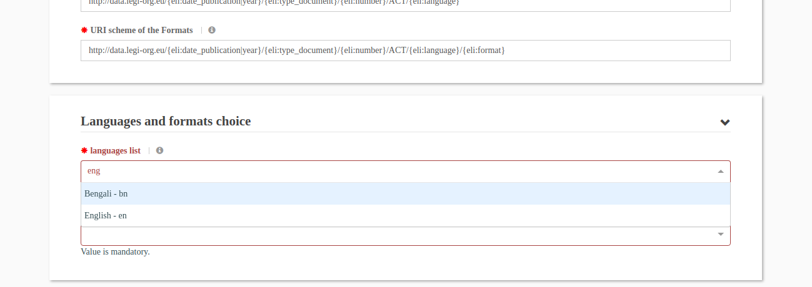

After clicking on the desired language, it is added in the field in a
light blue box. Clicking on the cross inside this box removes this
language. When one language has been added, it is possible to add another
one:

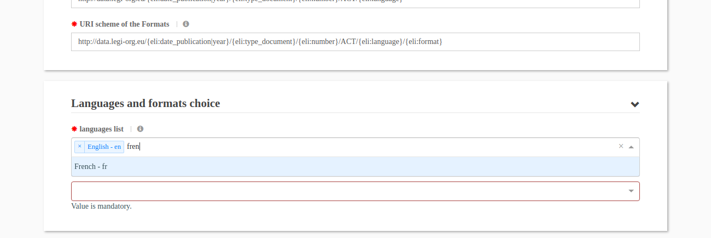

When choosing the languages, in the following form, inside the
"Description and documents" part, tabs are inserted for all the chosen
languages. These tabs contain the ELI properties of the corresponding
*legal expression* entity. It will therefore be possible to configure these
properties.

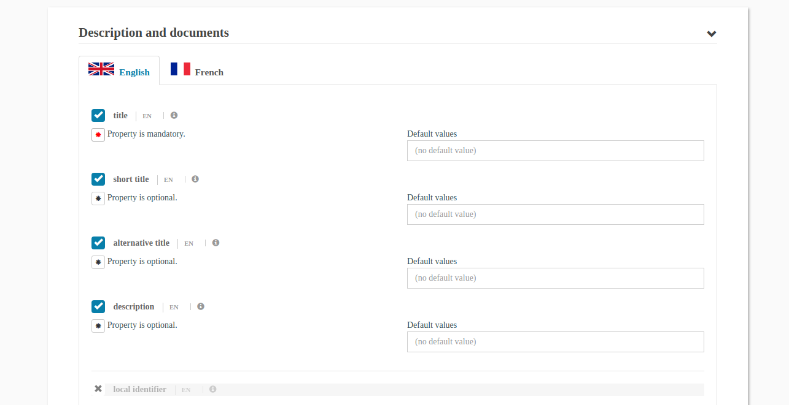

Formats choice
~~~~~~~~~~~~~~

The *formats list* field allows the user to choose the formats. The
behaviour is similar to the choice of the languages:

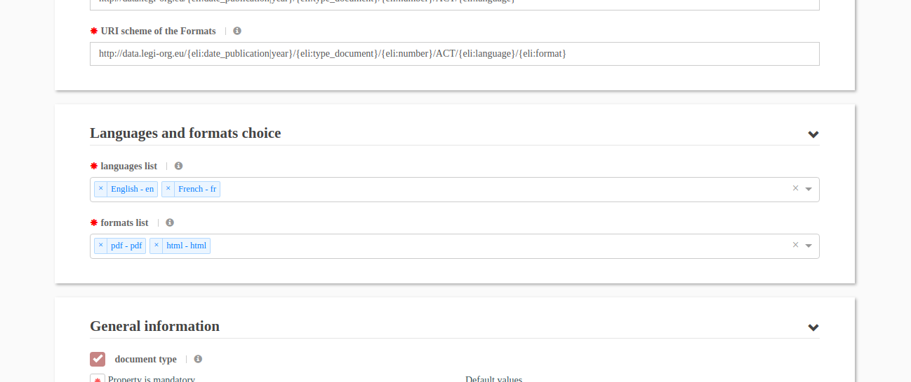

When choosing the formats, in the following form, inside each of the
language tabs of the "Description and documents" part, sections are
inserted for all the chosen formats. These sections contain the ELI
properties of the corresponding *format* entity. It will therefore be
possible to configure these properties.

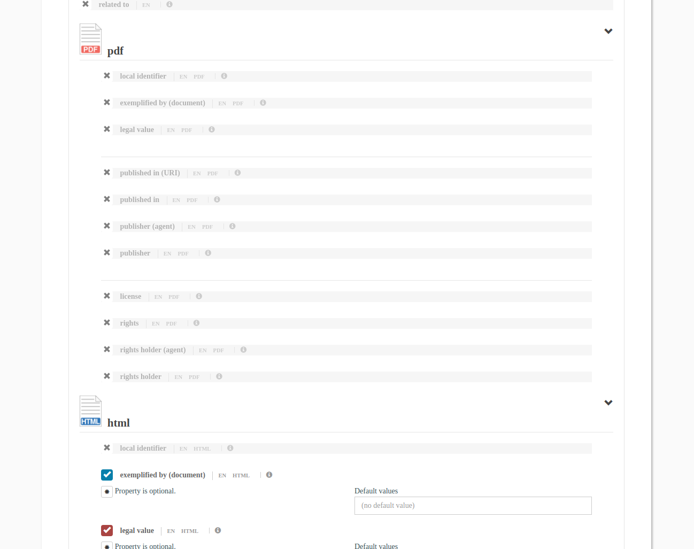

Configuring the properties
--------------------------

After defining the URI schemes and choosing the languages and the
formats, the configuration consists in configuring the ELI properties:

* the ELI properties at the top level, corresponding to the *legal
  resource* entity,
* the ELI properties inside a language tab, corresponding to a *legal
  expression* entity,
* the ELI properties inside a format section into a language tab,
  corresponding to a *format* entity.

The type of an ELI property is given in the ELI ontology. It can be:

* a textual value,
* a date,
* the URI of a SKOS *concept* taken from a controlled vocabulary,
* an URI.

The ELI annotation tool respects the types of the properties specified
in the ELI ontology. Nevertheless, when the type is a *concept* from a
controlled vocabulary, it is still necessary to choose this vocabulary
in order to properly configure the property.

For each property, a form sub-part gathers various elements:

* a button to activate or deactivate the property,
* the title of the property,
* a button to turn the property mandatory (thus at least one value must be
  provided when creating a notice),
* a field to select a vocabulary (when the property relies on a controlled
  vocabulary),
* on the right side, a field to define one or several default value (that can
  nevertheless be edited in the form that creates a notice).

Help message
~~~~~~~~~~~~

A help message can be displayed by clicking on the ``i`` icon (after the
property title). This help message is followed by the technical name of the
corresponding ELI field.

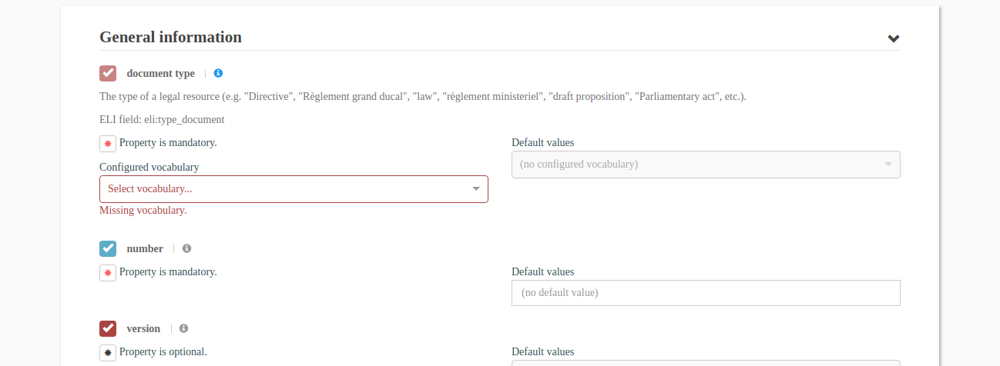

Properties used in the URI schemes
~~~~~~~~~~~~~~~~~~~~~~~~~~~~~~~~~~

When the property is used in the URI schemes (cf. :ref:`uri-schemes`
section), it cannot be deactivated and is always mandatory. Therefore
the corresponding buttons are not active and can't be clicked (cf. the
blue check and the red star buttons of the first two properties in the
following screenshot):

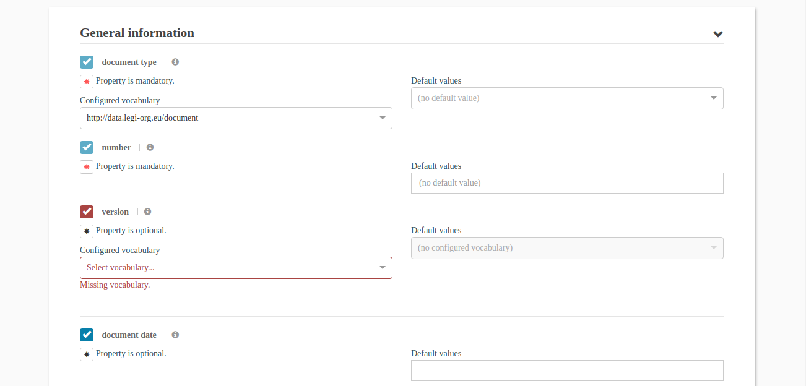

Activation / deactivation
~~~~~~~~~~~~~~~~~~~~~~~~~

A property can be deactivated by clicking on the activation button
(blue check) located before its title. The property is then folded and
greyed; the blue check is replaced by a grey cross. Clicking on the
grey cross re-activates the property.

A deactivated property will not be included in the form that creates
the notices. Therefore no value will ever be defined for this
property.

The following screenshot shows a property that has been deactivated
(the *version* property):

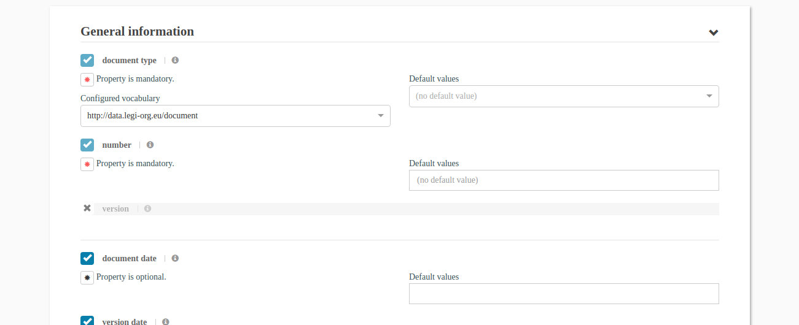

Mandatory / optional
~~~~~~~~~~~~~~~~~~~~

A property can be turned mandatory by clicking on the star button
located below the title. The star is then colorized in red. Clicking
again on the star button turns the property optional.

A mandatory property must be provided at least one value in the form
that creates the notices.

The following screenshot shows a property that has been turned mandatory
(the *in force* property):

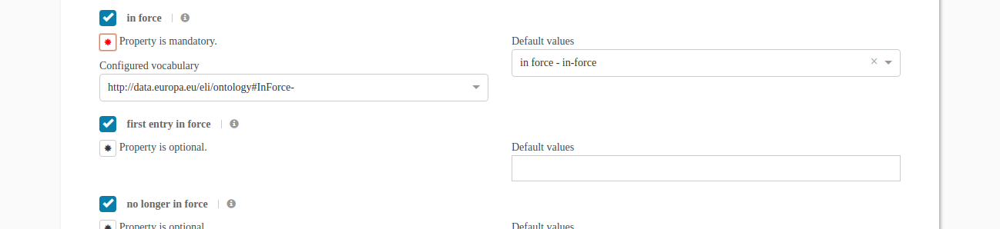

Vocabulary choice
~~~~~~~~~~~~~~~~~

The properties whose values must be taken from a controlled vocabulary
must be associated with one of the vocabulary that has been uploaded
in the tool (cf. :ref:`vocabs-edit` section). For these properties, a
dedicated field is inserted on the left side; it contains the URIs of the
existing vocabularies. While the vocabulary is not chosen, the configuration
of the property is invalid and therefore the property is displayed in red.

In the following screenshot, the user is choosing a vocabulary for the
*document type* property:

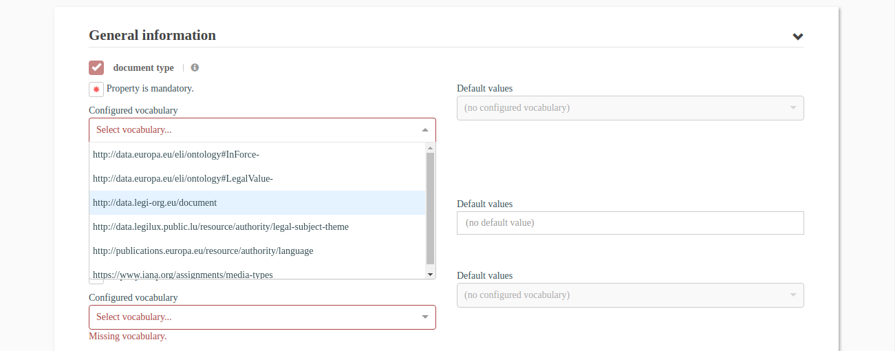

When the vocabulary has been chosen, the property configuration is valid and
it is thus displayed in the regular color. See the *document type* property
in the following screenshot:

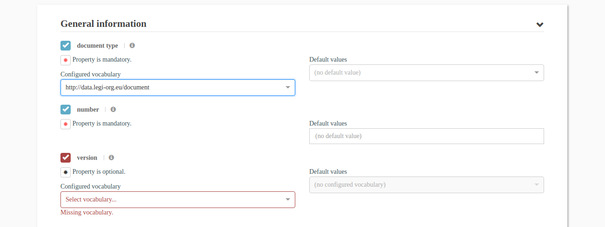

If the property is used in the URI schemes. All the Concepts inside the
chosen vocabulary must have a SKOS *notation*. If this constraint is
not respected, an error is displayed. See the *document type* property
in the following screenshot:

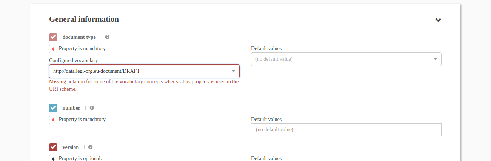

Default values
~~~~~~~~~~~~~~

On the right side, it is possible to define one (or several) default
values for the property. Here for a text property:

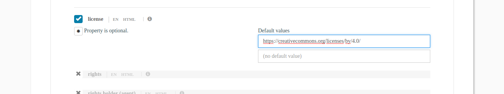

Here for a date property:

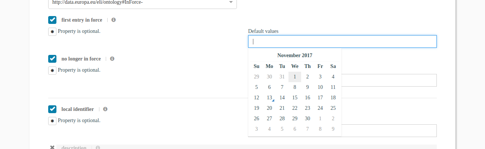

And below for a property whose values are taken from a controlled vocabulary.
Of course, the vocabulary must have been configured for the property before
being able to choose the default values.

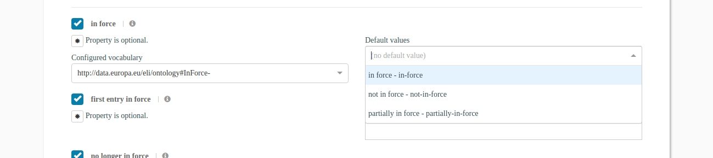
