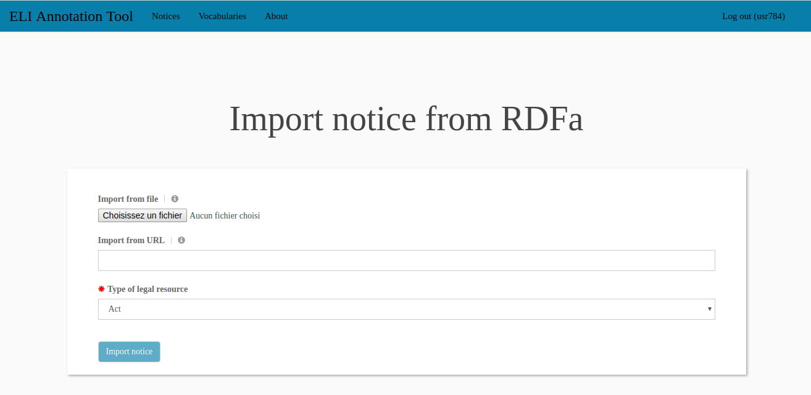
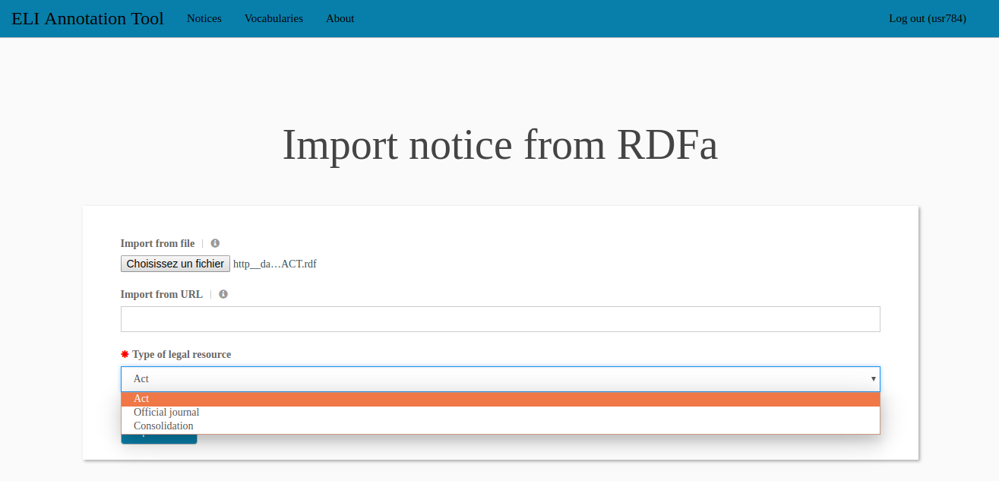
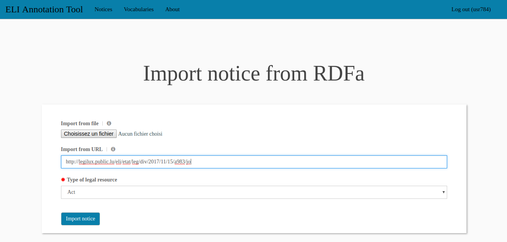
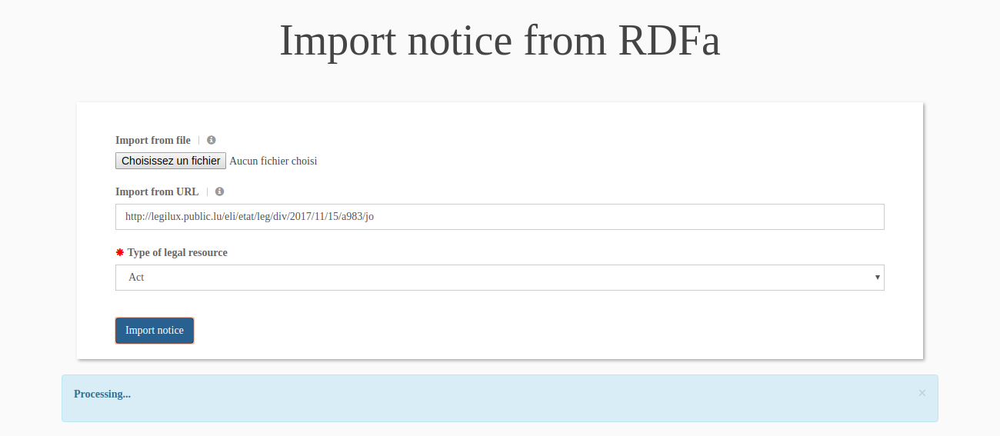
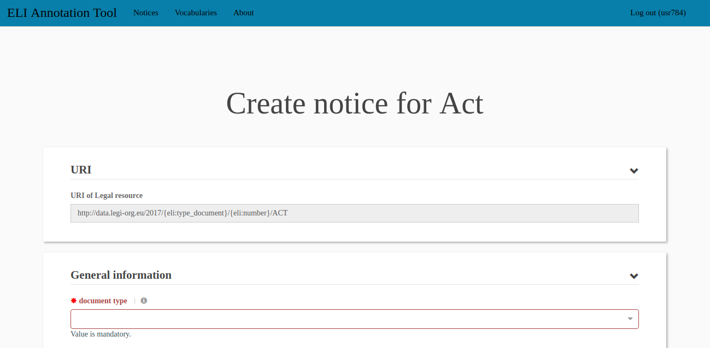

.. -*- coding: utf-8 -*-

.. _notices-import:

Importing notices
=================

This page can be accessed by clicking on the *Import notice from*
button of the notice page. It allows the user to import an existing
notice into the tool. The notices can only be imported from a
description in the ELI standard (with one *legal resource*, several
*legal expressions* and several *formats*). This description must
either in RDF/XML format or in RDF/Turtle format or in RDFa format
embedded inside an HTML page.

As the HTML rendering of the notices produced by the ELI annotation
tool contain a complete RDFa description, it is possible to re-import
in the tool the notices that have been previously generated and
exported.

Please keep in mind that the notices are imported in the context of
one of the forms configured in the tool: some properties are
deactivated (and will be discarded), some properties rely on a
controlled vocabulary (and thus the imported values might be discarded
because they are not in the configured vocabulary).

The page for importing a notice looks like:

It is possible to import either a file (located on the local disk) or
a Web resource downloaded from a URL. In any case, it is necessary to
specify the type of legal resource you want to import: *act*,
*official journal* or *consolidation*.

The following screenshot, shows the import from a file (click on the
*Choose a file* button, choose the file and then select the type of
legal resource):

The following screenshot, shows the import from a URL (enter the URL
address in the *Import from URL* field and then select the type of
legal resource):

The tool uploads the file or downloads the document. Then it processes
it to extract the ELI entities and their properties:

If everything is correct, you are automatically redirected to the
edition page of the notice that you have just imported. You can then
fill the missing fields or correct the imported values. This step is
similar to the edition or creation of a notice (cf. :ref:`notices`
section):

If an error occurs during the import, a message is displayed below the
import form.
