.. -*- coding: utf-8 -*-

.. _notices:

Writing notices
===============

The page related to the notices is the home page of the ELI annotation
tool. First, four buttons allow to:

* create a new notice for an act,
* create a new notice for an official journal,
* create a new notice for a consolidation,
* import an existing notice for a file or an URL (see
  :ref:`notices-import` section).

Please note that **for being able to create a notice** with one of the
previous buttons, **the form must have been properly configured** by a
user with admnistrative rights (cf. :ref:`configuration` section).

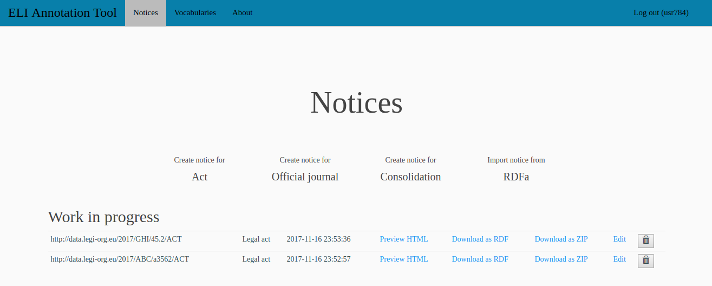

The **Work in progress** section lists, in a table, the notices that
have already been created. The first colum gives the URI of the *legal
resource* generated from the notice, the second column gives the type
of resource (*Act*, *Official journal* or *Consolidation*) and the
third column gives the date and time of the last modification of the
notice.

For each of the notices, four operations are available (cf. links and buttons
in the table):

* ``Preview HTML`` to have a look at the HTML rendering of the notice
  (one HTML page per generated ELI *legal expression* entity and one
  HTML page per generated *format* entity),
* ``Download as RDF`` to download the ELI entities and properties generated
  from the notice, in RDF/XML format,
* ``Download as ZIP`` to download an archive file containing the HTML rendering
  of the notice. Such a file can be used to deploy the notice on an
  external Web server,
* the delete button to delete the vocabulary.

The following sections details the form page for creating a
notice. This page is displayed after clicking on one of the *Create*
buttons on this page.

Notice URI
----------

The form for creating a notice begins with a section displaying the
URI of the *legal resource* that will be created from this
notice. When starting a new creation, the properties in the form still
don't have any value and thus the URI contains the name of the ELI
fields between curly brackets. For example:

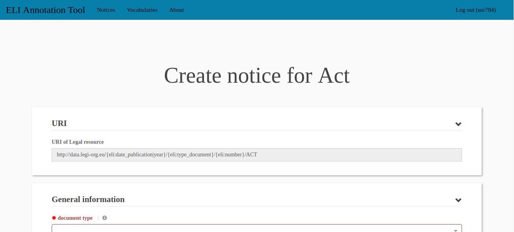

While values are defining for these fields in the following form, the
fields of the URI are replaced by their actual values. Finally, after
all the fields have a value, the URI is properly built. For example:

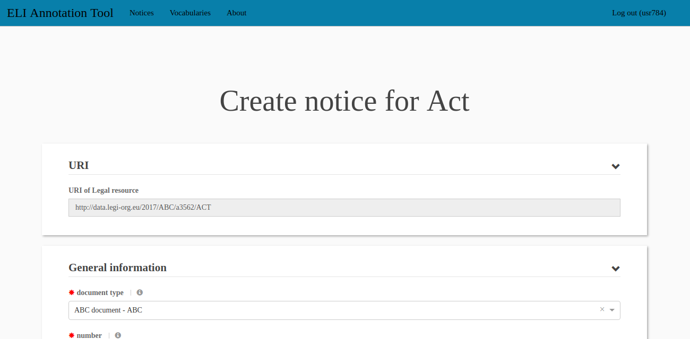

Creation form
-------------

Below the section displaying the URI, begins the form used for
creating or editing a notice. The properties are grouped in four
sections: *General information*, *Domain and context*, *Relationships
with other resources* and *Description and documents*.

This last section contains one tab per chosen language and, in each of
these tabs, properties and sub-sections (one per chosen format). The
sub-sections also contain properties.

Only the properties that have been activated in the form configuration
are displayed in this form.

At the end of the form, a dedicated zone displays the errors messages
(red box) and the warning messages (yellow box). It is impossible to
save the notice until all the errors have been corrected. The error
messages mainly concern: mandatory properties that don't have at least
one value, values that are not syntaxically correct. It is possible to
save the notice even if there are still warnings. The warning messages
mainly concern: URL that have not been reached (and thus might be
incorrect).

The following screenshot shows the error and warning zones:

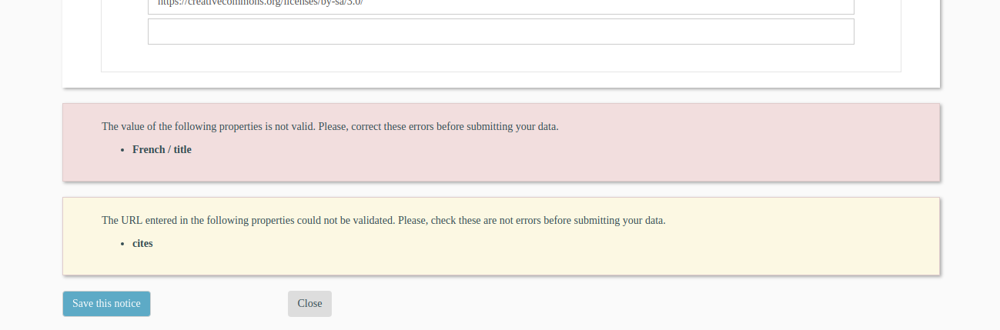

Text property
~~~~~~~~~~~~~

For the properties that contain textual values, a simple field allows
the user to enter the text value. For example:

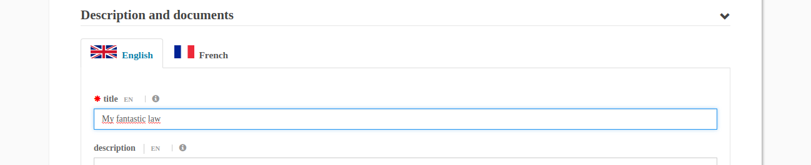

If the property can accept several values, a supplementary field is
automatically added when the first one is filled:

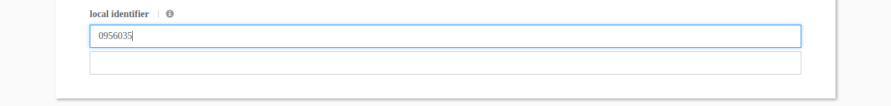

There is no limit to the number of values that can be defined for
these properties, supplementary fields are added when needed. For
example:

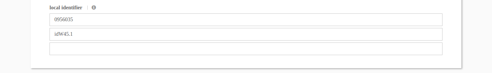

To delete a value, just select it with the mouse and press the ``Del``
key. The supplementary fields are automatically removed or added as
needed.

Date property
~~~~~~~~~~~~~

For the properties that contain date values, a field allows the user
to enter the date. This field automatically displays a calendar. The
calendar shows the current month and it is possible to move one month
backward or forward thanks to the arrows on each side of the month
name at the top of the calendar.

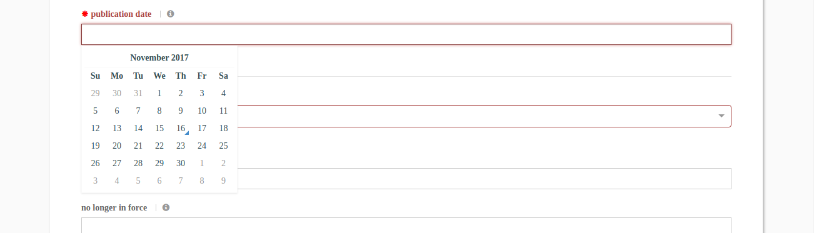

Clicking on one of the month days automatically fills the field with
the corresponding date:

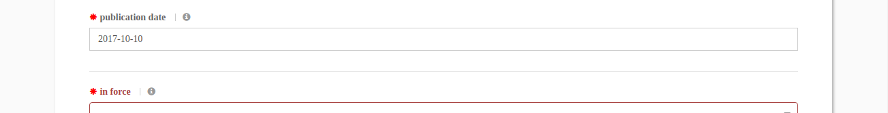

If you click on the month name at the top of the calendar, the
calendar shows the corresponding year and lists all the
months. Clicking on one month goes back to the previous view. The
arrows on each side of the year number at the top of the calendar move
one year backward or forward. If you click on the year, the calendar
shows the decade and lists all years of the decade. Clicking on one of
the years goes back to the "year" view; clicking on the arrows moves
one decade backward or forward.

The following screenshot shows the "year" view of the calendar:

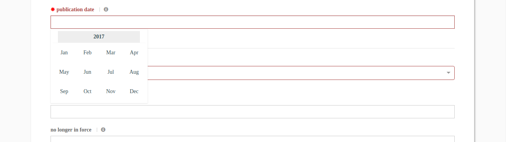

It is always possible to directly type the date in the field. Remember
the date must be given in the ``YYYY-MM-DD`` format
(e.g. ``2017-10-23``). For example:

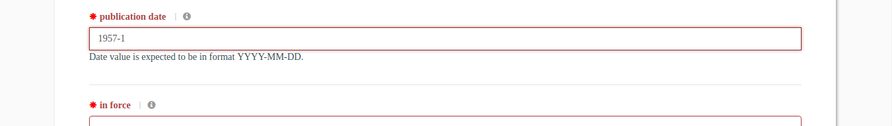

Property containing an URL
~~~~~~~~~~~~~~~~~~~~~~~~~~

Some of the properties are expected to contain a URL. These properties
are similar to the text properties except the tool tries to reach the
entered URL. A message is displayed explaining if the URL could be
reached on the Web:

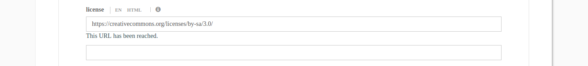

Or if the URL could not be reached on the Web:

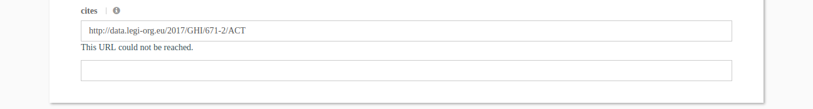

Please note that some URL might be correct even if they cannot be
reached on the Web. Moreover, if there is a problem with the Internet
access, no URL will be reached.

Property selecting a value from a vocabulary
~~~~~~~~~~~~~~~~~~~~~~~~~~~~~~~~~~~~~~~~~~~~

For the properties that contain values taken from a controlled
vocabulary, a field allows the user to choose the value from the list
of all the *Concepts* defined in the configured SKOS
vocabulary. Simply click on the chosen value. For example:

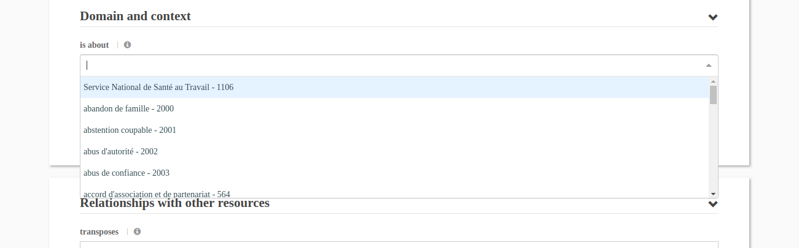

If the vocabulary contains numerous values, it is possible to type a
few characters in the field. The tool will then filter the values on
these characters and display only the matching values. For example:

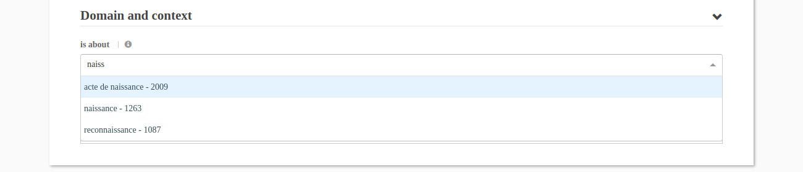

If the property only accepts one value, the chosen value is displayed
in the field. It is possible to delete the value by selecting the
field and typing the ``del`` key. The following screenshot shows a
value chosen for the *document type* property:

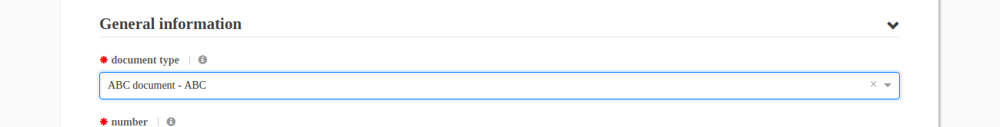

If the property accepts multiple values, the chosen value is displayed
in a little blue box inside the field. The grey cross in the blue box
can be used to delete the value. It is also possible to select the
blue box and type on the ``del`` key. The following screenshot shows
one value chosen for the *is about* property (note that the field is
ready for the selection of another value):

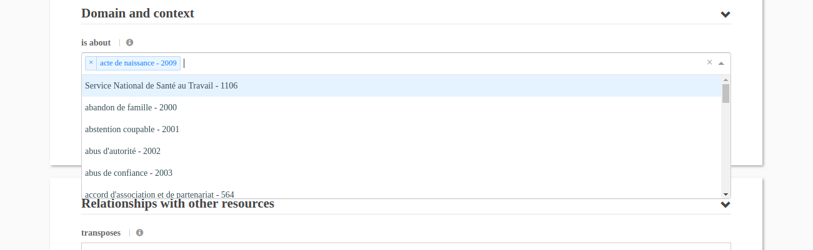

Even if values have been selected, it is still possible to select a
new value either by directly choosing it in the list or by typing
characters to filter the values before choosing it:

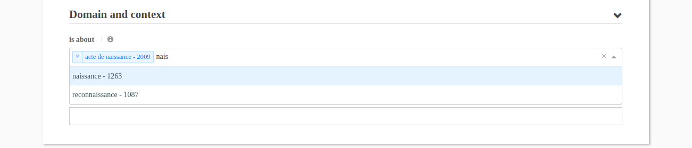

The following screenshot shows two values chosen for the *is about*
property:

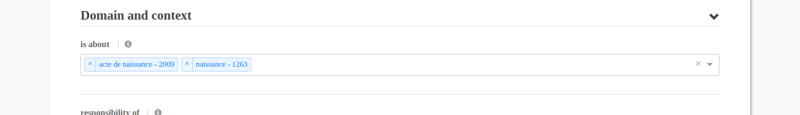
