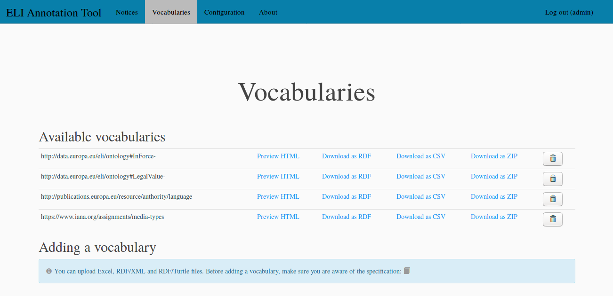
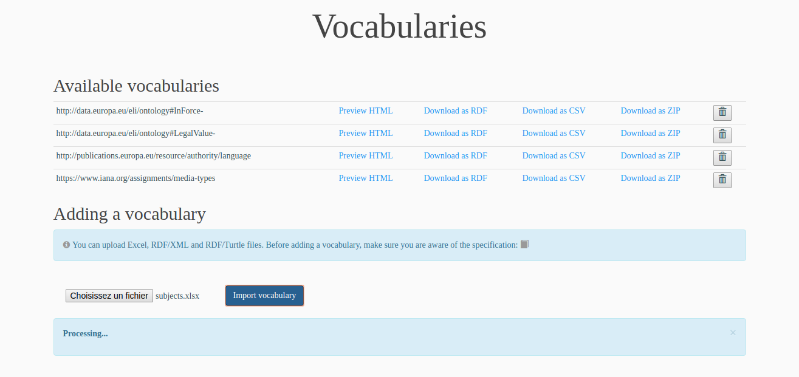
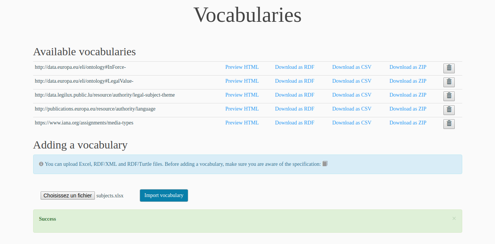
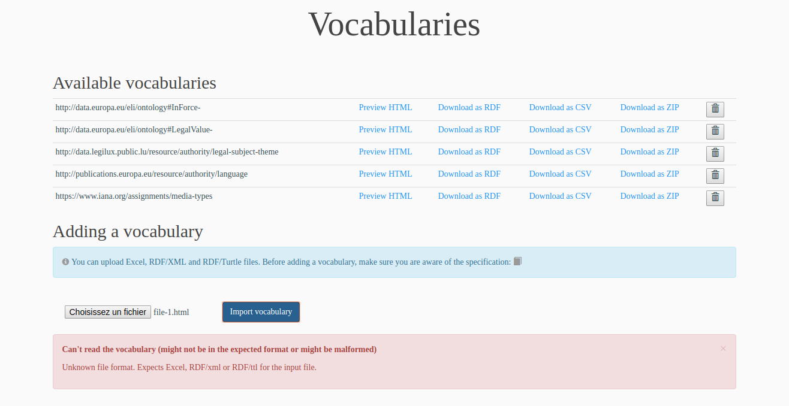
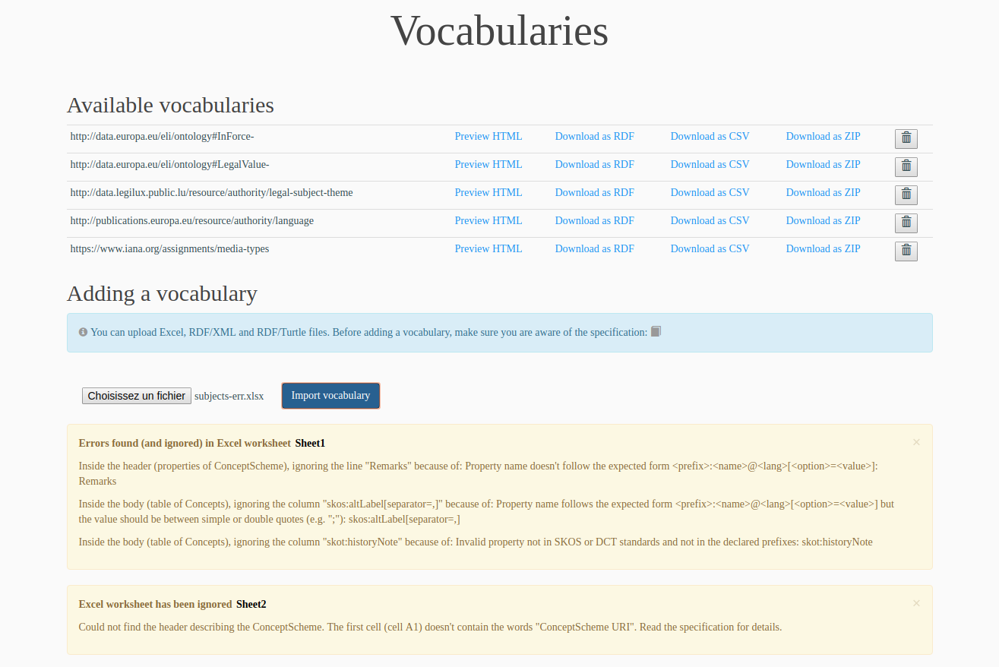

.. -*- coding: utf-8 -*-

.. _vocabs-edit:

Importing vocabularies
======================

Only a user with administrative rights can import or delete a
vocabulary.  For the user with administrative rights, the
*Vocabularies* page looks like:

The **Available vocabularies section** contains all the vocabularies that
have been uploaded in the tool and that can be used to configure the ELI
properties that need a controlled vocabulary (see :ref:`configuration`
section). The vocabularies are described thanks to the SKOS standard. Four
vocabularies are pre-loaded in the ELI annotation tool:

* the http://publications.europa.eu/resource/authority/language vocabulary
  that describes the languages of the ELI *legal expression* entities,
* the https://www.iana.org/assignments/media-types vocabulary that describes
  the formats of the ELI *format* entities,
* the http://data.europa.eu/eli/ontology#InForce- vocabulary that describes
  the values of the ELI *in-force* property,
* the http://data.europa.eu/eli/ontology#LegalValue- vocabulary that describes
  the values of the ELI *legal-value* property.

If needed, it is possible to download these vocabularies, edit them and
re-import them. Such an operation is usually done to add localized titles
to the SKOS *concepts* into a new language.

Please note that all the *concepts* of the languages and the formats
vocabularies must have a SKOS *notation*. For the languages, this notation
must be the two-letters code of the language (e.g. ``en`` for English).

For each of the vocabularies, five operations are available (cf. links and
buttons in the table):

* ``Preview HTML`` to have a look at the HTML rendering of the vocabulary
  (one HTML page per configured language),
* ``Download as RDF`` to download the vocabulary in RDF/XML format,
* ``Download as CSV`` to download the vocabulary in CSV format (that can
  be imported into Excel)
* ``Download as ZIP`` to download an archive file containing the HTML rendering
  of the vocabulary. Such a file can be used to deploy the vocabulary on an
  external Web server, and finally
* the delete button to delete the vocabulary.

The **Adding a vocabulary section** contains the form that can be used to
upload a vocabulary in the ELI annotation tool. It is possible to import:

* vocabularies in SKOS standard in RDF/XML or RDF/Turtle format,
* vocabularies described in Excel files.

The description of a vocabulary in an Excel file must follow precise
specifications that are described in the :ref:`excel-vocab-specif`
section.

Click on the ``Choose a file`` button and select the vocabulary file
you want to upload. Then, click the ``Import vocabulary`` button to
upload the file on the server and import the vocabulary. This
operation can take a long time for the big vocabularies. The following
screenshot shows a file that is currently processed for import:

After the vocabulary has been imported, a success message is displayed
and the new vocabulary is added in the *Available vocabularies*
table. The new vocabulary is available in the various formats: HTML
rendering, RDF, CSV and ZIP.

Please note that for the vocabularies that will be chosen to configure
ELI properties used in the URI schemes (cf. :ref:`uri-schemes`
section), all the *concepts* must have a SKOS *notation* as the
notation is used to build the URIs.

If the vocabulary contains fatal errors, a message is displayed and
explains the problem:

When importing a vocabulary from an Excel file, the conversion can
cause little errors that don't block the process. A message is
displayed at the end and reports all the problems. Thus, the user can
read this report and correct the vocabulary file before re-importing
it:

