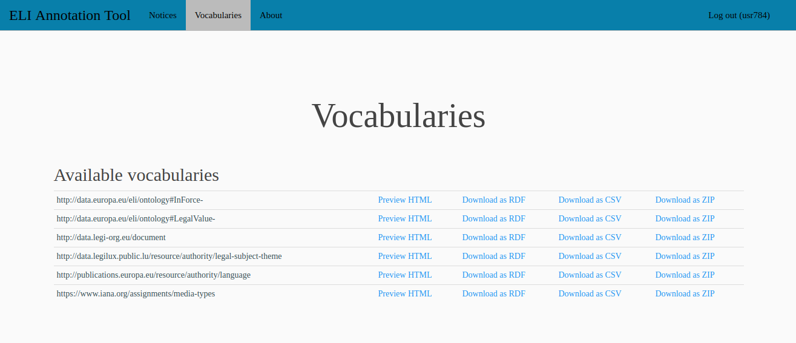

.. -*- coding: utf-8 -*-

.. _vocabs:

Visualizing vocabularies
========================

For the regular user (without administrative rights), the
*Vocabularies* page looks like:

The **Available vocabularies section** contains all the vocabularies
that have been uploaded in the tool. They might be used in some of the
ELI properties whose value must be taken from a controlled vocabulary
(it depends on how the forms for creating the notices have been
configured).

For each of the vocabularies, four operations are available (cf. links
in the table):

* ``Preview HTML`` to have a look at the HTML rendering of the vocabulary
  (one HTML page per configured language),
* ``Download as RDF`` to download the vocabulary in RDF/XML format,
* ``Download as CSV`` to download the vocabulary in CSV format (that can
  be imported into Excel)
* ``Download as ZIP`` to download an archive file containing the HTML rendering
  of the vocabulary. Such a file can be used to deploy the vocabulary on an
  external Web server.
