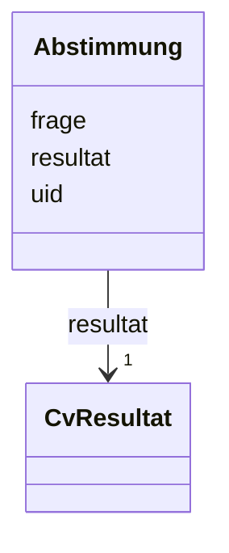

# Class: Abstimmung


URI: [chpaf:Abstimmung](https://ch.paf.link/Abstimmung)





<!-- no inheritance hierarchy -->


## Slots

| Name | Cardinality and Range | Description | Inheritance |
| ---  | --- | --- | --- |
| [uid](uid.md) | 1 <br/> [String](String.md) |  | direct |
| [frage](frage.md) | 1 <br/> [String](String.md) |  | direct |
| [resultat](resultat.md) | 1 <br/> [CvResultat](CvResultat.md) |  | direct |


## Usages

| used by | used in | type | used |
| ---  | --- | --- | --- |
| [Traktandum](Traktandum.md) | [abstimmungen](abstimmungen.md) | range | [Abstimmung](Abstimmung.md) |


## Identifier and Mapping Information


### Schema Source


* from schema: https://ch.paf.link/schema/session


## Mappings

| Mapping Type | Mapped Value |
| ---  | ---  |
| self | chpaf:Abstimmung |
| native | chpaf:Abstimmung |


## LinkML Source

<!-- TODO: investigate https://stackoverflow.com/questions/37606292/how-to-create-tabbed-code-blocks-in-mkdocs-or-sphinx -->

### Direct

<details>
```yaml
name: Abstimmung
from_schema: https://ch.paf.link/schema/session
slots:
- uid
- frage
- resultat
class_uri: chpaf:Abstimmung

```
</details>

### Induced

<details>
```yaml
name: Abstimmung
from_schema: https://ch.paf.link/schema/session
attributes:
  uid:
    name: uid
    from_schema: https://ch.paf.link/schema/session
    rank: 1000
    identifier: true
    alias: uid
    owner: Abstimmung
    domain_of:
    - Session
    - Traktandum
    - Abstimmung
    range: string
    required: true
  frage:
    name: frage
    from_schema: https://ch.paf.link/schema/session
    rank: 1000
    slot_uri: chpaf:frage
    alias: frage
    owner: Abstimmung
    domain_of:
    - Abstimmung
    range: string
    required: true
  resultat:
    name: resultat
    from_schema: https://ch.paf.link/schema/session
    rank: 1000
    slot_uri: chpaf:resultat
    alias: resultat
    owner: Abstimmung
    domain_of:
    - Abstimmung
    range: cv_resultat
    required: true
class_uri: chpaf:Abstimmung

```
</details>