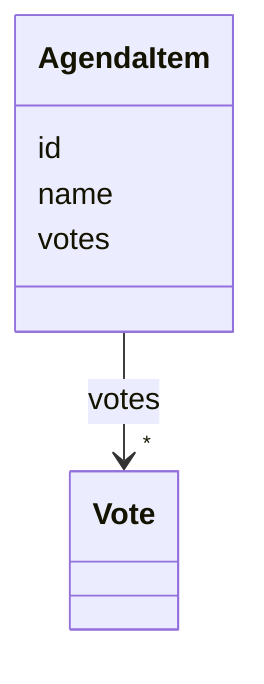

# Class: AgendaItem 


URI: [chpaf:AgendaItem](https://ch.paf.link/AgendaItem)





<!-- no inheritance hierarchy -->


## Slots

| Name | Cardinality and Range | Description | Inheritance |
| ---  | --- | --- | --- |
| [id](id.md) | 1 <br/> [String](String.md) |  | direct |
| [name](name.md) | 1 <br/> [String](String.md) |  | direct |
| [votes](votes.md) | * <br/> [Vote](Vote.md) |  | direct |


## Usages

| used by | used in | type | used |
| ---  | --- | --- | --- |
| [Session](Session.md) | [agendaItems](agendaItems.md) | range | [AgendaItem](AgendaItem.md) |


## Identifier and Mapping Information


### Schema Source


* from schema: https://ch.paf.link/schema/session


## Mappings

| Mapping Type | Mapped Value |
| ---  | ---  |
| self | chpaf:AgendaItem |
| native | chpaf:AgendaItem |


## LinkML Source

<!-- TODO: investigate https://stackoverflow.com/questions/37606292/how-to-create-tabbed-code-blocks-in-mkdocs-or-sphinx -->

### Direct

<details>
```yaml
name: AgendaItem
from_schema: https://ch.paf.link/schema/session
slots:
- id
- name
- votes

```
</details>

### Induced

<details>
```yaml
name: AgendaItem
from_schema: https://ch.paf.link/schema/session
attributes:
  id:
    name: id
    from_schema: https://ch.paf.link/schema/session
    rank: 1000
    identifier: true
    alias: id
    owner: AgendaItem
    domain_of:
    - Session
    - AgendaItem
    - Vote
    - Container
    range: string
    required: true
  name:
    name: name
    from_schema: https://ch.paf.link/schema/session
    rank: 1000
    slot_uri: dcterm:title
    alias: name
    owner: AgendaItem
    domain_of:
    - Session
    - AgendaItem
    range: string
    required: true
  votes:
    name: votes
    from_schema: https://ch.paf.link/schema/session
    rank: 1000
    slot_uri: chpaf:vote
    alias: votes
    owner: AgendaItem
    domain_of:
    - AgendaItem
    range: Vote
    multivalued: true
    inlined: true
    inlined_as_list: true

```
</details>