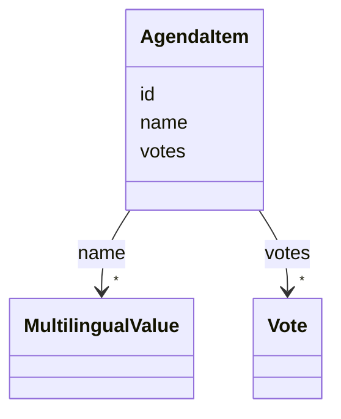

---
search:
  boost: 10.0
---

# Class: AgendaItem 

<div data-search-exclude markdown="1">


URI: [tutorial:AgendaItem](https://ch.paf.link/schema/tutorial/AgendaItem)



```mermaid
 classDiagram
    class AgendaItem
    click AgendaItem href "../AgendaItem/"
      AgendaItem : id
        
      AgendaItem : name
        
          
    
        
        
        AgendaItem --> "*" MultilingualValue : name
        click MultilingualValue href "../MultilingualValue/"
    

        
      AgendaItem : votes
        
          
    
        
        
        AgendaItem --> "*" Vote : votes
        click Vote href "../Vote/"
    

        
      
```


<!-- no inheritance hierarchy -->

## Slots

| Name | Cardinality and Range | Description | Inheritance |
| ---  | --- | --- | --- |
| [id](id.md) | 1 <br/> [String](String.md) |  | direct |
| [name](name.md) | * <br/> [MultilingualValue](MultilingualValue.md) |  | direct |
| [votes](votes.md) | * <br/> [Vote](Vote.md) |  | direct |


## Usages

| used by | used in | type | used |
| ---  | --- | --- | --- |
| [Session](Session.md) | [agenda_items](agenda_items.md) | range | [AgendaItem](AgendaItem.md) |
| [Vote](Vote.md) | [is_part_of_agenda_item](is_part_of_agenda_item.md) | range | [AgendaItem](AgendaItem.md) |
| [Container](Container.md) | [agenda_items](agenda_items.md) | range | [AgendaItem](AgendaItem.md) |


## Identifier and Mapping Information


### Schema Source


* from schema: https://ch.paf.link/schema/tutorial


## Mappings

| Mapping Type | Mapped Value |
| ---  | ---  |
| self | tutorial:AgendaItem |
| native | tutorial:AgendaItem |


## Examples
### Example: AgendaItem-hierarchical__en__en

```yaml
id: tutorial:s2025-2_t1
name:
- value: Landeshymne
  language: de
- value: National Anthem
  language: en
votes:
- id: tutorial:s2025-2_t1_a1
  question: Soll die Hymne geändert werden?
  datetime_actual: '2025-06-15T10:00:00+01:00'
  result: 'no'

```
### Example: AgendaItem-flat__de

```yaml
id: tutorial:s2025-2_t1
name:
- value: Landeshymne
  language: de

```


## LinkML Source

<!-- TODO: investigate https://stackoverflow.com/questions/37606292/how-to-create-tabbed-code-blocks-in-mkdocs-or-sphinx -->

### Direct

<details>
```yaml
name: AgendaItem
from_schema: https://ch.paf.link/schema/tutorial
slots:
- id
- name
- votes

```
</details>

### Induced

<details>
```yaml
name: AgendaItem
from_schema: https://ch.paf.link/schema/tutorial
attributes:
  id:
    name: id
    examples:
    - value: tutorial:s2025
    - value: tutorial:s2025-1
    - value: tutorial:s2025-1_t1
    from_schema: https://ch.paf.link/schema/tutorial
    rank: 1000
    identifier: true
    owner: AgendaItem
    domain_of:
    - Session
    - AgendaItem
    - Vote
    - Container
    range: string
    required: true
  name:
    name: name
    from_schema: https://ch.paf.link/schema/tutorial
    rank: 1000
    slot_uri: schema:name
    owner: AgendaItem
    domain_of:
    - Session
    - AgendaItem
    range: MultilingualValue
    multivalued: true
    inlined: true
    inlined_as_list: true
  votes:
    name: votes
    from_schema: https://ch.paf.link/schema/tutorial
    rank: 1000
    slot_uri: tutorial:vote
    owner: AgendaItem
    domain_of:
    - AgendaItem
    - Container
    range: Vote
    multivalued: true
    inlined: true
    inlined_as_list: true

```
</details></div>