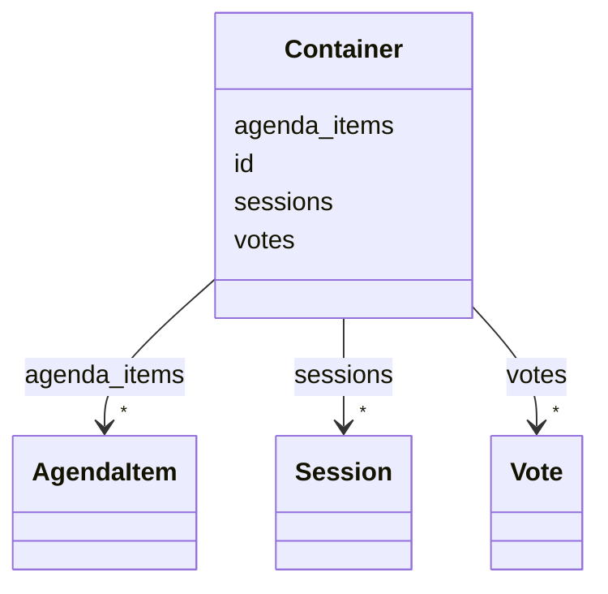

# Class: Container 


URI: [tutorial:Container](https://ch.paf.link/schema/tutorial/Container)





<!-- no inheritance hierarchy -->


## Slots

| Name | Cardinality and Range | Description | Inheritance |
| ---  | --- | --- | --- |
| [id](id.md) | 1 <br/> [String](String.md) |  | direct |
| [sessions](sessions.md) | * <br/> [Session](Session.md) |  | direct |
| [agenda_items](agenda_items.md) | * <br/> [AgendaItem](AgendaItem.md) |  | direct |
| [votes](votes.md) | * <br/> [Vote](Vote.md) |  | direct |


## Identifier and Mapping Information


### Schema Source


* from schema: https://ch.paf.link/schema/tutorial


## Mappings

| Mapping Type | Mapped Value |
| ---  | ---  |
| self | tutorial:Container |
| native | tutorial:Container |


## LinkML Source

<!-- TODO: investigate https://stackoverflow.com/questions/37606292/how-to-create-tabbed-code-blocks-in-mkdocs-or-sphinx -->

### Direct

<details>
```yaml
name: Container
from_schema: https://ch.paf.link/schema/tutorial
slots:
- id
- sessions
- agenda_items
- votes
tree_root: true

```
</details>

### Induced

<details>
```yaml
name: Container
from_schema: https://ch.paf.link/schema/tutorial
attributes:
  id:
    name: id
    from_schema: https://ch.paf.link/schema/tutorial
    rank: 1000
    identifier: true
    alias: id
    owner: Container
    domain_of:
    - Session
    - AgendaItem
    - Vote
    - Container
    range: string
    required: true
  sessions:
    name: sessions
    from_schema: https://ch.paf.link/schema/tutorial
    rank: 1000
    slot_uri: tutorial:session
    alias: sessions
    owner: Container
    domain_of:
    - Container
    range: Session
    multivalued: true
    inlined: true
    inlined_as_list: true
  agenda_items:
    name: agenda_items
    from_schema: https://ch.paf.link/schema/tutorial
    rank: 1000
    slot_uri: tutorial:agendaItem
    alias: agenda_items
    owner: Container
    domain_of:
    - Session
    - Container
    range: AgendaItem
    multivalued: true
    inlined: true
    inlined_as_list: true
  votes:
    name: votes
    from_schema: https://ch.paf.link/schema/tutorial
    rank: 1000
    slot_uri: tutorial:vote
    alias: votes
    owner: Container
    domain_of:
    - AgendaItem
    - Container
    range: Vote
    multivalued: true
    inlined: true
    inlined_as_list: true
tree_root: true

```
</details>