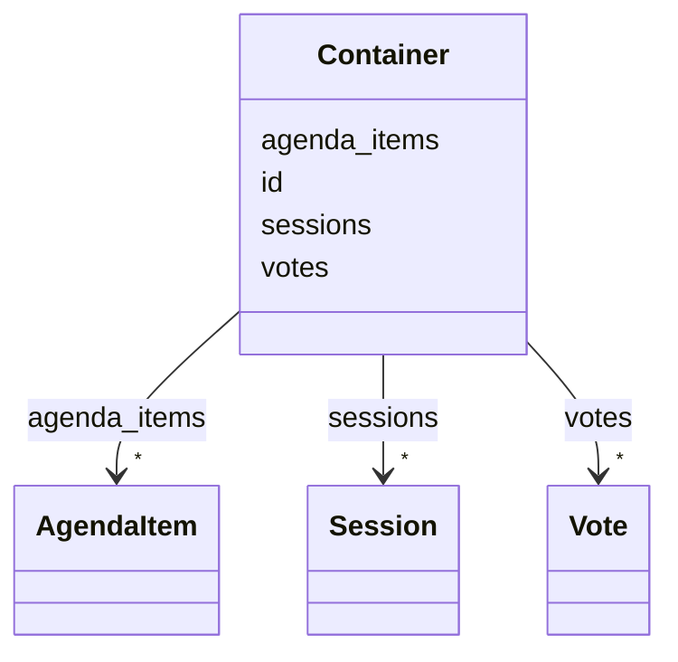

---
search:
  boost: 10.0
---

# Class: Container 

<div data-search-exclude markdown="1">


URI: [tutorial:Container](https://ch.paf.link/schema/tutorial/Container)



```mermaid
 classDiagram
    class Container
    click Container href "../Container/"
      Container : agenda_items
        
          
    
        
        
        Container --> "*" AgendaItem : agenda_items
        click AgendaItem href "../AgendaItem/"
    

        
      Container : id
        
      Container : sessions
        
          
    
        
        
        Container --> "*" Session : sessions
        click Session href "../Session/"
    

        
      Container : votes
        
          
    
        
        
        Container --> "*" Vote : votes
        click Vote href "../Vote/"
    

        
      
```


<!-- no inheritance hierarchy -->

## Class Properties

| Property | Value |
| --- | --- |
| Tree Root | Yes |


## Slots

| Name | Cardinality and Range | Description | Inheritance |
| ---  | --- | --- | --- |
| [id](id.md) | 1 <br/> [String](String.md) |  | direct |
| [sessions](sessions.md) | * <br/> [Session](Session.md) |  | direct |
| [agenda_items](agenda_items.md) | * <br/> [AgendaItem](AgendaItem.md) |  | direct |
| [votes](votes.md) | * <br/> [Vote](Vote.md) |  | direct |


## Identifier and Mapping Information


### Schema Source


* from schema: https://ch.paf.link/schema/tutorial


## Mappings

| Mapping Type | Mapped Value |
| ---  | ---  |
| self | tutorial:Container |
| native | tutorial:Container |


## Examples
### Example: Container-hierarchical

```yaml
id: tutorial:s2025
sessions:
  - id: tutorial:s2025-1
    date_begin_actual: "2025-03-01"
    date_end_actual: "2025-04-10"
    name: 
      - value: Frühlingssession 2025
        language: de
      - value: Spring Session 2025
        language: en
    agenda_items:
      - id: tutorial:s2025-1_t1
        name:
          - value: Fahnenfarbe
            language: de
          - value: Flag Color
            language: en
        votes:
          - id: tutorial:s2025-1_t1_a1
            question: Soll die Farbe geändert werden?
            datetime_actual: "2025-03-15T10:00:00Z"
            result: "yes"
          - id: tutorial:s2025-1_t1_a2
            question: Soll die Farbe Auberginen-Oliv werden?
            datetime_actual: "2025-03-16T10:00:00Z"
            result: "no"
  - id: tutorial:s2025-2
    date_begin_actual: "2025-06-01"
    date_end_actual: "2025-07-10"
    name: 
      - value: Sommersession 2025
        language: de
      - value: Summer Session 2025
        language: en
    agenda_items:
      - id: tutorial:s2025-2_t1
        name: 
          - value: Landeshymne
            language: de
          - value: National Anthem
            language: en
        votes:
          - id: tutorial:s2025-2_t1_a1
            question: Soll die Hymne geändert werden?
            datetime_actual: "2025-06-15T10:00:00+01:00"
            result: "no"
```
### Example: Container-flat

```yaml
id: tutorial:s2025
sessions: 
  - id: tutorial:s2025-1
    date_begin_actual: 2025-03-01
    date_end_actual: 2025-04-10
    name: 
      - value: Frühlingssession 2025
        language: de
      - value: Spring Session 2025
        language: en
  - id: tutorial:s2025-2
    date_begin_actual: 2025-06-01
    date_end_actual: 2025-07-10
    name: 
      - value: Sommersession 2025
        language: de
      - value: Summer Session 2025
        language: en
agenda_items:
  - id: tutorial:s2025-1_t1
    name:
      - value: Fahnenfarbe
        language: de
  - id: tutorial:s2025-2_t1
    name: 
      - value: Landeshymne
        language: de
votes:
  - id: tutorial:s2025-1_t1_a1
    is_part_of_agenda_item: tutorial:s2025-1_t1
    is_part_of: tutorial:s2025-1_t1
    question: Soll die Farbe geändert werden?
  - id: tutorial:s2025-1_t1_a2
    is_part_of_agenda_item: tutorial:s2025-1_t1
    is_part_of: tutorial:s2025-1_t1
    question: Soll die Farbe Auberginen-Oliv werden?
  - id: tutorial:s2025-2_t1_a1
    is_part_of_agenda_item: tutorial:s2025-2_t1
    is_part_of: tutorial:s2025-2_t1
    question: Soll die Hymne geändert werden?
```


## LinkML Source

<!-- TODO: investigate https://stackoverflow.com/questions/37606292/how-to-create-tabbed-code-blocks-in-mkdocs-or-sphinx -->

### Direct

<details>
```yaml
name: Container
from_schema: https://ch.paf.link/schema/tutorial
slots:
- id
- sessions
- agenda_items
- votes
tree_root: true

```
</details>

### Induced

<details>
```yaml
name: Container
from_schema: https://ch.paf.link/schema/tutorial
attributes:
  id:
    name: id
    examples:
    - value: tutorial:s2025
    - value: tutorial:s2025-1
    - value: tutorial:s2025-1_t1
    from_schema: https://ch.paf.link/schema/tutorial
    rank: 1000
    identifier: true
    owner: Container
    domain_of:
    - Session
    - AgendaItem
    - Vote
    - Container
    range: string
    required: true
  sessions:
    name: sessions
    from_schema: https://ch.paf.link/schema/tutorial
    rank: 1000
    slot_uri: tutorial:session
    owner: Container
    domain_of:
    - Container
    range: Session
    multivalued: true
    inlined: true
    inlined_as_list: true
  agenda_items:
    name: agenda_items
    from_schema: https://ch.paf.link/schema/tutorial
    rank: 1000
    slot_uri: tutorial:agendaItem
    owner: Container
    domain_of:
    - Session
    - Container
    range: AgendaItem
    multivalued: true
    inlined: true
    inlined_as_list: true
  votes:
    name: votes
    from_schema: https://ch.paf.link/schema/tutorial
    rank: 1000
    slot_uri: tutorial:vote
    owner: Container
    domain_of:
    - AgendaItem
    - Container
    range: Vote
    multivalued: true
    inlined: true
    inlined_as_list: true
tree_root: true

```
</details></div>