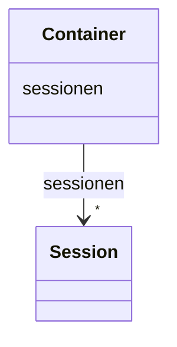

# Class: Container


URI: [chpaf:Container](https://ch.paf.link/Container)





<!-- no inheritance hierarchy -->


## Slots

| Name | Cardinality and Range | Description | Inheritance |
| ---  | --- | --- | --- |
| [sessionen](sessionen.md) | * <br/> [Session](Session.md) |  | direct |


## Identifier and Mapping Information


### Schema Source


* from schema: https://ch.paf.link/schema/session


## Mappings

| Mapping Type | Mapped Value |
| ---  | ---  |
| self | chpaf:Container |
| native | chpaf:Container |


## LinkML Source

<!-- TODO: investigate https://stackoverflow.com/questions/37606292/how-to-create-tabbed-code-blocks-in-mkdocs-or-sphinx -->

### Direct

<details>
```yaml
name: Container
from_schema: https://ch.paf.link/schema/session
attributes:
  sessionen:
    name: sessionen
    from_schema: https://ch.paf.link/schema/session
    rank: 1000
    domain_of:
    - Container
    range: Session
    multivalued: true
    inlined: true
    inlined_as_list: true
tree_root: true

```
</details>

### Induced

<details>
```yaml
name: Container
from_schema: https://ch.paf.link/schema/session
attributes:
  sessionen:
    name: sessionen
    from_schema: https://ch.paf.link/schema/session
    rank: 1000
    alias: sessionen
    owner: Container
    domain_of:
    - Container
    range: Session
    multivalued: true
    inlined: true
    inlined_as_list: true
tree_root: true

```
</details>