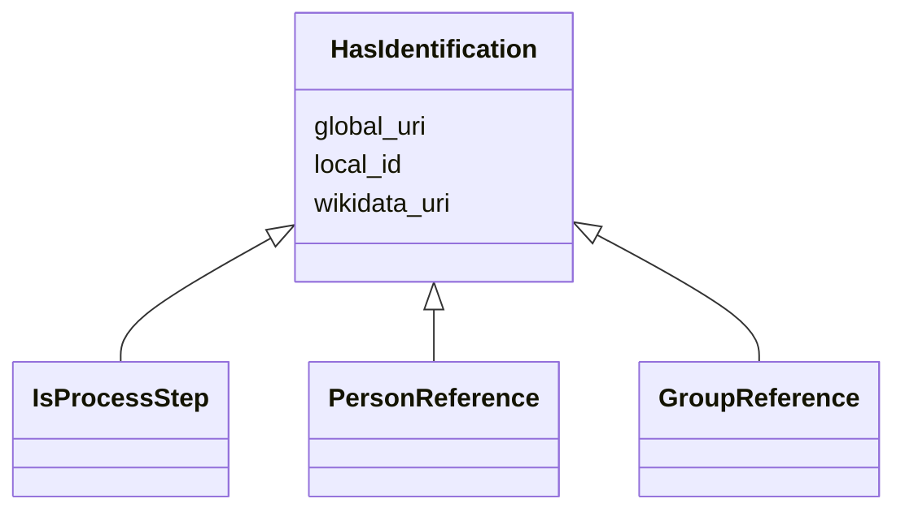

---
search:
  boost: 10.0
---

# Class: HasIdentification 


_A mixin class that provides slots for the identification of an entity._

__


<div data-search-exclude markdown="1">


URI: [tutorial:HasIdentification](https://ch.paf.link/schema/tutorial/HasIdentification)





<!-- no inheritance hierarchy -->

## Class Properties

| Property | Value |
| --- | --- |
| Mixin | Yes |


## Slots

| Name | Cardinality and Range | Description | Inheritance |
| ---  | --- | --- | --- |
| [local_id](local_id.md) | 0..1 <br/> [String](String.md) | Local identifier | direct |
| [global_uri](global_uri.md) | 1 <br/> [Uriorcurie](Uriorcurie.md) | A unique, globally valid URI for the entity | direct |
| [wikidata_uri](wikidata_uri.md) | 0..1 <br/> [Uriorcurie](Uriorcurie.md) | A URI that refers to a Wikidata entity, e | direct |


## Mixin Usage

| mixed into | description |
| --- | --- |
| [IsProcessStep](IsProcessStep.md) | A mixin class for a single step in a multi-stage process (e |
| [PersonReference](PersonReference.md) | Lightweight reference to a person with key identification data at time of lin... |
| [GroupReference](GroupReference.md) | Lightweight reference to a group with key identification data at time of link... |


## Identifier and Mapping Information


### Annotations

| property | value |
| --- | --- |
| description_de | Eine Mixin-Klasse, die Slots für die Identifikation einer Entität zur Verfügung stellt.
 |


### Schema Source


* from schema: https://ch.paf.link/schema/tutorial


## Mappings

| Mapping Type | Mapped Value |
| ---  | ---  |
| self | tutorial:HasIdentification |
| native | tutorial:HasIdentification |


## LinkML Source

<!-- TODO: investigate https://stackoverflow.com/questions/37606292/how-to-create-tabbed-code-blocks-in-mkdocs-or-sphinx -->

### Direct

<details>
```yaml
name: HasIdentification
annotations:
  description_de:
    tag: description_de
    value: 'Eine Mixin-Klasse, die Slots für die Identifikation einer Entität zur
      Verfügung stellt.

      '
description: 'A mixin class that provides slots for the identification of an entity.

  '
from_schema: https://ch.paf.link/schema/tutorial
mixin: true
slots:
- local_id
- global_uri
- wikidata_uri

```
</details>

### Induced

<details>
```yaml
name: HasIdentification
annotations:
  description_de:
    tag: description_de
    value: 'Eine Mixin-Klasse, die Slots für die Identifikation einer Entität zur
      Verfügung stellt.

      '
description: 'A mixin class that provides slots for the identification of an entity.

  '
from_schema: https://ch.paf.link/schema/tutorial
mixin: true
attributes:
  local_id:
    name: local_id
    annotations:
      description_de:
        tag: description_de
        value: 'Lokaler Identifikator. Bspw. eine UUID aus dem Ratsinformationssystem.

          '
    description: 'Local identifier. For example, a UUID from the council information
      system.

      '
    from_schema: https://ch.paf.link/schema/tutorial
    rank: 1000
    slot_uri: mcm:localId
    owner: HasIdentification
    domain_of:
    - HasIdentification
    range: string
  global_uri:
    name: global_uri
    annotations:
      description_de:
        tag: description_de
        value: 'Eine eindeutige, global gültige URI für die Entität.

          '
    description: 'A unique, globally valid URI for the entity.

      '
    from_schema: https://ch.paf.link/schema/tutorial
    rank: 1000
    slot_uri: mcm:globalURI
    identifier: true
    owner: HasIdentification
    domain_of:
    - HasIdentification
    range: uriorcurie
    required: true
  wikidata_uri:
    name: wikidata_uri
    annotations:
      description_de:
        tag: description_de
        value: 'Eine URI, die auf eine Wikidata-Entität verweist, z.B. https://www.wikidata.org/wiki/Q39
          für die Schweiz.

          '
    description: 'A URI that refers to a Wikidata entity, e.g. https://www.wikidata.org/wiki/Q39
      for Switzerland.

      '
    from_schema: https://ch.paf.link/schema/tutorial
    rank: 1000
    slot_uri: mcm:wikidataUri
    owner: HasIdentification
    domain_of:
    - HasIdentification
    range: uriorcurie

```
</details></div>