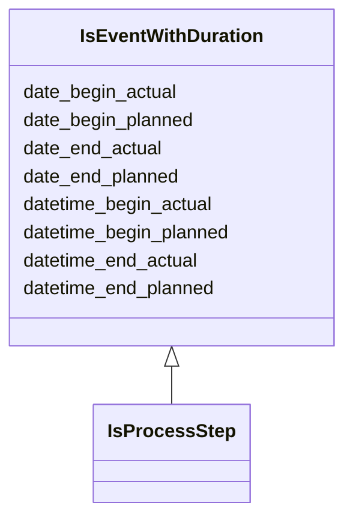

---
search:
  boost: 10.0
---

# Class: IsEventWithDuration 


_A mixin class that provides slots for modeling events or occurrences with time duration._

__


<div data-search-exclude markdown="1">


URI: [tutorial:IsEventWithDuration](https://ch.paf.link/schema/tutorial/IsEventWithDuration)





<!-- no inheritance hierarchy -->

## Class Properties

| Property | Value |
| --- | --- |
| Mixin | Yes |


## Slots

| Name | Cardinality and Range | Description | Inheritance |
| ---  | --- | --- | --- |
| [date_begin_actual](date_begin_actual.md) | 0..1 <br/> [Date](Date.md) | The actual start date of an event or occurrence with time duration | direct |
| [datetime_begin_actual](datetime_begin_actual.md) | 0..1 <br/> [Datetime](Datetime.md) | The actual start date and time of an event or occurrence with time duration | direct |
| [date_begin_planned](date_begin_planned.md) | 0..1 <br/> [Date](Date.md) | The planned start date of an event or occurrence with time duration | direct |
| [datetime_begin_planned](datetime_begin_planned.md) | 0..1 <br/> [Datetime](Datetime.md) | The planned start date and time of an event or occurrence with time duration | direct |
| [date_end_actual](date_end_actual.md) | 0..1 <br/> [Date](Date.md) | The actual end date of an event or occurrence with time duration | direct |
| [datetime_end_actual](datetime_end_actual.md) | 0..1 <br/> [Datetime](Datetime.md) | The actual end date and time of an event or occurrence with time duration | direct |
| [date_end_planned](date_end_planned.md) | 0..1 <br/> [Date](Date.md) | The planned end date of an event or occurrence with time duration | direct |
| [datetime_end_planned](datetime_end_planned.md) | 0..1 <br/> [Datetime](Datetime.md) | The planned end date and time of an event or occurrence with time duration | direct |


## Mixin Usage

| mixed into | description |
| --- | --- |
| [IsProcessStep](IsProcessStep.md) | A mixin class for a single step in a multi-stage process (e |


## Identifier and Mapping Information


### Annotations

| property | value |
| --- | --- |
| description_de | Eine Mixin-Klasse, die Slots für die Modellierung von Ereignissen oder Vorkommnissen mit Zeitdauer zur Verfügung stellt.
 |


### Schema Source


* from schema: https://ch.paf.link/schema/tutorial


## Mappings

| Mapping Type | Mapped Value |
| ---  | ---  |
| self | tutorial:IsEventWithDuration |
| native | tutorial:IsEventWithDuration |


## LinkML Source

<!-- TODO: investigate https://stackoverflow.com/questions/37606292/how-to-create-tabbed-code-blocks-in-mkdocs-or-sphinx -->

### Direct

<details>
```yaml
name: IsEventWithDuration
annotations:
  description_de:
    tag: description_de
    value: 'Eine Mixin-Klasse, die Slots für die Modellierung von Ereignissen oder
      Vorkommnissen mit Zeitdauer zur Verfügung stellt.

      '
description: 'A mixin class that provides slots for modeling events or occurrences
  with time duration.

  '
from_schema: https://ch.paf.link/schema/tutorial
mixin: true
slots:
- date_begin_actual
- datetime_begin_actual
- date_begin_planned
- datetime_begin_planned
- date_end_actual
- datetime_end_actual
- date_end_planned
- datetime_end_planned

```
</details>

### Induced

<details>
```yaml
name: IsEventWithDuration
annotations:
  description_de:
    tag: description_de
    value: 'Eine Mixin-Klasse, die Slots für die Modellierung von Ereignissen oder
      Vorkommnissen mit Zeitdauer zur Verfügung stellt.

      '
description: 'A mixin class that provides slots for modeling events or occurrences
  with time duration.

  '
from_schema: https://ch.paf.link/schema/tutorial
mixin: true
attributes:
  date_begin_actual:
    name: date_begin_actual
    annotations:
      description_de:
        tag: description_de
        value: 'Das tatsächliche Startdatum eines Ereignisses oder Vorkommnissen mit
          Zeitdauer.

          '
    description: 'The actual start date of an event or occurrence with time duration.

      '
    from_schema: https://ch.paf.link/schema/tutorial
    rank: 1000
    slot_uri: mcm:dateBeginActual
    owner: IsEventWithDuration
    domain_of:
    - Session
    - IsEventWithDuration
    range: date
  datetime_begin_actual:
    name: datetime_begin_actual
    annotations:
      description_de:
        tag: description_de
        value: 'Das tatsächliche Startdatum und die Uhrzeit eines Ereignisses oder
          Vorkommnissen mit Zeitdauer.

          '
    description: 'The actual start date and time of an event or occurrence with time
      duration.

      '
    from_schema: https://ch.paf.link/schema/tutorial
    rank: 1000
    slot_uri: mcm:datetimeBeginActual
    owner: IsEventWithDuration
    domain_of:
    - IsEventWithDuration
    range: datetime
  date_begin_planned:
    name: date_begin_planned
    annotations:
      description_de:
        tag: description_de
        value: 'Das geplante Startdatum eines Ereignisses oder Vorkommnissen mit Zeitdauer.

          '
    description: 'The planned start date of an event or occurrence with time duration.

      '
    from_schema: https://ch.paf.link/schema/tutorial
    rank: 1000
    slot_uri: mcm:dateBeginPlanned
    owner: IsEventWithDuration
    domain_of:
    - IsEventWithDuration
    range: date
  datetime_begin_planned:
    name: datetime_begin_planned
    annotations:
      description_de:
        tag: description_de
        value: 'Das geplante Startdatum und die Uhrzeit eines Ereignisses oder Vorkommnissen
          mit Zeitdauer.

          '
    description: 'The planned start date and time of an event or occurrence with time
      duration.

      '
    from_schema: https://ch.paf.link/schema/tutorial
    rank: 1000
    slot_uri: mcm:datetimeBeginPlanned
    owner: IsEventWithDuration
    domain_of:
    - IsEventWithDuration
    range: datetime
  date_end_actual:
    name: date_end_actual
    annotations:
      description_de:
        tag: description_de
        value: 'Das tatsächliche Enddatum eines Ereignisses oder Vorkommnissen mit
          Zeitdauer.

          '
    description: 'The actual end date of an event or occurrence with time duration.

      '
    from_schema: https://ch.paf.link/schema/tutorial
    rank: 1000
    slot_uri: mcm:dateEndActual
    owner: IsEventWithDuration
    domain_of:
    - Session
    - IsEventWithDuration
    range: date
  datetime_end_actual:
    name: datetime_end_actual
    annotations:
      description_de:
        tag: description_de
        value: 'Das tatsächliche Enddatum und die Uhrzeit eines Ereignisses oder Vorkommnissen
          mit Zeitdauer.

          '
    description: 'The actual end date and time of an event or occurrence with time
      duration.

      '
    from_schema: https://ch.paf.link/schema/tutorial
    rank: 1000
    slot_uri: mcm:datetimeEndActual
    owner: IsEventWithDuration
    domain_of:
    - IsEventWithDuration
    range: datetime
  date_end_planned:
    name: date_end_planned
    annotations:
      description_de:
        tag: description_de
        value: 'Das geplante Enddatum eines Ereignisses oder Vorkommnissen mit Zeitdauer.

          '
    description: 'The planned end date of an event or occurrence with time duration.

      '
    from_schema: https://ch.paf.link/schema/tutorial
    rank: 1000
    slot_uri: mcm:dateEndPlanned
    owner: IsEventWithDuration
    domain_of:
    - IsEventWithDuration
    range: date
  datetime_end_planned:
    name: datetime_end_planned
    annotations:
      description_de:
        tag: description_de
        value: 'Das geplante Enddatum und die Uhrzeit eines Ereignisses oder Vorkommnissen
          mit Zeitdauer.

          '
    description: 'The planned end date and time of an event or occurrence with time
      duration.

      '
    from_schema: https://ch.paf.link/schema/tutorial
    rank: 1000
    slot_uri: mcm:datetimeEndPlanned
    owner: IsEventWithDuration
    domain_of:
    - IsEventWithDuration
    range: datetime

```
</details></div>