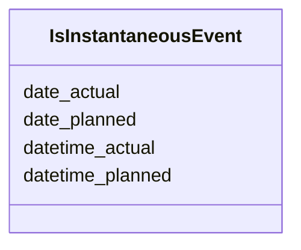

---
search:
  boost: 10.0
---

# Class: IsInstantaneousEvent 


_A mixin class that provides slots for modeling instantaneous events or occurrences (without time duration)._

__


<div data-search-exclude markdown="1">


URI: [tutorial:IsInstantaneousEvent](https://ch.paf.link/schema/tutorial/IsInstantaneousEvent)





<!-- no inheritance hierarchy -->

## Class Properties

| Property | Value |
| --- | --- |
| Mixin | Yes |


## Slots

| Name | Cardinality and Range | Description | Inheritance |
| ---  | --- | --- | --- |
| [date_actual](date_actual.md) | 0..1 <br/> [Date](Date.md) | The actual date of an instantaneous event or occurrence (without time duratio... | direct |
| [datetime_actual](datetime_actual.md) | 0..1 <br/> [Datetime](Datetime.md) | The actual date and time of an instantaneous event or occurrence (without tim... | direct |
| [date_planned](date_planned.md) | 0..1 <br/> [Date](Date.md) | The planned date of an instantaneous event or occurrence (without time durati... | direct |
| [datetime_planned](datetime_planned.md) | 0..1 <br/> [Datetime](Datetime.md) | The planned date and time of an instantaneous event or occurrence (without ti... | direct |


## Mixin Usage

| mixed into | description |
| --- | --- |


## Identifier and Mapping Information


### Annotations

| property | value |
| --- | --- |
| description_de | Eine Mixin-Klasse, die Slots für die Modellierung von instantanen Ereignissen oder Vorkommnissen (ohne Zeitdauer) zur Verfügung stellt.
 |


### Schema Source


* from schema: https://ch.paf.link/schema/tutorial


## Mappings

| Mapping Type | Mapped Value |
| ---  | ---  |
| self | tutorial:IsInstantaneousEvent |
| native | tutorial:IsInstantaneousEvent |


## LinkML Source

<!-- TODO: investigate https://stackoverflow.com/questions/37606292/how-to-create-tabbed-code-blocks-in-mkdocs-or-sphinx -->

### Direct

<details>
```yaml
name: IsInstantaneousEvent
annotations:
  description_de:
    tag: description_de
    value: 'Eine Mixin-Klasse, die Slots für die Modellierung von instantanen Ereignissen
      oder Vorkommnissen (ohne Zeitdauer) zur Verfügung stellt.

      '
description: 'A mixin class that provides slots for modeling instantaneous events
  or occurrences (without time duration).

  '
from_schema: https://ch.paf.link/schema/tutorial
mixin: true
slots:
- date_actual
- datetime_actual
- date_planned
- datetime_planned

```
</details>

### Induced

<details>
```yaml
name: IsInstantaneousEvent
annotations:
  description_de:
    tag: description_de
    value: 'Eine Mixin-Klasse, die Slots für die Modellierung von instantanen Ereignissen
      oder Vorkommnissen (ohne Zeitdauer) zur Verfügung stellt.

      '
description: 'A mixin class that provides slots for modeling instantaneous events
  or occurrences (without time duration).

  '
from_schema: https://ch.paf.link/schema/tutorial
mixin: true
attributes:
  date_actual:
    name: date_actual
    annotations:
      description_de:
        tag: description_de
        value: 'Das tatsächliche Datum eines instantanen Ereignisses oder Vorkommnissen
          (ohne Zeitdauer).

          '
    description: 'The actual date of an instantaneous event or occurrence (without
      time duration).

      '
    from_schema: https://ch.paf.link/schema/tutorial
    rank: 1000
    slot_uri: mcm:dateActual
    owner: IsInstantaneousEvent
    domain_of:
    - IsInstantaneousEvent
    range: date
  datetime_actual:
    name: datetime_actual
    annotations:
      description_de:
        tag: description_de
        value: 'Das tatsächliche Datum und die Uhrzeit eines instantanen Ereignisses
          oder Vorkommnissen (ohne Zeitdauer).

          '
    description: 'The actual date and time of an instantaneous event or occurrence
      (without time duration).

      '
    from_schema: https://ch.paf.link/schema/tutorial
    rank: 1000
    slot_uri: mcm:datetimeActual
    owner: IsInstantaneousEvent
    domain_of:
    - Vote
    - IsInstantaneousEvent
    range: datetime
  date_planned:
    name: date_planned
    annotations:
      description_de:
        tag: description_de
        value: 'Das geplante Datum eines instantanen Ereignisses oder Vorkommnissen
          (ohne Zeitdauer).

          '
    description: 'The planned date of an instantaneous event or occurrence (without
      time duration).

      '
    from_schema: https://ch.paf.link/schema/tutorial
    rank: 1000
    slot_uri: mcm:datePlanned
    owner: IsInstantaneousEvent
    domain_of:
    - IsInstantaneousEvent
    range: date
  datetime_planned:
    name: datetime_planned
    annotations:
      description_de:
        tag: description_de
        value: 'Das geplante Datum und die Uhrzeit eines instantanen Ereignisses oder
          Vorkommnissen (ohne Zeitdauer).

          '
    description: 'The planned date and time of an instantaneous event or occurrence
      (without time duration).

      '
    from_schema: https://ch.paf.link/schema/tutorial
    rank: 1000
    slot_uri: mcm:datetimePlanned
    owner: IsInstantaneousEvent
    domain_of:
    - IsInstantaneousEvent
    range: datetime

```
</details></div>