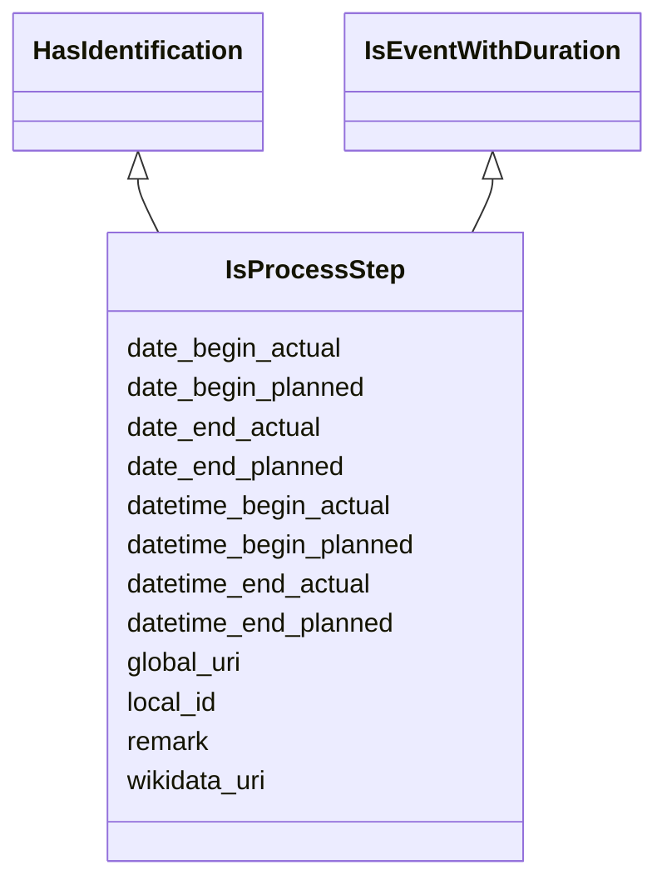

---
search:
  boost: 10.0
---

# Class: IsProcessStep 


_A mixin class for a single step in a multi-stage process (e.g.,_

_a deliberation step of an affair or a phase step of a consultation)._

_Combines identification and event-duration slots and adds a free-text_

_remark slot. Concrete step classes add their own type-specific slots._

__


<div data-search-exclude markdown="1">


URI: [tutorial:IsProcessStep](https://ch.paf.link/schema/tutorial/IsProcessStep)





## Inheritance
* **IsProcessStep** [ [HasIdentification](HasIdentification.md) [IsEventWithDuration](IsEventWithDuration.md)]


## Class Properties

| Property | Value |
| --- | --- |
| Mixin | Yes |


## Slots

| Name | Cardinality and Range | Description | Inheritance |
| ---  | --- | --- | --- |
| [remark](remark.md) | 0..1 <br/> [String](String.md) | Free-text remark or note for edge cases or additional context on a process st... | direct |
| [local_id](local_id.md) | 0..1 <br/> [String](String.md) | Local identifier | [HasIdentification](HasIdentification.md) |
| [global_uri](global_uri.md) | 1 <br/> [Uriorcurie](Uriorcurie.md) | A unique, globally valid URI for the entity | [HasIdentification](HasIdentification.md) |
| [wikidata_uri](wikidata_uri.md) | 0..1 <br/> [Uriorcurie](Uriorcurie.md) | A URI that refers to a Wikidata entity, e | [HasIdentification](HasIdentification.md) |
| [date_begin_actual](date_begin_actual.md) | 0..1 <br/> [Date](Date.md) | The actual start date of an event or occurrence with time duration | [IsEventWithDuration](IsEventWithDuration.md) |
| [datetime_begin_actual](datetime_begin_actual.md) | 0..1 <br/> [Datetime](Datetime.md) | The actual start date and time of an event or occurrence with time duration | [IsEventWithDuration](IsEventWithDuration.md) |
| [date_begin_planned](date_begin_planned.md) | 0..1 <br/> [Date](Date.md) | The planned start date of an event or occurrence with time duration | [IsEventWithDuration](IsEventWithDuration.md) |
| [datetime_begin_planned](datetime_begin_planned.md) | 0..1 <br/> [Datetime](Datetime.md) | The planned start date and time of an event or occurrence with time duration | [IsEventWithDuration](IsEventWithDuration.md) |
| [date_end_actual](date_end_actual.md) | 0..1 <br/> [Date](Date.md) | The actual end date of an event or occurrence with time duration | [IsEventWithDuration](IsEventWithDuration.md) |
| [datetime_end_actual](datetime_end_actual.md) | 0..1 <br/> [Datetime](Datetime.md) | The actual end date and time of an event or occurrence with time duration | [IsEventWithDuration](IsEventWithDuration.md) |
| [date_end_planned](date_end_planned.md) | 0..1 <br/> [Date](Date.md) | The planned end date of an event or occurrence with time duration | [IsEventWithDuration](IsEventWithDuration.md) |
| [datetime_end_planned](datetime_end_planned.md) | 0..1 <br/> [Datetime](Datetime.md) | The planned end date and time of an event or occurrence with time duration | [IsEventWithDuration](IsEventWithDuration.md) |


## Mixin Usage

| mixed into | description |
| --- | --- |


## Identifier and Mapping Information


### Annotations

| property | value |
| --- | --- |
| description_de | Eine Mixin-Klasse für einen einzelnen Schritt in einem
mehrstufigen Prozess (z. B. Bearbeitungsschritt eines Geschäfts oder
Phasen­schritt einer Konsultation). Kombiniert Identifikations- und
Zeitdauer-Slots und ergänzt einen freien Bemerkungs-Slot. Konkrete
Step-Klassen ergänzen ihre eigenen typ-spezifischen Slots.
 |


### Schema Source


* from schema: https://ch.paf.link/schema/tutorial


## Mappings

| Mapping Type | Mapped Value |
| ---  | ---  |
| self | tutorial:IsProcessStep |
| native | tutorial:IsProcessStep |


## LinkML Source

<!-- TODO: investigate https://stackoverflow.com/questions/37606292/how-to-create-tabbed-code-blocks-in-mkdocs-or-sphinx -->

### Direct

<details>
```yaml
name: IsProcessStep
annotations:
  description_de:
    tag: description_de
    value: 'Eine Mixin-Klasse für einen einzelnen Schritt in einem

      mehrstufigen Prozess (z. B. Bearbeitungsschritt eines Geschäfts oder

      Phasen­schritt einer Konsultation). Kombiniert Identifikations- und

      Zeitdauer-Slots und ergänzt einen freien Bemerkungs-Slot. Konkrete

      Step-Klassen ergänzen ihre eigenen typ-spezifischen Slots.

      '
description: 'A mixin class for a single step in a multi-stage process (e.g.,

  a deliberation step of an affair or a phase step of a consultation).

  Combines identification and event-duration slots and adds a free-text

  remark slot. Concrete step classes add their own type-specific slots.

  '
from_schema: https://ch.paf.link/schema/tutorial
mixin: true
mixins:
- HasIdentification
- IsEventWithDuration
slots:
- remark

```
</details>

### Induced

<details>
```yaml
name: IsProcessStep
annotations:
  description_de:
    tag: description_de
    value: 'Eine Mixin-Klasse für einen einzelnen Schritt in einem

      mehrstufigen Prozess (z. B. Bearbeitungsschritt eines Geschäfts oder

      Phasen­schritt einer Konsultation). Kombiniert Identifikations- und

      Zeitdauer-Slots und ergänzt einen freien Bemerkungs-Slot. Konkrete

      Step-Klassen ergänzen ihre eigenen typ-spezifischen Slots.

      '
description: 'A mixin class for a single step in a multi-stage process (e.g.,

  a deliberation step of an affair or a phase step of a consultation).

  Combines identification and event-duration slots and adds a free-text

  remark slot. Concrete step classes add their own type-specific slots.

  '
from_schema: https://ch.paf.link/schema/tutorial
mixin: true
mixins:
- HasIdentification
- IsEventWithDuration
attributes:
  remark:
    name: remark
    annotations:
      description_de:
        tag: description_de
        value: 'Freitext-Bemerkung oder Notiz für Sonderfälle oder zusätzlichen Kontext
          zu einem Prozessschritt oder einer Entität.

          '
    description: 'Free-text remark or note for edge cases or additional context on
      a process step or an entity.

      '
    from_schema: https://ch.paf.link/schema/tutorial
    rank: 1000
    slot_uri: mcm:remark
    owner: IsProcessStep
    domain_of:
    - IsProcessStep
    range: string
  local_id:
    name: local_id
    annotations:
      description_de:
        tag: description_de
        value: 'Lokaler Identifikator. Bspw. eine UUID aus dem Ratsinformationssystem.

          '
    description: 'Local identifier. For example, a UUID from the council information
      system.

      '
    from_schema: https://ch.paf.link/schema/tutorial
    rank: 1000
    slot_uri: mcm:localId
    owner: IsProcessStep
    domain_of:
    - HasIdentification
    range: string
  global_uri:
    name: global_uri
    annotations:
      description_de:
        tag: description_de
        value: 'Eine eindeutige, global gültige URI für die Entität.

          '
    description: 'A unique, globally valid URI for the entity.

      '
    from_schema: https://ch.paf.link/schema/tutorial
    rank: 1000
    slot_uri: mcm:globalURI
    identifier: true
    owner: IsProcessStep
    domain_of:
    - HasIdentification
    range: uriorcurie
    required: true
  wikidata_uri:
    name: wikidata_uri
    annotations:
      description_de:
        tag: description_de
        value: 'Eine URI, die auf eine Wikidata-Entität verweist, z.B. https://www.wikidata.org/wiki/Q39
          für die Schweiz.

          '
    description: 'A URI that refers to a Wikidata entity, e.g. https://www.wikidata.org/wiki/Q39
      for Switzerland.

      '
    from_schema: https://ch.paf.link/schema/tutorial
    rank: 1000
    slot_uri: mcm:wikidataUri
    owner: IsProcessStep
    domain_of:
    - HasIdentification
    range: uriorcurie
  date_begin_actual:
    name: date_begin_actual
    annotations:
      description_de:
        tag: description_de
        value: 'Das tatsächliche Startdatum eines Ereignisses oder Vorkommnissen mit
          Zeitdauer.

          '
    description: 'The actual start date of an event or occurrence with time duration.

      '
    from_schema: https://ch.paf.link/schema/tutorial
    rank: 1000
    slot_uri: mcm:dateBeginActual
    owner: IsProcessStep
    domain_of:
    - Session
    - IsEventWithDuration
    range: date
  datetime_begin_actual:
    name: datetime_begin_actual
    annotations:
      description_de:
        tag: description_de
        value: 'Das tatsächliche Startdatum und die Uhrzeit eines Ereignisses oder
          Vorkommnissen mit Zeitdauer.

          '
    description: 'The actual start date and time of an event or occurrence with time
      duration.

      '
    from_schema: https://ch.paf.link/schema/tutorial
    rank: 1000
    slot_uri: mcm:datetimeBeginActual
    owner: IsProcessStep
    domain_of:
    - IsEventWithDuration
    range: datetime
  date_begin_planned:
    name: date_begin_planned
    annotations:
      description_de:
        tag: description_de
        value: 'Das geplante Startdatum eines Ereignisses oder Vorkommnissen mit Zeitdauer.

          '
    description: 'The planned start date of an event or occurrence with time duration.

      '
    from_schema: https://ch.paf.link/schema/tutorial
    rank: 1000
    slot_uri: mcm:dateBeginPlanned
    owner: IsProcessStep
    domain_of:
    - IsEventWithDuration
    range: date
  datetime_begin_planned:
    name: datetime_begin_planned
    annotations:
      description_de:
        tag: description_de
        value: 'Das geplante Startdatum und die Uhrzeit eines Ereignisses oder Vorkommnissen
          mit Zeitdauer.

          '
    description: 'The planned start date and time of an event or occurrence with time
      duration.

      '
    from_schema: https://ch.paf.link/schema/tutorial
    rank: 1000
    slot_uri: mcm:datetimeBeginPlanned
    owner: IsProcessStep
    domain_of:
    - IsEventWithDuration
    range: datetime
  date_end_actual:
    name: date_end_actual
    annotations:
      description_de:
        tag: description_de
        value: 'Das tatsächliche Enddatum eines Ereignisses oder Vorkommnissen mit
          Zeitdauer.

          '
    description: 'The actual end date of an event or occurrence with time duration.

      '
    from_schema: https://ch.paf.link/schema/tutorial
    rank: 1000
    slot_uri: mcm:dateEndActual
    owner: IsProcessStep
    domain_of:
    - Session
    - IsEventWithDuration
    range: date
  datetime_end_actual:
    name: datetime_end_actual
    annotations:
      description_de:
        tag: description_de
        value: 'Das tatsächliche Enddatum und die Uhrzeit eines Ereignisses oder Vorkommnissen
          mit Zeitdauer.

          '
    description: 'The actual end date and time of an event or occurrence with time
      duration.

      '
    from_schema: https://ch.paf.link/schema/tutorial
    rank: 1000
    slot_uri: mcm:datetimeEndActual
    owner: IsProcessStep
    domain_of:
    - IsEventWithDuration
    range: datetime
  date_end_planned:
    name: date_end_planned
    annotations:
      description_de:
        tag: description_de
        value: 'Das geplante Enddatum eines Ereignisses oder Vorkommnissen mit Zeitdauer.

          '
    description: 'The planned end date of an event or occurrence with time duration.

      '
    from_schema: https://ch.paf.link/schema/tutorial
    rank: 1000
    slot_uri: mcm:dateEndPlanned
    owner: IsProcessStep
    domain_of:
    - IsEventWithDuration
    range: date
  datetime_end_planned:
    name: datetime_end_planned
    annotations:
      description_de:
        tag: description_de
        value: 'Das geplante Enddatum und die Uhrzeit eines Ereignisses oder Vorkommnissen
          mit Zeitdauer.

          '
    description: 'The planned end date and time of an event or occurrence with time
      duration.

      '
    from_schema: https://ch.paf.link/schema/tutorial
    rank: 1000
    slot_uri: mcm:datetimeEndPlanned
    owner: IsProcessStep
    domain_of:
    - IsEventWithDuration
    range: datetime

```
</details></div>