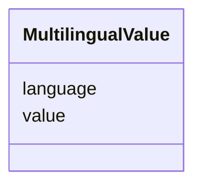

---
search:
  boost: 10.0
---

# Class: MultilingualValue 


_A multilingual string with language specification._

__


<div data-search-exclude markdown="1">


URI: [tutorial:MultilingualValue](https://ch.paf.link/schema/tutorial/MultilingualValue)





<!-- no inheritance hierarchy -->

## Slots

| Name | Cardinality and Range | Description | Inheritance |
| ---  | --- | --- | --- |
| [value](value.md) | 0..1 <br/> [String](String.md) | The value of an information besides other attributes such as type, language, ... | direct |
| [language](language.md) | 0..1 <br/> [String](String.md) | Language code in ISO 639-1 format (two lowercase letters, e | direct |


## Usages

| used by | used in | type | used |
| ---  | --- | --- | --- |
| [Session](Session.md) | [name](name.md) | range | [MultilingualValue](MultilingualValue.md) |
| [AgendaItem](AgendaItem.md) | [name](name.md) | range | [MultilingualValue](MultilingualValue.md) |
| [GroupReference](GroupReference.md) | [abbreviation](abbreviation.md) | range | [MultilingualValue](MultilingualValue.md) |


## Identifier and Mapping Information


### Annotations

| property | value |
| --- | --- |
| description_de | Ein mehrsprachiger String mit Angabe der Sprache.
 |


### Schema Source


* from schema: https://ch.paf.link/schema/tutorial


## Mappings

| Mapping Type | Mapped Value |
| ---  | ---  |
| self | tutorial:MultilingualValue |
| native | tutorial:MultilingualValue |


## LinkML Source

<!-- TODO: investigate https://stackoverflow.com/questions/37606292/how-to-create-tabbed-code-blocks-in-mkdocs-or-sphinx -->

### Direct

<details>
```yaml
name: MultilingualValue
annotations:
  description_de:
    tag: description_de
    value: 'Ein mehrsprachiger String mit Angabe der Sprache.

      '
description: 'A multilingual string with language specification.

  '
from_schema: https://ch.paf.link/schema/tutorial
slots:
- value
- language

```
</details>

### Induced

<details>
```yaml
name: MultilingualValue
annotations:
  description_de:
    tag: description_de
    value: 'Ein mehrsprachiger String mit Angabe der Sprache.

      '
description: 'A multilingual string with language specification.

  '
from_schema: https://ch.paf.link/schema/tutorial
attributes:
  value:
    name: value
    annotations:
      description_de:
        tag: description_de
        value: 'Der eigentliche Wert einer Information neben weiteren attributen wie
          Typ, Sprache, etc.

          '
    description: 'The value of an information besides other attributes such as type,
      language, etc.

      '
    from_schema: https://ch.paf.link/schema/tutorial
    rank: 1000
    slot_uri: mcm:value
    owner: MultilingualValue
    domain_of:
    - MultilingualValue
    range: string
  language:
    name: language
    annotations:
      description_de:
        tag: description_de
        value: 'Sprachcode im ISO 639-1 Format (zwei Kleinbuchstaben, z.B. "de", "fr",
          "it", "en").

          '
    description: 'Language code in ISO 639-1 format (two lowercase letters, e.g. "de",
      "fr", "it", "en").

      '
    from_schema: https://ch.paf.link/schema/tutorial
    rank: 1000
    slot_uri: mcm:language
    owner: MultilingualValue
    domain_of:
    - MultilingualValue
    range: string
    pattern: ^[a-z]{2}$

```
</details></div>