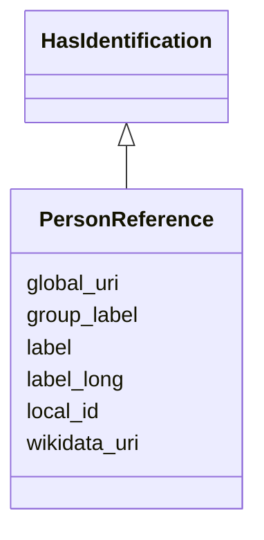

---
search:
  boost: 10.0
---

# Class: PersonReference 


_Lightweight reference to a person with key identification data at time of linking. Preserves historical accuracy even if the person changes later._

__


<div data-search-exclude markdown="1">


URI: [tutorial:PersonReference](https://ch.paf.link/schema/tutorial/PersonReference)





## Inheritance
* **PersonReference** [ [HasIdentification](HasIdentification.md)]


## Slots

| Name | Cardinality and Range | Description | Inheritance |
| ---  | --- | --- | --- |
| [label](label.md) | 1 <br/> [String](String.md) | Mandatory short display name to identify the person within the organisation (... | direct |
| [label_long](label_long.md) | 0..1 <br/> [String](String.md) | Optional long display name including academic titles and full official name (... | direct |
| [group_label](group_label.md) | 0..1 <br/> [String](String.md) | Name of the body/group at time of linking | direct |
| [local_id](local_id.md) | 0..1 <br/> [String](String.md) | Local identifier | [HasIdentification](HasIdentification.md) |
| [global_uri](global_uri.md) | 1 <br/> [Uriorcurie](Uriorcurie.md) | A unique, globally valid URI for the entity | [HasIdentification](HasIdentification.md) |
| [wikidata_uri](wikidata_uri.md) | 0..1 <br/> [Uriorcurie](Uriorcurie.md) | A URI that refers to a Wikidata entity, e | [HasIdentification](HasIdentification.md) |


## Identifier and Mapping Information


### Annotations

| property | value |
| --- | --- |
| description_de | Leichtgewichtige Referenz auf eine Person mit den wichtigsten Identifikationsmerkmalen zum Zeitpunkt der Verknüpfung. Ermöglicht historische Korrektheit auch wenn sich die Person später ändert.
 |


### Schema Source


* from schema: https://ch.paf.link/schema/tutorial


## Mappings

| Mapping Type | Mapped Value |
| ---  | ---  |
| self | tutorial:PersonReference |
| native | tutorial:PersonReference |


## LinkML Source

<!-- TODO: investigate https://stackoverflow.com/questions/37606292/how-to-create-tabbed-code-blocks-in-mkdocs-or-sphinx -->

### Direct

<details>
```yaml
name: PersonReference
annotations:
  description_de:
    tag: description_de
    value: 'Leichtgewichtige Referenz auf eine Person mit den wichtigsten Identifikationsmerkmalen
      zum Zeitpunkt der Verknüpfung. Ermöglicht historische Korrektheit auch wenn
      sich die Person später ändert.

      '
description: 'Lightweight reference to a person with key identification data at time
  of linking. Preserves historical accuracy even if the person changes later.

  '
from_schema: https://ch.paf.link/schema/tutorial
mixins:
- HasIdentification
slots:
- label
- label_long
- group_label
slot_usage:
  label:
    name: label
    annotations:
      description_de:
        tag: description_de
        value: 'Obligatorischer Kurzname zur Identifikation der Person innerhalb der
          Organisation (z.B. mit Geburtsjahr zur Unterscheidung von Personen mit gleichem
          Namen).

          '
    description: 'Mandatory short display name to identify the person within the organisation
      (e.g. with added birth year to distinguish persons with the same name).

      '
    required: true
  label_long:
    name: label_long
    annotations:
      description_de:
        tag: description_de
        value: 'Optionaler langer Anzeigename mit akademischen Titeln und vollständigem
          amtlichem Namen (z.B. "Dr. Maria Muster-Beispiel").

          '
    description: 'Optional long display name including academic titles and full official
      name (e.g. "Dr. Maria Muster-Beispiel").

      '

```
</details>

### Induced

<details>
```yaml
name: PersonReference
annotations:
  description_de:
    tag: description_de
    value: 'Leichtgewichtige Referenz auf eine Person mit den wichtigsten Identifikationsmerkmalen
      zum Zeitpunkt der Verknüpfung. Ermöglicht historische Korrektheit auch wenn
      sich die Person später ändert.

      '
description: 'Lightweight reference to a person with key identification data at time
  of linking. Preserves historical accuracy even if the person changes later.

  '
from_schema: https://ch.paf.link/schema/tutorial
mixins:
- HasIdentification
slot_usage:
  label:
    name: label
    annotations:
      description_de:
        tag: description_de
        value: 'Obligatorischer Kurzname zur Identifikation der Person innerhalb der
          Organisation (z.B. mit Geburtsjahr zur Unterscheidung von Personen mit gleichem
          Namen).

          '
    description: 'Mandatory short display name to identify the person within the organisation
      (e.g. with added birth year to distinguish persons with the same name).

      '
    required: true
  label_long:
    name: label_long
    annotations:
      description_de:
        tag: description_de
        value: 'Optionaler langer Anzeigename mit akademischen Titeln und vollständigem
          amtlichem Namen (z.B. "Dr. Maria Muster-Beispiel").

          '
    description: 'Optional long display name including academic titles and full official
      name (e.g. "Dr. Maria Muster-Beispiel").

      '
attributes:
  label:
    name: label
    annotations:
      description_de:
        tag: description_de
        value: 'Obligatorischer Kurzname zur Identifikation der Person innerhalb der
          Organisation (z.B. mit Geburtsjahr zur Unterscheidung von Personen mit gleichem
          Namen).

          '
    description: 'Mandatory short display name to identify the person within the organisation
      (e.g. with added birth year to distinguish persons with the same name).

      '
    from_schema: https://ch.paf.link/schema/tutorial
    rank: 1000
    slot_uri: mcm:label
    owner: PersonReference
    domain_of:
    - PersonReference
    - GroupReference
    range: string
    required: true
  label_long:
    name: label_long
    annotations:
      description_de:
        tag: description_de
        value: 'Optionaler langer Anzeigename mit akademischen Titeln und vollständigem
          amtlichem Namen (z.B. "Dr. Maria Muster-Beispiel").

          '
    description: 'Optional long display name including academic titles and full official
      name (e.g. "Dr. Maria Muster-Beispiel").

      '
    from_schema: https://ch.paf.link/schema/tutorial
    rank: 1000
    slot_uri: mcm:labelLong
    owner: PersonReference
    domain_of:
    - PersonReference
    range: string
  group_label:
    name: group_label
    annotations:
      description_de:
        tag: description_de
        value: 'Name des Gremiums zum Zeitpunkt der Verknüpfung.

          '
    description: 'Name of the body/group at time of linking.

      '
    from_schema: https://ch.paf.link/schema/tutorial
    rank: 1000
    slot_uri: mcm:groupLabel
    owner: PersonReference
    domain_of:
    - PersonReference
    range: string
  local_id:
    name: local_id
    annotations:
      description_de:
        tag: description_de
        value: 'Lokaler Identifikator. Bspw. eine UUID aus dem Ratsinformationssystem.

          '
    description: 'Local identifier. For example, a UUID from the council information
      system.

      '
    from_schema: https://ch.paf.link/schema/tutorial
    rank: 1000
    slot_uri: mcm:localId
    owner: PersonReference
    domain_of:
    - HasIdentification
    range: string
  global_uri:
    name: global_uri
    annotations:
      description_de:
        tag: description_de
        value: 'Eine eindeutige, global gültige URI für die Entität.

          '
    description: 'A unique, globally valid URI for the entity.

      '
    from_schema: https://ch.paf.link/schema/tutorial
    rank: 1000
    slot_uri: mcm:globalURI
    identifier: true
    owner: PersonReference
    domain_of:
    - HasIdentification
    range: uriorcurie
    required: true
  wikidata_uri:
    name: wikidata_uri
    annotations:
      description_de:
        tag: description_de
        value: 'Eine URI, die auf eine Wikidata-Entität verweist, z.B. https://www.wikidata.org/wiki/Q39
          für die Schweiz.

          '
    description: 'A URI that refers to a Wikidata entity, e.g. https://www.wikidata.org/wiki/Q39
      for Switzerland.

      '
    from_schema: https://ch.paf.link/schema/tutorial
    rank: 1000
    slot_uri: mcm:wikidataUri
    owner: PersonReference
    domain_of:
    - HasIdentification
    range: uriorcurie

```
</details></div>