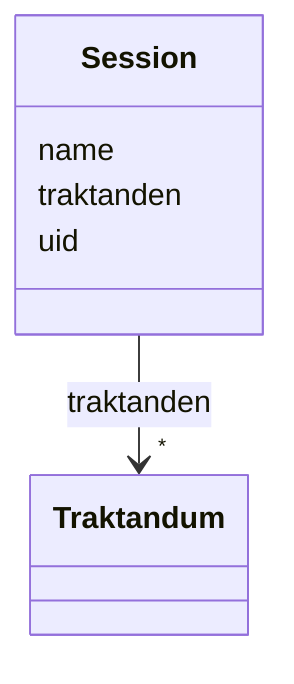

# Class: Session


URI: [chpaf:Session](https://ch.paf.link/Session)





<!-- no inheritance hierarchy -->


## Slots

| Name | Cardinality and Range | Description | Inheritance |
| ---  | --- | --- | --- |
| [uid](uid.md) | 1 <br/> [String](String.md) |  | direct |
| [name](name.md) | 1 <br/> [String](String.md) |  | direct |
| [traktanden](traktanden.md) | * <br/> [Traktandum](Traktandum.md) |  | direct |


## Usages

| used by | used in | type | used |
| ---  | --- | --- | --- |
| [Container](Container.md) | [sessionen](sessionen.md) | range | [Session](Session.md) |


## Identifier and Mapping Information


### Schema Source


* from schema: https://ch.paf.link/schema/session


## Mappings

| Mapping Type | Mapped Value |
| ---  | ---  |
| self | chpaf:Session |
| native | chpaf:Session |


## LinkML Source

<!-- TODO: investigate https://stackoverflow.com/questions/37606292/how-to-create-tabbed-code-blocks-in-mkdocs-or-sphinx -->

### Direct

<details>
```yaml
name: Session
from_schema: https://ch.paf.link/schema/session
slots:
- uid
- name
- traktanden
class_uri: chpaf:Session

```
</details>

### Induced

<details>
```yaml
name: Session
from_schema: https://ch.paf.link/schema/session
attributes:
  uid:
    name: uid
    from_schema: https://ch.paf.link/schema/session
    rank: 1000
    identifier: true
    alias: uid
    owner: Session
    domain_of:
    - Session
    - Traktandum
    - Abstimmung
    range: string
  name:
    name: name
    from_schema: https://ch.paf.link/schema/session
    rank: 1000
    slot_uri: dcterm:title
    alias: name
    owner: Session
    domain_of:
    - Session
    - Traktandum
    range: string
    required: true
  traktanden:
    name: traktanden
    from_schema: https://ch.paf.link/schema/session
    rank: 1000
    slot_uri: chpaf:traktandum
    alias: traktanden
    owner: Session
    domain_of:
    - Session
    range: Traktandum
    multivalued: true
    inlined_as_list: true
class_uri: chpaf:Session

```
</details>