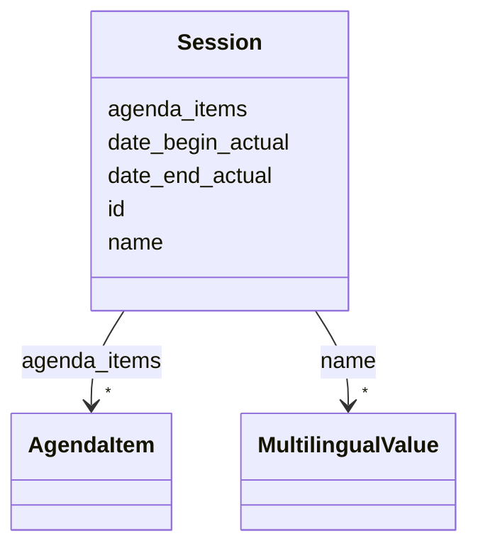

---
search:
  boost: 10.0
---

# Class: Session 

<div data-search-exclude markdown="1">


URI: [tutorial:Session](https://ch.paf.link/schema/tutorial/Session)



```mermaid
 classDiagram
    class Session
    click Session href "../Session/"
      Session : agenda_items
        
          
    
        
        
        Session --> "*" AgendaItem : agenda_items
        click AgendaItem href "../AgendaItem/"
    

        
      Session : date_begin_actual
        
      Session : date_end_actual
        
      Session : id
        
      Session : name
        
          
    
        
        
        Session --> "*" MultilingualValue : name
        click MultilingualValue href "../MultilingualValue/"
    

        
      
```


<!-- no inheritance hierarchy -->

## Slots

| Name | Cardinality and Range | Description | Inheritance |
| ---  | --- | --- | --- |
| [id](id.md) | 1 <br/> [String](String.md) |  | direct |
| [date_begin_actual](date_begin_actual.md) | 0..1 <br/> [Date](Date.md) | The actual start date of an event or occurrence with time duration | direct |
| [date_end_actual](date_end_actual.md) | 0..1 <br/> [Date](Date.md) | The actual end date of an event or occurrence with time duration | direct |
| [name](name.md) | * <br/> [MultilingualValue](MultilingualValue.md) |  | direct |
| [agenda_items](agenda_items.md) | * <br/> [AgendaItem](AgendaItem.md) |  | direct |


## Usages

| used by | used in | type | used |
| ---  | --- | --- | --- |
| [Container](Container.md) | [sessions](sessions.md) | range | [Session](Session.md) |


## Identifier and Mapping Information


### Schema Source


* from schema: https://ch.paf.link/schema/tutorial


## Mappings

| Mapping Type | Mapped Value |
| ---  | ---  |
| self | tutorial:Session |
| native | tutorial:Session |


## Examples
### Example: Session-hierarchical__en

```yaml
id: tutorial:s2025-2
date_begin_actual: '2025-06-01'
date_end_actual: '2025-07-10'
name:
- value: Sommersession 2025
  language: de
- value: Summer Session 2025
  language: en
agenda_items:
- id: tutorial:s2025-2_t1
  name:
  - value: Landeshymne
    language: de
  - value: National Anthem
    language: en
  votes:
  - id: tutorial:s2025-2_t1_a1
    question: Soll die Hymne geändert werden?
    datetime_actual: '2025-06-15T10:00:00+01:00'
    result: 'no'

```
### Example: Session-flat__en

```yaml
id: tutorial:s2025-2
date_begin_actual: 2025-06-01
date_end_actual: 2025-07-10
name:
- value: Sommersession 2025
  language: de
- value: Summer Session 2025
  language: en

```


## LinkML Source

<!-- TODO: investigate https://stackoverflow.com/questions/37606292/how-to-create-tabbed-code-blocks-in-mkdocs-or-sphinx -->

### Direct

<details>
```yaml
name: Session
from_schema: https://ch.paf.link/schema/tutorial
slots:
- id
- date_begin_actual
- date_end_actual
- name
- agenda_items

```
</details>

### Induced

<details>
```yaml
name: Session
from_schema: https://ch.paf.link/schema/tutorial
attributes:
  id:
    name: id
    examples:
    - value: tutorial:s2025
    - value: tutorial:s2025-1
    - value: tutorial:s2025-1_t1
    from_schema: https://ch.paf.link/schema/tutorial
    rank: 1000
    identifier: true
    owner: Session
    domain_of:
    - Session
    - AgendaItem
    - Vote
    - Container
    range: string
    required: true
  date_begin_actual:
    name: date_begin_actual
    annotations:
      description_de:
        tag: description_de
        value: 'Das tatsächliche Startdatum eines Ereignisses oder Vorkommnissen mit
          Zeitdauer.

          '
    description: 'The actual start date of an event or occurrence with time duration.

      '
    from_schema: https://ch.paf.link/schema/tutorial
    rank: 1000
    slot_uri: mcm:dateBeginActual
    owner: Session
    domain_of:
    - Session
    - IsEventWithDuration
    range: date
  date_end_actual:
    name: date_end_actual
    annotations:
      description_de:
        tag: description_de
        value: 'Das tatsächliche Enddatum eines Ereignisses oder Vorkommnissen mit
          Zeitdauer.

          '
    description: 'The actual end date of an event or occurrence with time duration.

      '
    from_schema: https://ch.paf.link/schema/tutorial
    rank: 1000
    slot_uri: mcm:dateEndActual
    owner: Session
    domain_of:
    - Session
    - IsEventWithDuration
    range: date
  name:
    name: name
    from_schema: https://ch.paf.link/schema/tutorial
    rank: 1000
    slot_uri: schema:name
    owner: Session
    domain_of:
    - Session
    - AgendaItem
    range: MultilingualValue
    multivalued: true
    inlined: true
    inlined_as_list: true
  agenda_items:
    name: agenda_items
    from_schema: https://ch.paf.link/schema/tutorial
    rank: 1000
    slot_uri: tutorial:agendaItem
    owner: Session
    domain_of:
    - Session
    - Container
    range: AgendaItem
    multivalued: true
    inlined: true
    inlined_as_list: true

```
</details></div>