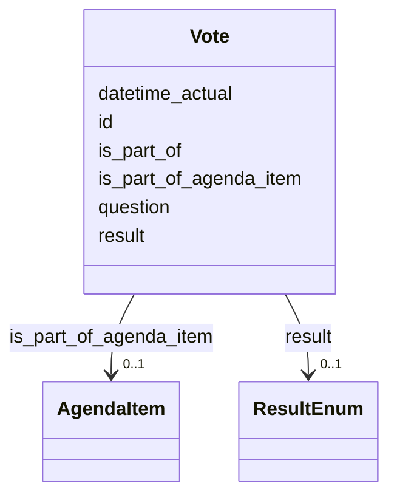

---
search:
  boost: 10.0
---

# Class: Vote 

<div data-search-exclude markdown="1">


URI: [tutorial:Vote](https://ch.paf.link/schema/tutorial/Vote)



```mermaid
 classDiagram
    class Vote
    click Vote href "../Vote/"
      Vote : datetime_actual
        
      Vote : id
        
      Vote : is_part_of
        
      Vote : is_part_of_agenda_item
        
          
    
        
        
        Vote --> "0..1" AgendaItem : is_part_of_agenda_item
        click AgendaItem href "../AgendaItem/"
    

        
      Vote : question
        
      Vote : result
        
          
    
        
        
        Vote --> "0..1" ResultEnum : result
        click ResultEnum href "../ResultEnum/"
    

        
      
```


<!-- no inheritance hierarchy -->

## Slots

| Name | Cardinality and Range | Description | Inheritance |
| ---  | --- | --- | --- |
| [id](id.md) | 1 <br/> [String](String.md) |  | direct |
| [is_part_of](is_part_of.md) | 0..1 <br/> [Uriorcurie](Uriorcurie.md) |  | direct |
| [question](question.md) | 1 <br/> [String](String.md) |  | direct |
| [datetime_actual](datetime_actual.md) | 0..1 <br/> [Datetime](Datetime.md) | The actual date and time of an instantaneous event or occurrence (without tim... | direct |
| [result](result.md) | 0..1 <br/> [ResultEnum](ResultEnum.md) |  | direct |
| [is_part_of_agenda_item](is_part_of_agenda_item.md) | 0..1 <br/> [AgendaItem](AgendaItem.md) |  | direct |


## Usages

| used by | used in | type | used |
| ---  | --- | --- | --- |
| [AgendaItem](AgendaItem.md) | [votes](votes.md) | range | [Vote](Vote.md) |
| [Container](Container.md) | [votes](votes.md) | range | [Vote](Vote.md) |


## Identifier and Mapping Information


### Schema Source


* from schema: https://ch.paf.link/schema/tutorial


## Mappings

| Mapping Type | Mapped Value |
| ---  | ---  |
| self | tutorial:Vote |
| native | tutorial:Vote |


## LinkML Source

<!-- TODO: investigate https://stackoverflow.com/questions/37606292/how-to-create-tabbed-code-blocks-in-mkdocs-or-sphinx -->

### Direct

<details>
```yaml
name: Vote
from_schema: https://ch.paf.link/schema/tutorial
slots:
- id
- is_part_of
- question
- datetime_actual
- result
attributes:
  is_part_of_agenda_item:
    name: is_part_of_agenda_item
    from_schema: https://ch.paf.link/schema/tutorial
    rank: 1000
    domain_of:
    - Vote
    range: AgendaItem

```
</details>

### Induced

<details>
```yaml
name: Vote
from_schema: https://ch.paf.link/schema/tutorial
attributes:
  is_part_of_agenda_item:
    name: is_part_of_agenda_item
    from_schema: https://ch.paf.link/schema/tutorial
    rank: 1000
    owner: Vote
    domain_of:
    - Vote
    range: AgendaItem
  id:
    name: id
    examples:
    - value: tutorial:s2025
    - value: tutorial:s2025-1
    - value: tutorial:s2025-1_t1
    from_schema: https://ch.paf.link/schema/tutorial
    rank: 1000
    identifier: true
    owner: Vote
    domain_of:
    - Session
    - AgendaItem
    - Vote
    - Container
    range: string
    required: true
  is_part_of:
    name: is_part_of
    examples:
    - value: tutorial:s2025-1_t1
    - value: tutorial:s2025-2_t1
    from_schema: https://ch.paf.link/schema/tutorial
    rank: 1000
    owner: Vote
    domain_of:
    - Vote
    range: uriorcurie
  question:
    name: question
    examples:
    - value: Soll die Farbe Auberginen-Oliv werden?
    - value: Soll die Farbe geändert werden?
    - value: Soll die Hymne geändert werden?
    from_schema: https://ch.paf.link/schema/tutorial
    rank: 1000
    owner: Vote
    domain_of:
    - Vote
    range: string
    required: true
  datetime_actual:
    name: datetime_actual
    annotations:
      description_de:
        tag: description_de
        value: 'Das tatsächliche Datum und die Uhrzeit eines instantanen Ereignisses
          oder Vorkommnissen (ohne Zeitdauer).

          '
    description: 'The actual date and time of an instantaneous event or occurrence
      (without time duration).

      '
    from_schema: https://ch.paf.link/schema/tutorial
    rank: 1000
    slot_uri: mcm:datetimeActual
    owner: Vote
    domain_of:
    - Vote
    - IsInstantaneousEvent
    range: datetime
  result:
    name: result
    examples:
    - value: 'no'
    - value: 'yes'
    from_schema: https://ch.paf.link/schema/tutorial
    rank: 1000
    owner: Vote
    domain_of:
    - Vote
    range: result_enum

```
</details></div>