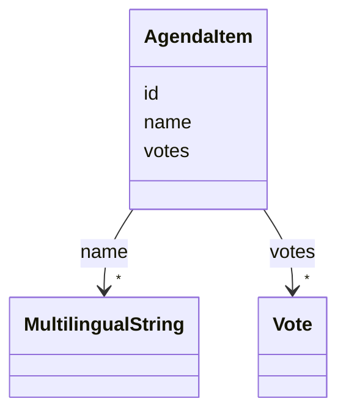
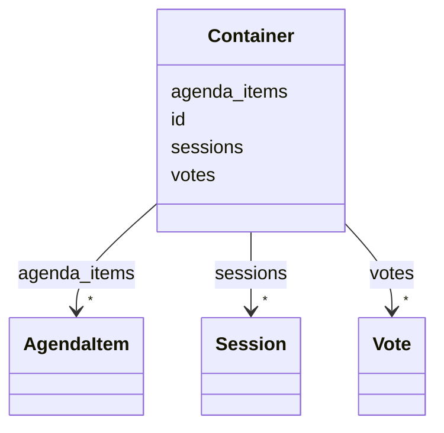
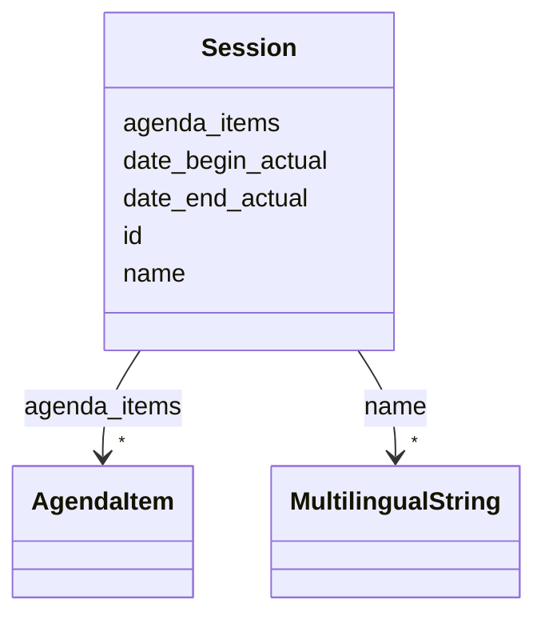
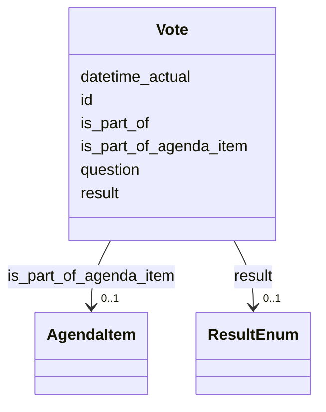

# Head

Header Text from the input markdown file.

# Intro

Intro Text from the input markdown file.

# Introduction to Sessions Schema

# Classes

| Class | Description |
| --- | --- |
| [AgendaItem](#AgendaItem) | None |
| [Container](#Container) | None |
| [Session](#Session) | None |
| [Vote](#Vote) | None |


# Class: AgendaItem 


URI: [tutorial:AgendaItem](https://ch.paf.link/schema/tutorial/AgendaItem)





<!-- no inheritance hierarchy -->


## Slots

| Name | Cardinality and Range | Description | Inheritance |
| ---  | --- | --- | --- |
| [id](#id) | 1 <br/> [String](#String) |  | direct |
| [name](#name) | * <br/> [MultilingualString](#MultilingualString) |  | direct |
| [votes](#votes) | * <br/> [Vote](#Vote) |  | direct |


## Usages

| used by | used in | type | used |
| ---  | --- | --- | --- |
| [Session](#Session) | [agenda_items](#agenda_items) | range | [AgendaItem](#AgendaItem) |
| [Vote](#Vote) | [is_part_of_agenda_item](#is_part_of_agenda_item) | range | [AgendaItem](#AgendaItem) |
| [Container](#Container) | [agenda_items](#agenda_items) | range | [AgendaItem](#AgendaItem) |


## Identifier and Mapping Information


### Schema Source


* from schema: https://ch.paf.link/schema/tutorial


## Mappings

| Mapping Type | Mapped Value |
| ---  | ---  |
| self | tutorial:AgendaItem |
| native | tutorial:AgendaItem |


## LinkML Source

<!-- TODO: investigate https://stackoverflow.com/questions/37606292/how-to-create-tabbed-code-blocks-in-mkdocs-or-sphinx -->

### Direct

<details>
```yaml
name: AgendaItem
from_schema: https://ch.paf.link/schema/tutorial
slots:
- id
- name
- votes

```
</details>

### Induced

<details>
```yaml
name: AgendaItem
from_schema: https://ch.paf.link/schema/tutorial
attributes:
  id:
    name: id
    from_schema: https://ch.paf.link/schema/tutorial
    rank: 1000
    identifier: true
    alias: id
    owner: AgendaItem
    domain_of:
    - Session
    - AgendaItem
    - Vote
    - Container
    range: string
    required: true
  name:
    name: name
    from_schema: https://ch.paf.link/schema/tutorial
    rank: 1000
    slot_uri: schema:name
    alias: name
    owner: AgendaItem
    domain_of:
    - Session
    - AgendaItem
    range: MultilingualString
    multivalued: true
    inlined: true
    inlined_as_list: true
  votes:
    name: votes
    from_schema: https://ch.paf.link/schema/tutorial
    rank: 1000
    slot_uri: tutorial:vote
    alias: votes
    owner: AgendaItem
    domain_of:
    - AgendaItem
    - Container
    range: Vote
    multivalued: true
    inlined: true
    inlined_as_list: true

```
</details>


# Class: Container 


URI: [tutorial:Container](https://ch.paf.link/schema/tutorial/Container)





<!-- no inheritance hierarchy -->


## Slots

| Name | Cardinality and Range | Description | Inheritance |
| ---  | --- | --- | --- |
| [id](#id) | 1 <br/> [String](#String) |  | direct |
| [sessions](#sessions) | * <br/> [Session](#Session) |  | direct |
| [agenda_items](#agenda_items) | * <br/> [AgendaItem](#AgendaItem) |  | direct |
| [votes](#votes) | * <br/> [Vote](#Vote) |  | direct |


## Identifier and Mapping Information


### Schema Source


* from schema: https://ch.paf.link/schema/tutorial


## Mappings

| Mapping Type | Mapped Value |
| ---  | ---  |
| self | tutorial:Container |
| native | tutorial:Container |


## LinkML Source

<!-- TODO: investigate https://stackoverflow.com/questions/37606292/how-to-create-tabbed-code-blocks-in-mkdocs-or-sphinx -->

### Direct

<details>
```yaml
name: Container
from_schema: https://ch.paf.link/schema/tutorial
slots:
- id
- sessions
- agenda_items
- votes
tree_root: true

```
</details>

### Induced

<details>
```yaml
name: Container
from_schema: https://ch.paf.link/schema/tutorial
attributes:
  id:
    name: id
    from_schema: https://ch.paf.link/schema/tutorial
    rank: 1000
    identifier: true
    alias: id
    owner: Container
    domain_of:
    - Session
    - AgendaItem
    - Vote
    - Container
    range: string
    required: true
  sessions:
    name: sessions
    from_schema: https://ch.paf.link/schema/tutorial
    rank: 1000
    slot_uri: tutorial:session
    alias: sessions
    owner: Container
    domain_of:
    - Container
    range: Session
    multivalued: true
    inlined: true
    inlined_as_list: true
  agenda_items:
    name: agenda_items
    from_schema: https://ch.paf.link/schema/tutorial
    rank: 1000
    slot_uri: tutorial:agendaItem
    alias: agenda_items
    owner: Container
    domain_of:
    - Session
    - Container
    range: AgendaItem
    multivalued: true
    inlined: true
    inlined_as_list: true
  votes:
    name: votes
    from_schema: https://ch.paf.link/schema/tutorial
    rank: 1000
    slot_uri: tutorial:vote
    alias: votes
    owner: Container
    domain_of:
    - AgendaItem
    - Container
    range: Vote
    multivalued: true
    inlined: true
    inlined_as_list: true
tree_root: true

```
</details>


# Class: Session 


URI: [tutorial:Session](https://ch.paf.link/schema/tutorial/Session)





<!-- no inheritance hierarchy -->


## Slots

| Name | Cardinality and Range | Description | Inheritance |
| ---  | --- | --- | --- |
| [id](#id) | 1 <br/> [String](#String) |  | direct |
| [date_begin_actual](#date_begin_actual) | 0..1 <br/> [Date](#Date) |  | direct |
| [date_end_actual](#date_end_actual) | 0..1 <br/> [Date](#Date) |  | direct |
| [name](#name) | * <br/> [MultilingualString](#MultilingualString) |  | direct |
| [agenda_items](#agenda_items) | * <br/> [AgendaItem](#AgendaItem) |  | direct |


## Usages

| used by | used in | type | used |
| ---  | --- | --- | --- |
| [Container](#Container) | [sessions](#sessions) | range | [Session](#Session) |


## Identifier and Mapping Information


### Schema Source


* from schema: https://ch.paf.link/schema/tutorial


## Mappings

| Mapping Type | Mapped Value |
| ---  | ---  |
| self | tutorial:Session |
| native | tutorial:Session |


## LinkML Source

<!-- TODO: investigate https://stackoverflow.com/questions/37606292/how-to-create-tabbed-code-blocks-in-mkdocs-or-sphinx -->

### Direct

<details>
```yaml
name: Session
from_schema: https://ch.paf.link/schema/tutorial
slots:
- id
- date_begin_actual
- date_end_actual
- name
- agenda_items

```
</details>

### Induced

<details>
```yaml
name: Session
from_schema: https://ch.paf.link/schema/tutorial
attributes:
  id:
    name: id
    from_schema: https://ch.paf.link/schema/tutorial
    rank: 1000
    identifier: true
    alias: id
    owner: Session
    domain_of:
    - Session
    - AgendaItem
    - Vote
    - Container
    range: string
    required: true
  date_begin_actual:
    name: date_begin_actual
    from_schema: https://ch.paf.link/schema/tutorial
    rank: 1000
    alias: date_begin_actual
    owner: Session
    domain_of:
    - Session
    range: date
  date_end_actual:
    name: date_end_actual
    from_schema: https://ch.paf.link/schema/tutorial
    rank: 1000
    alias: date_end_actual
    owner: Session
    domain_of:
    - Session
    range: date
  name:
    name: name
    from_schema: https://ch.paf.link/schema/tutorial
    rank: 1000
    slot_uri: schema:name
    alias: name
    owner: Session
    domain_of:
    - Session
    - AgendaItem
    range: MultilingualString
    multivalued: true
    inlined_as_list: true
  agenda_items:
    name: agenda_items
    from_schema: https://ch.paf.link/schema/tutorial
    rank: 1000
    slot_uri: tutorial:agendaItem
    alias: agenda_items
    owner: Session
    domain_of:
    - Session
    - Container
    range: AgendaItem
    multivalued: true
    inlined_as_list: true

```
</details>


# Class: Vote 


URI: [tutorial:Vote](https://ch.paf.link/schema/tutorial/Vote)





<!-- no inheritance hierarchy -->


## Slots

| Name | Cardinality and Range | Description | Inheritance |
| ---  | --- | --- | --- |
| [id](#id) | 1 <br/> [String](#String) |  | direct |
| [is_part_of](#is_part_of) | 0..1 <br/> [Uriorcurie](#Uriorcurie) |  | direct |
| [question](#question) | 1 <br/> [String](#String) |  | direct |
| [datetime_actual](#datetime_actual) | 0..1 <br/> [Datetime](#Datetime) |  | direct |
| [result](#result) | 0..1 <br/> [ResultEnum](#ResultEnum) |  | direct |
| [is_part_of_agenda_item](#is_part_of_agenda_item) | 0..1 <br/> [AgendaItem](#AgendaItem) |  | direct |


## Usages

| used by | used in | type | used |
| ---  | --- | --- | --- |
| [AgendaItem](#AgendaItem) | [votes](#votes) | range | [Vote](#Vote) |
| [Container](#Container) | [votes](#votes) | range | [Vote](#Vote) |


## Identifier and Mapping Information


### Schema Source


* from schema: https://ch.paf.link/schema/tutorial


## Mappings

| Mapping Type | Mapped Value |
| ---  | ---  |
| self | tutorial:Vote |
| native | tutorial:Vote |


## LinkML Source

<!-- TODO: investigate https://stackoverflow.com/questions/37606292/how-to-create-tabbed-code-blocks-in-mkdocs-or-sphinx -->

### Direct

<details>
```yaml
name: Vote
from_schema: https://ch.paf.link/schema/tutorial
slots:
- id
- is_part_of
- question
- datetime_actual
- result
attributes:
  is_part_of_agenda_item:
    name: is_part_of_agenda_item
    from_schema: https://ch.paf.link/schema/tutorial
    rank: 1000
    domain_of:
    - Vote
    range: AgendaItem

```
</details>

### Induced

<details>
```yaml
name: Vote
from_schema: https://ch.paf.link/schema/tutorial
attributes:
  is_part_of_agenda_item:
    name: is_part_of_agenda_item
    from_schema: https://ch.paf.link/schema/tutorial
    rank: 1000
    alias: is_part_of_agenda_item
    owner: Vote
    domain_of:
    - Vote
    range: AgendaItem
  id:
    name: id
    from_schema: https://ch.paf.link/schema/tutorial
    rank: 1000
    identifier: true
    alias: id
    owner: Vote
    domain_of:
    - Session
    - AgendaItem
    - Vote
    - Container
    range: string
    required: true
  is_part_of:
    name: is_part_of
    from_schema: https://ch.paf.link/schema/tutorial
    rank: 1000
    alias: is_part_of
    owner: Vote
    domain_of:
    - Vote
    range: uriorcurie
  question:
    name: question
    from_schema: https://ch.paf.link/schema/tutorial
    rank: 1000
    alias: question
    owner: Vote
    domain_of:
    - Vote
    range: string
    required: true
  datetime_actual:
    name: datetime_actual
    from_schema: https://ch.paf.link/schema/tutorial
    rank: 1000
    alias: datetime_actual
    owner: Vote
    domain_of:
    - Vote
    range: datetime
  result:
    name: result
    from_schema: https://ch.paf.link/schema/tutorial
    rank: 1000
    alias: result
    owner: Vote
    domain_of:
    - Vote
    range: result_enum

```
</details>
