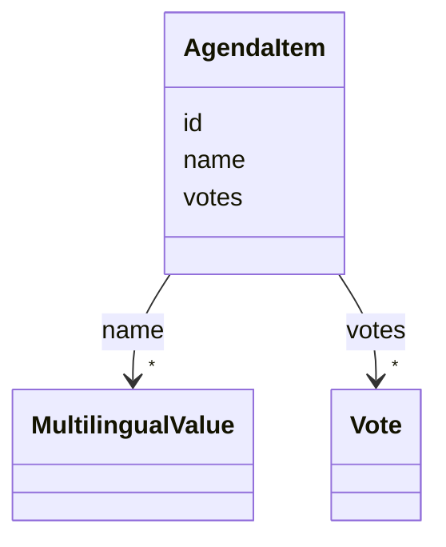
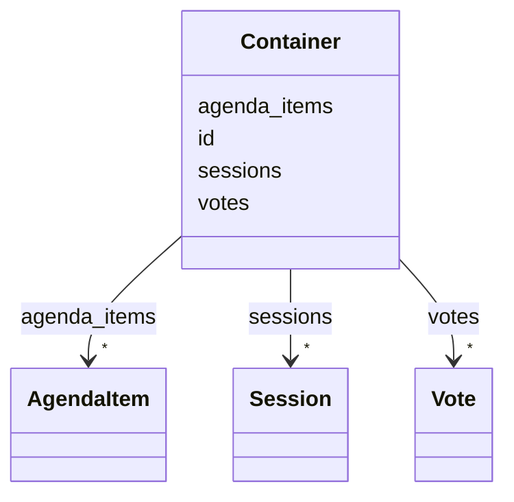
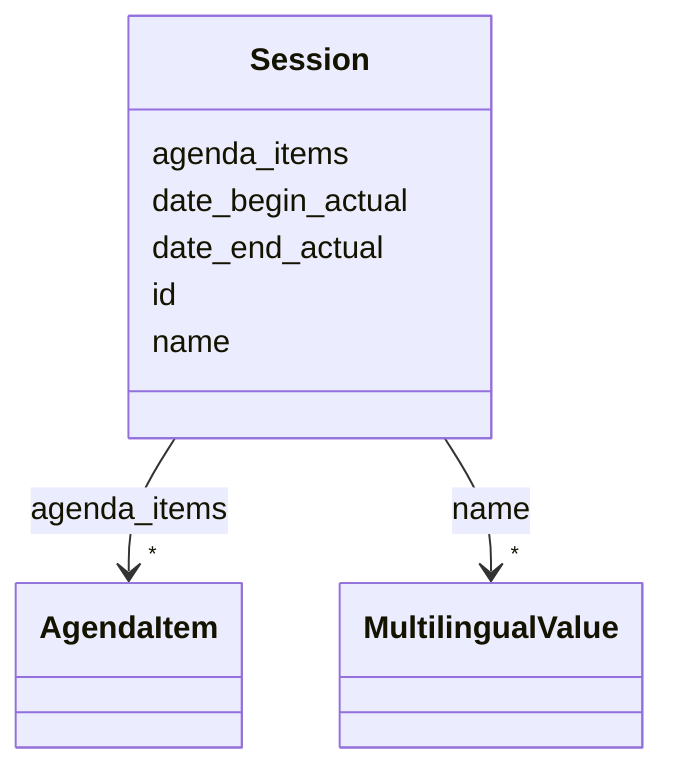
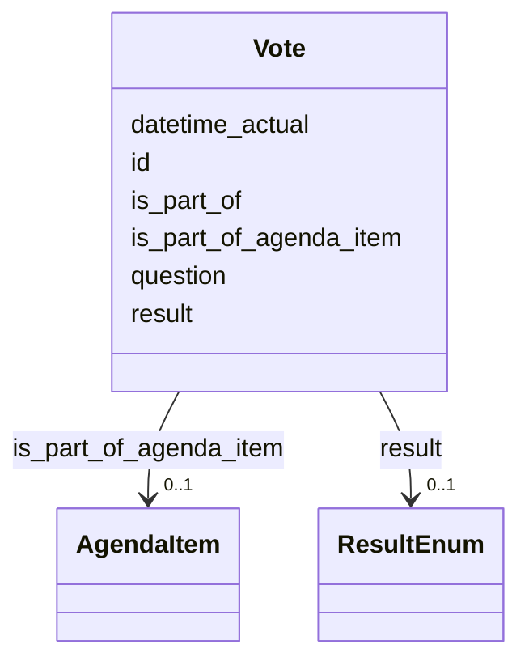

# Head

Header Text from the input markdown file.

# Intro

Intro Text from the input markdown file.

# Introduction to Sessions Schema

# Classes

| Class | Description |
| --- | --- |
| [AgendaItem](#AgendaItem) | None |
| [Container](#Container) | None |
| [Session](#Session) | None |
| [Vote](#Vote) | None |

---
search:
  boost: 10.0
---

# Class: AgendaItem 

<div data-search-exclude markdown="1">


URI: [tutorial:AgendaItem](https://ch.paf.link/schema/tutorial/AgendaItem)



```mermaid
 classDiagram
    class AgendaItem
    click AgendaItem href "../AgendaItem/"
      AgendaItem : id
        
      AgendaItem : name
        
          
    
        
        
        AgendaItem --> "*" MultilingualValue : name
        click MultilingualValue href "../MultilingualValue/"
    

        
      AgendaItem : votes
        
          
    
        
        
        AgendaItem --> "*" Vote : votes
        click Vote href "../Vote/"
    

        
      
```


<!-- no inheritance hierarchy -->

## Slots

| Name | Cardinality and Range | Description | Inheritance |
| ---  | --- | --- | --- |
| [id](#id) | 1 <br/> [String](#String) |  | direct |
| [name](#name) | * <br/> [MultilingualValue](#MultilingualValue) |  | direct |
| [votes](#votes) | * <br/> [Vote](#Vote) |  | direct |


## Usages

| used by | used in | type | used |
| ---  | --- | --- | --- |
| [Session](#Session) | [agenda_items](#agenda_items) | range | [AgendaItem](#AgendaItem) |
| [Vote](#Vote) | [is_part_of_agenda_item](#is_part_of_agenda_item) | range | [AgendaItem](#AgendaItem) |
| [Container](#Container) | [agenda_items](#agenda_items) | range | [AgendaItem](#AgendaItem) |


## Identifier and Mapping Information


### Schema Source


* from schema: https://ch.paf.link/schema/tutorial


## Mappings

| Mapping Type | Mapped Value |
| ---  | ---  |
| self | tutorial:AgendaItem |
| native | tutorial:AgendaItem |


## Examples
### Example: AgendaItem-hierarchical__en__en

```yaml
id: tutorial:s2025-2_t1
name:
- value: Landeshymne
  language: de
- value: National Anthem
  language: en
votes:
- id: tutorial:s2025-2_t1_a1
  question: Soll die Hymne geändert werden?
  datetime_actual: '2025-06-15T10:00:00+01:00'
  result: 'no'

```
### Example: AgendaItem-flat__de

```yaml
id: tutorial:s2025-2_t1
name:
- value: Landeshymne
  language: de

```


## LinkML Source

<!-- TODO: investigate https://stackoverflow.com/questions/37606292/how-to-create-tabbed-code-blocks-in-mkdocs-or-sphinx -->

### Direct

<details>
```yaml
name: AgendaItem
from_schema: https://ch.paf.link/schema/tutorial
slots:
- id
- name
- votes

```
</details>

### Induced

<details>
```yaml
name: AgendaItem
from_schema: https://ch.paf.link/schema/tutorial
attributes:
  id:
    name: id
    examples:
    - value: tutorial:s2025
    - value: tutorial:s2025-1
    - value: tutorial:s2025-1_t1
    from_schema: https://ch.paf.link/schema/tutorial
    rank: 1000
    identifier: true
    owner: AgendaItem
    domain_of:
    - Session
    - AgendaItem
    - Vote
    - Container
    range: string
    required: true
  name:
    name: name
    from_schema: https://ch.paf.link/schema/tutorial
    rank: 1000
    slot_uri: schema:name
    owner: AgendaItem
    domain_of:
    - Session
    - AgendaItem
    range: MultilingualValue
    multivalued: true
    inlined: true
    inlined_as_list: true
  votes:
    name: votes
    from_schema: https://ch.paf.link/schema/tutorial
    rank: 1000
    slot_uri: tutorial:vote
    owner: AgendaItem
    domain_of:
    - AgendaItem
    - Container
    range: Vote
    multivalued: true
    inlined: true
    inlined_as_list: true

```
</details></div>
---
search:
  boost: 10.0
---

# Class: Container 

<div data-search-exclude markdown="1">


URI: [tutorial:Container](https://ch.paf.link/schema/tutorial/Container)



```mermaid
 classDiagram
    class Container
    click Container href "../Container/"
      Container : agenda_items
        
          
    
        
        
        Container --> "*" AgendaItem : agenda_items
        click AgendaItem href "../AgendaItem/"
    

        
      Container : id
        
      Container : sessions
        
          
    
        
        
        Container --> "*" Session : sessions
        click Session href "../Session/"
    

        
      Container : votes
        
          
    
        
        
        Container --> "*" Vote : votes
        click Vote href "../Vote/"
    

        
      
```


<!-- no inheritance hierarchy -->

## Class Properties

| Property | Value |
| --- | --- |
| Tree Root | Yes |


## Slots

| Name | Cardinality and Range | Description | Inheritance |
| ---  | --- | --- | --- |
| [id](#id) | 1 <br/> [String](#String) |  | direct |
| [sessions](#sessions) | * <br/> [Session](#Session) |  | direct |
| [agenda_items](#agenda_items) | * <br/> [AgendaItem](#AgendaItem) |  | direct |
| [votes](#votes) | * <br/> [Vote](#Vote) |  | direct |


## Identifier and Mapping Information


### Schema Source


* from schema: https://ch.paf.link/schema/tutorial


## Mappings

| Mapping Type | Mapped Value |
| ---  | ---  |
| self | tutorial:Container |
| native | tutorial:Container |


## Examples
### Example: Container-hierarchical

```yaml
id: tutorial:s2025
sessions:
  - id: tutorial:s2025-1
    date_begin_actual: "2025-03-01"
    date_end_actual: "2025-04-10"
    name: 
      - value: Frühlingssession 2025
        language: de
      - value: Spring Session 2025
        language: en
    agenda_items:
      - id: tutorial:s2025-1_t1
        name:
          - value: Fahnenfarbe
            language: de
          - value: Flag Color
            language: en
        votes:
          - id: tutorial:s2025-1_t1_a1
            question: Soll die Farbe geändert werden?
            datetime_actual: "2025-03-15T10:00:00Z"
            result: "yes"
          - id: tutorial:s2025-1_t1_a2
            question: Soll die Farbe Auberginen-Oliv werden?
            datetime_actual: "2025-03-16T10:00:00Z"
            result: "no"
  - id: tutorial:s2025-2
    date_begin_actual: "2025-06-01"
    date_end_actual: "2025-07-10"
    name: 
      - value: Sommersession 2025
        language: de
      - value: Summer Session 2025
        language: en
    agenda_items:
      - id: tutorial:s2025-2_t1
        name: 
          - value: Landeshymne
            language: de
          - value: National Anthem
            language: en
        votes:
          - id: tutorial:s2025-2_t1_a1
            question: Soll die Hymne geändert werden?
            datetime_actual: "2025-06-15T10:00:00+01:00"
            result: "no"
```
### Example: Container-flat

```yaml
id: tutorial:s2025
sessions: 
  - id: tutorial:s2025-1
    date_begin_actual: 2025-03-01
    date_end_actual: 2025-04-10
    name: 
      - value: Frühlingssession 2025
        language: de
      - value: Spring Session 2025
        language: en
  - id: tutorial:s2025-2
    date_begin_actual: 2025-06-01
    date_end_actual: 2025-07-10
    name: 
      - value: Sommersession 2025
        language: de
      - value: Summer Session 2025
        language: en
agenda_items:
  - id: tutorial:s2025-1_t1
    name:
      - value: Fahnenfarbe
        language: de
  - id: tutorial:s2025-2_t1
    name: 
      - value: Landeshymne
        language: de
votes:
  - id: tutorial:s2025-1_t1_a1
    is_part_of_agenda_item: tutorial:s2025-1_t1
    is_part_of: tutorial:s2025-1_t1
    question: Soll die Farbe geändert werden?
  - id: tutorial:s2025-1_t1_a2
    is_part_of_agenda_item: tutorial:s2025-1_t1
    is_part_of: tutorial:s2025-1_t1
    question: Soll die Farbe Auberginen-Oliv werden?
  - id: tutorial:s2025-2_t1_a1
    is_part_of_agenda_item: tutorial:s2025-2_t1
    is_part_of: tutorial:s2025-2_t1
    question: Soll die Hymne geändert werden?
```


## LinkML Source

<!-- TODO: investigate https://stackoverflow.com/questions/37606292/how-to-create-tabbed-code-blocks-in-mkdocs-or-sphinx -->

### Direct

<details>
```yaml
name: Container
from_schema: https://ch.paf.link/schema/tutorial
slots:
- id
- sessions
- agenda_items
- votes
tree_root: true

```
</details>

### Induced

<details>
```yaml
name: Container
from_schema: https://ch.paf.link/schema/tutorial
attributes:
  id:
    name: id
    examples:
    - value: tutorial:s2025
    - value: tutorial:s2025-1
    - value: tutorial:s2025-1_t1
    from_schema: https://ch.paf.link/schema/tutorial
    rank: 1000
    identifier: true
    owner: Container
    domain_of:
    - Session
    - AgendaItem
    - Vote
    - Container
    range: string
    required: true
  sessions:
    name: sessions
    from_schema: https://ch.paf.link/schema/tutorial
    rank: 1000
    slot_uri: tutorial:session
    owner: Container
    domain_of:
    - Container
    range: Session
    multivalued: true
    inlined: true
    inlined_as_list: true
  agenda_items:
    name: agenda_items
    from_schema: https://ch.paf.link/schema/tutorial
    rank: 1000
    slot_uri: tutorial:agendaItem
    owner: Container
    domain_of:
    - Session
    - Container
    range: AgendaItem
    multivalued: true
    inlined: true
    inlined_as_list: true
  votes:
    name: votes
    from_schema: https://ch.paf.link/schema/tutorial
    rank: 1000
    slot_uri: tutorial:vote
    owner: Container
    domain_of:
    - AgendaItem
    - Container
    range: Vote
    multivalued: true
    inlined: true
    inlined_as_list: true
tree_root: true

```
</details></div>
---
search:
  boost: 10.0
---

# Class: Session 

<div data-search-exclude markdown="1">


URI: [tutorial:Session](https://ch.paf.link/schema/tutorial/Session)



```mermaid
 classDiagram
    class Session
    click Session href "../Session/"
      Session : agenda_items
        
          
    
        
        
        Session --> "*" AgendaItem : agenda_items
        click AgendaItem href "../AgendaItem/"
    

        
      Session : date_begin_actual
        
      Session : date_end_actual
        
      Session : id
        
      Session : name
        
          
    
        
        
        Session --> "*" MultilingualValue : name
        click MultilingualValue href "../MultilingualValue/"
    

        
      
```


<!-- no inheritance hierarchy -->

## Slots

| Name | Cardinality and Range | Description | Inheritance |
| ---  | --- | --- | --- |
| [id](#id) | 1 <br/> [String](#String) |  | direct |
| [date_begin_actual](#date_begin_actual) | 0..1 <br/> [Date](#Date) | The actual start date of an event or occurrence with time duration | direct |
| [date_end_actual](#date_end_actual) | 0..1 <br/> [Date](#Date) | The actual end date of an event or occurrence with time duration | direct |
| [name](#name) | * <br/> [MultilingualValue](#MultilingualValue) |  | direct |
| [agenda_items](#agenda_items) | * <br/> [AgendaItem](#AgendaItem) |  | direct |


## Usages

| used by | used in | type | used |
| ---  | --- | --- | --- |
| [Container](#Container) | [sessions](#sessions) | range | [Session](#Session) |


## Identifier and Mapping Information


### Schema Source


* from schema: https://ch.paf.link/schema/tutorial


## Mappings

| Mapping Type | Mapped Value |
| ---  | ---  |
| self | tutorial:Session |
| native | tutorial:Session |


## Examples
### Example: Session-hierarchical__en

```yaml
id: tutorial:s2025-2
date_begin_actual: '2025-06-01'
date_end_actual: '2025-07-10'
name:
- value: Sommersession 2025
  language: de
- value: Summer Session 2025
  language: en
agenda_items:
- id: tutorial:s2025-2_t1
  name:
  - value: Landeshymne
    language: de
  - value: National Anthem
    language: en
  votes:
  - id: tutorial:s2025-2_t1_a1
    question: Soll die Hymne geändert werden?
    datetime_actual: '2025-06-15T10:00:00+01:00'
    result: 'no'

```
### Example: Session-flat__en

```yaml
id: tutorial:s2025-2
date_begin_actual: 2025-06-01
date_end_actual: 2025-07-10
name:
- value: Sommersession 2025
  language: de
- value: Summer Session 2025
  language: en

```


## LinkML Source

<!-- TODO: investigate https://stackoverflow.com/questions/37606292/how-to-create-tabbed-code-blocks-in-mkdocs-or-sphinx -->

### Direct

<details>
```yaml
name: Session
from_schema: https://ch.paf.link/schema/tutorial
slots:
- id
- date_begin_actual
- date_end_actual
- name
- agenda_items

```
</details>

### Induced

<details>
```yaml
name: Session
from_schema: https://ch.paf.link/schema/tutorial
attributes:
  id:
    name: id
    examples:
    - value: tutorial:s2025
    - value: tutorial:s2025-1
    - value: tutorial:s2025-1_t1
    from_schema: https://ch.paf.link/schema/tutorial
    rank: 1000
    identifier: true
    owner: Session
    domain_of:
    - Session
    - AgendaItem
    - Vote
    - Container
    range: string
    required: true
  date_begin_actual:
    name: date_begin_actual
    annotations:
      description_de:
        tag: description_de
        value: 'Das tatsächliche Startdatum eines Ereignisses oder Vorkommnissen mit
          Zeitdauer.

          '
    description: 'The actual start date of an event or occurrence with time duration.

      '
    from_schema: https://ch.paf.link/schema/tutorial
    rank: 1000
    slot_uri: mcm:dateBeginActual
    owner: Session
    domain_of:
    - Session
    - IsEventWithDuration
    range: date
  date_end_actual:
    name: date_end_actual
    annotations:
      description_de:
        tag: description_de
        value: 'Das tatsächliche Enddatum eines Ereignisses oder Vorkommnissen mit
          Zeitdauer.

          '
    description: 'The actual end date of an event or occurrence with time duration.

      '
    from_schema: https://ch.paf.link/schema/tutorial
    rank: 1000
    slot_uri: mcm:dateEndActual
    owner: Session
    domain_of:
    - Session
    - IsEventWithDuration
    range: date
  name:
    name: name
    from_schema: https://ch.paf.link/schema/tutorial
    rank: 1000
    slot_uri: schema:name
    owner: Session
    domain_of:
    - Session
    - AgendaItem
    range: MultilingualValue
    multivalued: true
    inlined: true
    inlined_as_list: true
  agenda_items:
    name: agenda_items
    from_schema: https://ch.paf.link/schema/tutorial
    rank: 1000
    slot_uri: tutorial:agendaItem
    owner: Session
    domain_of:
    - Session
    - Container
    range: AgendaItem
    multivalued: true
    inlined: true
    inlined_as_list: true

```
</details></div>
---
search:
  boost: 10.0
---

# Class: Vote 

<div data-search-exclude markdown="1">


URI: [tutorial:Vote](https://ch.paf.link/schema/tutorial/Vote)



```mermaid
 classDiagram
    class Vote
    click Vote href "../Vote/"
      Vote : datetime_actual
        
      Vote : id
        
      Vote : is_part_of
        
      Vote : is_part_of_agenda_item
        
          
    
        
        
        Vote --> "0..1" AgendaItem : is_part_of_agenda_item
        click AgendaItem href "../AgendaItem/"
    

        
      Vote : question
        
      Vote : result
        
          
    
        
        
        Vote --> "0..1" ResultEnum : result
        click ResultEnum href "../ResultEnum/"
    

        
      
```


<!-- no inheritance hierarchy -->

## Slots

| Name | Cardinality and Range | Description | Inheritance |
| ---  | --- | --- | --- |
| [id](#id) | 1 <br/> [String](#String) |  | direct |
| [is_part_of](#is_part_of) | 0..1 <br/> [Uriorcurie](#Uriorcurie) |  | direct |
| [question](#question) | 1 <br/> [String](#String) |  | direct |
| [datetime_actual](#datetime_actual) | 0..1 <br/> [Datetime](#Datetime) | The actual date and time of an instantaneous event or occurrence (without tim... | direct |
| [result](#result) | 0..1 <br/> [ResultEnum](#ResultEnum) |  | direct |
| [is_part_of_agenda_item](#is_part_of_agenda_item) | 0..1 <br/> [AgendaItem](#AgendaItem) |  | direct |


## Usages

| used by | used in | type | used |
| ---  | --- | --- | --- |
| [AgendaItem](#AgendaItem) | [votes](#votes) | range | [Vote](#Vote) |
| [Container](#Container) | [votes](#votes) | range | [Vote](#Vote) |


## Identifier and Mapping Information


### Schema Source


* from schema: https://ch.paf.link/schema/tutorial


## Mappings

| Mapping Type | Mapped Value |
| ---  | ---  |
| self | tutorial:Vote |
| native | tutorial:Vote |


## LinkML Source

<!-- TODO: investigate https://stackoverflow.com/questions/37606292/how-to-create-tabbed-code-blocks-in-mkdocs-or-sphinx -->

### Direct

<details>
```yaml
name: Vote
from_schema: https://ch.paf.link/schema/tutorial
slots:
- id
- is_part_of
- question
- datetime_actual
- result
attributes:
  is_part_of_agenda_item:
    name: is_part_of_agenda_item
    from_schema: https://ch.paf.link/schema/tutorial
    rank: 1000
    domain_of:
    - Vote
    range: AgendaItem

```
</details>

### Induced

<details>
```yaml
name: Vote
from_schema: https://ch.paf.link/schema/tutorial
attributes:
  is_part_of_agenda_item:
    name: is_part_of_agenda_item
    from_schema: https://ch.paf.link/schema/tutorial
    rank: 1000
    owner: Vote
    domain_of:
    - Vote
    range: AgendaItem
  id:
    name: id
    examples:
    - value: tutorial:s2025
    - value: tutorial:s2025-1
    - value: tutorial:s2025-1_t1
    from_schema: https://ch.paf.link/schema/tutorial
    rank: 1000
    identifier: true
    owner: Vote
    domain_of:
    - Session
    - AgendaItem
    - Vote
    - Container
    range: string
    required: true
  is_part_of:
    name: is_part_of
    examples:
    - value: tutorial:s2025-1_t1
    - value: tutorial:s2025-2_t1
    from_schema: https://ch.paf.link/schema/tutorial
    rank: 1000
    owner: Vote
    domain_of:
    - Vote
    range: uriorcurie
  question:
    name: question
    examples:
    - value: Soll die Farbe Auberginen-Oliv werden?
    - value: Soll die Farbe geändert werden?
    - value: Soll die Hymne geändert werden?
    from_schema: https://ch.paf.link/schema/tutorial
    rank: 1000
    owner: Vote
    domain_of:
    - Vote
    range: string
    required: true
  datetime_actual:
    name: datetime_actual
    annotations:
      description_de:
        tag: description_de
        value: 'Das tatsächliche Datum und die Uhrzeit eines instantanen Ereignisses
          oder Vorkommnissen (ohne Zeitdauer).

          '
    description: 'The actual date and time of an instantaneous event or occurrence
      (without time duration).

      '
    from_schema: https://ch.paf.link/schema/tutorial
    rank: 1000
    slot_uri: mcm:datetimeActual
    owner: Vote
    domain_of:
    - Vote
    - IsInstantaneousEvent
    range: datetime
  result:
    name: result
    examples:
    - value: 'no'
    - value: 'yes'
    from_schema: https://ch.paf.link/schema/tutorial
    rank: 1000
    owner: Vote
    domain_of:
    - Vote
    range: result_enum

```
</details></div>
