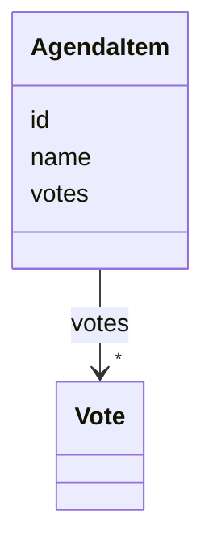
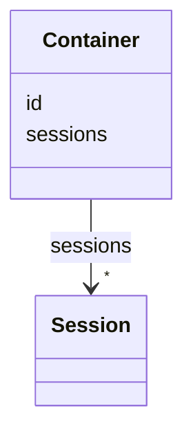
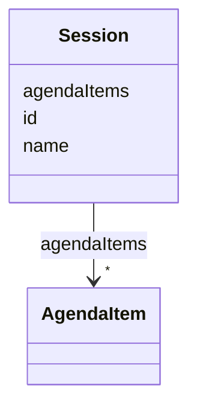
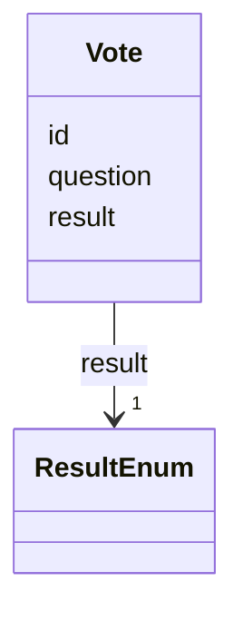

# Head

Header Text from the input markdown file.

# Intro

Intro Text from the input markdown file.

# Introduction to Sessions Schema

# Classes

| Class | Description |
| --- | --- |
| [AgendaItem](#AgendaItem) | None |
| [Container](#Container) | None |
| [Session](#Session) | None |
| [Vote](#Vote) | None |


# Class: AgendaItem 


URI: [chpaf:AgendaItem](https://ch.paf.link/AgendaItem)





<!-- no inheritance hierarchy -->


## Slots

| Name | Cardinality and Range | Description | Inheritance |
| ---  | --- | --- | --- |
| [id](#id) | 1 <br/> [String](#String) |  | direct |
| [name](#name) | 1 <br/> [String](#String) |  | direct |
| [votes](#votes) | * <br/> [Vote](#Vote) |  | direct |


## Usages

| used by | used in | type | used |
| ---  | --- | --- | --- |
| [Session](#Session) | [agendaItems](#agendaItems) | range | [AgendaItem](#AgendaItem) |


## Identifier and Mapping Information


### Schema Source


* from schema: https://ch.paf.link/schema/session


## Mappings

| Mapping Type | Mapped Value |
| ---  | ---  |
| self | chpaf:AgendaItem |
| native | chpaf:AgendaItem |


## LinkML Source

<!-- TODO: investigate https://stackoverflow.com/questions/37606292/how-to-create-tabbed-code-blocks-in-mkdocs-or-sphinx -->

### Direct

<details>
```yaml
name: AgendaItem
from_schema: https://ch.paf.link/schema/session
slots:
- id
- name
- votes

```
</details>

### Induced

<details>
```yaml
name: AgendaItem
from_schema: https://ch.paf.link/schema/session
attributes:
  id:
    name: id
    from_schema: https://ch.paf.link/schema/session
    rank: 1000
    identifier: true
    alias: id
    owner: AgendaItem
    domain_of:
    - Session
    - AgendaItem
    - Vote
    - Container
    range: string
    required: true
  name:
    name: name
    from_schema: https://ch.paf.link/schema/session
    rank: 1000
    slot_uri: dcterm:title
    alias: name
    owner: AgendaItem
    domain_of:
    - Session
    - AgendaItem
    range: string
    required: true
  votes:
    name: votes
    from_schema: https://ch.paf.link/schema/session
    rank: 1000
    slot_uri: chpaf:vote
    alias: votes
    owner: AgendaItem
    domain_of:
    - AgendaItem
    range: Vote
    multivalued: true
    inlined: true
    inlined_as_list: true

```
</details>


# Class: Container 


URI: [chpaf:Container](https://ch.paf.link/Container)





<!-- no inheritance hierarchy -->


## Slots

| Name | Cardinality and Range | Description | Inheritance |
| ---  | --- | --- | --- |
| [id](#id) | 1 <br/> [String](#String) |  | direct |
| [sessions](#sessions) | * <br/> [Session](#Session) |  | direct |


## Identifier and Mapping Information


### Schema Source


* from schema: https://ch.paf.link/schema/session


## Mappings

| Mapping Type | Mapped Value |
| ---  | ---  |
| self | chpaf:Container |
| native | chpaf:Container |


## LinkML Source

<!-- TODO: investigate https://stackoverflow.com/questions/37606292/how-to-create-tabbed-code-blocks-in-mkdocs-or-sphinx -->

### Direct

<details>
```yaml
name: Container
from_schema: https://ch.paf.link/schema/session
slots:
- id
- sessions
tree_root: true

```
</details>

### Induced

<details>
```yaml
name: Container
from_schema: https://ch.paf.link/schema/session
attributes:
  id:
    name: id
    from_schema: https://ch.paf.link/schema/session
    rank: 1000
    identifier: true
    alias: id
    owner: Container
    domain_of:
    - Session
    - AgendaItem
    - Vote
    - Container
    range: string
    required: true
  sessions:
    name: sessions
    from_schema: https://ch.paf.link/schema/session
    rank: 1000
    slot_uri: chpaf:session
    alias: sessions
    owner: Container
    domain_of:
    - Container
    range: Session
    multivalued: true
    inlined: true
    inlined_as_list: true
tree_root: true

```
</details>


# Class: Session 


URI: [chpaf:Session](https://ch.paf.link/Session)





<!-- no inheritance hierarchy -->


## Slots

| Name | Cardinality and Range | Description | Inheritance |
| ---  | --- | --- | --- |
| [id](#id) | 1 <br/> [String](#String) |  | direct |
| [name](#name) | 1 <br/> [String](#String) |  | direct |
| [agendaItems](#agendaItems) | * <br/> [AgendaItem](#AgendaItem) |  | direct |


## Usages

| used by | used in | type | used |
| ---  | --- | --- | --- |
| [Container](#Container) | [sessions](#sessions) | range | [Session](#Session) |


## Identifier and Mapping Information


### Schema Source


* from schema: https://ch.paf.link/schema/session


## Mappings

| Mapping Type | Mapped Value |
| ---  | ---  |
| self | chpaf:Session |
| native | chpaf:Session |


## LinkML Source

<!-- TODO: investigate https://stackoverflow.com/questions/37606292/how-to-create-tabbed-code-blocks-in-mkdocs-or-sphinx -->

### Direct

<details>
```yaml
name: Session
from_schema: https://ch.paf.link/schema/session
slots:
- id
- name
- agendaItems

```
</details>

### Induced

<details>
```yaml
name: Session
from_schema: https://ch.paf.link/schema/session
attributes:
  id:
    name: id
    from_schema: https://ch.paf.link/schema/session
    rank: 1000
    identifier: true
    alias: id
    owner: Session
    domain_of:
    - Session
    - AgendaItem
    - Vote
    - Container
    range: string
    required: true
  name:
    name: name
    from_schema: https://ch.paf.link/schema/session
    rank: 1000
    slot_uri: dcterm:title
    alias: name
    owner: Session
    domain_of:
    - Session
    - AgendaItem
    range: string
    required: true
  agendaItems:
    name: agendaItems
    from_schema: https://ch.paf.link/schema/session
    rank: 1000
    slot_uri: chpaf:agendaItem
    alias: agendaItems
    owner: Session
    domain_of:
    - Session
    range: AgendaItem
    multivalued: true
    inlined_as_list: true

```
</details>


# Class: Vote 


URI: [chpaf:Vote](https://ch.paf.link/Vote)





<!-- no inheritance hierarchy -->


## Slots

| Name | Cardinality and Range | Description | Inheritance |
| ---  | --- | --- | --- |
| [id](#id) | 1 <br/> [String](#String) |  | direct |
| [question](#question) | 1 <br/> [String](#String) |  | direct |
| [result](#result) | 1 <br/> [ResultEnum](#ResultEnum) |  | direct |


## Usages

| used by | used in | type | used |
| ---  | --- | --- | --- |
| [AgendaItem](#AgendaItem) | [votes](#votes) | range | [Vote](#Vote) |


## Identifier and Mapping Information


### Schema Source


* from schema: https://ch.paf.link/schema/session


## Mappings

| Mapping Type | Mapped Value |
| ---  | ---  |
| self | chpaf:Vote |
| native | chpaf:Vote |


## LinkML Source

<!-- TODO: investigate https://stackoverflow.com/questions/37606292/how-to-create-tabbed-code-blocks-in-mkdocs-or-sphinx -->

### Direct

<details>
```yaml
name: Vote
from_schema: https://ch.paf.link/schema/session
slots:
- id
- question
- result

```
</details>

### Induced

<details>
```yaml
name: Vote
from_schema: https://ch.paf.link/schema/session
attributes:
  id:
    name: id
    from_schema: https://ch.paf.link/schema/session
    rank: 1000
    identifier: true
    alias: id
    owner: Vote
    domain_of:
    - Session
    - AgendaItem
    - Vote
    - Container
    range: string
    required: true
  question:
    name: question
    from_schema: https://ch.paf.link/schema/session
    rank: 1000
    alias: question
    owner: Vote
    domain_of:
    - Vote
    range: string
    required: true
  result:
    name: result
    from_schema: https://ch.paf.link/schema/session
    rank: 1000
    alias: result
    owner: Vote
    domain_of:
    - Vote
    range: result_enum
    required: true

```
</details>
